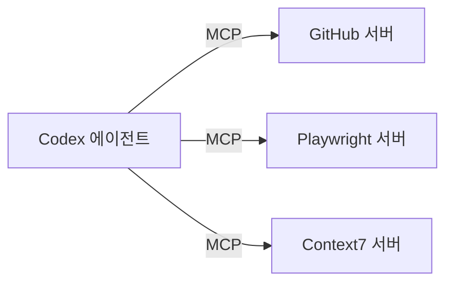

# 047. MCP란 무엇인가 — 도구 확장의 표준



Codex는 그 자체로도 강력하지만, 외부 도구를 붙이면 날개를 답니다. 웹 검색, GitHub, 브라우저 자동화, 디자인 툴까지 — 이 연결의 표준이 MCP입니다.

## MCP란

> MCP(Model Context Protocol)는 Codex 같은 AI에 제3자 도구와 데이터를 연결하는 표준 규격입니다.

USB가 온갖 기기를 컴퓨터에 꽂는 표준이듯, MCP는 온갖 도구를 AI에 꽂는 표준입니다. 한 번 표준을 따르면, 수많은 도구를 같은 방식으로 붙일 수 있습니다.

## 왜 필요한가

기본 Codex는 "내 작업 폴더"가 세상의 전부입니다. MCP를 붙이면:

- 최신 문서를 웹에서 가져오고
- GitHub 이슈·PR을 직접 다루고
- 브라우저를 조작해 E2E 테스트를 돌리고
- Figma 디자인을 읽어오고
- Sentry 에러를 조회합니다

즉, AI의 손이 닿는 범위가 폭발적으로 넓어집니다.

## 두 가지 서버 형태

MCP 도구는 "서버"로 제공됩니다. 두 종류가 있습니다.

| 형태 | 설명 | 예 |
|---|---|---|
| STDIO 서버 | 로컬에서 프로세스로 실행 | `npx`로 띄우는 로컬 도구 |
| Streamable HTTP 서버 | 원격 HTTP, 인증(Bearer/OAuth) 지원 | 클라우드 서비스 |

## 인기 MCP 서버

자주 쓰이는 것들:

- OpenAI Docs — 공식 문서 검색
- Context7 — 라이브러리 최신 문서 주입
- GitHub — 저장소·이슈·PR 조작
- Playwright / Chrome DevTools — 브라우저 자동화
- Figma — 디자인 파일 접근
- Sentry — 에러 모니터링 조회

(연결 실습은 048번, 활용은 049번)

## 어디서 쓰나

MCP 설정은 CLI와 IDE 확장에서 공유됩니다. 한 번 설정하면 여러 클라이언트에서 같은 도구를 씁니다. 설정 위치도 유저/프로젝트 양쪽 가능합니다(032번 원리와 동일).

## 안전 관점

> MCP 서버는 외부 코드를 실행하거나 데이터를 주고받습니다. 신뢰할 수 있는 서버만 붙이세요. 도구 권한·승인(040번)과 함께 관리됩니다. 모르는 출처의 MCP 서버는 조심하세요.

## 현재 연결 상태 보기

```text
/mcp
```

연결된 MCP 서버와 사용 가능한 도구를 확인합니다.

## 생각해보기

당신의 작업에 어떤 외부 도구가 있으면 좋을까요?
- 자료 조사가 많다 → 웹 검색·Context7
- GitHub 협업이 많다 → GitHub MCP
- 프런트엔드 테스트 → Playwright

다음 절에서 실제로 하나 붙여 봅니다.

## 정리

- MCP = AI에 외부 도구를 꽂는 표준(USB 같은 역할)
- STDIO(로컬) / Streamable HTTP(원격) 두 형태
- GitHub·Playwright·Context7 등 인기 서버
- CLI·IDE에서 설정 공유, 신뢰된 서버만 연결
- `/mcp`로 상태 확인

---

다음 절에서 `codex mcp add`로 직접 서버를 연결합니다.
