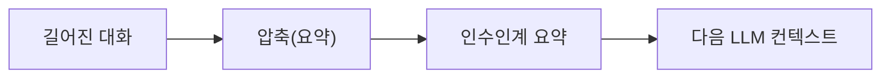

# 065. 컨텍스트 압축(compaction)의 원리



대화가 길어지면 컨텍스트 윈도우(008번)가 가득 찹니다. Codex는 이를 압축(compaction)으로 해결합니다. 그 원리가 흥미롭습니다.

## 문제: 유한한 기억

모델의 컨텍스트는 무한하지 않습니다. 긴 작업에서 대화·파일·도구 출력이 쌓이면 한도에 다다릅니다. 그냥 오래된 걸 버리면 중요한 맥락도 함께 날아갈 수 있습니다.

## 해결: 요약해서 자리를 비운다

Codex는 한도에 가까워지면 지금까지의 내용을 요약해 핵심만 남기고 공간을 확보합니다.

- 자동으로(한도 임박 시) 또는
- 수동으로 `/compact`(021번)

## 핵심 메타포: "다음 LLM에게 인수인계"

압축의 진짜 묘미는 그 관점에 있습니다. Codex의 압축 프롬프트는 이렇게 시작합니다(실제 출하 내용 요약).

> "지금 컨텍스트 체크포인트 압축을 수행하라. 작업을 이어받을 다른 LLM을 위한 인수인계 요약을 만들어라."

즉 "내 메모리를 줄인다"가 아니라, "이 작업을 이어받을 또 다른 AI에게 넘겨줄 인수인계서를 쓴다"는 시각입니다.

## 인수인계 요약에 담는 것

압축 요약은 다음을 포함하도록 설계됩니다.

1. 현재까지의 진행과 핵심 결정사항
2. 중요한 맥락·제약·사용자 선호
3. 남은 작업(명확한 다음 단계)
4. 이어가는 데 필요한 핵심 데이터·예시·참조

간결하고 구조적이며, 다음 LLM이 매끄럽게 이어갈 수 있게 작성됩니다.

## 이어받기

압축된 요약은 특별한 표식(요약 접두어)과 함께 다음 단계로 전달됩니다. 이어받는 쪽은 이를 "다른 LLM이 만든 요약"으로 인식하고:

- 이미 한 작업을 중복하지 않고
- 요약을 바탕으로 작업을 계속합니다.

```text
[긴 대화] ──압축──▶ [인수인계 요약] ──▶ [요약 + 새 작업으로 계속]
            (자리 확보)        (중복 방지, 맥락 유지)
```

## 한도와 동작

- 사용자 메시지 압축에는 상한이 있습니다(예: 약 2만 토큰 규모).
- 압축 전후의 토큰량을 측정해 관리합니다.
- 토큰 추정으로 언제 압축할지 판단합니다.

## 실전 함의

- 장시간 작업이 가능한 이유 = 압축이 맥락을 유지하며 공간을 비워주기 때문(Goal 모드, 044번이 잘 도는 이유)
- 압축 후 AI가 세부를 약간 잊을 수 있음 → 꼭 지킬 규칙은 AGENTS.md에(034번). AGENTS.md는 매번 다시 주입되므로 압축에 영향받지 않습니다.

> TIP 아주 중요한 결정·제약은 압축 전에 한 번 명시적으로 정리해두면, 요약에 확실히 담깁니다. 또는 파일/AGENTS.md로 남기세요.

## 관찰 실습

```text
1. 긴 작업을 진행해 컨텍스트를 많이 채운다
2. /compact 실행
3. 압축 후 "지금까지 우리가 한 작업과 다음 할 일을 요약해줘"
   → 인수인계 요약이 맥락을 잘 보존했는지 확인
```

## 정리

- 압축 = 길어진 대화를 요약해 공간 확보(자동/`/compact`)
- 메타포: "다음 LLM을 위한 인수인계서" — 진행·결정·남은 일·핵심 데이터
- 이어받는 쪽은 중복 없이 작업 지속 → 장시간 작업의 비결
- 압축에 안 휩쓸리려면 핵심 규칙은 AGENTS.md에

---

다음 절에서 Codex의 행동을 결정하는 출하 시스템 프롬프트를 해부합니다.
