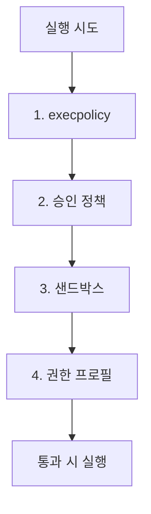

# 069. 4겹 권한 모델 심층 분석



지금까지 흩어져 나온 안전장치들(execpolicy·승인·샌드박스·권한)을 하나의 그림으로 모읍니다. Codex의 안전은 네 겹의 독립 방어선으로 설계되어 있습니다.

## 네 개의 겹

```text
┌─ 1. execpolicy ──── 이 명령이 애초에 허용/질문/금지인가? (의도 수준)
├─ 2. approval ────── 사용자에게 물어볼 시점인가?         (사람 판단)
├─ 3. sandbox ─────── OS가 물리적으로 막는가?            (기술 강제)
└─ 4. permissions ─── 경로/네트워크별로 허용되는가?       (정밀 통제)
```

각 겹을 다시 보면:

| 겹 | 무엇 | 다룬 절 |
|---|---|---|
| execpolicy | 명령을 Allow/Prompt/Forbidden 분류 | 068 |
| approval policy | untrusted/on-request/never/granular | 040 |
| sandbox | read-only/workspace-write/full-access (OS 강제) | 038~039 |
| permission profiles | 파일·네트워크 경로별 allow/deny | 041 |

## 핵심: "독립적"이라는 것

이 겹들은 서로 독립입니다. 즉 하나가 느슨하거나 뚫려도 다른 겹이 막습니다.

예: 어떤 명령이 execpolicy에서 `Allow`라도, 샌드박스가 폴더 밖 쓰기를 금지하면 실행은 그 경계 안에서만 일어납니다. 또 권한 프로필이 특정 도메인만 허용하면 네트워크는 거기에 갇힙니다.

> 이것이 공식 문서가 말하는 "의도를 신뢰하는 게 아니라, 기술적 경계를 강제한다(not just trusting intentions, but enforcing technical boundaries)"의 구현입니다.

## 한 명령이 실행되기까지

`pip install requests` 를 예로 전체 흐름을 따라가 봅시다.

```text
1. execpolicy: "pip install"은 자동허용 목록 밖 → Prompt
2. approval:   정책이 on-request → 사용자에게 승인 요청 (never면 거부)
3. (승인됨)
4. sandbox:    workspace-write 안에서 실행, 시스템 영역 보호
5. permissions: 네트워크 allowlist에 pypi.org가 있어야 다운로드 가능
   → 결과: 통제된 환경에서 안전하게 설치
```

하나라도 막으면 거기서 멈춥니다. 네 겹을 모두 통과해야 비로소 자유롭게 실행됩니다.

## 왜 이렇게까지 하나

AI 에이전트는 강력하지만, 두 가지 위험이 있습니다.

- 실수 — AI가 의도치 않게 잘못된 명령
- 악용 — 프롬프트 인젝션 등으로 유도된 악성 행동

단일 방어선은 뚫리면 끝입니다. 다층 방어(defense in depth)는 한 겹이 실패해도 전체가 무너지지 않게 합니다. 보안의 정석이죠.

## 실무 설정 조합 다시 보기

| 상황 | 조합 |
|---|---|
| 안전한 탐색 | read-only + untrusted |
| 일상 개발 | workspace-write + on-request (기본) |
| 자동화(CI) | workspace-write/full(격리) + never + 엄격한 permissions |
| 민감 프로젝트 | + secrets 폴더 deny, 네트워크 최소 allowlist |

## 신뢰 기반 자동화의 자신감

4겹을 이해하면 자동화를 더 과감하게 할 수 있습니다. "AI를 믿어서"가 아니라 "경계로 강제해서" 안전하기 때문입니다. 이것이 고급 사용자의 사고방식입니다.

## 생각해보기

당신의 자동화 시나리오(예: 야간 의존성 업데이트)에 4겹을 어떻게 설정할까요?
- execpolicy: 기본
- approval: never (무인)
- sandbox: 격리/작업폴더
- permissions: pypi/npm 도메인만, secrets deny

## 정리

- Codex 안전 = 4겹 독립 방어: execpolicy · approval · sandbox · permissions
- 각 겹이 독립이라 하나가 느슨해도 다른 게 막음(다층 방어)
- "의도 신뢰"가 아닌 "경계 강제"가 핵심 철학
- 4겹을 이해하면 자동화를 안전하게 과감히 할 수 있다

---

다음 절에서 가장 아래 겹 — OS 네이티브 샌드박스의 내부를 들여다봅니다.
