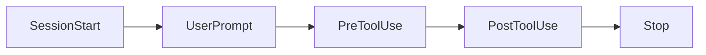

# 074. Hooks 9대 이벤트와 활용 패턴



훅을 제대로 쓰려면 어떤 시점에 끼어들 수 있는지를 알아야 합니다. Codex가 제공하는 주요 라이프사이클 이벤트를 정리합니다.

## 라이프사이클 이벤트 목록

| 이벤트 | 발생 시점 | 대표 활용 |
|---|---|---|
| `SessionStart` | 세션 시작/재개/clear/compact 시 | 환경 점검, 초기 컨텍스트 주입 |
| `UserPromptSubmit` | 사용자가 프롬프트 제출 시 | 프롬프트 검사, 가이드라인 주입 |
| `PreToolUse` | 도구(Bash/편집/MCP) 실행 직전 | 위험 명령 차단, 검증 |
| `PostToolUse` | 도구 실행 직후 | 결과 로깅, 자동 포맷 |
| `PermissionRequest` | 승인 프롬프트 직전 | 정책 기반 자동 판단·기록 |
| `PreCompact` / `PostCompact` | 압축 전/후 | 중요 맥락 보존·복원 |
| `SubagentStart` / `SubagentStop` | 서브에이전트 생애 | 서브에이전트 추적·제어 |
| `Stop` | 턴(대화) 종료 시 | 마무리 작업, 요약 저장 |

> 이벤트 이름과 시점만 알아도, "여기에 끼어들면 되겠다"가 보입니다.

## 활용 패턴 1: 위험 명령 차단 (PreToolUse)

가장 인기 있는 패턴입니다. 도구 실행 직전에 명령을 검사해, 위험하면 막습니다.

```text
[PreToolUse] → 실행하려는 명령을 받음 → 'rm -rf /' 같은 패턴이면 차단(JSON으로 중단)
```

(다음 절 075번에서 직접 만듭니다.)

## 활용 패턴 2: 자동 포맷/린트 (PostToolUse)

파일 편집 직후 포매터를 돌려 코드 스타일을 자동으로 맞춥니다.

```text
[PostToolUse: 파일 편집] → black/prettier 실행 → 항상 일관된 스타일
```

## 활용 패턴 3: 가이드라인 주입 (UserPromptSubmit / SessionStart)

프롬프트 제출이나 세션 시작 시, 사내 규칙·현재 상태를 컨텍스트에 자동으로 덧붙입니다(컨텍스트 주입형 훅, 073번).

```text
[SessionStart] → "현재 스프린트 목표, 금지 사항"을 컨텍스트에 주입
```

## 활용 패턴 4: 감사 로그 (PreToolUse + PostToolUse)

모든 도구 호출과 결과를 파일/시스템에 기록해, 나중에 "AI가 무엇을 했는지" 감사합니다. 규제·보안 환경에서 유용합니다.

## 활용 패턴 5: 압축 보호 (PreCompact)

압축으로 중요한 정보가 사라지지 않도록, 압축 직전에 핵심 상태를 별도 저장합니다(065번 보완).

## JSON 입출력 개념

훅은 이벤트 정보를 JSON으로 받고, JSON으로 응답합니다.

```json
// 입력 예 (PreToolUse): 실행하려는 명령 정보
{ "event": "PreToolUse", "tool": "shell", "command": ["rm", "-rf", "/"] }

// 출력 예: 차단
{ "decision": "block", "reason": "위험한 삭제 명령 차단" }
```

> 실제 스키마는 버전에 따라 다릅니다. `/hooks`와 공식 문서로 현재 형식을 확인하세요.

## 설계 팁

- 훅은 빠르게 끝나야 합니다(매 이벤트마다 돌므로 느리면 전체가 느려짐).
- 한 훅은 한 가지 일만 (단일 책임).
- 실패해도 안전하게(훅 오류가 작업을 망치지 않게).
- 민감 동작(차단·주입)은 충분히 테스트 후 신뢰 등록.

## 정리

- 주요 이벤트: SessionStart, UserPromptSubmit, Pre/PostToolUse, PermissionRequest, Pre/PostCompact, Subagent Start/Stop, Stop
- 패턴: 위험 명령 차단 · 자동 포맷 · 가이드라인 주입 · 감사 로그 · 압축 보호
- JSON in/out으로 동작 제어
- 빠르고 단일 책임으로, 신뢰 등록 후 사용

---

다음 절에서 PreToolUse 훅으로 보안 검사를 직접 만들어 봅니다.
