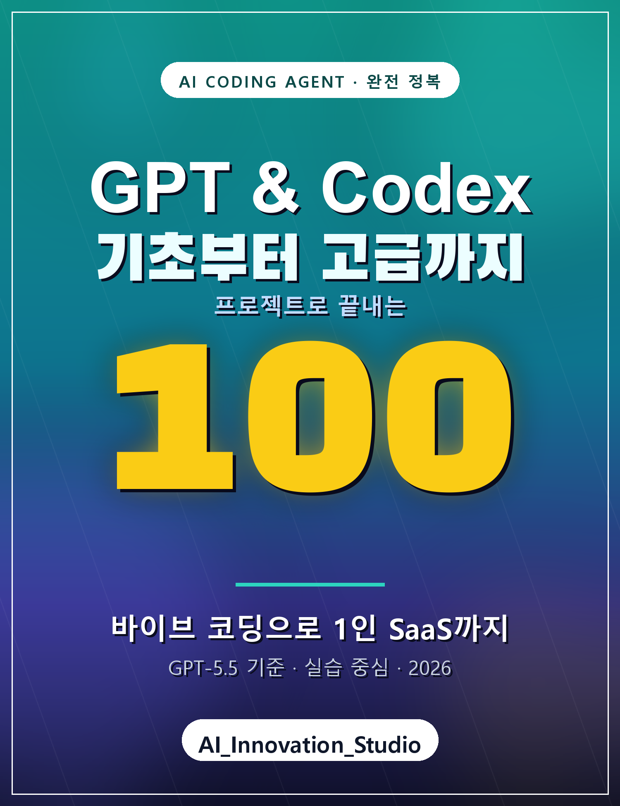

# GPT & Codex 기초부터 고급까지 100

> AI 에이전트와 함께하는 바이브 코딩 — 코드 한 줄부터 1인 SaaS까지

- 저자: AI_Innovation_Studio
- 기준 버전: GPT-5.5 / Codex CLI (2026년 6월)
- 집필일: 2026년 6월 20일
- 대상: 코딩 입문자 ~ 실무 개발자
- 구성: 초급 → 중급 → 고급 → 실전 프로젝트 → 부록 (총 100개 절)

---

## 이 책은 누구를 위한 책인가

- "코드는 잘 모르지만 AI로 진짜 앱을 만들어 보고 싶다" — 초급자
- "Codex를 쓰긴 하는데 설정·MCP·스킬을 제대로 활용하고 싶다" — 중급자
- "에이전트 내부 동작을 이해하고 SDK로 직접 확장하고 싶다" — 고급자

## 이 책의 특징

1. GPT-5.5 최신 기준 — 2026년 6월 현재 가장 강력한 모델 기준으로 작성
2. 초급부터 천천히 — 터미널이 처음인 사람도 따라올 수 있게 단계별 구성
3. 실습 중심 — 거의 모든 장에 손으로 따라 하는 예제 포함
4. 하나의 실전 프로젝트 — AI 할일 SaaS "TaskFlow"를 처음부터 끝까지 완성
5. 내부까지 — 공식 문서를 넘어 Codex 엔진의 실제 동작 원리까지

## 목차

전체 목차는 [`000_목차.md`](000_목차.md) 를 참고하세요.

## 문의 · 커뮤니티

- 이메일: leemanrank@gmail.com
- 인공지능 정보공유 단톡방(오픈채팅): https://open.kakao.com/o/s4OEqBai

---

© 2026 AI_Innovation_Studio. 본 교재의 예제 코드는 자유롭게 사용할 수 있습니다.
