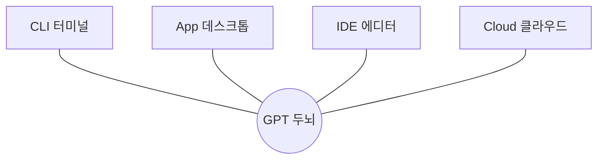
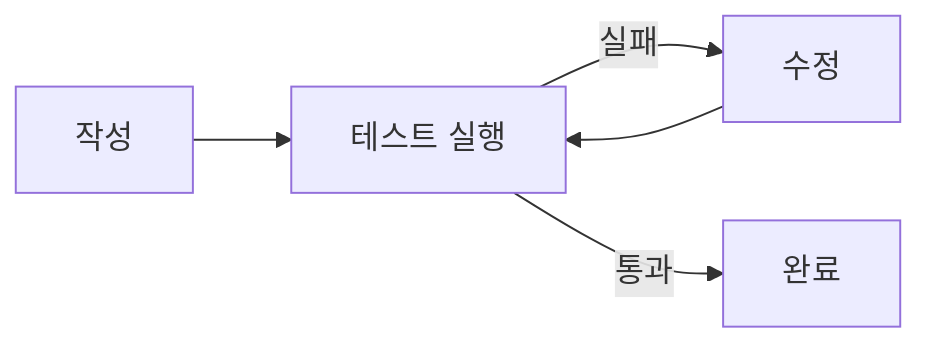
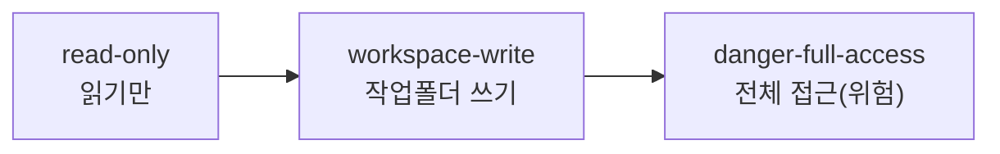
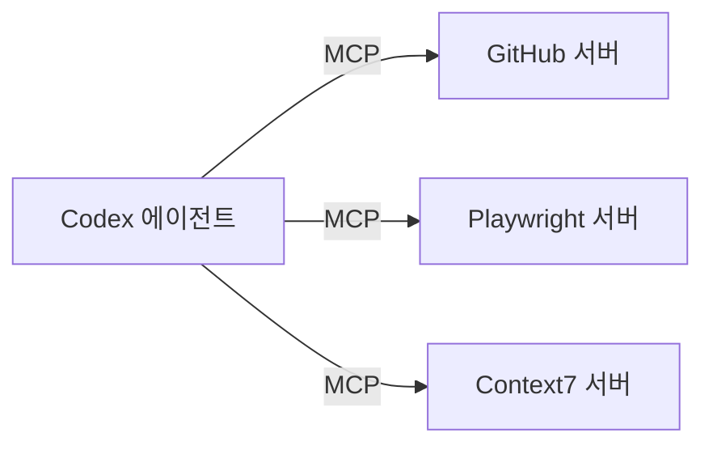
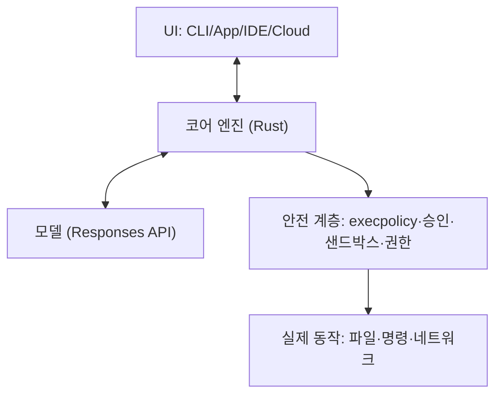
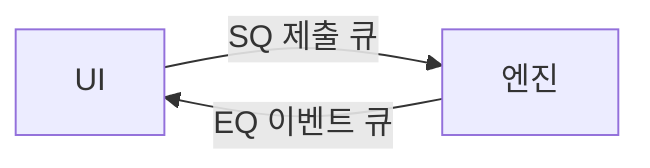
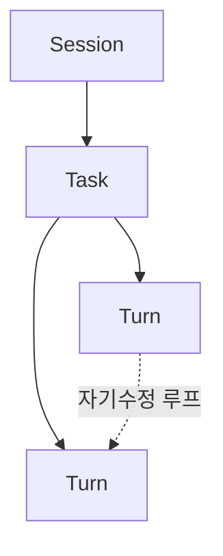
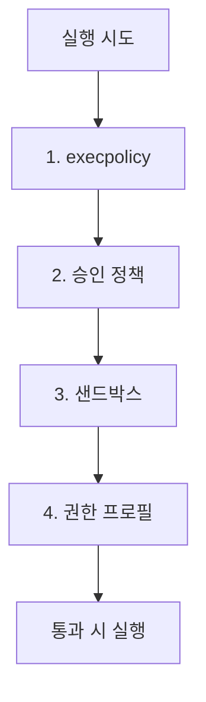
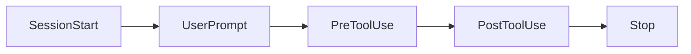

# GPT & Codex 기초부터 고급까지 100

> AI 에이전트와 함께하는 바이브 코딩 — 코드 한 줄부터 1인 SaaS까지

- 저자: AI_Innovation_Studio
- 기준 버전: GPT-5.5 / Codex CLI (2026년 6월)
- 집필일: 2026년 6월 20일
- 문의: leemanrank@gmail.com
- 인공지능 정보공유 단톡방: https://open.kakao.com/o/s4OEqBai

---

# 전체 목차 — GPT & Codex 기초부터 고급까지 100

> [TOC]

본 책은 100개의 절(節)로 구성됩니다. 초급자는 1번부터 순서대로, 경험자는 필요한 Part로 바로 이동하세요.

---

## Part 0. 시작하기 전에
- 001. 머리말 — 왜 지금 GPT와 Codex인가
- 002. 이 책의 구성과 사용법 (초급·중급·고급 로드맵)
- 003. 우리가 함께 만들 것: 1인 SaaS "TaskFlow"
- 004. 꼭 알아야 할 용어 사전

## Part 1. 초급 — GPT와 Codex의 세계로
- 005. GPT란 무엇인가 — 거대 언어 모델(LLM)의 이해
- 006. GPT-5.5: 2026년 최신 플래그십 모델
- 007. 모델 라인업과 선택 기준 (5.5 / 5.4 / mini / spark)
- 008. 토큰·컨텍스트 윈도우·추론 강도(reasoning effort)
- 009. ChatGPT vs API vs Codex — 무엇을 언제 쓰나
- 010. Codex란 무엇인가 — AI 코딩 에이전트의 등장
- 011. Codex의 네 가지 얼굴: App / CLI / IDE / Cloud
- 012. 개발 환경 준비 (계정·요금제·터미널)
- 013. Codex CLI 설치하기 (Mac / Linux / Windows)
- 014. 첫 실행과 로그인 (`codex login`)
- 015. 첫 대화: "Hello, Codex"
- 016. Codex 화면(TUI) 둘러보기
- 017. [실습] 첫 번째 코드 생성
- 018. 파일을 읽고 편집하게 시키기
- 019. 터미널 명령 실행과 승인(approval) 이해
- 020. 변경사항 확인하기 (`/diff`)
- 021. 세션 관리: `/clear`, `/compact`, 종료와 재개
- 022. 슬래시 커맨드 입문 (필수 10개)
- 023. 이미지로 지시하기 (스크린샷 첨부)
- 024. 좋은 프롬프트 1 — 명확하게 요청하기
- 025. 좋은 프롬프트 2 — 작업 쪼개기
- 026. 좋은 프롬프트 3 — 검증을 포함시키기
- 027. [실습] 파이썬 계산기 만들기
- 028. [실습] 웹페이지 한 장 만들기 (HTML/CSS)
- 029. 초급에서 흔한 실수와 해결
- 030. 초급 마무리 & 체크리스트

## Part 2. 중급 — Codex를 길들이기
- 031. 설정 파일 `config.toml` 이해하기
- 032. 유저 설정 vs 프로젝트 설정
- 033. 모델·추론 강도 설정하기
- 034. AGENTS.md — 프로젝트 규칙 가르치기
- 035. AGENTS.md 계층과 우선순위 (override, 32KiB)
- 036. [실습] 우리 프로젝트 AGENTS.md 작성
- 037. Memories — Codex의 기억 다루기
- 038. 샌드박스(Sandbox) — 안전의 핵심
- 039. 샌드박스 3모드: read-only / workspace-write / full-access
- 040. 승인 정책(approval policy) 4종
- 041. 권한 프로필(permission profiles)
- 042. 프롬프팅 심화 1 — 컨텍스트 제공의 기술
- 043. 프롬프팅 심화 2 — 스레드와 병렬 작업
- 044. 프롬프팅 심화 3 — Goal 모드 (`/goal`)
- 045. 코드 리뷰 시키기 (`/review`)
- 046. 계획 모드(plan)와 단계별 작업
- 047. MCP란 무엇인가 — 도구 확장의 표준
- 048. MCP 서버 연결하기 (`codex mcp add`)
- 049. 인기 MCP 서버 활용 (GitHub·Playwright·Context7)
- 050. Skills — 재사용 워크플로 만들기
- 051. SKILL.md 작성법과 progressive disclosure
- 052. [실습] 나만의 커스텀 스킬 제작
- 053. Plugins와 마켓플레이스
- 054. 웹 검색 도구 활용
- 055. 비대화형 모드 `codex exec` (자동화 기초)
- 056. Git과 함께 쓰기 (커밋·브랜치 안전수칙)
- 057. IDE에서 Codex 쓰기 (VS Code / Cursor)
- 058. [실습] To-Do API 서버 만들기 (FastAPI)
- 059. 중급에서 흔한 실수와 해결
- 060. 중급 마무리 & 체크리스트

## Part 3. 고급 — Codex의 내부와 확장
- 061. Codex 아키텍처 큰 그림 (Rust 모노레포)
- 062. 코어 프로토콜 — SQ/EQ 큐 모델
- 063. Session > Task > Turn 생명주기
- 064. 모델 통신 — Responses API와 SSE 스트리밍
- 065. 컨텍스트 압축(compaction)의 원리
- 066. 출하 시스템 프롬프트 해부
- 067. apply_patch 편집 포맷 제대로 다루기
- 068. 명령 정책 execpolicy와 Starlark DSL
- 069. 4겹 권한 모델 심층 분석
- 070. OS 네이티브 샌드박스 내부 (Seatbelt / landlock)
- 071. 서브에이전트(Subagents) 오케스트레이션
- 072. [실습] 서브에이전트로 병렬 탐색
- 073. Hooks — 에이전트 루프에 끼어들기
- 074. Hooks 9대 이벤트와 활용 패턴
- 075. [실습] PreToolUse 훅으로 보안 검사
- 076. Personality 시스템 (friendly / pragmatic)
- 077. Codex SDK 시작 (TypeScript)
- 078. Codex SDK 시작 (Python)
- 079. [실습] SDK로 나만의 에이전트 앱
- 080. app-server JSON-RPC 프로토콜
- 081. Codex Cloud 심화와 Environments
- 082. [실습] GitHub `@codex`로 PR 자동화
- 083. GitHub Actions에 Codex 통합
- 084. 보안과 거버넌스 (Codex Security·엔터프라이즈)
- 085. 고급 마무리 & 체크리스트

## Part 4. 실전 프로젝트 — 바이브 코딩으로 1인 SaaS
- 086. 프로젝트 기획 — AI 할일 SaaS "TaskFlow"
- 087. 요구사항을 AGENTS.md와 Goal로 정의
- 088. 백엔드 구축 — Codex와 페어 코딩
- 089. 프런트엔드 구축 — 디자인 슬롭 피하기
- 090. 데이터베이스와 인증 붙이기
- 091. 테스트 작성과 자동 검증 루프
- 092. MCP·서브에이전트로 개발 가속
- 093. 배포 — Cloud / CI 자동화
- 094. 코드 리뷰와 리팩터링 라운드
- 095. 출시와 회고

## Part 5. 부록 & 마무리
- 096. 슬래시 커맨드 전체 레퍼런스
- 097. `config.toml` 전체 레퍼런스
- 098. CLI 서브커맨드 전체 레퍼런스
- 099. 트러블슈팅 & FAQ
- 100. 맺음말 — AI 시대의 개발자로 살아가기

---

# 001. 머리말 — 왜 지금 GPT와 Codex인가


## 5년 만에 바뀐 풍경

2020년만 해도 "AI가 코드를 짠다"는 말은 신기한 데모였습니다. 2026년 지금, 그것은 일하는 방식 그 자체가 되었습니다. 전 세계 200만 명이 넘는 개발자가 매주 Codex로 기능을 만들고, 버그를 잡고, 낯선 코드베이스를 이해합니다. 더 놀라운 건, 그중 상당수가 "전문 개발자"가 아니라는 점입니다.

이 변화의 중심에 두 가지가 있습니다.

- GPT-5.5 — OpenAI가 2026년 내놓은 최신 플래그십 모델. 복잡한 코딩, 컴퓨터 사용, 지식 노동, 리서치까지 아우르는 추론 능력을 갖췄습니다.
- Codex — 그 GPT의 두뇌를 당신의 컴퓨터와 터미널, 그리고 클라우드에서 직접 행동하게 만든 코딩 에이전트입니다. 파일을 읽고, 코드를 고치고, 테스트를 돌리고, 커밋까지 합니다.

## "바이브 코딩"의 시대

요즘 사람들은 이런 식으로 일합니다.

> "할 일을 추가하고 마감일을 설정할 수 있는 웹앱을 만들어 줘. 그리고 완료한 일은 취소선이 그어지게 해줘."

그러면 에이전트가 파일을 만들고, 코드를 쓰고, 실행해 보고, 화면을 띄워 줍니다. 사람은 무엇을 원하는지(intent)에 집중하고, 어떻게 구현할지(implementation)의 상당 부분을 AI에게 맡깁니다. 이런 흐름을 흔히 바이브 코딩(Vibe Coding)이라 부릅니다.

오해하지 마세요. 바이브 코딩은 "아무것도 몰라도 된다"는 뜻이 아닙니다. 오히려 무엇을 어떻게 요청하고, 결과를 어떻게 검증하며, AI를 어떻게 통제하는가를 아는 사람이 압도적으로 유리해집니다. 이 책은 바로 그 능력을 길러 줍니다.

## 이 책이 다른 점

시중의 많은 자료는 "설치하고, 명령어 몇 개 쳐보기"에서 멈춥니다. 이 책은 다릅니다.

1. 초급부터 천천히 — 터미널이 처음인 분도 따라올 수 있게 한 걸음씩 갑니다.
2. 고급의 진짜 내부까지 — Codex 엔진이 실제로 어떻게 동작하는지(큐 모델, 샌드박스, 명령 정책, 출하 프롬프트)를 코드 수준에서 풀어냅니다.
3. 하나의 프로젝트로 관통 — 책을 덮을 때쯤 당신은 AI 할일 SaaS "TaskFlow" 라는 진짜 서비스를 하나 완성하게 됩니다.

## 이 책을 읽고 나면

- GPT-5.5와 Codex의 차이와 관계를 명확히 이해합니다.
- Codex를 설치하고 일상 개발에 자연스럽게 녹여 씁니다.
- 설정·규칙(AGENTS.md)·도구(MCP)·스킬로 에이전트를 내 방식대로 길들입니다.
- 샌드박스·승인·권한으로 안전하게 자동화합니다.
- SDK와 훅으로 나만의 AI 도구를 직접 만듭니다.
- 실전 프로젝트로 기획 → 개발 → 배포 → 출시 전 과정을 경험합니다.

## 함께 가는 법

- 코드 블록은 직접 따라 쳐 보세요. 눈으로 읽는 것과 손으로 하는 것은 다릅니다.
- 각 장 끝의 [실습]과 체크리스트를 건너뛰지 마세요.
- 막히면 Codex에게 물어보세요. 이 책 자체가 "AI에게 잘 묻는 법"을 가르칩니다.

자, 그럼 시작합시다. 다음 절에서 이 책을 어떻게 읽을지부터 정리하겠습니다.

---

## 저자와 소통하기

이 책을 읽다 막히거나, 의견·피드백을 나누고 싶다면 언제든 연락 주세요. 혼자 공부하는 것보다 함께가 멀리 갑니다.

- 문의·피드백 이메일: leemanrank@gmail.com
- 인공지능 정보공유 단톡방(오픈채팅): https://open.kakao.com/o/s4OEqBai
  - 최신 AI·Codex 소식, 질문과 답변, 함께 성장하는 사람들이 있는 공간입니다. 참여 문의는 위 링크로!

> 학습 중 생긴 질문을 단톡방에 공유하면, 같은 길을 걷는 동료들의 경험이 큰 힘이 됩니다.


---

# 002. 이 책의 구성과 사용법


## 다섯 개의 Part

이 책은 100개의 절을 5개 Part로 나눕니다. 난이도는 계단처럼 올라갑니다.

| Part | 수준 | 무엇을 배우나 | 핵심 질문 |
|---|---|---|---|
| Part 1 | 초급 | GPT·Codex 이해, 설치, 첫 사용, 기본 프롬프트 | "어떻게 시작하지?" |
| Part 2 | 중급 | 설정, AGENTS.md, 샌드박스, MCP, 스킬, 자동화 | "어떻게 길들이지?" |
| Part 3 | 고급 | 내부 아키텍처, 서브에이전트, 훅, SDK, 클라우드 | "어떻게 동작하고 확장하지?" |
| Part 4 | 실전 | 1인 SaaS "TaskFlow"를 처음부터 끝까지 | "어떻게 진짜를 만들지?" |
| Part 5 | 부록 | 레퍼런스, 트러블슈팅, 맺음말 | "막히면 어디를 보지?" |

## 읽는 순서

- 완전 입문자 → 001번부터 순서대로. Part 1을 절대 건너뛰지 마세요.
- Codex를 써본 사람 → Part 2부터. 단 034(AGENTS.md), 038(샌드박스)은 꼭 읽으세요.
- 개발 경험자·고급 사용자 → Part 3부터. 내부 원리가 궁금하다면 061번이 출발점입니다.
- 빨리 만들어 보고 싶은 사람 → Part 4를 먼저 훑고, 막히는 개념을 앞 Part에서 찾아 읽으세요.

## 이 책의 약속과 표기

본문에는 몇 가지 반복되는 박스가 있습니다.

> TIP — 알아두면 편한 실전 팁

> 주의 — 데이터 손실·보안 등 조심할 점

> 깊이 보기 — 내부 동작이 궁금한 사람을 위한 심화 (초급자는 건너뛰어도 됨)

> 실습 — 직접 손으로 따라 하는 예제

명령어와 코드는 이렇게 표기합니다.

```bash
# 터미널에 입력하는 명령
codex --version
```

```python
# 파이썬 코드 예시
print("Hello, Codex")
```

화면에 입력하는 슬래시 커맨드는 `/diff` 처럼, 파일 경로는 `~/.codex/config.toml` 처럼 표기합니다.

## 버전 기준

이 책의 모든 내용은 2026년 6월 기준입니다.

- 모델: GPT-5.5 (플래그십)을 기본으로, 필요 시 `gpt-5.4`·`gpt-5.4-mini`·`gpt-5.3-codex-spark`를 함께 다룹니다.
- 도구: Codex CLI 최신 버전 (Rust 기반, Apache-2.0 오픈소스 코어)

> AI 도구는 빠르게 진화합니다. 명령어나 화면이 책과 조금 다르면, 개념은 그대로 두고 최신 도움말(`codex --help`)을 함께 보세요.

## 준비물

- 인터넷이 되는 컴퓨터 (Windows / macOS / Linux 모두 가능)
- OpenAI 계정 (ChatGPT Plus 이상 또는 API 키)
- 터미널을 열 수 있는 용기 — 그게 전부입니다

다음 절에서는 우리가 이 책 전체에 걸쳐 함께 만들 프로젝트를 소개합니다.


---

# 003. 우리가 함께 만들 것 — 1인 SaaS "TaskFlow"

## 책 한 권 = 프로젝트 하나

이 책은 이론만 나열하지 않습니다. 우리는 TaskFlow 라는 실제로 동작하는 서비스를 함께 만듭니다. 각 Part에서 배운 기술이 이 프로젝트에 차곡차곡 쌓입니다.

> TaskFlow — "AI가 도와주는 할일 관리 SaaS". 할 일을 추가/완료/삭제하고, 마감일을 관리하며, AI가 우선순위를 제안해 주는 1인 개발 웹 서비스.

왜 할일 앱이냐고요? 세 가지 이유입니다.

1. 누구나 이해한다 — 기능을 설명하는 데 시간이 들지 않습니다.
2. 풀스택을 다 만진다 — 프런트엔드, 백엔드, DB, 인증, 배포까지 SaaS의 전형을 모두 경험합니다.
3. 확장이 자유롭다 — 기본기를 익힌 뒤 알림, 협업, 결제 등으로 얼마든지 키울 수 있습니다.

## 무엇을 만들게 되나

완성된 TaskFlow는 이런 기능을 갖습니다.

- ○ 할 일 추가 · 수정 · 완료 · 삭제 (CRUD)
- 마감일 설정과 정렬
- 회원가입 / 로그인 (인증)
- AI 우선순위 추천 — "오늘 뭐부터 할까?"를 GPT-5.5가 제안
- 클라우드 배포 + 자동 테스트(CI)

## 기술 스택 (걱정 마세요, 천천히 갑니다)

| 영역 | 기술 | 다루는 Part |
|---|---|---|
| 백엔드 | Python · FastAPI | 058, 088 |
| 프런트엔드 | HTML · CSS · 약간의 JS | 028, 089 |
| 데이터베이스 | SQLite → PostgreSQL | 090 |
| 인증 | 토큰 기반 로그인 | 090 |
| AI 기능 | GPT-5.5 API | 088, 092 |
| 배포 | Codex Cloud · GitHub Actions | 093 |

지금 이 표가 외계어처럼 보여도 괜찮습니다. Part 1·2를 지나면 자연스럽게 읽히게 됩니다.

## 어떻게 만드나 — "바이브 코딩" 방식

우리는 한 줄 한 줄 직접 타이핑하지 않습니다. 대신 Codex에게 이렇게 일을 맡깁니다.

```text
FastAPI로 할 일(todo)을 추가/조회/완료/삭제하는 REST API를 만들어줘.
- 각 할 일은 id, 제목, 완료여부, 마감일을 가진다
- 데이터는 우선 SQLite에 저장
- pytest로 각 엔드포인트 테스트도 함께 작성해줘
```

그러면 Codex가 파일을 만들고, 코드를 쓰고, 테스트를 돌려 보여 줍니다. 우리는 요구사항을 잘 정의하고, 결과를 검증하고, 다음을 지시합니다. 이게 이 책이 가르치는 핵심 역량입니다.

## 단계별 성장 지도

```text
Part 1  ─▶  도구에 익숙해진다 (작은 코드 생성)
Part 2  ─▶  규칙·도구로 Codex를 길들인다 (To-Do API 1차 완성)
Part 3  ─▶  내부를 이해하고 확장한다 (자동화·SDK)
Part 4  ─▶  TaskFlow 완성 → 배포 → 출시
```

> TIP 각 Part의 [실습]에서 만든 결과물을 버리지 말고 폴더에 모아 두세요. Part 4에서 그대로 재활용합니다.

다음 절에서는 본격적으로 들어가기 전에 꼭 알아야 할 용어들을 짧고 쉽게 정리합니다.


---

# 004. 꼭 알아야 할 용어 사전

본격적으로 시작하기 전에, 책 전반에 계속 등장하는 단어들을 쉬운 말로 정리합니다. 지금 다 외울 필요는 없습니다. 헷갈릴 때 이 절로 돌아오세요.

## AI · 모델 관련

LLM (거대 언어 모델, Large Language Model)
대량의 텍스트로 학습해 "다음에 올 말"을 잘 예측하는 AI. GPT가 대표적입니다. 코드도 결국 텍스트라서 LLM이 잘 다룹니다.

GPT-5.5
2026년 OpenAI의 최신 플래그십 모델. 이 책의 기준 모델입니다.

토큰(token)
AI가 글을 처리하는 최소 단위. 단어보다 작을 수도, 클 수도 있습니다. 영어는 대략 4글자가 1토큰, 한국어는 글자당 더 많은 토큰을 씁니다. 요금과 처리량이 토큰 단위로 계산됩니다.

컨텍스트 윈도우(context window)
모델이 한 번에 "기억"할 수 있는 토큰의 양. 대화가 길어지면 이 창을 넘지 않도록 관리해야 합니다(→ 압축, compaction).

추론 강도(reasoning effort)
모델이 답하기 전에 "얼마나 깊이 생각할지"를 정하는 설정. `low`는 빠르고 저렴, `high`는 느리지만 똑똑합니다. (`minimal`~`xhigh`까지 단계가 있습니다.)

## 에이전트 · 도구 관련

에이전트(agent)
단순히 답만 하는 게 아니라 스스로 행동(파일 편집, 명령 실행 등) 하는 AI. Codex가 바로 코딩 에이전트입니다.

Codex
GPT를 코딩 에이전트로 만든 OpenAI의 도구. 터미널(CLI), 데스크톱 앱, IDE 확장, 클라우드 형태로 씁니다.

CLI (명령줄 인터페이스, Command-Line Interface)
터미널에 명령어를 입력해 쓰는 프로그램. `codex`가 그렇습니다.

TUI (텍스트 사용자 인터페이스, Text User Interface)
터미널 안에서 동작하는 화면 기반 UI. Codex를 실행하면 나오는 대화 화면이 TUI입니다.

프롬프트(prompt)
AI에게 주는 지시문. "잘 쓰는 법"이 이 책의 핵심 주제 중 하나입니다.

스레드(thread)
하나의 작업 세션. 프롬프트 + AI의 응답 + 도구 호출이 모여 한 스레드를 이룹니다.

턴(turn)
스레드 안에서 한 번의 "요청→응답→행동" 사이클. 여러 턴이 모여 하나의 작업(Task)을 완성합니다.

## 안전 · 제어 관련

샌드박스(sandbox)
에이전트가 함부로 시스템을 건드리지 못하게 가두는 안전 울타리. read-only / workspace-write 등 모드가 있습니다.

승인(approval)
위험할 수 있는 작업을 실행하기 전에 사용자에게 "해도 될까요?"를 묻는 절차.

AGENTS.md
프로젝트에 두는 규칙 파일. "이 저장소에선 이렇게 일해라"를 Codex에게 항상 알려 줍니다.

## 확장 관련

MCP (Model Context Protocol)
Codex에 외부 도구(웹 검색, GitHub, 브라우저 등)를 붙이는 표준 연결 규격.

스킬(skill)
자주 쓰는 작업 절차를 묶어 둔 재사용 패키지. `SKILL.md`로 정의합니다.

훅(hook)
에이전트가 일하는 도중 특정 시점에 내 스크립트를 끼워 넣는 장치 (예: 도구 실행 직전 검사).

SDK (소프트웨어 개발 키트)
Codex를 코드에서 프로그램처럼 제어하게 해주는 라이브러리 (TypeScript·Python).

---

> TIP 모르는 단어가 나오면 Codex에게 직접 물어봐도 됩니다. "토큰이 뭐야? 초보자도 알게 쉽게 설명해줘" 처럼요.

이제 준비가 끝났습니다. Part 1, 초급으로 들어갑니다.


---

# 005. GPT란 무엇인가 — 거대 언어 모델(LLM)의 이해

## 한 문장으로

> GPT는 "지금까지의 글을 보고, 다음에 올 말을 가장 그럴듯하게 예측하는" 거대한 AI다.

너무 단순해 보이나요? 이 단순한 능력이 무한히 커지면 놀라운 일이 벌어집니다. 번역, 요약, 글쓰기, 그리고 코딩까지 — 전부 "다음 말 예측"의 응용입니다.

## 어떻게 코드를 짜는가

코드도 결국 텍스트입니다.

```python
def add(a, b):
    return ...
```

여기서 `...` 자리에 뭐가 올까요? 사람도 "`a + b`"라고 답할 겁니다. GPT는 수억 개의 코드 예제를 학습해서, 이런 빈칸을 사람보다 빠르고 정확하게 채웁니다. 단순한 빈칸 채우기를 넘어, 함수 전체·파일 전체·프로젝트 구조까지 만들어 냅니다.

## GPT의 발전 과정 (아주 짧게)

- GPT-3 (2020) — "그럴듯한 글"을 쓰기 시작
- GPT-4 (2023) — 추론·코딩 능력 도약, 실무 투입
- GPT-5 계열 (2025~2026) — 추론(reasoning) 능력 강화, 도구를 직접 쓰는 에이전트 시대 개막
- GPT-5.5 (2026) — 이 책의 기준. 복잡한 코딩과 장시간 작업에 최적화

## "생성형 AI"와 "추론형 AI"

초기 GPT는 묻자마자 바로 답했습니다(생성형). 최신 모델은 답하기 전에 속으로 생각하는 단계를 거칩니다(추론형). 어려운 문제일수록 더 오래 생각하고, 그만큼 정확해집니다. 이 "생각의 깊이"를 우리가 조절할 수 있는데, 이를 추론 강도(reasoning effort)라고 합니다 (→ 008번).

## GPT가 잘하는 것 vs 조심할 것

잘하는 것
- 보일러플레이트(반복 코드) 생성
- 낯선 라이브러리 사용법 안내
- 버그 원인 추론, 리팩터링 제안
- 문서·테스트 작성

조심할 것
- 환각(hallucination) — 그럴듯하지만 틀린 답을 자신 있게 말할 수 있음
- 최신 정보 — 학습 시점 이후 정보는 모를 수 있음(그래서 웹 검색·도구를 붙임)
- 보안·민감 정보 — 함부로 비밀키를 노출하면 안 됨

> 핵심 교훈 GPT의 답은 "초안"입니다. 검증은 사람의 몫입니다. 이 책은 검증을 쉽게 만드는 법(테스트 자동화 등)을 계속 강조합니다.

## 그래서 Codex가 필요하다

GPT 혼자서는 "말"만 합니다. 실제로 파일을 고치고, 코드를 실행해 결과를 확인하려면 GPT를 손과 발이 달린 에이전트로 만들어야 합니다. 그게 바로 Codex입니다(→ 010번).

---

### 미니 실습 (계정 없이도 가능)
종이에 적어 보세요. 아래 빈칸에 GPT라면 뭐라고 채울지 예측해 봅시다.

```python
# 두 수 중 큰 값을 반환
def max_value(a, b):
    if a > b:
        return a
    else:
        return ___
```

정답은 `b`입니다. 방금 당신은 "다음 말 예측"을 직접 해본 겁니다 — GPT가 하는 일의 본질이죠.


---

# 006. GPT-5.5 — 2026년 최신 플래그십 모델

## GPT-5.5는 무엇인가

> GPT-5.5는 2026년 OpenAI의 최신 프런티어(최첨단) 모델로, 복잡한 코딩·컴퓨터 사용·지식 노동·리서치 워크플로에 걸쳐 가장 강력한 성능을 냅니다.

Codex에서 복잡한 작업을 맡길 때 권장되는 기본 모델이 바로 GPT-5.5입니다. ChatGPT 로그인 또는 API 키로 사용할 수 있습니다.

## 무엇이 강해졌나

GPT-5.5가 이전 세대보다 두드러지는 부분은 다음과 같습니다.

1. 깊은 추론 — 여러 단계를 거쳐야 하는 문제(설계 → 구현 → 검증)를 끝까지 끌고 갑니다.
2. 장시간 자율 작업 — 한 번 시킨 작업을 여러 턴에 걸쳐 스스로 이어 갑니다(→ Goal 모드, 044번).
3. 도구 사용(tool use) — 터미널·파일·웹 검색·MCP 도구를 능숙하게 조합합니다.
4. 컴퓨터 사용(computer use) — 화면을 보고 조작하는 작업까지 다룹니다.

## 언제 GPT-5.5를 쓰나

| 상황 | 추천 |
|---|---|
| 복잡한 기능 구현, 아키텍처 설계 | ○ GPT-5.5 |
| 버그 추적, 보안 리뷰 | ○ GPT-5.5 (추론 강도 high) |
| 단순 반복, 빠른 수정 | gpt-5.4-mini가 더 경제적 |
| 실시간 즉답 코딩 | gpt-5.3-codex-spark (Pro 전용) |

> 다른 모델들과의 비교는 다음 절(007)에서 자세히 다룹니다.

## "Codex" 변형 모델 이야기

OpenAI는 일반 모델 외에, 소프트웨어 엔지니어링에 특화 튜닝한 Codex 계열 모델도 함께 제공해 왔습니다(예: 과거의 `codex-1`). 이들은 코드 편집·도구 호출 같은 에이전트 작업에 맞춰 다듬어졌습니다. 2026년 현재 권장 라인업은 GPT-5.5를 정점으로 정리되어 있으며, 구형인 `gpt-5.2`·`gpt-5.3-codex` 등은 사용 중단(deprecated) 되었으니 새 작업에는 최신 모델을 쓰세요.

## 요금과 토큰 감각

정확한 단가는 시기에 따라 바뀌므로 공식 가격표를 확인해야 합니다. 다만 감각은 갖고 가세요.

- 더 똑똑한 모델 = 토큰당 비용 ↑
- 추론 강도가 높을수록 = 생각하는 토큰(요금) ↑
- 컨텍스트가 길수록 = 입력 토큰 ↑

> TIP 처음엔 GPT-5.5로 작업의 "설계"를 시키고, 단순 반복 부분은 mini로 내려서 돌리면 품질과 비용을 동시에 잡을 수 있습니다(→ 071 서브에이전트에서 이 전략을 본격적으로 다룹니다).

## 정리

- GPT-5.5 = 2026년 가장 강력한 범용/코딩 모델, Codex의 권장 기본값
- 복잡·장시간·도구 사용 작업에 강함
- 비용은 "똑똑함 × 생각의 깊이 × 입력 길이"에 비례한다고 기억

## 자주 묻는 질문

Q. 꼭 GPT-5.5만 써야 하나요?
A. 아닙니다. 간단한 수정이나 대량 파일 훑기 같은 일은 더 가볍고 빠른 모델이 비용 대비 효율이 좋습니다. 어려운 설계나 까다로운 디버깅처럼 깊은 추론이 필요할 때 GPT-5.5를 쓰는 식으로 작업에 맞춰 고르면 됩니다. 자세한 기준은 다음 절에서 다룹니다.

Q. 모델이 바뀌면 이 책 내용이 쓸모없어지나요?
A. 모델 이름과 숫자는 계속 바뀌지만, 이 책이 가르치는 핵심(어떻게 요청하고, 검증하고, 통제하는가)은 모델이 바뀌어도 그대로 통합니다. 새 모델이 나오면 이름만 바꿔 적용하면 됩니다.

Q. GPT-5.5는 인터넷의 최신 정보를 다 아나요?
A. 학습 시점까지의 지식을 갖고 있고, 그 이후 정보는 모를 수 있습니다. 그래서 최신 라이브러리 사용법 같은 건 웹 검색이나 외부 도구로 보완합니다. 이 방법은 중급편에서 다룹니다.

다음 절에서는 GPT-5.5를 포함한 전체 모델 라인업과 고르는 기준을 표로 정리합니다.

---

> 깊이 보기 Codex는 모델별로 출하 시스템 프롬프트가 다릅니다. 즉 같은 GPT라도 "Codex로 동작할 때의 행동 지침"이 모델마다 따로 준비돼 있습니다. 이 내부는 066번에서 해부합니다.


---

# 007. 모델 라인업과 선택 기준

## 2026년 6월 기준 라인업

Codex에서 고를 수 있는 주요 모델은 다음과 같습니다.

| 모델 | 성격 | 추천 용도 | 비용/속도 |
|---|---|---|---|
| gpt-5.5 | 플래그십, 최강 추론 | 복잡한 코딩, 설계, 리서치 | 비싸고 느림(깊음) |
| gpt-5.4 | 주력 프런티어, 전 플랫폼 호환 | 일상적인 전문 작업 | 균형 |
| gpt-5.4-mini | 경량·고속 | 대용량 스캔, 단순 작업, 서브에이전트 | 싸고 빠름 |
| gpt-5.3-codex-spark | 실시간 프리뷰(텍스트 전용) | 즉각적인 코딩 반복(ChatGPT Pro 전용) | 매우 빠름 |

> `gpt-5.2`, `gpt-5.3-codex` 같은 구형은 deprecated 입니다. 새 프로젝트엔 위 표의 모델을 쓰세요.

## 고르는 3가지 기준

모델 선택은 결국 세 가지 트레이드오프의 균형입니다.

```text
   똑똑함(품질)  ⟷  속도  ⟷  비용
```

- 품질이 최우선 (아키텍처 설계, 까다로운 버그) → `gpt-5.5`
- 균형 (대부분의 일상 작업) → `gpt-5.4`
- 속도·비용 우선 (반복 수정, 파일 훑기) → `gpt-5.4-mini`
- 즉답 페어코딩 → `gpt-5.3-codex-spark`

## 실전 선택 가이드

> 다음 작업에 어떤 모델이 좋을지 스스로 골라 보세요. (정답은 아래)

1. "이 1만 줄짜리 로그에서 에러 패턴만 찾아줘"
2. "결제 모듈을 새로 설계하고 구현해줘"
3. "변수명 오타 하나 고쳐줘"
4. "방금 친 코드 바로 이어서 자동완성처럼 도와줘"

<details>
<summary>정답 보기</summary>

1. `gpt-5.4-mini` (대량 스캔, 단순 추출)
2. `gpt-5.5` (복잡한 설계+구현)
3. `gpt-5.4-mini` (사소한 수정)
4. `gpt-5.3-codex-spark` (실시간 반복)

</details>

## 모델 바꾸는 법 (미리 보기)

자세한 설정은 033번에서 다루지만, 방법만 미리 보면 세 가지입니다.

```bash
# 1) 실행 중 슬래시 커맨드로
/model

# 2) 실행할 때 플래그로
codex --model gpt-5.5

# 3) 설정 파일 config.toml 에 기본값으로
#    model = "gpt-5.5"
```

## "추론 강도"도 함께 고른다

같은 모델이라도 얼마나 깊이 생각할지를 따로 정할 수 있습니다.

- `low` — 빠르고 저렴 (단순 작업)
- `medium` — 기본 균형
- `high` — 깊은 추론 (보안 리뷰, 복잡한 로직 추적)
- (`minimal` ~ `xhigh` 까지 세분화)

> TIP "비싼 모델 + 낮은 추론"보다 "적당한 모델 + 높은 추론"이 나은 경우가 많습니다. 모델과 추론 강도는 함께 튜닝하세요. 자세한 건 008번에서.

## 정리

- 한 가지 모델만 고집하지 말고 작업에 맞춰 갈아타세요.
- 기본은 `gpt-5.5`, 비용·속도가 중요하면 `gpt-5.4-mini`.
- 모델 × 추론 강도 = 진짜 성능 다이얼.


---

# 008. 토큰 · 컨텍스트 윈도우 · 추론 강도

이 세 가지는 AI를 다루는 사람의 기본 상식입니다. 비용, 속도, 품질이 전부 여기서 결정됩니다.

## 1) 토큰(token)

AI는 글자를 그대로 보지 않고, 토큰이라는 조각으로 잘라서 처리합니다.

```text
"Hello, world"  →  ["Hello", ",", " world"]   (대략 3토큰)
"안녕하세요"      →  글자마다 더 잘게 쪼개짐 (한국어는 토큰을 더 많이 씀)
```

기억할 점:
- 요금은 토큰 단위로 매겨집니다 (입력 토큰 + 출력 토큰).
- 영어보다 한국어가 토큰을 더 많이 소비합니다.
- 코드도 토큰으로 변환됩니다.

> TIP 대략 영어 750단어 ≈ 1,000토큰. 한국어는 같은 분량이라도 더 많은 토큰을 씁니다. 긴 문서를 통째로 붙이기 전에 "정말 다 필요한가?"를 생각하세요.

## 2) 컨텍스트 윈도우(context window)

모델이 한 번에 들고 있을 수 있는 토큰의 총량입니다. 일종의 "작업 기억(working memory)"이죠.

```text
[ 시스템 지침 ] + [ AGENTS.md ] + [ 대화 기록 ] + [ 첨부 파일 ] + [ 도구 출력 ]
└──────────────── 이 모든 게 컨텍스트 윈도우 안에 들어가야 함 ────────────────┘
```

윈도우가 가득 차면?
- 오래된 내용이 밀려나거나
- Codex가 자동으로 압축(compaction) 합니다 → 지금까지의 작업을 요약해 자리를 비웁니다 (내부 원리는 065번).

> 대화가 아주 길어지면 모델이 "앞부분을 잊은 것처럼" 행동할 수 있습니다. 중요한 규칙은 대화에 의존하지 말고 AGENTS.md에 박아 두세요(→ 034번).

## 3) 추론 강도(reasoning effort)

답하기 전에 모델이 속으로 얼마나 깊이 생각할지를 정하는 다이얼입니다.

| 강도 | 특징 | 적합한 작업 |
|---|---|---|
| `minimal` / `low` | 빠르고 저렴, 생각 적음 | 단순 수정, 포맷팅 |
| `medium` | 기본 균형 | 대부분의 일상 작업 |
| `high` / `xhigh` | 느리지만 깊음 | 보안 리뷰, 복잡한 버그 추적, 설계 |

생각하는 과정도 토큰을 씁니다. 즉 추론 강도 ↑ = 비용·시간 ↑ = 품질 ↑.

## 셋을 함께 보는 감각

실전에서 이 셋은 따로 놀지 않습니다.

```text
긴 코드베이스(컨텍스트↑) + 어려운 문제(추론↑) = 토큰 많이 + 느림 + 비쌈
                                              → 그만큼 똑똑한 결과
```

> 비용 절약 3원칙
> 1. 필요한 파일만 컨텍스트에 넣는다.
> 2. 단순 작업은 추론 강도를 낮춘다.
> 3. 대화가 길어지면 `/compact`로 정리한다(→ 021번).

## 정리

- 토큰 = 처리·요금의 단위 (한국어는 더 많이 씀)
- 컨텍스트 윈도우 = 한 번에 기억하는 양, 넘치면 압축됨
- 추론 강도 = 생각의 깊이 다이얼, 품질·비용을 좌우

---

### 미니 실습
다음 두 프롬프트 중 어느 쪽이 토큰을 더 아낄까요?

- A: "내 프로젝트 전체 폴더를 다 읽고 버그를 찾아줘"
- B: "`payment.py` 파일에서 환불 로직의 버그를 찾아줘. 재현 방법은 ~ 이야"

정답은 B. 범위를 좁히면 토큰도 아끼고 정확도도 올라갑니다. (좋은 프롬프트의 핵심 — 025번에서 더 다룹니다.)


---

# 009. ChatGPT vs API vs Codex — 무엇을 언제 쓰나

같은 GPT-5.5라도 어디서 만나느냐에 따라 쓰임새가 다릅니다. 초보자가 가장 헷갈리는 지점이니 확실히 정리합시다.

## 세 가지 접점

| 구분 | 무엇인가 | 누가 쓰나 |
|---|---|---|
| ChatGPT | 웹/앱의 대화 인터페이스 | 모두 — 질문, 글쓰기, 아이디어 |
| API | 코드로 GPT를 호출하는 인터페이스 | 개발자 — 내 앱에 AI 기능 탑재 |
| Codex | GPT를 코딩 에이전트로 만든 도구 | 개발/제작 — 파일 편집·실행·자동화 |

## 비유로 이해하기

- ChatGPT = 똑똑한 상담원과 채팅하기. 답을 주지만, 내 컴퓨터를 직접 만지진 않습니다.
- API = 그 상담원을 내 프로그램 안에 부품으로 끼워 넣기. "이 텍스트 요약해줘"를 코드로 호출합니다.
- Codex = 그 상담원에게 손과 발, 그리고 내 작업 폴더 열쇠를 준 것. 직접 파일을 만들고 고치고 테스트를 돌립니다.

## 언제 무엇을 쓰나

ChatGPT를 쓸 때
- "이 개념 설명해줘", "이 에러 메시지 무슨 뜻이야?"
- 코드 조각을 받아서 내가 직접 붙여 넣을 때

API를 쓸 때
- TaskFlow의 "AI 우선순위 추천" 같은 기능을 내 서비스에 넣을 때 (→ 088번)
- 대량 자동 처리(문서 분류 등)

Codex를 쓸 때
- "이 저장소에 로그인 기능 추가해줘" — 프로젝트를 직접 만지는 모든 작업
- 버그 수정, 리팩터링, 테스트 작성, 배포 자동화

## 이 책에서의 비중

이 책의 주인공은 Codex입니다. 다만:

- ChatGPT는 학습 도우미로 곁들여 씁니다 (모르는 개념 물어보기).
- API는 Part 4에서 TaskFlow에 AI 기능을 넣을 때 등장합니다.

세 가지는 경쟁자가 아니라 역할 분담입니다.

## 헷갈림 정리 Q&A

Q. Codex를 쓰면 ChatGPT는 필요 없나요?
A. 아닙니다. 빠른 개념 질문엔 ChatGPT가 편하고, 실제 작업엔 Codex가 강합니다. 둘을 오가며 쓰세요.

Q. Codex도 결국 API를 쓰는 거 아닌가요?
A. 내부적으로는 모델 API와 통신합니다(→ 064번에서 그 구조를 봅니다). 하지만 사용자 입장에선 "에이전트"라는 완전히 다른 경험입니다.

Q. 요금제는 어떻게 되나요?
A. Codex는 ChatGPT Plus·Pro·Business·Edu·Enterprise 플랜에 포함되며, API 키로도 쓸 수 있습니다. 자세한 준비는 다음 절(012)에서.

## 정리

- ChatGPT = 대화, API = 부품, Codex = 에이전트(직접 작업)
- 이 책의 중심은 Codex, 보조로 ChatGPT, 기능 구현엔 API
- 셋은 역할이 다르니 상황에 맞게 함께 쓴다

---

다음 절부터 드디어 Codex 본체로 들어갑니다.


---

# 010. Codex란 무엇인가 — AI 코딩 에이전트의 등장

## 한 문장 정의

> Codex는 코드를 읽고, 편집하고, 실행할 수 있는 OpenAI의 코딩 에이전트다. 더 빠르게 만들고, 버그를 고치고, 낯선 코드를 이해하도록 돕는다.

앞 절의 표현을 빌리면, Codex는 "손과 발이 달린 GPT" 입니다. 말만 하는 게 아니라 실제로 당신의 작업 폴더에서 행동합니다.

## "에이전트"가 뭐가 다른가

일반 AI 챗봇과 코딩 에이전트의 결정적 차이:

| | 챗봇 | 에이전트(Codex) |
|---|---|---|
| 파일 읽기 | × (붙여줘야 함) | ○ 스스로 읽음 |
| 파일 편집 | × (직접 복붙) | ○ 직접 수정 |
| 명령 실행 | × | ○ 테스트·빌드 실행 |
| 결과 확인 | × | ○ 실행 결과 보고 다음 행동 결정 |
| 반복 작업 | 매번 지시 | ○ 스스로 루프 |

즉 Codex는 "요청 → 행동 → 결과 확인 → 다시 행동"의 사이클(턴, turn)을 스스로 돌립니다. 이게 에이전트의 본질입니다.

## Codex가 일하는 흐름 (간단 버전)

```text
1. 당신: "로그인 기능 추가해줘"
2. Codex: 관련 파일들을 읽어 구조 파악
3. Codex: 코드 작성 (apply_patch로 파일 편집)
4. Codex: 테스트 실행
5. Codex: 실패하면 원인 분석 → 다시 수정 (2~4 반복)
6. Codex: "완료했습니다. 이렇게 바꿨어요" + 다음 단계 제안
```

이 흐름 곳곳에 안전장치가 있습니다. 위험한 명령은 실행 전에 당신에게 승인을 묻고(→ 019, 040번), 시스템을 함부로 못 건드리게 샌드박스가 가둡니다(→ 038번).

## 무엇을 시킬 수 있나

- ○ 기능 추가 / 버그 수정 / 리팩터링
- ○ 테스트·문서 작성
- ○ "이 코드 뭐 하는 거야?" — 코드베이스 설명
- ○ 의존성 업그레이드, 마이그레이션
- ○ 반복 작업 자동화
- ○ 코드 리뷰 (→ 045번)

## 2026년의 Codex, 얼마나 쓰이나

- 주간 활성 사용자 200만 명 이상
- 2026년 3월엔 보안 취약점을 찾아 고치는 Codex Security 에이전트까지 등장
- 단순 도구를 넘어 개발 문화 그 자체로 자리 잡는 중

## 오해 바로잡기

> × "Codex가 개발자를 대체한다"
> ○ "Codex는 개발자의 레버리지를 키운다"

Codex는 지루한 반복을 가져가고, 사람은 무엇을 만들지, 어떻게 검증할지라는 더 높은 판단에 집중합니다. 이 책이 기르려는 게 바로 그 판단력입니다.

## 정리

- Codex = 읽고·고치고·실행하는 코딩 에이전트 (손발 달린 GPT)
- 챗봇과 달리 행동의 루프를 스스로 돈다
- 승인·샌드박스 같은 안전장치가 내장
- 사람의 역할은 사라지지 않고 더 높은 곳으로 이동한다

---

다음 절에서는 Codex를 만나는 네 가지 방식(App·CLI·IDE·Cloud)을 비교합니다.


---

# 011. Codex의 네 가지 얼굴 — App / CLI / IDE / Cloud



Codex는 하나가 아닙니다. 같은 두뇌(GPT-5.5)를 네 가지 몸으로 만날 수 있습니다. 상황에 맞게 고르면 됩니다.

## 1) CLI — 터미널의 Codex

```bash
codex
```

- 터미널에서 실행하는 본체. 이 책의 주 무대입니다.
- 가볍고 빠르며, 자동화·스크립트와 잘 맞습니다.
- 로컬 머신에서 수 시간짜리 긴 작업도 버팁니다.

> 왜 CLI로 배우나? CLI를 이해하면 나머지 셋(App·IDE·Cloud)은 자연스럽게 따라옵니다. 가장 투명하게 동작을 보여 주기 때문입니다.

## 2) App — 데스크톱 앱의 Codex

```bash
codex app
```

- 프로젝트 사이드바, 대화 스레딩, 리뷰 화면 등 GUI 경험.
- 마우스로 편하게 여러 작업을 오가고 싶을 때.
- ChatGPT의 Codex 페이지(웹 앱)로도 접근 가능.

## 3) IDE 확장 — 에디터 안의 Codex

- VS Code · Cursor · Windsurf에 설치해 에디터 안에서 바로 사용.
- 열려 있는 파일과 선택한 코드 범위를 자동으로 컨텍스트에 넣어 줍니다.
- 코드를 보면서 바로 시키는 흐름에 최적.

## 4) Cloud(Web) — 클라우드의 Codex

- 작업을 클라우드 격리 환경에서 비동기로 실행.
- GitHub 저장소와 연동, 이슈·PR에서 `@codex` 태그로 작업 트리거, PR 자동 생성.
- 여러 작업을 병렬로 돌리기 좋음 (→ 081번).

## 한눈에 비교

| 형태 | 강점 | 이럴 때 |
|---|---|---|
| CLI | 투명·자동화·장시간 | 일상 개발, 스크립트, 학습 |
| App | 편한 GUI, 멀티 스레드 | 마우스 위주, 여러 작업 관리 |
| IDE | 에디터 통합, 자동 컨텍스트 | 코드 보며 즉시 작업 |
| Cloud | 격리·병렬·GitHub 연동 | 비동기 대량 작업, 팀 협업 |

## 중요한 사실: 설정을 공유한다

네 가지는 따로 노는 게 아닙니다. 많은 설정(예: MCP 서버, AGENTS.md 규칙)을 공유합니다. 한 번 잘 설정해 두면 어디서든 같은 방식으로 일합니다.

```text
        ┌──────────── 공유 설정 ────────────┐
        │  config.toml · AGENTS.md · MCP    │
        └───────────────────────────────────┘
           ↑        ↑          ↑         ↑
         CLI      App        IDE      Cloud
```

## 이 책의 선택

- 메인: CLI (Part 1~3 학습)
- 곁들임: IDE (057번에서 실습), Cloud (081~082번에서 실습)
- 개념을 CLI로 익히면 나머지는 "같은 두뇌, 다른 화면"일 뿐입니다.

## 정리

- Codex = 같은 GPT 두뇌의 네 가지 몸: CLI · App · IDE · Cloud
- 이 책은 가장 투명한 CLI로 배운 뒤, IDE·Cloud로 확장
- 설정은 서로 공유되므로 한 번 잘 만들면 어디서든 통한다

---

다음 절에서는 실제로 손을 움직입니다 — 개발 환경 준비부터 시작합니다.


---

# 012. 개발 환경 준비 — 계정 · 요금제 · 터미널

설치에 앞서 딱 세 가지만 준비하면 됩니다. 천천히 따라오세요.

## 1) OpenAI 계정과 요금제

Codex를 쓰려면 둘 중 하나가 필요합니다.

- ChatGPT 유료 플랜 — Plus / Pro / Business / Edu / Enterprise 중 하나
- 또는 API 키 — platform.openai.com 에서 발급

> TIP 학습 목적이라면 ChatGPT Plus로 시작하는 게 가장 간단합니다. 로그인만 하면 Codex가 바로 동작합니다.

가입/로그인은 [chatgpt.com](https://chatgpt.com) 에서 합니다.

## 2) 터미널 열기

터미널은 명령어를 입력하는 검은 창입니다. 무서워 보여도 우리는 몇 개의 명령만 씁니다.

운영체제별 터미널 열기

- Windows — 시작 메뉴에서 `Windows Terminal` 또는 `PowerShell` 검색 후 실행
- macOS — `⌘ + 스페이스` → "터미널" 입력 → 실행
- Linux — `Ctrl + Alt + T`

> 첫 명령 연습 터미널에 아래를 입력하고 Enter를 눌러 보세요.
> ```bash
> echo "안녕 터미널"
> ```
> "안녕 터미널"이 출력되면 성공입니다. 방금 터미널과 대화한 겁니다.

## 3) (Windows 사용자) WSL 권장

Windows에서도 Codex가 바로 동작하지만, 리눅스 환경(WSL2)을 함께 쓰면 개발이 한결 매끄럽습니다.

```powershell
# 관리자 PowerShell에서 한 번만
wsl --install
```

설치 후 재부팅하면 Ubuntu 리눅스를 Windows 안에서 쓸 수 있습니다.

> 지금 당장 WSL이 어렵다면 건너뛰어도 됩니다. 나중에 필요할 때 다시 와도 늦지 않습니다.

## 준비 체크리스트

- [ ] OpenAI 계정 로그인 가능
- [ ] ChatGPT 유료 플랜 또는 API 키 보유
- [ ] 터미널을 열 수 있음
- [ ] `echo` 명령으로 출력 확인함
- [ ] (선택) Windows라면 WSL 고려

다섯 개 중 위 네 개에 체크했다면 다음 절로 갑니다 — 드디어 설치입니다.

## 자주 묻는 질문

Q. 프로그래밍을 한 번도 안 해봤어요. 괜찮나요?
A. 네. 이 책은 그런 분을 위해 설계됐습니다. 터미널 명령은 책에 그대로 적힌 걸 따라 치면 됩니다.

Q. 회사 노트북이라 설치 권한이 제한적이에요.
A. npm 전역 설치가 막혀 있을 수 있습니다. 그럴 땐 클라우드(Web) 버전이나 IDE 확장을 고려하세요(→ 011, 081번).

Q. 인터넷 속도가 느린데 설치가 될까요?
A. 됩니다. 설치 파일이 크지 않아 한 번만 받으면 이후엔 인터넷이 모델 호출에만 쓰입니다.

Q. 맥과 윈도우 중 무엇이 더 편한가요?
A. 둘 다 잘 됩니다. 다만 개발 생태계 특성상 맥/리눅스가 명령어 환경이 매끄러운 편이고, 윈도우라면 WSL을 함께 쓰면 비슷한 경험을 얻습니다.A. npm 전역 설치가 막혀 있을 수 있습니다. 그럴 땐 클라우드(Web) 버전이나 IDE 확장을 고려하세요(→ 011, 081번).


---

# 013. Codex CLI 설치하기 (Mac / Linux / Windows)

이제 진짜 Codex를 컴퓨터에 설치합니다. 운영체제에 맞는 방법 하나만 고르면 됩니다.

## 방법 1: 설치 스크립트 (가장 쉬움)

macOS / Linux
```bash
curl -fsSL https://chatgpt.com/codex/install.sh | sh
```

Windows (PowerShell)
```powershell
powershell -ExecutionPolicy ByPass -c "irm https://chatgpt.com/codex/install.ps1 | iex"
```

이 한 줄이 알아서 최신 버전을 받아 설치합니다.

## 방법 2: 패키지 매니저

이미 개발 도구가 깔려 있다면 이 방법도 좋습니다.

npm (Node.js 사용자)
```bash
npm install -g @openai/codex
```

Homebrew (macOS)
```bash
brew install --cask codex
```

## 방법 3: 직접 다운로드

[GitHub Releases](https://github.com/openai/codex/releases/latest) 에서 운영체제에 맞는 바이너리를 내려받아도 됩니다.

| 플랫폼 | 파일 |
|---|---|
| macOS (Apple Silicon) | `codex-aarch64-apple-darwin.tar.gz` |
| macOS (Intel) | `codex-x86_64-apple-darwin.tar.gz` |
| Linux | `codex-x86_64-unknown-linux-...tar.gz` |

> TIP 초보자는 방법 1(설치 스크립트)을 추천합니다. 가장 적게 고민하고 끝납니다.

## 설치 확인

설치가 끝났으면 터미널에서 버전을 확인합니다.

```bash
codex --version
```

버전 번호(예: `codex 0.xx.x`)가 나오면 설치 성공!

```bash
# 도움말도 한번 봐두세요
codex --help
```

## 잘 안 될 때

`command not found: codex`
→ 터미널을 완전히 껐다 켜 보세요. 그래도 안 되면 PATH 설정 문제일 수 있습니다. 설치 스크립트가 안내한 경로를 확인하세요.

npm 권한 오류 (`EACCES`)
→ 전역 설치 권한 문제입니다. 설치 스크립트(방법 1)로 다시 시도하거나, npm 전역 경로 권한을 조정하세요.

Windows에서 스크립트 실행이 막힘
→ `ExecutionPolicy ByPass` 옵션이 포함된 명령(위 방법 1)을 그대로 쓰세요.

> 깊이 보기 Codex CLI는 Rust로 작성된 오픈소스(Apache-2.0)입니다. 그래서 단일 실행 바이너리로 가볍게 배포되고, 원하면 소스에서 직접 빌드할 수도 있습니다. 내부 구조는 Part 3(061번~)에서 깊이 다룹니다.

## 정리

- 설치는 스크립트 한 줄이 가장 쉽다 (Mac/Linux/Windows 각각 제공)
- npm·Homebrew·직접 다운로드도 가능
- `codex --version` 으로 확인
- 안 되면 터미널 재시작부터

---

설치를 마쳤으니, 다음 절에서 로그인하고 첫 실행을 해봅시다.


---

# 014. 첫 실행과 로그인 (`codex login`)

설치를 마쳤으니 Codex에 나를 인증시킬 차례입니다.

## 로그인 방법 1: ChatGPT 계정 (권장)

```bash
codex login
```

이 명령을 치면 브라우저가 열리고 ChatGPT 로그인 화면이 나옵니다. 평소 쓰는 계정으로 로그인하면 끝입니다. 터미널로 돌아오면 "로그인됨" 표시가 보입니다.

> TIP ChatGPT Plus 이상 플랜이라면 이 방법이 가장 간단합니다. 별도 키 관리가 필요 없습니다.

## 로그인 방법 2: API 키

API 키로 쓰고 싶다면 환경 변수로 키를 지정하는 방식이 일반적입니다.

```bash
# 예시 (실제 키로 교체)
export OPENAI_API_KEY="sk-..."
```

> 보안 주의 API 키는 비밀번호와 같습니다.
> - 코드나 깃 저장소에 키를 그대로 적지 마세요.
> - 화면 공유·스크린샷에 키가 노출되지 않게 조심하세요.
> - 노출되었다면 즉시 재발급(폐기)하세요.

## 로그인 상태 확인

```bash
codex
```

그냥 `codex`를 실행했을 때 로그인 안내 없이 대화 화면(TUI)이 뜨면 인증이 된 것입니다.

## 로그아웃

다른 계정으로 바꾸거나 정리하고 싶을 때:

```bash
codex logout
```

## 어떤 인증을 강제하고 싶다면 (미리 보기)

조직 정책상 "무조건 ChatGPT 로그인만" 또는 "무조건 API 키만" 쓰게 하고 싶을 수 있습니다. 이건 설정 파일에서 지정합니다 (자세히는 031~033번).

```toml
# ~/.codex/config.toml (예시)
forced_login_method = "chatgpt"   # 또는 "api"
```

## 자주 묻는 질문

Q. 브라우저가 안 열려요 (서버·SSH 환경).
A. 원격 서버라면 브라우저 인증이 까다롭습니다. API 키 방식을 쓰거나, 로컬에서 로그인한 인증 정보를 활용하세요.

Q. 회사 계정과 개인 계정을 오가고 싶어요.
A. `codex logout` 후 다시 `codex login` 하면 됩니다.

Q. 인증 정보는 어디에 저장되나요?
A. 사용자 홈의 Codex 설정 폴더(`~/.codex/`)에 안전하게 보관됩니다.

## 정리

- 가장 쉬운 방법: `codex login` → 브라우저에서 ChatGPT 로그인
- API 키는 환경 변수로, 절대 코드에 노출 금지
- `codex logout` 으로 로그아웃
- 조직 정책은 `config.toml`의 `forced_login_method`로 강제 가능

---

인증까지 끝났습니다. 다음 절에서 Codex와 첫 대화를 나눠 봅시다. 두근거리죠?


---

# 015. 첫 대화 — "Hello, Codex"

이제 Codex와 처음으로 이야기해 봅니다. 작업용 폴더를 하나 만들고 시작하는 게 좋습니다.

## 작업 폴더 만들기

```bash
# 책 실습용 폴더를 만들고 그 안으로 이동
mkdir codex-study
cd codex-study
```

> TIP Codex는 실행한 위치의 폴더를 작업 공간으로 인식합니다. 그래서 항상 "작업할 폴더 안에서" `codex`를 실행하는 습관을 들이세요.

## Codex 실행

```bash
codex
```

대화 화면(TUI)이 뜨면, 아래쪽 입력칸에 자연어로 말을 겁니다.

## 첫 질문 던지기

입력칸에 이렇게 쳐 보세요.

```text
안녕! 너는 무엇을 할 수 있어? 초보자도 알기 쉽게 3가지만 알려줘.
```

Codex가 자기소개와 함께 할 수 있는 일을 설명해 줄 겁니다. 방금 당신은 AI 에이전트와 첫 대화를 한 겁니다.

## 진짜 "작업" 시켜 보기

이번엔 단순 질문이 아니라 행동을 시켜 봅니다.

```text
hello.txt 라는 파일을 만들고, 그 안에 "Hello, Codex!" 라고 적어줘.
```

Codex는:
1. 파일을 만들겠다고 계획을 보여 주고,
2. (필요하면) "이 작업을 해도 될까요?" 승인을 묻고,
3. 파일을 생성합니다.

확인해 봅시다. 새 터미널 탭이나 Codex 종료 후:

```bash
cat hello.txt
```

`Hello, Codex!` 가 보이면 성공입니다. AI가 실제로 당신의 폴더에 파일을 만든 겁니다 — 챗봇과의 결정적 차이죠(→ 010번).

## 대화 종료하기

- 입력칸에서 `/quit` 또는 `Ctrl + C` 두 번
- 다음에 이어서 하려면 `codex resume` (→ 021번)

## 첫 대화에서 느낄 점

- Codex는 즉답 챗봇이 아니라 일꾼입니다. 행동 전에 계획을 세우고, 위험하면 물어봅니다.
- 자연어로 편하게 말해도 알아듣습니다. 단, 구체적일수록 결과가 좋습니다(→ 024~026번).

## 자주 묻는 질문

Q. 한국어로 말해도 되나요?
A. 네. 한국어로 지시해도 잘 동작합니다. 다만 변수명·파일명 등은 영어가 무난합니다.

Q. Codex가 엉뚱한 걸 했어요.
A. 괜찮습니다. `/diff`로 무엇을 바꿨는지 확인하고(→ 020번), 다시 지시하면 됩니다. 되돌리는 법도 곧 배웁니다.

Q. 실수로 이상한 파일을 만들까 걱정돼요.
A. 그래서 샌드박스와 승인이 있습니다(→ 038, 040번). 기본 설정에서 Codex는 함부로 시스템을 건드리지 못합니다.

## 정리

- 작업 폴더 안에서 `codex` 실행
- 자연어로 질문하고, 행동(파일 생성 등)까지 시켜 봄
- `cat`으로 결과 확인 → 에이전트의 힘을 체감
- 종료는 `/quit`, 재개는 `codex resume`

---

다음 절에서 Codex 화면(TUI)의 구석구석을 둘러봅니다.


---

# 016. Codex 화면(TUI) 둘러보기

Codex를 실행하면 나오는 터미널 화면을 TUI(Text User Interface)라고 합니다. 구석구석 알아두면 훨씬 편합니다.

## 화면 구성 한눈에

```text
┌─────────────────────────────────────────────┐
│  [대화 영역]                                │  ← Codex와 주고받은 내용
│   - 당신의 프롬프트                         │
│   - Codex의 계획·설명                       │
│   - 도구 호출(파일 편집, 명령 실행) 기록    │
│                                             │
├─────────────────────────────────────────────┤
│  [상태 표시줄]  모델 · 토큰 · 작업 폴더     │  ← 현재 상태
├─────────────────────────────────────────────┤
│  > [입력칸] 여기에 프롬프트나 /명령 입력    │  ← 당신이 타이핑
└─────────────────────────────────────────────┘
```

## 핵심 조작

| 동작 | 방법 |
|---|---|
| 프롬프트 보내기 | 입력 후 `Enter` |
| 슬래시 커맨드 | `/` 입력 시 목록 표시 |
| 작업 중단 | `Esc` (진행 중인 턴 인터럽트) |
| 종료 | `/quit` 또는 `Ctrl + C` 두 번 |
| 줄바꿈 입력 | `Shift + Enter` (여러 줄 프롬프트) |

> TIP 긴 프롬프트는 `Shift + Enter`로 줄을 나눠 가독성 있게 작성하세요. AI도 사람처럼 잘 정리된 지시를 더 잘 이해합니다.

## 상태 표시줄 읽는 법

상태 줄에는 보통 이런 정보가 보입니다.

- 현재 모델 (예: `gpt-5.5`) — `/model`로 변경 가능(→ 033번)
- 토큰 사용량 / 컨텍스트 잔여 — 가득 차기 전에 `/compact`(→ 021번)
- 작업 폴더(cwd) — Codex가 작업하는 위치

## 슬래시 커맨드 미리 맛보기

입력칸에서 `/`를 치면 사용 가능한 명령이 뜹니다. 자주 쓰는 것:

```text
/model     모델 변경
/status    현재 상태 보기
/diff      변경된 내용 보기
/clear     대화 초기화
/compact   대화 압축(요약)
/review    코드 리뷰
/init      AGENTS.md 초안 생성
```

전체 목록과 활용은 022번(입문)과 096번(전체 레퍼런스)에서 다룹니다.

## 승인 프롬프트 만나기

Codex가 위험할 수 있는 작업(명령 실행 등)을 하려 하면, 화면에 이런 식의 승인 요청이 뜹니다.

```text
Codex가 다음 명령을 실행하려 합니다:
  $ pip install fastapi
[ 승인(y) / 거부(n) / 항상 허용 ]
```

여기서 당신이 통제권을 쥡니다. 의미를 모르는 명령은 거부하거나 Codex에게 "이게 왜 필요해?"라고 물어보세요(→ 019, 040번).

## 테마와 단축키 커스터마이즈

Codex TUI는 색 테마, 단축키(keymap) 등을 바꿀 수 있습니다.

```text
/keymap     단축키 보기/설정
```

지금은 기본값으로 충분합니다. 나중에 익숙해지면 손에 맞게 조정하세요.

## 정리

- TUI = 대화 영역 + 상태 표시줄 + 입력칸
- `/`로 슬래시 커맨드, `Esc`로 중단, `Shift+Enter`로 여러 줄
- 상태 줄에서 모델·토큰·작업 폴더를 늘 확인
- 위험 작업은 승인 프롬프트로 당신이 통제

---

화면에 익숙해졌으니, 다음 절에서 첫 번째 진짜 코드 생성 실습을 합니다.


---

# 017. [실습] 첫 번째 코드 생성

말로만 듣던 "AI가 코드를 짠다"를 직접 경험할 시간입니다. 아주 작은 것부터 시작합니다.

## 목표

Codex에게 간단한 파이썬 스크립트를 만들게 하고, 실제로 실행해 봅니다.

## 준비

```bash
mkdir codex-study && cd codex-study   # 이미 있으면 cd 만
codex
```

## Step 1. 만들기 지시

입력칸에 이렇게 칩니다.

```text
greet.py 파일을 만들어줘.
이름을 입력받아서 "안녕하세요, OOO님!" 이라고 출력하는 파이썬 프로그램이야.
초보자가 이해하기 쉽게 주석도 달아줘.
```

Codex가 계획을 보여 주고 파일을 생성합니다. (필요 시 승인 요청 → 승인)

## Step 2. 결과 확인

Codex가 만든 파일을 봅시다. Codex에게 직접 물어도 됩니다.

```text
방금 만든 greet.py 내용을 보여줘.
```

대략 이런 코드가 생성됩니다.

```python
# 사용자의 이름을 입력받아 인사말을 출력하는 프로그램

name = input("이름을 입력하세요: ")  # 사용자 입력 받기
print(f"안녕하세요, {name}님!")        # 인사말 출력
```

## Step 3. 실행하기

```text
greet.py를 실행해줘.
```

또는 직접 터미널에서:

```bash
python greet.py
```

이름을 입력하면 인사말이 나옵니다. AI가 만든 첫 프로그램이 동작했습니다!

## Step 4. 고쳐 보기 (반복의 맛)

이번엔 기능을 살짝 바꿔 봅니다.

```text
greet.py를 수정해서, 이름이 비어 있으면 "이름을 입력해 주세요"라고 안내하고
다시 입력받게 해줘.
```

Codex가 기존 파일을 수정합니다. 무엇이 바뀌었는지는 `/diff`로 확인할 수 있습니다(→ 020번).

## 무엇을 배웠나

- AI에게 무엇을(목표) 시키면 코드가 나온다
- 만든 코드를 실행해서 검증한다
- 마음에 안 들면 다시 지시해서 반복 개선한다

이 "지시 → 생성 → 실행 → 개선"의 사이클이 바이브 코딩의 기본 리듬입니다.

## 도전 과제

다음을 Codex에게 시켜 보세요. (정답 코드는 없습니다. 직접 만들어 보는 게 핵심)

1. "구구단 2단을 출력하는 프로그램"
2. "1부터 100까지 더한 결과를 출력하는 프로그램"
3. "섭씨 온도를 입력받아 화씨로 바꿔 출력하는 프로그램"

각각 만든 뒤 실행해서 결과가 맞는지 꼭 검증하세요.

## 흔한 실수

> "되겠지" 하고 넘어가지 마세요. AI 코드도 실행해서 확인하는 습관이 가장 중요합니다. 이 책이 검증을 끈질기게 강조하는 이유입니다.

## 정리

- 첫 코드 생성·실행·수정을 직접 경험
- 핵심 리듬: 지시 → 생성 → 실행 → 개선
- AI 코드도 반드시 실행으로 검증

---

다음 절에서는 Codex가 기존 파일을 읽고 편집하는 과정을 더 깊이 봅니다.


---

# 018. 파일을 읽고 편집하게 시키기

Codex의 진짜 힘은 기존 코드를 이해하고 정확히 고치는 데 있습니다. 이 절에서 그 메커니즘을 이해합니다.

## Codex는 어떻게 파일을 읽나

당신이 "이 프로젝트에 로그인 기능 추가해줘"라고 하면, Codex는 먼저 스스로 관련 파일을 찾아 읽습니다.

- 폴더 구조를 훑고
- 관련 있어 보이는 파일을 열어 보고
- 빠른 검색 도구(`rg`, ripgrep)로 키워드를 찾습니다

> 깊이 보기 Codex의 출하 지침에는 "검색할 때 `grep`보다 빠른 `rg`를 우선 사용하라"는 규칙이 박혀 있습니다. 그래서 큰 코드베이스도 빠르게 파악합니다.

## Codex는 어떻게 파일을 고치나 — `apply_patch`

Codex는 파일 전체를 다시 쓰지 않습니다. 대신 바뀌는 부분만 정밀하게 교체하는 `apply_patch`라는 방식을 씁니다. 이렇게 생겼습니다(개념만 보세요).

```text
*** Begin Patch
*** Update File: greet.py
@@
-print(f"안녕하세요, {name}님!")
+print(f"반갑습니다, {name}님! 좋은 하루 되세요.")
*** End Patch
```

- `-` 줄은 삭제, `+` 줄은 추가
- 주변 몇 줄을 함께 보여줘 정확한 위치를 잡음

덕분에 큰 파일에서도 의도한 부분만 안전하게 바뀝니다. (이 포맷의 전체 문법은 067번에서 제대로 다루기합니다.)

## 실습: 읽고 → 이해하고 → 고치기

앞서 만든 `greet.py`로 해봅시다.

Step 1. 읽고 설명시키기
```text
greet.py가 무슨 일을 하는지 한 줄로 설명해줘.
```

Step 2. 부분 수정
```text
greet.py에서 인사말을 영어로도 함께 출력하도록 한 줄 추가해줘.
```

Step 3. 변경 확인
```text
/diff
```
`+` 표시로 추가된 줄이 보일 겁니다(→ 020번).

## 여러 파일에 걸친 작업

Codex는 여러 파일을 동시에 다룰 수도 있습니다.

```text
utils.py 파일을 새로 만들어서 인사말 만드는 함수를 옮기고,
greet.py에서는 그 함수를 가져다 쓰도록 리팩터링해줘.
```

Codex는 새 파일을 만들고, 기존 파일을 수정하고, 둘이 잘 맞물리게 연결합니다.

## 안전 수칙

> Codex는 기본적으로 당신이 만들지 않은 변경을 함부로 되돌리지 않습니다. 또한 위험한 명령(`git reset --hard` 등)은 승인 없이 실행하지 않도록 설계돼 있습니다(→ 056, 066번). 그래도 중요한 작업 전엔 버전 관리(git)를 켜 두는 게 안전합니다.

## 정리

- Codex는 스스로 파일을 찾아 읽고(rg 검색 활용)
- `apply_patch`로 바뀌는 부분만 정밀 편집한다
- 읽기 → 이해 → 부분 수정 → `/diff` 확인의 흐름
- 여러 파일에 걸친 리팩터링도 가능

---

다음 절에서는 Codex가 터미널 명령을 실행할 때의 승인 절차를 배웁니다.


---

# 019. 터미널 명령 실행과 승인(approval) 이해

Codex는 코드를 짤 뿐 아니라 터미널 명령을 직접 실행합니다 — 테스트, 설치, 빌드 등. 그런데 명령 실행은 강력한 만큼 위험할 수도 있습니다. 그래서 승인(approval) 절차가 있습니다.

## 왜 명령을 실행하나

- 테스트 실행: `pytest`
- 패키지 설치: `pip install fastapi`
- 빌드/실행: `npm run build`
- 결과 확인: `ls`, `cat`, `git status`

Codex는 이런 명령으로 자기 작업을 스스로 검증합니다. "코드를 짜고 → 테스트를 돌려 → 통과를 확인"하는 거죠. 이게 품질의 비결입니다.

## 승인 프롬프트

위험할 수 있는 명령 앞에서 Codex는 멈추고 묻습니다.

```text
Codex가 다음을 실행하려 합니다:
  $ pip install fastapi
[y] 승인  [n] 거부  [a] 항상 허용
```

여기서 당신의 선택:

- 승인(y) — 이번 한 번 실행 허용
- 거부(n) — 실행하지 않음 (Codex는 다른 방법을 찾거나 멈춤)
- 항상 허용(a) — 비슷한 명령을 앞으로 자동 허용 (신중히!)

## 자동으로 허용되는 명령도 있다

모든 명령마다 묻는다면 너무 번거롭겠죠. 그래서 안전한 읽기 명령(예: `ls`, `cat`, `pwd`, `rg`)은 기본적으로 승인 없이 실행됩니다. 반면 설치·삭제·네트워크 접근처럼 영향이 큰 명령은 승인을 요구합니다.

> 깊이 보기 Codex 내부에는 "어떤 명령을 자동 허용/질문/금지할지"를 정의한 명령 정책(execpolicy)이 있습니다. 자동 허용되는 건 사실상 읽기 위주의 소수 명령뿐입니다. 이 정책 시스템은 068번에서 깊이 다룹니다.

## 모르는 명령이 뜨면

> 금과옥조 의미를 모르는 명령은 함부로 승인하지 마세요.

대신 Codex에게 물어보세요.

```text
방금 실행하려던 그 명령이 무슨 일을 하는지, 위험하진 않은지 설명해줘.
```

이해한 뒤 승인해도 늦지 않습니다.

## 승인 정책 미리 보기

승인을 얼마나 자주 물을지는 승인 정책(approval policy)으로 조절합니다(자세히는 040번).

- `untrusted` — 신뢰 안 된 명령마다 묻기 (가장 신중)
- `on-request` — 경계를 넘을 때만 묻기 (균형, 자주 쓰임)
- `never` — 묻지 않기 (자동화용, 주의)

초보자는 기본값 그대로 두는 걸 권합니다. 익숙해지면 조절하세요.

## 실습

```text
현재 폴더의 파일 목록을 보여줘.
```
→ `ls` 정도는 보통 바로 실행됩니다(읽기 명령).

```text
requests 라이브러리를 설치해줘.
```
→ `pip install requests` 같은 설치 명령은 승인을 물을 겁니다. 의미를 확인하고 승인해 보세요.

## 정리

- Codex는 명령 실행으로 스스로 검증한다 (테스트·빌드 등)
- 영향이 큰 명령은 승인 프롬프트로 당신에게 통제권을 준다
- 안전한 읽기 명령은 자동 허용
- 모르는 명령은 묻고 나서 승인 — 가장 중요한 안전 습관

---

다음 절에서는 Codex가 무엇을 바꿨는지 한눈에 보는 `/diff`를 배웁니다.


---

# 020. 변경사항 확인하기 (`/diff`)

AI가 코드를 고쳤을 때 무엇이 어떻게 바뀌었는지 확인하는 능력은 필수입니다. 이걸 게을리하면 바이브 코딩이 "깜깜이 코딩"이 됩니다.

## diff란

diff(디프)는 "변경 전과 후의 차이"를 보여 주는 것입니다.

```diff
  print("안녕하세요")
- print("좋은 하루")
+ print("좋은 하루 되세요!")
  print("끝")
```

- `-` (빨강) = 삭제된 줄
- `+` (초록) = 추가된 줄
- 표시 없는 줄 = 그대로 (맥락)

## `/diff` 사용하기

Codex TUI에서 작업 후 입력칸에 치세요.

```text
/diff
```

지금까지 Codex가 만든 모든 변경사항을 diff 형태로 보여 줍니다. 파일별로 무엇이 추가·삭제됐는지 한눈에 들어옵니다.

## 실습

앞서 만든 `greet.py`로 해봅시다.

```text
greet.py의 인사말 문구를 더 친근하게 바꿔줘.
```

바로 이어서:

```text
/diff
```

`-` 와 `+` 로 표시된 변경을 직접 확인하세요. "내가 시킨 것만 바뀌었나?"를 점검하는 습관이 핵심입니다.

## diff를 보는 체크 포인트

변경을 검토할 때 스스로 물어보세요.

1. 의도한 변경인가? — 시킨 것만 바뀌었나?
2. 엉뚱한 파일이 바뀌진 않았나?
3. 삭제된 줄이 정말 필요 없는 것인가?
4. 새로 추가된 코드가 이해되는가? (이해 안 되면 Codex에게 설명 요청)

## Git diff와의 관계

프로젝트에서 git(버전 관리)을 쓰고 있다면, 터미널에서도 변경을 볼 수 있습니다.

```bash
git diff           # 아직 스테이징 안 된 변경
git status         # 어떤 파일이 바뀌었는지 목록
```

`/diff`는 Codex 세션 안에서 빠르게 보는 용도, `git diff`는 저장소 기준으로 보는 용도입니다. 둘 다 익숙해지면 좋습니다(→ 056번에서 git 연동 자세히).

## 변경이 마음에 안 들 때

- 다시 지시: "방금 변경은 취소하고, 대신 ~ 하게 해줘."
- git이 있다면 되돌리기: `git checkout -- 파일명` (주의: 변경 폐기)

> Codex는 사용자가 만든 변경을 함부로 되돌리지 않도록 설계돼 있습니다. 되돌리기는 당신이 명시적으로 지시하세요.

## 정리

- diff = 변경 전후의 차이 (`-` 삭제, `+` 추가)
- `/diff`로 Codex의 모든 변경을 한눈에 검토
- 검토 포인트: 의도대로인가 · 엉뚱한 변경 없나 · 이해되는가
- git을 쓰면 `git diff`·`git status`도 함께 활용

---

다음 절에서는 대화가 길어질 때를 위한 세션 관리(`/clear`, `/compact`, 재개)를 배웁니다.


---

# 021. 세션 관리 — `/clear`, `/compact`, 종료와 재개

작업을 하다 보면 대화가 길어집니다. 이때 세션을 잘 관리하면 비용을 아끼고, AI의 집중력을 유지하고, 어제 하던 일을 오늘 이어갈 수 있습니다.

## 세션·스레드 다시 보기

- 스레드(thread) = 하나의 작업 대화 (프롬프트 + 응답 + 도구 호출)
- 대화가 쌓일수록 컨텍스트 윈도우(→ 008번)를 채웁니다
- 가득 차면 AI가 앞부분을 "잊은 것처럼" 굴 수 있습니다

그래서 세 가지 도구가 필요합니다: 초기화 · 압축 · 재개.

## 1) `/clear` — 새로 시작

```text
/clear
```

지금까지의 대화를 비우고 새 출발합니다. 주제가 완전히 바뀔 때 유용합니다.

> `/clear`는 현재 대화 맥락을 버립니다. 진행 중이던 작업 맥락이 사라지니, 정말 새 주제일 때만 쓰세요.

## 2) `/compact` — 대화 압축

```text
/compact
```

지금까지의 대화를 요약해서 컨텍스트 공간을 비웁니다. 맥락의 핵심은 유지하면서 자리를 확보하는 거죠.

> 깊이 보기 Codex는 컨텍스트가 한도에 가까워지면 자동으로도 압축합니다. 그 원리는 "다음 작업을 이어받을 또 다른 AI에게 인수인계 요약을 만든다"는 개념입니다. 내부 메커니즘은 065번에서 자세히 봅니다.

`/clear` vs `/compact`

| | `/clear` | `/compact` |
|---|---|---|
| 대화 맥락 | 완전 삭제 | 요약해서 유지 |
| 언제 | 주제 전환 | 같은 작업 계속하되 길어졌을 때 |

## 3) 종료와 재개 — `codex resume`

작업을 잠시 멈추고 나중에 이어가려면:

```text
/quit          # 또는 Ctrl+C 두 번으로 종료
```

다음에 다시 이어가려면 터미널에서:

```bash
codex resume
```

이전 대화(스레드)를 그대로 불러와 이어서 작업합니다. 어제 하던 일을 오늘 자연스럽게 계속할 수 있습니다.

> TIP Codex는 세션 기록(transcript)을 로컬에 저장합니다. 그래서 `resume`이 가능합니다. 여러 작업을 오갈 땐 이 기능이 큰 힘이 됩니다.

## 실전 워크플로 예시

```text
1. 오전: 로그인 기능 작업 → /quit
2. 점심 후: codex resume → 이어서 작업
3. 대화가 길어짐 → /compact 로 정리
4. 완전히 다른 기능 시작 → /clear 로 새 출발
```

## 상태 점검: `/status`

지금 세션의 상태(모델, 토큰 사용량 등)가 궁금하면:

```text
/status
```

## 정리

- `/clear` = 새로 시작 (주제 전환), `/compact` = 요약 후 계속 (작업 지속)
- `/quit`로 종료, `codex resume`으로 재개 (어제 작업 이어가기)
- 컨텍스트가 길어지면 압축으로 비용·집중력 관리
- `/status`로 현재 상태 점검

---

다음 절에서 지금까지 등장한 슬래시 커맨드들을 한자리에 정리하고, 필수 10개를 익힙니다.


---

# 022. 슬래시 커맨드 입문 — 필수 10개

슬래시 커맨드는 입력칸에서 `/`로 시작하는 단축 명령입니다. 자연어 프롬프트와 달리, 정해진 기능을 빠르게 실행합니다. 전체 목록은 096번에 있고, 여기선 초보자 필수 10개만 확실히 익힙니다.

## 입력 방법

입력칸에서 `/`를 치면 사용 가능한 명령 목록이 자동완성으로 뜹니다. 화살표로 고르거나 이름을 마저 입력하면 됩니다.

## 필수 10개

### 1. `/model` — 모델 변경
```text
/model
```
작업에 맞춰 GPT-5.5 / 5.4 / mini 등으로 전환 (→ 007, 033번).

### 2. `/status` — 현재 상태
모델, 토큰 사용량, 작업 폴더 등을 확인.

### 3. `/diff` — 변경사항 보기
Codex가 무엇을 바꿨는지 검토 (→ 020번). 가장 자주 쓰게 될 명령.

### 4. `/compact` — 대화 압축
길어진 대화를 요약해 공간 확보 (→ 021번).

### 5. `/clear` — 대화 초기화
새 주제로 깨끗하게 시작 (→ 021번).

### 6. `/review` — 코드 리뷰
변경된 코드에서 버그·위험을 점검 (→ 045번).

### 7. `/init` — AGENTS.md 초안 생성
프로젝트 규칙 파일의 뼈대를 자동 생성 (→ 034번).

### 8. `/plan` — 계획 모드
복잡한 작업을 단계로 나눠 계획부터 (→ 046번).

### 9. `/goal` — 목표 모드
장시간 목표를 설정하고 끝까지 추진 (→ 044번).

### 10. `/mcp` — MCP 서버 관리
연결된 외부 도구 확인·관리 (→ 047번).

## 한눈에 표

| 명령 | 기능 | 자세히 |
|---|---|---|
| `/model` | 모델 변경 | 033 |
| `/status` | 상태 보기 | 016 |
| `/diff` | 변경 확인 | 020 |
| `/compact` | 대화 압축 | 021 |
| `/clear` | 대화 초기화 | 021 |
| `/review` | 코드 리뷰 | 045 |
| `/init` | AGENTS.md 생성 | 034 |
| `/plan` | 계획 모드 | 046 |
| `/goal` | 목표 모드 | 044 |
| `/mcp` | MCP 관리 | 047 |

## 그 밖에 알아두면 좋은 것

- `/fork` — 현재 대화를 분기해서 다른 방향 시도
- `/resume` — 저장된 이전 대화 이어가기
- `/keymap` — 단축키 설정
- `/personality` — 응답 말투 변경 (→ 076번)
- `/permissions` — 권한 설정 (→ 041번)

> TIP 모든 걸 외울 필요 없습니다. `/`만 치면 목록이 뜹니다. `/diff`와 `/compact` 두 개만 손에 익혀도 초급은 충분합니다.

## 실습

다음을 순서대로 해보세요.

```text
1. greet.py를 한 번 더 수정 (아무 거나)
2. /diff   → 변경 확인
3. /status → 토큰 사용량 확인
4. /compact → 대화 정리
```

## 정리

- 슬래시 커맨드 = `/`로 시작하는 단축 명령
- 필수: `/diff` `/compact` `/clear` `/model` `/status` 등 10개
- 전부 외우지 말고 `/`로 목록 띄워 쓰기
- 전체 레퍼런스는 096번

---

다음 절에서는 이미지(스크린샷)로 지시하는 방법을 배웁니다.


---

# 023. 이미지로 지시하기 — 스크린샷 첨부

Codex는 글뿐 아니라 이미지(스크린샷, 디자인 시안, 에러 화면)도 이해합니다. 말로 설명하기 어려운 걸 "보여주면" 훨씬 정확해집니다.

## 언제 이미지가 유용한가

- 디자인 따라 만들기 — "이 시안처럼 화면 만들어줘"
- 에러 화면 공유 — 복잡한 오류 스크린샷을 그대로
- 표·그래프 재현 — "이런 차트를 그려줘"
- 레이아웃 설명 — 글로 설명하기 힘든 배치

## 이미지 넣는 법

방법 1: 입력칸에 직접 첨부/붙여넣기
많은 환경에서 이미지 파일을 입력칸에 끌어다 놓거나 붙여넣을 수 있습니다.

방법 2: 파일 경로로 지정
```text
./design.png 이 시안처럼 로그인 화면을 HTML/CSS로 만들어줘.
```

방법 3: 명령줄에서 함께 전달
이미지 경로를 인자로 넘겨 시작할 수도 있습니다(환경에 따라 다름).

> TIP Codex는 PNG·JPEG 같은 일반 이미지 형식을 받습니다. 스크린샷은 대부분 PNG라 그대로 쓰면 됩니다.

## 실습: 에러 화면 해결시키기

코드를 돌리다 에러가 났다고 해봅시다.

1. 에러가 뜬 터미널/브라우저를 스크린샷
2. Codex에 첨부하고:
```text
이 에러가 왜 나는지 설명하고, 고쳐줘.
```

Codex가 화면 속 에러 메시지를 읽고 원인과 해결책을 제시합니다.

## 실습: 디자인 따라 만들기

간단한 UI 시안 이미지를 준비해(직접 그리거나 캡처) 첨부하고:

```text
이 이미지처럼 생긴 간단한 할 일 목록 화면을 HTML/CSS로 만들어줘.
모바일에서도 잘 보이게 해줘.
```

> 이건 Part 4의 TaskFlow 프런트엔드(089번)로 이어지는 좋은 연습입니다.

## 이미지 + 텍스트는 함께

이미지만 던지지 말고 무엇을 원하는지 글로도 덧붙이세요.

- × (이미지만)
- ○ (이미지) + "이 레이아웃에서 버튼 색만 파란색으로 바꿔서 만들어줘"

이미지는 "무엇을", 텍스트는 "어떻게/어디까지"를 명확히 해줍니다.

## 참고: Codex의 이미지 "생성" 능력

Codex는 이미지를 읽는 것뿐 아니라, 도구를 통해 이미지를 생성·편집할 수도 있습니다(예: `gpt-image-2` 기반). 이 책의 삽화도 그렇게 만들도록 설계되어 있습니다(부록의 이미지 프롬프트 참고).

## 정리

- Codex는 스크린샷·시안 등 이미지를 이해한다
- 디자인 재현, 에러 해결, 레이아웃 설명에 강력
- 이미지 + 텍스트를 함께 주면 정확도 ↑
- 이미지 생성·편집도 가능 (gpt-image-2)

---

## 한 가지 주의

이미지에는 의외로 많은 정보가 담깁니다. 화면을 캡처해 첨부할 때, 화면 한쪽에 비밀번호나 API 키, 개인정보가 함께 찍히지 않았는지 한 번 확인하세요. 민감한 부분은 가리고 첨부하는 습관이 안전합니다.

다음 절부터 좋은 프롬프트 쓰기 3부작이 시작됩니다. 이 책에서 가장 중요한 기술 중 하나입니다.


---

# 024. 좋은 프롬프트 1 — 명확하게 요청하기

AI 시대의 핵심 역량은 코딩 실력이 아니라 "잘 요청하는 능력" 입니다. 같은 Codex라도 어떻게 묻느냐에 따라 결과가 하늘과 땅 차이입니다. 이번 3부작에서 그 기술을 익힙니다.

이번 절의 주제는 명확성(clarity) 입니다.

## 나쁜 프롬프트 vs 좋은 프롬프트

× 모호한 요청
```text
로그인 만들어줘.
```
→ AI는 추측해야 합니다. 어떤 언어로? 무슨 DB로? 어디에? 결과가 엉뚱할 확률이 높습니다.

○ 명확한 요청
```text
FastAPI로 이메일/비밀번호 로그인 API를 만들어줘.
- POST /login 엔드포인트
- 성공하면 JWT 토큰 반환
- 비밀번호는 해시로 비교
- 사용자 데이터는 우선 SQLite에 저장
```
→ AI가 정확히 무엇을 만들지 압니다.

## 명확한 프롬프트의 4요소

좋은 요청에는 보통 이 네 가지가 담깁니다.

1. 무엇을(What) — 만들/고칠 대상
2. 어떻게(How/제약) — 사용할 기술·방식·규칙
3. 어디에(Where) — 대상 파일·위치
4. 결과 기준(Done) — 무엇이 되면 완료인가

```text
[무엇을] todo 삭제 기능을
[어디에] todo_api.py 에 추가해줘.
[어떻게] DELETE /todos/{id} 엔드포인트로, 없는 id면 404를 반환해.
[완료기준] pytest로 삭제 성공/실패 케이스 테스트도 함께 작성해줘.
```

## "맥락"을 주는 것도 명확성

AI는 당신의 머릿속을 모릅니다. 배경을 짧게 알려주세요.

- × "이거 왜 안 돼?"
- ○ "`python app.py`를 실행하면 `ModuleNotFoundError: fastapi`가 떠. 가상환경은 켰어. 왜 그런지 봐줘."

## 모를 땐 계획부터 요청

무엇을 어떻게 시킬지조차 막막하면, 계획을 먼저 받으세요.

```text
사용자 인증 기능을 추가하고 싶어. 어떤 단계로 진행하면 좋을지
계획을 먼저 제안해줘. 아직 코드는 짜지 마.
```

계획을 보고 마음에 들면 "좋아, 1번부터 진행해"라고 하면 됩니다. (계획 모드는 046번에서 자세히.)

## 실습: 프롬프트 고쳐 쓰기

아래 모호한 요청을 명확하게 다시 써 보세요.

1. "게임 만들어줘"
2. "버그 고쳐줘"
3. "예쁘게 해줘"

<details>
<summary>예시 답안</summary>

1. "파이썬으로 숫자 맞히기 게임을 만들어줘. 1~100 중 무작위 수를 정하고, 사용자가 입력하면 '업/다운'을 알려주고, 맞히면 시도 횟수를 출력해줘."
2. "`cart.py`의 `total()` 함수가 할인율을 두 번 적용하는 것 같아. 10000원에 10% 할인이 8100원으로 나와. 9000원이 되도록 고쳐줘."
3. "이 로그인 폼의 버튼을 둥근 모서리에 파란색으로, 가운데 정렬해줘. 모바일에서도 꽉 차게."

</details>

## 정리

- AI 시대 핵심 역량 = 잘 요청하기
- 명확한 프롬프트 4요소: 무엇을 · 어떻게 · 어디에 · 완료기준
- 맥락(배경)을 함께 주면 정확도 ↑
- 막막하면 계획부터 요청

---

다음 절은 두 번째 비결 — 작업 쪼개기입니다.


---

# 025. 좋은 프롬프트 2 — 작업 쪼개기

두 번째 비결은 작업 분해(task decomposition) 입니다. 큰 덩어리를 한 번에 시키면 AI도 사람처럼 실수합니다. 작게 쪼개면 품질이 극적으로 좋아집니다.

## 왜 쪼개야 하나

OpenAI의 공식 가이드도 분명히 말합니다.

> "Codex는 복잡한 작업을 작고 집중된 단계로 나눌 때 더 잘 처리한다. 작은 작업은 테스트하기 쉽고, 검토하기도 쉽다."

큰 작업을 한 번에 시키면:
- AI가 중간에 길을 잃고
- 어디서 틀렸는지 검증·디버깅이 어렵고
- 다시 시키려면 처음부터입니다.

## 나쁜 예 vs 좋은 예

× 한 방에 다
```text
회원가입, 로그인, 비밀번호 찾기, 프로필 수정, 이메일 인증까지
전부 만들어줘.
```

○ 단계로 쪼개기
```text
1단계: 먼저 회원가입 API만 만들자.
  - POST /signup, 이메일+비밀번호, 중복 이메일은 거부
  - 테스트도 함께
```
→ 1단계가 통과되면 2단계(로그인), 3단계(...)로 진행.

## 쪼개는 법: "수직"으로 얇게

기능을 얇은 한 조각씩 완성하는 게 좋습니다.

```text
[나쁨] DB 전부 → API 전부 → 화면 전부  (각 층을 통째로)
[좋음] "할 일 추가" 기능 하나를 DB+API+화면까지 얇게 완성 → 다음 기능
```

각 조각이 혼자서도 동작하고 검증 가능하면 이상적입니다.

## 모를 땐 AI에게 쪼개달라고

분해 자체가 어렵다면 Codex에게 맡기세요.

```text
TaskFlow라는 할 일 관리 웹앱을 만들 거야.
전체를 어떤 작은 단계들로 나눠서 진행하면 좋을지,
의존 순서까지 고려해서 목록으로 제안해줘. 코드는 아직 짜지 마.
```

그러면 Codex가 단계별 로드맵을 제시합니다. 그걸 하나씩 시키면 됩니다.

## 한 턴, 한 가지

대화 한 번에 목표 하나를 권합니다.

- × "로그인 만들고, 그 다음에 디자인도 바꾸고, 배포도 해줘"
- ○ "로그인부터 만들자." (완료·검증 후 다음)

## 실습: TaskFlow를 쪼개 보자

종이에 적어 보세요. "할 일 관리 앱"을 5단계 이내로 쪼갠다면?

<details>
<summary>예시</summary>

1. 할 일 추가/조회 API (저장은 메모리)
2. 저장을 SQLite로 교체
3. 완료/삭제 기능 추가
4. 마감일 필드 추가 + 정렬
5. 간단한 화면(HTML) 붙이기

각 단계마다 테스트로 검증 후 다음으로. — 이게 Part 4의 실제 진행 순서입니다.

</details>

## 정리

- 큰 작업은 작게 쪼갤수록 품질·검증·재시도가 쉬워진다
- 기능을 얇은 한 조각씩(수직 분해) 완성
- 분해가 막히면 AI에게 계획을 요청
- 한 턴에 한 가지 목표

---

다음 절은 마지막 비결이자 이 책의 핵심 철학 — 검증을 포함시키기입니다.


---

# 026. 좋은 프롬프트 3 — 검증을 포함시키기



세 번째이자 가장 강력한 비결입니다. 이 책이 처음부터 끝까지 반복하는 한 문장으로 시작합시다.

> "Codex는 자기 작업을 검증할 수 있을 때 더 높은 품질의 결과를 낸다." (OpenAI 공식 가이드)

## 왜 검증이 품질을 만드나

AI가 코드를 짜고 스스로 테스트를 돌려 통과를 확인하면, 틀린 코드를 그 자리에서 발견해 고칩니다. 검증 수단이 없으면 AI는 "아마 될 거예요"에서 멈춥니다 — 그게 환각의 온상입니다.

```text
검증 없음:  코드 작성 → "완료!" (사실은 버그)
검증 있음:  코드 작성 → 테스트 실행 → 실패 → 원인 분석 → 수정 → 통과 → 진짜 완료
```

## 검증을 프롬프트에 "심는" 법

요청할 때 어떻게 확인할지를 함께 알려주세요.

1) 테스트 작성 요청
```text
todo 추가 기능을 만들고, pytest로 다음을 검증하는 테스트도 함께 작성해줘:
- 정상 추가되면 201을 반환
- 제목이 비면 400을 반환
그리고 테스트를 실행해서 통과하는지 보여줘.
```

2) 재현 방법 제공 (버그 수정 시)
```text
장바구니 합계가 틀려. 재현: 1000원짜리 2개 담으면 1800원이 나와 (할인 없음).
원인을 찾아 고치고, 이 케이스를 검증하는 테스트를 추가해줘.
```

3) 실행 확인 요청
```text
다 만든 뒤 서버를 실행해서 /health 엔드포인트가 200을 주는지 확인해줘.
```

## "검증 가능하게" 만드는 도구들

- 테스트 — pytest, jest 등 (가장 강력)
- 린터/타입체크 — 코드 스타일·타입 오류 자동 검출
- 실행/빌드 — 실제로 돌려 보기
- 재현 절차 — 버그를 다시 일으키는 정확한 방법

> TIP "테스트 먼저"를 요청하는 것도 강력합니다. "이 기능의 테스트를 먼저 작성하고, 그 테스트를 통과하도록 구현해줘." (테스트 주도 방식)

## 검증은 사람의 안전장치이기도

AI가 테스트를 통과시켰다고 끝이 아닙니다. 사람도 확인합니다.

1. `/diff`로 변경 검토 (→ 020번)
2. 테스트가 정말 의미 있는 걸 검증하는지 확인
3. 직접 한 번 실행

> AI가 "테스트가 통과했다"고 해도, 그 테스트가 허술할 수 있습니다. 무엇을 검증했는지를 보세요. 고급편 Goal 모드(044번)에서는 Codex 스스로 "완료를 증거로 입증"하게 만드는 내부 장치까지 다룹니다.

## 실습: 검증을 넣어 다시 시키기

017번에서 만든 계산기/구구단 중 하나를 골라, 이렇게 다시 시켜 보세요.

```text
이 프로그램에 대한 테스트를 작성하고 실행해서, 결과가 올바른지 증명해줘.
```

테스트가 통과하는 모습을 직접 확인하세요. "되는 걸 봤다"와 "될 거 같다"는 완전히 다릅니다.

## 좋은 프롬프트 3부작 총정리

```text
① 명확하게   — 무엇을·어떻게·어디에·완료기준
② 쪼개서     — 작고 얇은 단위로
③ 검증 포함  — 테스트·재현·실행으로 스스로 확인하게
```

이 세 가지만 몸에 익혀도 당신은 상위 10%의 AI 사용자입니다.

## 정리

- 검증 가능성이 곧 품질 — AI가 스스로 틀림을 잡게 한다
- 프롬프트에 테스트·재현·실행 확인을 심어라
- AI의 "통과"도 사람이 한 번 더 검토
- 3부작: 명확하게 → 쪼개서 → 검증 포함

---

다음 두 절은 지금까지 배운 걸 모으는 종합 실습입니다 (계산기, 웹페이지).


---

# 027. [실습] 파이썬 계산기 만들기

지금까지 배운 명확한 요청 → 쪼개기 → 검증을 한데 모아, 작지만 제대로 된 프로그램을 만듭니다.

## 목표

사칙연산이 되는 명령줄 계산기를 만들고, 테스트로 검증까지 합니다.

## Step 1. 계획부터 (쪼개기)

```text
파이썬으로 간단한 계산기를 만들 거야. 코드 짜기 전에,
어떤 함수로 나누면 좋을지 계획만 먼저 제안해줘.
```

Codex는 보통 이렇게 제안합니다: `add`, `subtract`, `multiply`, `divide` 함수 + 입력 처리.

## Step 2. 핵심 함수부터 (명확하게)

```text
calculator.py를 만들어줘.
- add(a, b), subtract(a, b), multiply(a, b), divide(a, b) 함수
- divide는 0으로 나누면 ValueError를 발생시켜
- 각 함수에 간단한 주석
아직 입력 처리(UI)는 만들지 마.
```

생성될 코드 예시:

```python
def add(a, b):
    return a + b

def subtract(a, b):
    return a - b

def multiply(a, b):
    return a * b

def divide(a, b):
    if b == 0:
        raise ValueError("0으로 나눌 수 없습니다.")
    return a / b
```

## Step 3. 검증 (테스트 포함)

```text
calculator.py의 네 함수를 검증하는 pytest 테스트를 test_calculator.py에 작성하고,
0으로 나누기 예외 케이스도 포함해줘. 그리고 테스트를 실행해서 결과를 보여줘.
```

생성될 테스트 예시:

```python
import pytest
from calculator import add, subtract, multiply, divide

def test_add():
    assert add(2, 3) == 5

def test_divide():
    assert divide(10, 2) == 5

def test_divide_by_zero():
    with pytest.raises(ValueError):
        divide(1, 0)
```

> pytest가 없다면 Codex가 `pip install pytest`를 제안할 겁니다. 의미를 확인하고 승인하세요(→ 019번).

## Step 4. 사용자 입력 붙이기

```text
이제 calculator.py에, 사용자가 두 숫자와 연산자(+ - * /)를 입력하면
결과를 출력하는 부분을 추가해줘. 잘못된 입력은 안내 메시지를 보여줘.
```

## Step 5. 직접 실행

```bash
python calculator.py
```

몇 가지 계산을 해보고, 0으로 나누기도 시도해 안내가 뜨는지 확인하세요.

## 도전 과제 (확장)

- 거듭제곱(`**`) 연산 추가
- 계산 기록을 리스트에 저장해 마지막에 출력
- 위 기능들에 대한 테스트도 함께

각 확장마다 테스트로 검증하는 습관을 유지하세요.

## 회고

방금 당신은 이걸 경험했습니다.
- 계획 → 핵심 → 검증 → UI 순서로 쪼개서 진행
- 모든 단계에서 테스트로 검증
- 예외 처리(0으로 나누기)까지 고려

이게 바로 실무 개발의 축소판입니다.

## 정리

- 작은 프로그램도 계획→핵심→검증→UI로 쪼개면 탄탄해진다
- 예외 케이스(0으로 나누기)를 테스트로 못 박기
- "실행해서 확인"으로 마무리

---

다음 절에서는 웹페이지 한 장을 만들어 봅니다 (프런트엔드 첫걸음).


---

# 028. [실습] 웹페이지 한 장 만들기 (HTML/CSS)

이번엔 브라우저에서 보이는 웹페이지를 만듭니다. TaskFlow의 화면(089번)으로 이어지는 첫걸음입니다.

## 목표

간단하지만 보기 좋은 소개 페이지 한 장을, AI가 흔히 만드는 밋밋함("AI 슬롭")을 피해서 만듭니다.

## Step 1. 기본 페이지 생성

```text
index.html 한 파일을 만들어줘.
- 내 소개 페이지: 이름, 한 줄 소개, "연락하기" 버튼
- HTML과 CSS는 한 파일 안에 (별도 파일 없이)
- 모바일에서도 잘 보이게(반응형)
```

## Step 2. 브라우저로 확인

```bash
# 파일을 브라우저로 열기 (운영체제별)
# macOS:
open index.html
# Windows:
start index.html
# Linux:
xdg-open index.html
```

화면이 뜨면 성공입니다.

## Step 3. 디자인 끌어올리기 ("슬롭" 피하기)

AI에게 그냥 맡기면 흔한 회색 레이아웃이 나오기 쉽습니다. 구체적인 디자인 방향을 주세요.

```text
이 페이지의 디자인을 개선해줘:
- 배경은 단색 말고 부드러운 그라데이션
- 표현력 있는 폰트(기본 Arial 말고)
- 버튼에 hover 애니메이션
- 보라색-흰색 조합은 피하고, 청록 계열로
- 전체적으로 의도적이고 세련된 느낌
```

> 깊이 보기 사실 Codex 자체의 출하 지침에는 "프런트엔드 작업 시 'AI 슬롭'(밋밋하고 평균적인 디자인)을 피하라"는 규칙이 들어 있습니다. 표현력 있는 타이포그래피, 명확한 색 방향, 의미 있는 모션을 권장하죠. 우리가 구체적으로 요청하면 이 능력이 잘 발휘됩니다. (066번에서 이 출하 프롬프트를 해부합니다.)

## Step 4. 이미지로 지시하기 (선택)

원하는 시안 이미지가 있다면 첨부하고:

```text
이 이미지 같은 분위기로 페이지를 다시 디자인해줘.
```

(이미지 입력은 023번 참고)

## Step 5. 변경 검토

```text
/diff
```

CSS가 어떻게 바뀌었는지 확인해 보세요. 처음엔 낯설어도, 보다 보면 패턴이 눈에 들어옵니다.

## 도전 과제

- "다크 모드 토글 버튼" 추가
- 프로필 사진(원형) 넣기
- 간단한 "오늘의 할 일" 목록 영역 추가 (TaskFlow 맛보기!)

## 자주 묻는 질문

Q. CSS를 하나도 몰라요. 괜찮나요?
A. 괜찮습니다. 지금은 "AI에게 디자인 방향을 구체적으로 주면 결과가 좋아진다"만 체득하면 됩니다.

Q. 만든 페이지를 인터넷에 올리고 싶어요.
A. 배포는 Part 4(093번)에서 다룹니다. 지금은 로컬에서 보는 것으로 충분합니다.

## 정리

- HTML/CSS 한 장으로 웹페이지 첫 경험
- 브라우저로 열어 직접 확인
- 구체적 디자인 방향을 줘서 "AI 슬롭" 회피
- 이미지 시안 첨부로 분위기 전달 가능

---

다음 절에서 초급에서 흔히 겪는 실수와 해결법을 정리합니다.


---

# 029. 초급에서 흔한 실수와 해결

누구나 처음엔 비슷한 곳에서 넘어집니다. 미리 알아두면 시간을 크게 아낍니다.

## 실수 1. "깜깜이 승인"

증상: 승인 프롬프트가 뜨면 무조건 `y`를 누른다.
문제: 위험한 명령도 무심코 통과시킨다.
해결: 모르는 명령은 묻고 나서 승인. "이 명령 뭐 하는 거야?"(→ 019번)

## 실수 2. 변경을 안 보고 넘어감

증상: AI가 "완료했어요" 하면 그대로 믿는다.
문제: 엉뚱한 파일이 바뀌어도 모른다.
해결: 작업 후 습관적으로 `/diff`(→ 020번).

## 실수 3. 검증 없이 "되겠지"

증상: 실행/테스트 없이 다음으로 넘어간다.
문제: 버그가 쌓여 나중에 폭발.
해결: 실행해서 확인, 가능하면 테스트(→ 026번).

## 실수 4. 한 번에 너무 많이 시킴

증상: "이거 저거 다 만들어줘."
문제: AI가 길을 잃고 결과가 엉성.
해결: 작게 쪼개기(→ 025번). 한 턴에 한 목표.

## 실수 5. 모호한 요청

증상: "예쁘게 해줘", "좋게 고쳐줘."
문제: 기준이 없어 매번 다른 결과.
해결: 구체적으로(무엇을·어떻게·완료기준)(→ 024번).

## 실수 6. 작업 폴더를 안 맞춤

증상: 아무 데서나 `codex` 실행.
문제: 엉뚱한 위치에 파일이 생기거나 못 찾음.
해결: 작업할 폴더 안에서 실행(`cd` 먼저)(→ 015번).

## 실수 7. 컨텍스트를 방치

증상: 한 대화에서 하루 종일 온갖 주제를 다룸.
문제: AI가 앞을 잊고, 토큰 낭비.
해결: 주제 바뀌면 `/clear`, 길어지면 `/compact`(→ 021번).

## 실수 8. 비밀키 노출

증상: API 키를 코드나 대화에 그대로 적음.
문제: 키 유출 = 요금 폭탄·보안 사고.
해결: 환경 변수로 관리, 절대 코드/스크린샷에 노출 금지(→ 014번).

## 실수 9. AI를 맹신

증상: AI 말이면 다 맞다고 생각.
문제: 환각(그럴듯한 오답)에 속는다.
해결: AI 답은 초안. 검증은 사람 몫(→ 005번).

## 실수 10. 막히면 포기

증상: 에러 한 번에 좌절.
문제: 사실 대부분 금방 해결 가능.
해결: 에러를 그대로 Codex에 붙여 물어보기. "이 에러 왜 나? 고쳐줘."

## 빠른 자가진단 체크리스트

- [ ] 작업 전 올바른 폴더에 있는가?
- [ ] 요청이 구체적인가?
- [ ] 작업 후 `/diff`로 확인했는가?
- [ ] 실행/테스트로 검증했는가?
- [ ] 모르는 명령을 함부로 승인하지 않았는가?
- [ ] 비밀키가 노출되지 않았는가?

## 정리

- 초보 실수는 대부분 검증 생략 · 모호함 · 깜깜이 승인에서 온다
- 해법은 이미 배웠다: 명확히 · 쪼개서 · 검증 · `/diff` · 신중한 승인
- 막히면 에러를 그대로 AI에게 — 포기는 금물

---

다음 절에서 초급편을 마무리하고 중급으로 넘어갈 준비를 합니다.


---

# 030. 초급 마무리 & 체크리스트

축하합니다! Part 1, 초급을 완주했습니다. 여기까지 따라왔다면 당신은 이미 "AI와 함께 코딩하는 사람"입니다.

## 지금까지 배운 것

GPT·Codex 이해
- GPT는 "다음 말 예측" AI, GPT-5.5는 2026년 플래그십 (005~007)
- 토큰·컨텍스트·추론 강도의 개념 (008)
- ChatGPT·API·Codex의 역할 차이 (009)
- Codex = 읽고·고치고·실행하는 에이전트, 네 가지 형태 (010~011)

설치와 첫걸음
- 설치 → 로그인 → 첫 대화 → TUI 이해 (012~016)

기본기
- 코드 생성·파일 편집·명령 실행과 승인 (017~019)
- `/diff`로 검토, 세션 관리(`/clear` `/compact` resume) (020~021)
- 슬래시 커맨드 필수 10개, 이미지 입력 (022~023)

프롬프트 3부작 (핵심!)
- 명확하게 → 쪼개서 → 검증 포함 (024~026)

종합 실습
- 파이썬 계산기, 웹페이지 (027~028)
- 흔한 실수 10가지 (029)

## 초급 완료 체크리스트

다음을 직접 해봤다면 체크하세요.

- [ ] Codex를 설치하고 로그인했다
- [ ] 자연어로 파일을 만들게 했다
- [ ] 기존 파일을 수정하고 `/diff`로 확인했다
- [ ] 명령 승인 프롬프트를 만나 신중히 판단했다
- [ ] `/compact`로 대화를 정리해봤다
- [ ] 테스트를 포함해 검증하는 프롬프트를 써봤다
- [ ] 계산기와 웹페이지를 완성했다
- [ ] 모호한 요청을 명확하게 고쳐 써봤다

6개 이상이면 중급으로 갈 준비 완료입니다!

## 미니 졸업 시험

다음을 스스로 해보세요. 막히면 앞 절로 돌아가세요.

> "파이썬으로 섭씨↔화씨 변환기를 만들어라.
> 단, ① 계획부터 받고 ② 변환 함수와 테스트를 먼저 만들고
> ③ 테스트를 통과시킨 뒤 ④ 사용자 입력을 붙여라.
> 마지막에 `/diff`로 전체를 검토하라."

이걸 막힘없이 해냈다면, 당신은 초급의 모든 핵심을 체화한 것입니다.

## 중급에서 만날 것 (예고)

Part 2에서는 Codex를 내 방식대로 길들이는 법을 배웁니다.

- 설정 파일 `config.toml`
- 프로젝트 규칙 `AGENTS.md`
- 샌드박스·승인·권한으로 안전한 자동화
- MCP로 외부 도구(웹·GitHub·브라우저) 연결
- Skills로 반복 작업 패키징
- To-Do API 서버 실습 (TaskFlow의 시작!)

## 한마디

초급의 목표는 "도구를 무서워하지 않게 되는 것"이었습니다. 이제 Codex는 당신에게 낯선 검은 화면이 아니라, 함께 일하는 동료일 겁니다. 다음 단계에서 이 동료를 훨씬 강력하게 만들어 봅시다.

 Part 2. 중급 — Codex를 길들이기로 계속됩니다.


---

# 031. 설정 파일 `config.toml` 이해하기

Part 2, 중급에 오신 걸 환영합니다. 초급이 "도구에 익숙해지기"였다면, 중급은 "Codex를 내 방식대로 길들이기" 입니다. 그 출발점이 설정 파일입니다.

## config.toml이란

Codex의 동작을 정의하는 설정 파일입니다. 모델, 승인 정책, 샌드박스, 기능 토글 등 거의 모든 것을 여기서 정합니다. 형식은 TOML(읽기 쉬운 키-값 형식)입니다.

```toml
# 가장 단순한 예
model = "gpt-5.5"
model_reasoning_effort = "medium"
```

> TOML 읽는 법 `키 = 값` 형태입니다. `[섹션]`으로 묶고, `#`은 주석입니다. JSON보다 사람이 읽기 편합니다.

## 어디에 있나

설정은 위치에 따라 두 종류입니다(자세히는 032번).

- 유저 설정: `~/.codex/config.toml` — 내 모든 프로젝트에 적용
- 프로젝트 설정: `<프로젝트>/.codex/config.toml` — 그 프로젝트에만 적용 (신뢰된 프로젝트에서만 로드)

> `~`는 사용자 홈 폴더입니다 (Windows는 보통 `C:\Users\사용자명`).

## 파일 만들기/열기

가장 쉬운 방법은 Codex에게 시키는 겁니다.

```text
~/.codex/config.toml 파일을 열어서 현재 설정을 보여줘.
없으면 기본 모델을 gpt-5.5로 설정하는 파일을 만들어줘.
```

또는 직접:

```bash
# 폴더가 없으면 만들고, 편집기로 열기
mkdir -p ~/.codex
# (원하는 편집기로 ~/.codex/config.toml 열기)
```

## 자주 쓰는 핵심 설정 미리보기

```toml
# 모델과 추론 강도
model = "gpt-5.5"
model_reasoning_effort = "medium"

# 샌드박스 모드 (안전) — 038번
sandbox_mode = "workspace-write"

# 승인 정책 — 040번
approval_policy = "on-request"

# 기능 토글 — 필요한 것만 켜기
[features]
hooks = true
memories = true
```

각 항목은 이어지는 절들에서 하나씩 깊이 다룹니다. 지금은 "이런 게 여기서 정해진다"만 알면 됩니다. 전체 목록은 097번 레퍼런스에 있습니다.

## 설정 확인하기

```text
/status
```

또는 설정 디버그용 명령으로 현재 적용된 값을 확인할 수 있습니다.

```text
/debug-config
```

## 주의: 프로젝트 설정의 제한

프로젝트 `.codex/config.toml`은 편리하지만, 모델 제공자(provider)·인증·텔레메트리 같은 민감한 설정은 유저 설정만 바꿀 수 있습니다. 보안을 위한 제한입니다(→ 032번).

## 실습

```text
~/.codex/config.toml 에 기본 모델을 gpt-5.5,
추론 강도를 medium으로 설정해줘. 그리고 적용됐는지 /status로 보여줘.
```

설정 전후로 `/status`의 모델 표시가 바뀌는지 확인하세요.

## 정리

- `config.toml` = Codex 동작을 정의하는 TOML 설정 파일
- 위치: 유저(`~/.codex/`) vs 프로젝트(`.codex/`)
- 모델·샌드박스·승인·기능 토글 등을 지정
- 민감 설정은 유저 레벨에서만 변경 가능
- 전체 목록은 097번

---

다음 절에서 유저 설정과 프로젝트 설정의 관계·우선순위를 정리합니다.


---

# 032. 유저 설정 vs 프로젝트 설정

설정은 두 곳에 둘 수 있습니다. 차이와 우선순위를 알면 "왜 내 설정이 적용 안 되지?" 같은 혼란이 사라집니다.

## 두 계층

| 구분 | 위치 | 적용 범위 | 용도 |
|---|---|---|---|
| 유저 설정 | `~/.codex/config.toml` | 내 모든 프로젝트 | 개인 기본값 (선호 모델 등) |
| 프로젝트 설정 | `<프로젝트>/.codex/config.toml` | 그 프로젝트만 | 팀/프로젝트 공통 규칙 |

## 우선순위

같은 항목이 양쪽에 있으면 프로젝트 설정이 유저 설정을 덮어씁니다(더 구체적인 것이 우선). 단 아래 예외가 있습니다.

```text
[기본값] ──▶ [유저 설정] ──▶ [프로젝트 설정] ──▶ [실행 시 플래그/슬래시]
   낮은 우선순위                            높은 우선순위 ▶
```

가장 마지막에 지정한 것(실행 시 `--model` 플래그나 `/model`)이 최종 승자입니다.

## 프로젝트 설정의 안전 제한

프로젝트 `.codex/config.toml`은 신뢰된(trusted) 프로젝트에서만 로드됩니다. 또한 다음은 프로젝트 설정으로 바꿀 수 없습니다.

- 모델 제공자(provider) 정의
- 인증(authentication) 방식
- 알림/텔레메트리 설정

> 왜 막아두나? 낯선 저장소를 열었을 때, 그 저장소의 설정 파일이 당신의 인증을 가로채거나 데이터를 빼돌리지 못하게 하기 위함입니다. 보안의 기본기죠.

## 어떤 걸 어디에 둘까

유저 설정(`~/.codex/`)에 둘 것
- 선호하는 기본 모델·추론 강도
- 개인 단축키, 테마
- 자주 쓰는 개인 MCP 서버

프로젝트 설정(`.codex/`)에 둘 것
- 그 프로젝트에 맞는 샌드박스/승인 정책
- 프로젝트 전용 MCP·스킬
- 팀이 공유해야 할 동작 (git에 커밋해 공유)

> TIP 프로젝트 설정을 git에 커밋하면 팀원 모두가 같은 Codex 환경을 갖게 됩니다. 온보딩이 쉬워집니다.

## 신뢰(trust)와 관련해서

낯선 프로젝트를 처음 열면 Codex가 "이 프로젝트를 신뢰하느냐"를 확인할 수 있습니다. 신뢰해야 프로젝트 설정·일부 기능이 활성화됩니다. 출처를 모르는 저장소는 신중히 다루세요.

## 실습

```text
1. 실습 폴더 안에서: .codex/config.toml 을 만들어서
   이 프로젝트에서는 sandbox_mode 를 read-only 로 설정해줘.
2. /debug-config 로 현재 적용된 sandbox_mode 가 무엇인지 확인해줘.
```

유저 설정과 프로젝트 설정이 어떻게 합쳐지는지 눈으로 확인하세요.

## 정리

- 설정은 유저(전역) vs 프로젝트(국소) 두 계층
- 우선순위: 기본값 < 유저 < 프로젝트 < 실행 시 지정
- provider·인증·텔레메트리는 유저 설정만 (보안)
- 팀 공유 설정은 프로젝트 `.codex/`에 커밋

---

다음 절에서 가장 자주 만질 설정 — 모델과 추론 강도 설정을 실전으로 다룹니다.


---

# 033. 모델 · 추론 강도 설정하기

007번에서 개념을 배웠으니, 이제 실제로 설정하는 세 가지 방법과 실전 조합을 익힙니다.

## 모델 바꾸는 3가지 방법

1) 실행 중 — `/model` (가장 즉각적)
```text
/model
```
목록에서 고르면 그 자리에서 전환됩니다. 작업 성격이 바뀔 때 유용.

2) 실행 시 — `--model` 플래그
```bash
codex --model gpt-5.5
codex --model gpt-5.4-mini
```
이 세션에만 적용됩니다.

3) 기본값 — `config.toml`
```toml
model = "gpt-5.5"
```
앞으로 모든 세션의 기본이 됩니다.

## 추론 강도 설정

```toml
model_reasoning_effort = "high"   # minimal | low | medium | high | xhigh
```

또는 실행 중에 바꿀 수도 있습니다(환경에 따라 슬래시/설정으로). 강도가 높을수록 깊게 생각하고, 그만큼 느리고 비쌉니다(→ 008번).

## 실전 조합 레시피

작업에 맞는 "모델 × 추론 강도" 조합 예시입니다.

| 작업 | 모델 | 추론 강도 |
|---|---|---|
| 아키텍처 설계, 까다로운 버그 | `gpt-5.5` | `high` / `xhigh` |
| 일반 기능 구현 | `gpt-5.5` 또는 `gpt-5.4` | `medium` |
| 대량 파일 스캔, 단순 추출 | `gpt-5.4-mini` | `low` |
| 사소한 수정 (오타 등) | `gpt-5.4-mini` | `minimal` |
| 보안 리뷰 | `gpt-5.5` | `high` |

> TIP 비용·속도가 답답하면 모델을 내리기 전에 추론 강도를 먼저 조절해 보세요. 같은 모델이라도 체감이 크게 달라집니다.

## 작업 중간에 갈아타기

실전에서는 한 작업 안에서도 모델을 바꿉니다.

```text
1. /model 로 gpt-5.5 선택
   → "결제 모듈 전체 구조를 설계해줘" (어려운 설계)
2. /model 로 gpt-5.4-mini 선택
   → "위 설계대로 반복되는 CRUD 코드를 채워줘" (단순 반복)
```

비싼 모델로 머리 쓰고, 싼 모델로 손 쓰는 전략입니다. 고급편의 서브에이전트(071번)에서는 이걸 자동화합니다.

## 컨텍스트 윈도우 설정 (참고)

특수한 경우 컨텍스트 크기 관련 값도 설정에 있습니다.

```toml
# 보통은 건드릴 필요 없음
model_context_window = 200000   # 예시
```

대부분은 기본값을 그대로 쓰면 됩니다.

## 실습

```text
1. /model 로 gpt-5.4-mini 선택
2. "이 폴더의 모든 .py 파일 목록과 각 파일의 줄 수를 알려줘" (단순 작업)
3. /model 로 gpt-5.5 선택
4. "이 프로젝트 구조를 개선할 방법을 제안해줘" (사고가 필요한 작업)
```

같은 질문이라도 모델에 따라 답의 깊이가 어떻게 다른지 느껴 보세요.

## 정리

- 모델 변경: `/model`(즉시) · `--model`(세션) · `config.toml`(기본값)
- 추론 강도: `model_reasoning_effort` (`minimal`~`xhigh`)
- 작업별로 모델 × 강도를 조합하라
- "비싼 모델로 설계, 싼 모델로 반복" 전략

---

다음 절부터 중급의 핵심 — AGENTS.md로 프로젝트 규칙 가르치기가 시작됩니다.


---

# 034. AGENTS.md — 프로젝트 규칙 가르치기

중급에서 가장 중요한 한 가지를 꼽으라면 단연 AGENTS.md 입니다. 이 파일 하나로 "우리 프로젝트에선 이렇게 일해라"를 Codex에게 항상 알려줄 수 있습니다.

## AGENTS.md란

> Codex가 작업을 시작하기 전에 항상 읽는 지시문 파일입니다. 프로젝트의 규칙·관례·맥락을 담아두면, 매번 설명하지 않아도 Codex가 그대로 따릅니다.

매 대화마다 "테스트는 pytest로 돌려", "들여쓰기는 4칸이야"를 반복하는 건 비효율입니다. 한 번 적어두면 끝나는 게 AGENTS.md입니다.

## 무엇을 적나

working agreements(작업 약속)를 적습니다. 예:

```markdown
# 프로젝트 규칙

## 테스트
- 코드를 수정하면 항상 `pytest`를 실행해 통과를 확인한다.
- 새 기능에는 반드시 테스트를 함께 작성한다.

## 코드 스타일
- Python은 PEP8을 따른다. 포매터는 `black`을 쓴다.
- 함수와 변수명은 영어로, 주석은 한국어로.

## 의존성
- 새 패키지 추가 전에 먼저 물어본다.
- 패키지 매니저는 `pip` + `requirements.txt`를 쓴다.

## 금지
- `main` 브랜치에 직접 커밋하지 않는다.
- 데이터베이스 마이그레이션은 사람 확인 후 실행한다.
```

좋은 항목 후보:
- 테스트·빌드·린트 방법
- 코드 스타일·네이밍 규칙
- 폴더 구조·아키텍처 원칙
- 의존성 관리 방침
- 보안·민감정보 취급
- 하지 말아야 할 것(금지 사항)

## 자동으로 초안 만들기 — `/init`

빈 파일을 마주하기 부담스럽다면, Codex가 프로젝트를 분석해 초안을 만들어 줍니다.

```text
/init
```

생성된 초안을 검토하고, 우리 규칙에 맞게 다듬으면 됩니다.

## 형식은 그냥 마크다운

특별한 문법이 없습니다. 읽기 좋은 마크다운이면 충분합니다. 제목(`#`)과 목록(`-`)으로 깔끔하게 정리하세요. AI도 사람처럼 잘 구조화된 문서를 더 잘 따릅니다.

## AGENTS.md vs Memories

둘 다 "기억"처럼 보이지만 역할이 다릅니다.

| | AGENTS.md | Memories (037번) |
|---|---|---|
| 성격 | 정적, 명시적 규칙 | 동적, 자동 학습된 맥락 |
| 공유 | git에 커밋 → 팀 공유 | 보통 개인 로컬 |
| 우선 | 반드시 지켜야 할 규칙 | 보조적 참고 |

> 원칙 꼭 지켜야 하는 팀 규칙은 AGENTS.md에 두세요. Memories는 거드는 역할입니다. (공식 가이드의 권고이기도 합니다.)

## 검증: 잘 읽혔는지 확인

```bash
codex --ask-for-approval never "현재 적용된 지시(instructions)를 요약해줘."
```

Codex가 당신의 AGENTS.md 내용을 반영해 답하면 제대로 로드된 것입니다.

## 실습

```text
실습 폴더에 AGENTS.md를 만들어줘. 내용은:
- 테스트는 pytest로, 코드 수정 후 항상 실행
- 새 패키지 추가 전 확인 요청
- 주석은 한국어로
```

그런 다음 아무 코드나 수정시켜 보고, Codex가 알아서 pytest를 돌리려 하는지 관찰하세요.

## 정리

- AGENTS.md = Codex가 항상 읽는 프로젝트 규칙 파일
- 작업 약속(테스트·스타일·의존성·금지)을 마크다운으로
- `/init`으로 초안 자동 생성
- 필수 규칙은 AGENTS.md, 보조 맥락은 Memories

---

다음 절에서 AGENTS.md의 계층·우선순위·크기 제한을 정확히 파헤칩니다.


---

# 035. AGENTS.md 계층과 우선순위 (override, 32KiB)

AGENTS.md는 한 개만 두는 게 아닙니다. 여러 계층으로 두고, 가까운 것이 먼 것을 덮는 구조입니다. 이 메커니즘을 정확히 알면 대규모 프로젝트도 깔끔하게 통제할 수 있습니다.

## 세 계층의 탐색 순서

Codex는 지시문을 다음 순서로 모읍니다.

1. 글로벌(유저): `~/.codex/AGENTS.override.md` 가 있으면 그것, 없으면 `~/.codex/AGENTS.md`
2. 프로젝트: 프로젝트 루트를 찾은 뒤, 루트 → 현재 작업 폴더까지 각 디렉터리에서
   - `AGENTS.override.md` → `AGENTS.md` → (설정된 fallback 파일명) 순으로 탐색
3. 병합: 루트에서 아래로 이어 붙이며(concatenate), 현재 폴더에 가까운 파일이 나중에 와서 우선 적용

```text
~/.codex/AGENTS.md                  (전역 기본)
└─ myproject/AGENTS.md              (프로젝트 공통)
   └─ myproject/services/AGENTS.md  (서비스별)
      └─ .../payments/AGENTS.override.md  (가장 구체적 → 최우선)
```

> 핵심: 루트 → 하위로 갈수록 우선순위가 높아진다. 가까운 규칙이 먼 규칙을 이깁니다.

## `AGENTS.override.md`의 용도

같은 폴더에서 `AGENTS.override.md`는 `AGENTS.md`보다 먼저 선택됩니다. 특정 하위 영역에서 상위 규칙을 강하게 덮어쓸 때 씁니다.

예: 전사 규칙은 "테스트는 `npm test`"인데, 결제 서비스만 "`make test-payments`"를 써야 한다면:

```markdown
<!-- services/payments/AGENTS.override.md -->
## 결제 서비스 전용 규칙
- 테스트는 `npm test` 대신 `make test-payments` 를 사용한다.
- API 키 회전 시 반드시 보안팀에 통보한다.
```

> TIP 특수 규칙은 그 작업이 일어나는 폴더에 최대한 가깝게 두세요. Codex는 현재 작업 폴더까지만 탐색하므로, 가까울수록 확실히 적용됩니다.

## 병합 방식 자세히

- 파일들은 빈 줄과 구분자로 이어 붙여져 모델에게 전달됩니다.
- 빈 파일은 건너뜁니다.
- 즉, 여러 계층의 규칙이 합쳐진 하나의 지시문으로 Codex에게 주어집니다. (상충하면 가까운 것이 우선)

## 크기 제한: 32 KiB

기본적으로 모든 AGENTS.md의 합산 크기는 32 KiB(`32 * 1024` 바이트)로 제한됩니다. 설정 키는 `project_doc_max_bytes` 입니다.

```toml
# 한도를 늘리고 싶을 때 (보통은 불필요)
project_doc_max_bytes = 65536
```

한도에 도달하면 그 이후 파일은 더해지지 않습니다.

> AGENTS.md를 너무 길게 쓰지 마세요. 길면 한도에 걸리고, 컨텍스트도 잡아먹습니다. 핵심 규칙만 간결하게, 길면 하위 폴더로 나누는 게 좋습니다.

## fallback 파일명 (고급)

다른 이름의 지시 파일(예: 타 도구의 규칙 파일)을 함께 읽게 하려면 설정에 추가합니다.

```toml
project_doc_fallback_filenames = ["CLAUDE.md", "CONVENTIONS.md"]
```

> 기본값은 빈 목록입니다. 즉 별도 설정 없이는 `AGENTS.md`(와 `AGENTS.override.md`)만 읽습니다. 다른 파일명을 쓰고 싶을 때만 추가하세요.

## 실습

```text
1. 프로젝트 루트에 AGENTS.md: "주석은 한국어로"
2. 하위 폴더 sub/ 에 AGENTS.override.md: "이 폴더에서는 주석을 영어로"
3. sub/ 안에서 코드를 만들게 한 뒤, 주석 언어가 무엇인지 확인
```

가까운 규칙(영어 주석)이 이기는지 직접 확인하세요.

## 정리

- AGENTS.md는 글로벌 → 프로젝트 루트 → 하위 폴더로 계층화
- 가까운 파일이 먼 파일을 덮는다 (override가 최우선)
- 합산 32 KiB 제한(`project_doc_max_bytes`)
- 다른 파일명은 `project_doc_fallback_filenames`로 추가 (기본은 빈 목록)

---

다음 절에서 우리 프로젝트 TaskFlow를 위한 실전 AGENTS.md를 직접 작성합니다.


---

# 036. [실습] 우리 프로젝트 AGENTS.md 작성

이제 배운 걸 적용해, 우리 실전 프로젝트 TaskFlow의 AGENTS.md를 만듭니다. 이 파일은 Part 4에서 그대로 재사용합니다.

## Step 1. 프로젝트 폴더 준비

```bash
mkdir taskflow && cd taskflow
git init        # 버전 관리 시작 (권장)
codex
```

## Step 2. `/init`으로 초안 받기

```text
/init
```

Codex가 폴더를 분석해 AGENTS.md 초안을 만듭니다. 아직 코드가 없으니 간단할 겁니다. 이제 우리 손으로 채웁니다.

## Step 3. TaskFlow 규칙 작성

```text
AGENTS.md를 아래 내용으로 작성해줘:

# TaskFlow 프로젝트 규칙

## 프로젝트 개요
- AI가 우선순위를 추천해주는 할 일 관리 SaaS
- 백엔드: Python + FastAPI, DB: SQLite(개발) → PostgreSQL(운영)
- 프런트엔드: HTML/CSS + 약간의 JavaScript

## 작업 방식
- 기능은 작게 쪼개서 하나씩 완성한다(수직 분해).
- 코드를 수정하면 항상 `pytest`로 테스트를 실행한다.
- 새 기능에는 반드시 테스트를 함께 작성한다.

## 코드 스타일
- Python은 PEP8, 포매터는 black.
- 함수/변수명은 영어, 주석은 한국어.
- API 경로는 RESTful 하게(`/todos`, `/todos/{id}`).

## 의존성
- 새 패키지 추가 전에 먼저 물어본다.
- 의존성은 requirements.txt 로 관리.

## 보안/금지
- 비밀키·토큰은 코드에 넣지 않고 환경 변수로 관리한다.
- main 브랜치에 직접 커밋하지 않는다.
- 데이터 삭제/마이그레이션은 사람 확인 후 실행한다.
```

## Step 4. 잘 적용됐는지 검증

```text
현재 적용된 프로젝트 지시(instructions)를 요약해서 알려줘.
```

또는 터미널에서:

```bash
codex --ask-for-approval never "이 프로젝트의 규칙을 요약해줘."
```

요약에 우리가 적은 규칙(테스트, 주석 언어, 의존성 확인 등)이 반영되면 성공입니다.

## Step 5. 동작 테스트

규칙이 실제로 작동하는지 봅시다.

```text
todo를 표현하는 간단한 파이썬 클래스를 todo.py에 만들어줘.
```

관찰 포인트:
- 주석이 한국어로 달리는가? (스타일 규칙)
- 테스트를 함께 만들려 하는가? (테스트 규칙)
- 새 패키지가 필요하면 먼저 물어보는가? (의존성 규칙)

규칙대로 움직인다면, 당신은 Codex를 성공적으로 "길들인" 겁니다.

## Step 6. 팀과 공유 (git 커밋)

```bash
git add AGENTS.md
git commit -m "Add project rules in AGENTS.md"
```

이제 이 저장소를 받는 누구든(혹은 클라우드의 Codex든) 같은 규칙으로 일합니다.

## 흔한 실수

> AGENTS.md를 소설처럼 길게 쓰지 마세요. 간결한 규칙 목록이 가장 잘 작동합니다(32KiB 제한도 있음). 세부 배경은 별도 문서로, 규칙만 여기에.

## 정리

- `/init`으로 초안 → 우리 규칙으로 구체화
- TaskFlow의 스택·작업방식·스타일·보안 규칙을 명시
- `--ask-for-approval never "규칙 요약"`으로 검증
- git 커밋으로 팀·클라우드와 규칙 공유

---

다음 절에서 Codex의 Memories(기억) 기능을 다룹니다.


---

# 037. Memories — Codex의 기억 다루기

AGENTS.md가 "명시적으로 적은 규칙"이라면, Memories는 Codex가 작업하며 스스로 쌓는 기억입니다. 어제의 맥락을 오늘로 가져옵니다.

## Memories란

> "Memories는 이전 스레드에서 얻은 유용한 맥락을 이후 작업으로 가져오게 해준다." — 공식 가이드

선호하는 방식, 자주 쓰는 워크플로, 기술 스택, 알려진 함정 등을 매번 다시 설명하지 않아도 되게 합니다.

## 어디에 저장되나

기억은 로컬에 저장됩니다.

```text
~/.codex/memories/
```

특징:
- 활성 세션은 건너뛰고, 비밀값은 자동으로 가립니다(redact).
- API 사용량 한도에 가까우면 기억 생성을 잠시 멈춥니다.

## 켜고 끄기

설정에서 기능을 활성화합니다.

```toml
[features]
memories = true
```

또는 앱 설정에서 토글. 세션 단위로는 슬래시 커맨드로 제어합니다.

```text
/memories     이 세션의 기억 사용/생성 관리
```

세부 옵션:

```toml
# (개념) 기억 동작 제어
generate_memories = true          # 이 스레드를 기억의 입력으로 삼을지
use_memories = true               # 기존 기억을 다음 세션에 주입할지
disable_on_external_context = true # MCP/웹검색을 쓴 세션은 기억에서 제외
```

## AGENTS.md vs Memories — 다시, 분명히

| | AGENTS.md | Memories |
|---|---|---|
| 출처 | 사람이 명시 | Codex가 자동 학습 |
| 보장 | 반드시 적용 | 보조적 참고 |
| 공유 | git 커밋 | 개인 로컬 |
| 버전관리 | 됨 | 안 됨 |

> 철칙 반드시 지켜야 하는 규칙은 AGENTS.md에 적으세요. Memories는 "있으면 편한 회상"일 뿐, 규칙의 유일한 근거로 삼지 마세요. (공식 가이드의 명시적 권고)

## 언제 유용한가

- "이 사람은 항상 pytest를 선호하더라"
- "이 프로젝트는 가상환경을 `venv/`에 둔다"
- "이전에 이 라이브러리에서 이런 함정이 있었다"

이런 맥락이 자동으로 이어지면 반복 설명이 줄어듭니다.

## 주의할 점

> Memories는 과거 시점의 사실입니다. 코드가 그 사이 바뀌었을 수 있습니다. 기억이 특정 파일·함수를 언급해도, 현재 상태를 다시 확인하는 게 안전합니다.

> 민감한 정보가 기억에 남지 않도록 주의하세요. Codex가 비밀값을 가리긴 하지만, 애초에 비밀을 대화에 노출하지 않는 게 최선입니다.

## 기억 초기화

기억을 비우고 싶다면 (앱/명령으로) 리셋할 수 있습니다.

```text
/memories      → 관리 메뉴에서 초기화 옵션
```

## 실습

```text
1. /memories 로 현재 기억 상태를 확인
2. 작업하면서 "나는 항상 한국어 주석을 선호해" 같은 선호를 표현
3. 세션을 종료했다가 새로 시작해, 그 선호가 이어지는지 관찰
```

## 정리

- Memories = Codex가 자동으로 쌓는 세션 간 회상
- `~/.codex/memories/`, 비밀값 자동 가림
- `[features] memories = true`, 세션 제어는 `/memories`
- 필수 규칙은 AGENTS.md, 기억은 보조 — 헷갈리지 말 것

---

다음 절부터 안전의 핵심 샌드박스를 본격적으로 다룹니다.


---

# 038. 샌드박스(Sandbox) — 안전의 핵심

AI가 내 컴퓨터에서 명령을 실행한다 — 강력하지만 동시에 무섭습니다. 이 두려움을 해결하는 장치가 샌드박스입니다. 중급 사용자라면 반드시 이해해야 합니다.

## 샌드박스란

> Codex가 자율적으로 행동하되, 당신의 머신에 무제한 접근하지는 못하게 하는 경계입니다.

쉽게 말해, AI를 안전한 울타리 안에서 놀게 하는 것입니다. 울타리 안에서는 자유롭게 일하지만, 밖(시스템 전체)으로는 함부로 나갈 수 없습니다.

## 왜 필요한가

샌드박스가 없다면:
- 실수로 중요한 파일을 지울 수도
- 악의적 코드가 시스템을 망가뜨릴 수도
- 모르는 곳에 네트워크 요청을 보낼 수도

샌드박스가 있으면, 이런 위험을 기술적으로 차단합니다. "AI를 믿어서"가 아니라 "OS가 막아서" 안전한 것입니다.

## 두 개의 다른 개념: 신뢰 vs 강제

Codex의 안전은 두 축으로 동작합니다.

1. 승인(approval) — "이거 해도 돼요?"라고 묻는 것 (사람의 판단) → 040번
2. 샌드박스(sandbox) — 애초에 할 수 없게 막는 것 (기술적 경계) → 이 절

> 비유: 승인은 "지갑 꺼내기 전에 물어보기", 샌드박스는 "애초에 금고를 잠가두기". 둘은 함께 작동합니다.

## OS가 직접 가둔다

Codex는 운영체제의 네이티브 보안 기능을 씁니다(내부는 070번에서 깊이).

| OS | 샌드박스 기술 |
|---|---|
| macOS | Seatbelt |
| Linux / WSL2 | bubblewrap + landlock + seccomp |
| Windows | Windows Sandbox / 제한 토큰 |

중요한 건, 명령만이 아니라 그 명령이 띄우는 하위 프로세스(git, 패키지매니저, 테스트러너)까지 같은 울타리에 갇힌다는 점입니다.

## 무엇을 통제하나

- 파일시스템 — 어디를 읽고 쓸 수 있는가
- 네트워크 — 외부 접속을 허용할 것인가
- 실행 — 어떤 명령을 돌릴 수 있는가

이 통제 수준을 모드로 고릅니다(다음 절 039번).

## 승인 피로 줄이기

매번 묻기만 하면 피곤하고, 다 막으면 무력합니다. 샌드박스는 "울타리 안에서는 자유롭게, 밖으로 나갈 때만 확인"으로 이 균형을 맞춥니다. 덕분에 일일이 승인하지 않아도 안전하게 자동화할 수 있습니다.

## 기본값을 믿어라 (초중급 조언)

> ○ 초·중급 사용자는 기본 샌드박스 설정을 그대로 쓰는 걸 권합니다. 기본값은 "작업 폴더에는 쓸 수 있지만 시스템은 못 건드림"으로 안전하게 잡혀 있습니다.

설정을 함부로 `full-access`로 풀지 마세요(→ 039번 경고).

## 실습 (개념 확인)

```text
현재 이 세션의 샌드박스 모드가 무엇인지 알려주고,
그 모드에서 내가 할 수 있는 것과 없는 것을 설명해줘.
```

Codex가 자기 울타리의 범위를 설명해 줄 겁니다.

## 정리

- 샌드박스 = AI를 안전한 울타리에 가두는 기술적 경계
- 승인(묻기)과 샌드박스(막기)는 다른 축, 함께 작동
- OS 네이티브 기능(Seatbelt/landlock 등)으로 강제
- 파일·네트워크·실행을 통제, 초중급은 기본값 유지 권장

---

다음 절에서 샌드박스의 세 가지 모드를 구체적으로 비교합니다.


---

# 039. 샌드박스 3모드 — read-only / workspace-write / full-access



샌드박스의 통제 강도는 세 가지 모드로 정합니다. 각각 무엇을 허용하는지 정확히 알아야 안전하게 쓸 수 있습니다.

## 세 모드 한눈에

| 모드 | 파일 읽기 | 파일 쓰기 | 명령 실행 | 비고 |
|---|---|---|---|---|
| `read-only` | ○ | × (승인 필요) | 제한적 | 가장 안전, 탐색·리뷰용 |
| `workspace-write` | ○ | ○ (작업 폴더 안) | 일상 명령 | 기본값, 균형 |
| `danger-full-access` | ○ | ○ (전체) | 제한 없음 | 위험, 특수 상황만 |

## 1) `read-only` — 읽기 전용

파일을 보기만 합니다. 편집하려면 승인이 필요합니다.

언제: 낯선 코드베이스를 탐색하거나, 코드 리뷰만 시킬 때. "절대 아무것도 바꾸지 마"가 필요한 상황.

```toml
sandbox_mode = "read-only"
```

## 2) `workspace-write` — 작업 폴더 쓰기 (기본값)

현재 작업 폴더 안에서는 읽고 쓰고 일상 명령을 실행할 수 있습니다. 폴더 밖이나 시스템 영역은 막힙니다.

언제: 대부분의 일상 개발. 가장 실용적인 균형점이라 기본값입니다.

```toml
sandbox_mode = "workspace-write"
```

세부적으로 쓰기 가능한 경로와 네트워크 허용 여부 등을 더 조정할 수도 있습니다(고급).

```toml
[sandbox_workspace_write]
# (개념) 쓰기 허용 루트, 네트워크 접근 등 세부 설정
```

## 3) `danger-full-access` — 전체 접근

샌드박스 제한이 사실상 없습니다. 이름에 'danger'가 붙은 이유가 있습니다.

언제: 정말 특수한 경우(예: 시스템 전역 작업이 꼭 필요하고, 환경이 이미 격리됨 - 일회용 컨테이너 등)에만.

```toml
sandbox_mode = "danger-full-access"
```

> 경고 일반 개발 머신에서 이 모드를 상시로 쓰지 마세요. AI의 실수나 악성 코드가 시스템 전체에 영향을 줄 수 있습니다. "편하니까"라는 이유로 풀지 마세요.

## 모드 고르는 법

```text
"절대 안 바꿨으면" → read-only
"평소 개발"        → workspace-write (기본, 권장)
"진짜 특수상황"    → danger-full-access (격리 환경에서만)
```

## 승인 정책과 함께 본다

샌드박스 모드는 승인 정책(040번)과 짝을 이룹니다.

```text
예) read-only + 편집 시 승인  → 매우 신중한 탐색 모드
예) workspace-write + on-request → 일상 개발의 표준 조합
```

## 실습

```text
1. .codex/config.toml 에 sandbox_mode = "read-only" 설정
2. Codex에게 "test.txt 파일을 만들어줘" 라고 요청
3. 어떻게 반응하는지 관찰 (승인을 요구하거나 제한을 안내할 것)
4. 다시 workspace-write 로 바꾸고 같은 요청 → 차이 확인
```

## 정리

- 3모드: `read-only`(보기만) · `workspace-write`(작업폴더 쓰기, 기본) · `danger-full-access`(전체,)
- 일상은 `workspace-write`로 충분하고 안전
- `full-access`는 격리 환경의 특수 상황에서만
- 샌드박스 모드 × 승인 정책으로 안전 수준을 조합

---

다음 절에서 짝꿍인 승인 정책 4종을 다룹니다.


---

# 040. 승인 정책(approval policy) 4종

샌드박스가 "할 수 없게 막는" 것이라면, 승인 정책은 "할 때 물어볼지"를 정합니다. 얼마나 자주 멈춰 물어볼지를 네 단계로 조절합니다.

## 네 가지 정책

```toml
approval_policy = "on-request"   # untrusted | on-request | never | granular
```

| 정책 | 동작 | 성격 |
|---|---|---|
| `untrusted` | 신뢰되지 않은 명령마다 묻기 | 가장 신중 |
| `on-request` | 경계를 넘을 때만 묻기 | 균형 (권장) |
| `never` | 묻지 않음 | 자동화용 (주의) |
| `granular` | 카테고리별로 선택 허용 | 정밀 제어 |

## 1) `untrusted` — 가장 신중

안전하다고 검증된 소수 명령 외에는 거의 다 물어봅니다. 낯선/위험한 작업을 할 때, 또는 처음 Codex를 신중히 다룰 때.

## 2) `on-request` — 균형 (가장 많이 씀)

울타리(샌드박스) 안에서는 자율적으로 일하고, 경계를 넘는 행동(네트워크 접근, 폴더 밖 쓰기 등)만 물어봅니다. 승인 피로와 안전의 좋은 균형이라 실전에서 가장 흔합니다.

## 3) `never` — 묻지 않음

승인을 일절 묻지 않습니다. 비대화형 자동화(CI, 스크립트, `codex exec`)에 필요합니다.

> `never`는 사람이 지켜보지 않는 환경에서만, 그리고 샌드박스로 단단히 가둔 상태에서 쓰세요. 단독으로 쓰면 위험합니다. (참고: `never`에서는, 정책상 "물어봐야 할" 명령은 묻는 대신 거부됩니다.)

## 4) `granular` — 카테고리별 정밀 제어

어떤 종류의 요청을 허용/질문할지 항목별로 정합니다. 예: 샌드박스 escalation, 실행 정책(rules), MCP 상호작용, 도구 권한 요청, 스킬 스크립트 승인 등.

> 세밀한 통제가 필요한 팀·조직에 유용합니다. 초중급은 몰라도 됩니다.

## 샌드박스 모드와의 조합 (핵심)

승인 정책은 혼자 쓰지 않고 샌드박스 모드와 함께 봅니다.

| 조합 | 의미 |
|---|---|
| `read-only` + `untrusted` | 극도로 신중 (탐색·감사용) |
| `workspace-write` + `on-request` | 일상 개발 표준 ○ |
| `workspace-write` + `never` | 빠른 자동화 (주의해서) |
| `danger-full-access` + `never` | 격리 환경 전용 |

## 실행 시 임시 변경

설정을 영구히 바꾸지 않고 이번만:

```bash
codex --ask-for-approval never "..."     # 이 실행만 묻지 않기
codex --ask-for-approval untrusted "..." # 이 실행만 매우 신중히
```

## 초중급 권장값

> ○ 그냥 기본(`on-request` + `workspace-write`)을 쓰세요. 익숙해지고 자동화가 필요해지면 그때 조절하면 됩니다.

## 실습

```text
1. 기본 정책에서 "requests 패키지를 설치해줘" → 승인 요청 관찰
2. codex --ask-for-approval never 로 실행해 같은 작업 → 차이 관찰
3. 차이를 이해했으면 다시 기본으로
```

## 정리

- 승인 정책 4종: `untrusted`(신중)·`on-request`(균형, 권장)·`never`(자동화)·`granular`(정밀)
- 샌드박스 모드와 조합해서 안전 수준을 만든다
- 일상 표준: `workspace-write` + `on-request`
- `never`는 격리·자동화에서만 신중히

---

다음 절에서 경로·네트워크 단위로 더 세밀하게 통제하는 권한 프로필을 봅니다.


---

# 041. 권한 프로필(permission profiles)

샌드박스 모드(039)와 승인 정책(040)이 "큰 그림"이라면, 권한 프로필은 경로·네트워크 단위의 세밀한 통제입니다. 중급 후반~고급에서 빛을 발합니다.

## 권한 프로필이란

이름 붙인 권한 묶음입니다. "이 프로필은 이 폴더만 쓰기 허용, 이 도메인만 접속 허용"처럼 정의해 두고 재사용합니다.

```toml
# config.toml (개념 예시)
[permissions.dev]
# 파일시스템
read = ["**"]                 # 어디든 읽기
write = ["./src/**", "./tests/**"]  # src와 tests만 쓰기
deny = ["./secrets/**"]       # secrets 폴더는 금지

# 네트워크
network_allow = ["api.openai.com", "pypi.org"]  # 허용 도메인
```

## 무엇을 통제하나

- 파일시스템: 경로/글롭별 `read` · `write` · `deny`
- 네트워크: 허용 도메인 목록, 프록시(SOCKS5), 유닉스 소켓 정책
- 상속: `extends`로 기존 프로필 위에 쌓기

```toml
[permissions.ci]
extends = "dev"               # dev 프로필을 물려받고
network_allow = []            # CI에서는 네트워크 차단
```

## 프로필 적용

설정에서 기본 프로필을 지정하거나, 상황별로 고릅니다.

```toml
default_permissions = "dev"
```

세션 중에는 슬래시 커맨드로 권한 상태를 보고 조정할 수 있습니다.

```text
/permissions
```

## 왜 유용한가 — 실전 시나리오

시나리오 1: 비밀 폴더 보호
`./secrets/`를 `deny`에 넣으면, AI가 실수로도 그 폴더를 건드리지 못합니다.

시나리오 2: 네트워크 최소화
허용 도메인만 열어두면, AI가 의도치 않게 임의의 서버로 데이터를 보내는 걸 막습니다.

시나리오 3: 환경별 분리
개발(`dev`)은 느슨하게, CI(`ci`)는 빡빡하게 — `extends`로 깔끔하게 관리.

## 4겹 권한 모델 안에서의 위치 (미리 보기)

Codex의 안전은 사실 네 겹으로 작동합니다(고급편 069번에서 완성).

```text
1. 명령 정책(execpolicy)  — 이 명령이 애초에 허용/질문/금지인가
2. 승인 정책(approval)    — 사용자에게 물어볼 시점
3. 샌드박스(sandbox)      — OS가 물리적으로 강제
4. 권한 프로필(permissions) — 경로·네트워크별 정밀 허용/거부  ← 이 절
```

각 겹이 독립적이라, 하나가 뚫려도 다른 겹이 막아줍니다.

## 초중급 가이드

> 권한 프로필은 팀·운영 환경에서 진가를 발휘합니다. 혼자 학습 중이라면 기본값으로 충분하고, "이런 정밀 통제가 가능하다"만 알아두세요. TaskFlow 배포(093번)에서 실제로 써봅니다.

## 실습 (개념)

```text
.codex/config.toml 에 secrets 폴더 쓰기를 막는 권한을 추가하고 싶어.
어떻게 작성하면 되는지 예시를 만들어줘. 그리고 /permissions 로
현재 권한을 보여줘.
```

## 정리

- 권한 프로필 = 경로·네트워크 단위의 정밀 통제 (이름 붙여 재사용)
- 파일 `read/write/deny`, 네트워크 allowlist, `extends` 상속
- `/permissions`로 확인, `default_permissions`로 지정
- Codex 안전의 4번째 겹 (나머지는 069번)

---

다음 절부터 프롬프팅 심화 3부작이 시작됩니다 (중급 버전).


---

# 042. 프롬프팅 심화 1 — 컨텍스트 제공의 기술

초급에서 "명확·쪼개기·검증"을 배웠습니다. 중급에서는 한 단계 위 — 컨텍스트(맥락)를 능숙하게 제공하는 기술을 다룹니다. 같은 모델도 어떤 맥락을 주느냐로 결과가 달라집니다.

## Codex가 맥락을 얻는 4가지 경로

1. 명시적 컨텍스트 — 당신이 직접 준 파일·이미지·설명
2. IDE 통합 — 에디터에서 열린 파일·선택 범위가 자동 포함(057번)
3. 수집형 컨텍스트 — Codex가 스스로 파일을 읽고, 도구를 돌려 모은 것
4. 자동 압축 — 길어지면 요약해 핵심만 유지(065번)

좋은 사용자는 1번(명시적)을 잘 다룹니다.

## 기술 1: 관련 파일을 짚어주기

Codex가 스스로 찾게 두기보다, 어디를 보라고 알려주면 빠르고 정확합니다.

```text
[모호] 결제 버그 고쳐줘.
[좋음] payment/refund.py 의 calculate_refund() 에서 환불액이 음수가 나와.
       관련 테스트는 tests/test_refund.py 에 있어. 둘을 보고 고쳐줘.
```

## 기술 2: 예시(입출력)를 주기

기대하는 동작을 구체적 예시로 보여주세요.

```text
이 함수가 이렇게 동작하길 원해:
- format_price(1000) → "1,000원"
- format_price(0)    → "0원"
- format_price(-500) → "-500원"
이대로 구현하고 이 케이스들을 테스트로 만들어줘.
```

예시는 백 마디 설명보다 강력합니다.

## 기술 3: 제약과 비목표를 명시

"하지 말 것"도 맥락입니다.

```text
- 외부 라이브러리는 추가하지 마(표준 라이브러리만).
- 기존 API 시그니처는 바꾸지 마.
- 이번엔 UI는 건드리지 말고 로직만.
```

## 기술 4: 이미지·로그 붙이기

- 에러 로그 전문을 그대로 붙여넣기
- 디자인 시안·화면 스크린샷 첨부(023번)

"말로 설명"보다 "원본을 보여주기"가 정확합니다.

## 기술 5: 컨텍스트를 과하게 주지 않기

역설적으로, 너무 많이 주는 것도 독입니다.

> "프로젝트 전체를 다 읽고 ~"는 토큰을 낭비하고 초점을 흐립니다. 필요한 파일만 짚어주세요(008번 비용 원칙).

## 컨텍스트 잔량 관리

작업 중 `/status`로 컨텍스트 여유를 확인하세요. 빠듯하면:
- `/compact`로 정리(021번)
- 또는 새 스레드로 분리(043번)

## 실습

같은 요청을 두 방식으로 시키고 결과를 비교하세요.

```text
A) "이 코드 개선해줘" (파일도 안 짚고 막연하게)
B) "calculator.py의 divide()가 0 division을 처리 안 해.
    ValueError를 던지게 고치고, 그 케이스 테스트도 추가해줘."
```

B가 훨씬 나은 결과를 줄 겁니다. 차이를 체감하세요.

## 정리

- 맥락 경로 4가지 중 명시적 컨텍스트를 잘 다루는 게 핵심
- 기술: 파일 짚기 · 입출력 예시 · 제약 명시 · 원본(로그/이미지) 첨부
- 과한 컨텍스트는 독 — 필요한 만큼만
- `/status`로 잔량 보고 `/compact`로 관리

---

다음 절에서 스레드와 병렬 작업을 다룹니다.


---

# 043. 프롬프팅 심화 2 — 스레드와 병렬 작업

작업이 많아지면 한 대화에 다 욱여넣지 말고 여러 스레드로 분리하는 게 좋습니다. 이 절에서 스레드를 다루는 실전 감각을 익힙니다.

## 스레드 다시 보기

- 스레드(thread) = 하나의 작업 세션 (프롬프트 + 응답 + 도구 호출)
- 로컬(샌드박스)에서 돌릴 수도, 클라우드(격리·병렬)에서 돌릴 수도 있습니다
- 나중에 `codex resume`으로 이어갈 수 있습니다(021번)

## 한 스레드 = 한 관심사

> 원칙 한 스레드에서는 하나의 작업/주제만 다루세요.

이유:
- 컨텍스트가 깔끔하게 유지됨(앞 작업 노이즈가 안 섞임)
- 비용 절약(불필요한 맥락을 매 턴 끌고 다니지 않음)
- 나중에 찾기 쉬움

주제가 바뀌면 `/clear`(같은 세션 비우기) 또는 새 스레드를 시작하세요.

## 병렬 작업 — 동시에 여러 개

서로 독립적인 작업은 동시에 돌릴 수 있습니다.

```text
예) 스레드 A: "문서(README)를 정리해줘"
    스레드 B: "테스트 커버리지를 높여줘"
    스레드 C: "의존성을 최신으로 업데이트해줘"
```

App·Cloud에서는 이런 병렬 실행이 특히 편합니다(011, 081번).

## 병렬의 황금률: 파일 겹침 금지

> 같은 파일을 동시에 수정하는 병렬 작업은 피하세요. 서로의 변경을 덮어쓰는 충돌이 납니다.

안전한 병렬:
- A는 `docs/`, B는 `tests/`, C는 `deps`처럼 영역이 갈릴 때

위험한 병렬:
- A와 B가 둘 다 `app.py`를 고칠 때 → 충돌

## 스레드 분기 — `/fork`

지금 대화에서 다른 방향을 실험해보고 싶을 때, 분기하면 원본을 보존한 채 가지를 칠 수 있습니다.

```text
/fork
```

예: "이 방법으로도 해보고, 저 방법으로도 해본 뒤 비교"할 때 유용.

> 깊이 보기 Codex는 각 턴이 끝날 때 일종의 북마크(response id)를 남겨, 과거 지점에서 대화를 분기/되감기할 수 있게 설계돼 있습니다. 내부 원리는 063번(턴 생명주기)에서 봅니다.

## 로컬 vs 클라우드 선택

| | 로컬(CLI) | 클라우드(Web) |
|---|---|---|
| 실행 위치 | 내 머신(샌드박스) | 격리된 클라우드 환경 |
| 병렬 | 가능하나 자원 공유 | 진짜 병렬에 유리 |
| 용도 | 일상·즉시 작업 | 장시간·대량·비동기 |

긴 작업이나 여러 개를 동시에 굴릴 땐 클라우드가 편합니다(081번).

## 실습

```text
1. 스레드 1에서: README.md 작성
2. /quit 후 새 폴더 작업이면 새 codex 세션으로 분리
3. 어제 작업으로 돌아갈 땐 codex resume
4. 한 작업 안에서 대안을 시도할 땐 /fork
```

## 정리

- 한 스레드 = 한 관심사 (깔끔·저비용·검색 용이)
- 독립 작업은 병렬로, 단 같은 파일 동시 수정 금지
- `/fork`로 분기, `resume`으로 재개
- 장시간·대량은 클라우드 스레드 고려

---

다음 절은 장시간 자율 작업의 끝판왕 — Goal 모드입니다.


---

# 044. 프롬프팅 심화 3 — Goal 모드 (`/goal`)

Goal 모드는 Codex에게 지속적인 목표를 주고 여러 턴에 걸쳐 끝까지 추진하게 하는 강력한 기능입니다. 중급에서 사용법을, 고급(066번 주변)에서 내부 철학을 봅니다.

## Goal 모드란

```text
/goal
```

일반 프롬프트는 한 번의 요청-응답이지만, Goal은 "최종 상태"를 정의하고 그것이 달성될 때까지 Codex가 스스로 작업을 이어갑니다.

## 좋은 목표 = 측정 가능한 최종 상태

목표는 결과로 검증 가능해야 합니다.

| × 모호한 목표 | ○ 측정 가능한 목표 |
|---|---|
| "성능 개선해줘" | "홈페이지 TTI(상호작용 시간)를 1초 미만으로" |
| "타입 정리해줘" | "strict 모드에서 `any` 없이 TypeScript 컴파일 통과" |
| "테스트 좀 늘려" | "핵심 모듈 테스트 커버리지 80% 이상" |

## Goal 모드의 작동 철학 (꼭 알아두기)

Codex의 Goal 모드는 단순 반복이 아니라, 내부적으로 엄격한 원칙으로 움직입니다.

1) 목표를 축소하지 않는다
턴이 끝나도 "지금 끝낼 수 있는 작은 것"으로 목표를 줄이지 않습니다. 전체 목표를 유지한 채 실제 최종 상태를 향해 전진합니다.

2) 충실도(fidelity)
"테스트만 통과시키는 더 쉬운 해법"으로 슬쩍 바꾸지 않습니다. 요청한 최종 상태에 진짜 가까워지는 변경만 인정합니다.

3) 증거 기반(evidence)
이전 대화 기억이 아니라 현재 코드/상태를 권위 있는 근거로 삼습니다. 작업 전에 현재 상태를 확인합니다.

4) 완료 감사(completion audit)
"끝났다"를 함부로 선언하지 않습니다. 요구사항 하나하나에 대해 증거로 완료를 입증한 뒤에야 목표를 완료 처리합니다. 약하거나 간접적인 증거는 "미완료"로 봅니다.

5) 막힘(blocked) 판정은 신중히
한 번 막혔다고 바로 포기하지 않습니다. 같은 장애가 여러 턴 반복될 때만 "막힘"으로 보고합니다. "어렵다/느리다"는 이유로는 멈추지 않습니다.

> 깊이 보기 위 원칙들은 Codex의 Goal 모드 내부 프롬프트에 실제로 박혀 있는 설계입니다. "그럴듯한 완료"가 아니라 "증거로 입증된 완료"를 요구하는 거죠. 또한 목표 텍스트를 신뢰할 수 없는 사용자 데이터로 취급해 프롬프트 인젝션을 방어합니다. (출하 프롬프트 해부는 066번)

## 예산(budget) 관리

장시간 작업은 토큰을 많이 씁니다. Goal에는 예산 개념이 있어, 한도에 가까워지면 새 작업을 벌이지 않고 진척을 요약하고 다음 단계를 안내합니다.

## 목표 수정·일시정지·재개

- 진행 중 목표를 수정할 수 있습니다(이전 목표 전용 작업은 중단되고 새 목표로 전환).
- 일시정지/재개도 가능합니다.
- 진행을 끊지 않고 조향(steering) 프롬프트를 줄 수도 있습니다(방향만 살짝 트는 입력).

## 언제 Goal을 쓰나

- 여러 단계가 필요한 마이그레이션 (예: "전체를 TypeScript로 전환")
- 명확한 완료 기준이 있는 큰 작업 (커버리지 목표 등)
- "끝까지 알아서 해줘"가 필요한 자율 작업

## 실습

```text
/goal
목표: calculator 프로젝트의 모든 함수에 대해 테스트를 작성하고,
pytest 커버리지 90% 이상을 달성한다. 달성되면 보고해줘.
```

Codex가 스스로 테스트를 늘리고, 돌려보고, 커버리지를 확인하며 목표에 다가가는 과정을 관찰하세요.

## 정리

- Goal 모드 = 측정 가능한 최종 상태를 정하고 끝까지 추진
- 목표 축소 금지, 충실도·증거 기반, 완료 감사로 입증된 완료만 인정
- 예산 관리, 수정·재개·조향 지원
- 큰 마이그레이션·자율 작업에 강력

---

다음 절에서 Codex에게 코드 리뷰를 시키는 `/review`를 다룹니다.


---

# 045. 코드 리뷰 시키기 (`/review`)

Codex는 코드를 짤 뿐 아니라 남이(혹은 내가) 짠 코드를 검토하는 데도 탁월합니다. 버그·위험·누락을 사람보다 빠르게 훑어줍니다.

## `/review`란

```text
/review
```

파일을 수정하지 않고 분석만 해서, 버그·리스크·개선점을 보고합니다. 다음을 기준으로 리뷰할 수 있습니다.

- 기준 브랜치(base branch)와의 차이
- 아직 커밋 안 한 변경(uncommitted)
- 특정 커밋
- 사용자가 지정한 커스텀 지시

## 리뷰 마인드셋 (Codex가 보는 것)

Codex의 리뷰는 "잘했어요"가 아니라 문제 찾기에 초점을 둡니다. 구체적으로:

- 버그 — 논리 오류, 엣지 케이스 누락
- 리스크 — 동작 회귀, 보안 취약점
- 테스트 공백 — 검증 안 된 경로
- 품질 — 중복, 복잡도, 가독성

> 깊이 보기 Codex의 출하 지침은 "리뷰 요청 시 버그·리스크·회귀·누락 테스트를 우선 찾고, 심각도 순으로 파일/라인과 함께 제시하라"고 명시합니다. 그래서 칭찬보다 문제 목록이 먼저 나옵니다.

## 실전 사용법

변경분 리뷰
```text
방금 내가 작업한 변경사항을 리뷰해줘. 버그와 보안 위험 위주로.
```

특정 파일 리뷰
```text
payment/refund.py 를 리뷰해줘. 엣지 케이스 누락이 있는지 집중적으로 봐줘.
```

PR 올리기 전 셀프 리뷰
```text
/review
```
→ 커밋/PR 전에 스스로 점검하는 습관.

## 리뷰 결과 활용

리뷰는 분석이라 코드를 바꾸지 않습니다. 결과를 보고:

```text
방금 리뷰에서 지적한 1번과 3번 문제를 고쳐줘.
```

처럼 선택적으로 수정을 지시합니다. 모든 지적을 다 받아들일 필요는 없습니다 — 판단은 당신 몫.

## 사람 리뷰 + AI 리뷰

AI 리뷰는 사람 리뷰를 대체하지 않고 증폭합니다.

- AI: 빠르게 전수 검사, 단순 실수·패턴 포착
- 사람: 비즈니스 맥락, 설계 타당성, 우선순위 판단

> TIP 팀이라면 PR마다 "AI 셀프 리뷰 → 사람 리뷰" 순서를 표준으로 삼으면 리뷰 품질과 속도가 동시에 올라갑니다.

## 실습

일부러 버그가 있는 코드를 만들어 리뷰시켜 보세요.

```text
1. "0으로 나누기를 처리 안 하는 나눗셈 함수를 일부러 만들어줘"
2. /review (또는 "이 함수를 리뷰해줘")
3. Codex가 0 division 위험을 짚는지 확인
4. "그 문제를 고치고 테스트도 추가해줘"
```

## 정리

- `/review` = 수정 없이 버그·리스크·테스트 공백 분석
- base/커밋/미커밋/커스텀 기준으로 리뷰 가능
- 결과는 선택적으로 수정에 반영
- AI 리뷰 + 사람 리뷰 = 속도와 품질 동시에

---

다음 절에서 복잡한 작업을 단계로 다루는 계획 모드(plan)를 봅니다.


---

# 046. 계획 모드(plan)와 단계별 작업

복잡한 작업은 무작정 시작하면 길을 잃습니다. 계획부터 세우고 단계별로 진행하면 통제력과 품질이 올라갑니다.

## 계획 모드란

```text
/plan
```

Codex가 바로 코드를 짜는 대신, 무엇을 어떤 순서로 할지 계획을 먼저 제시합니다. 당신이 검토·수정한 뒤 실행에 들어갑니다.

## 왜 계획부터인가

- 큰 작업의 전체 그림을 먼저 합의 → 엉뚱한 방향 방지
- 단계가 명확하면 검증·중단·재개가 쉬움
- 사람이 중간에 개입할 지점이 생김

> 초급의 "작업 쪼개기"(025번)를 Codex가 대신 해주는 것이라고 보면 됩니다.

## 계획 도구의 동작

Codex 내부에는 계획 도구(plan tool)가 있어, 작업을 단계 목록으로 관리하고 진행에 따라 갱신합니다.

- 쉬운 작업(대략 가장 쉬운 25%)에는 계획을 생략합니다.
- 한 단계짜리 계획은 만들지 않습니다(불필요).
- 한 단계를 끝내면 계획을 갱신합니다(진척 표시).

> 깊이 보기이 행동 규칙들은 Codex 출하 지침에 명시돼 있습니다. "사소한 일에 계획 오버헤드를 쓰지 말고, 큰 일은 계획으로 가시성을 확보하라"는 원칙이죠.

## 실전 흐름

```text
1. /plan
   "사용자 인증 기능을 추가하고 싶어. 계획을 세워줘."

2. Codex가 제시:
   [ ] 1. 사용자 모델/테이블 설계
   [ ] 2. 회원가입 API + 테스트
   [ ] 3. 로그인 API(JWT) + 테스트
   [ ] 4. 인증 미들웨어
   [ ] 5. 보호된 엔드포인트 연결

3. 당신: "좋아. 1번부터 진행하되, DB는 SQLite로."

4. 단계별 실행 → 각 단계 후 검증 → 다음
```

## 계획 검토 시 체크포인트

Codex의 계획을 받으면 스스로 점검하세요.

- 단계 순서(의존성)가 맞는가?
- 빠진 단계는 없는가? (예: 테스트, 에러 처리)
- 너무 큰 단계는 더 쪼갤 수 있는가?

마음에 안 들면 "2번과 3번 순서를 바꾸자", "4번을 둘로 나눠줘"처럼 계획을 함께 다듬으세요.

## 계획 모드 vs Goal 모드

| | 계획 모드(`/plan`) | Goal 모드(`/goal`) |
|---|---|---|
| 초점 | 단계 설계와 사람의 검토 | 최종 상태를 향한 자율 추진 |
| 사람 개입 | 단계마다 활발 | 목표 설정 후 비교적 자율 |
| 좋은 때 | 방향을 함께 정하고 싶을 때 | 끝까지 알아서 해줬으면 할 때 |

둘을 결합할 수도 있습니다: 계획으로 합의 → Goal로 추진.

## 실습

```text
/plan
"calculator 프로젝트를 모듈로 분리하고, 테스트를 보강하고,
간단한 CLI 인터페이스를 추가하고 싶어. 단계 계획을 세워줘."
```

제시된 계획을 한 군데 이상 직접 수정한 뒤, 1단계만 실행시켜 보세요. "계획을 통제하는 감각"을 익히는 게 목표입니다.

## 정리

- `/plan` = 코드 전에 단계 계획을 받고 검토
- 사소한 일은 계획 생략, 큰 일은 계획으로 가시성 확보
- 계획을 함께 다듬은 뒤 단계별 실행·검증
- 계획(설계 합의) + Goal(자율 추진) 조합 가능

---

다음 절부터 외부 도구를 붙이는 MCP의 세계로 들어갑니다.


---

# 047. MCP란 무엇인가 — 도구 확장의 표준



Codex는 그 자체로도 강력하지만, 외부 도구를 붙이면 날개를 답니다. 웹 검색, GitHub, 브라우저 자동화, 디자인 툴까지 — 이 연결의 표준이 MCP입니다.

## MCP란

> MCP(Model Context Protocol)는 Codex 같은 AI에 제3자 도구와 데이터를 연결하는 표준 규격입니다.

USB가 온갖 기기를 컴퓨터에 꽂는 표준이듯, MCP는 온갖 도구를 AI에 꽂는 표준입니다. 한 번 표준을 따르면, 수많은 도구를 같은 방식으로 붙일 수 있습니다.

## 왜 필요한가

기본 Codex는 "내 작업 폴더"가 세상의 전부입니다. MCP를 붙이면:

- 최신 문서를 웹에서 가져오고
- GitHub 이슈·PR을 직접 다루고
- 브라우저를 조작해 E2E 테스트를 돌리고
- Figma 디자인을 읽어오고
- Sentry 에러를 조회합니다

즉, AI의 손이 닿는 범위가 폭발적으로 넓어집니다.

## 두 가지 서버 형태

MCP 도구는 "서버"로 제공됩니다. 두 종류가 있습니다.

| 형태 | 설명 | 예 |
|---|---|---|
| STDIO 서버 | 로컬에서 프로세스로 실행 | `npx`로 띄우는 로컬 도구 |
| Streamable HTTP 서버 | 원격 HTTP, 인증(Bearer/OAuth) 지원 | 클라우드 서비스 |

## 인기 MCP 서버

자주 쓰이는 것들:

- OpenAI Docs — 공식 문서 검색
- Context7 — 라이브러리 최신 문서 주입
- GitHub — 저장소·이슈·PR 조작
- Playwright / Chrome DevTools — 브라우저 자동화
- Figma — 디자인 파일 접근
- Sentry — 에러 모니터링 조회

(연결 실습은 048번, 활용은 049번)

## 어디서 쓰나

MCP 설정은 CLI와 IDE 확장에서 공유됩니다. 한 번 설정하면 여러 클라이언트에서 같은 도구를 씁니다. 설정 위치도 유저/프로젝트 양쪽 가능합니다(032번 원리와 동일).

## 안전 관점

> MCP 서버는 외부 코드를 실행하거나 데이터를 주고받습니다. 신뢰할 수 있는 서버만 붙이세요. 도구 권한·승인(040번)과 함께 관리됩니다. 모르는 출처의 MCP 서버는 조심하세요.

## 현재 연결 상태 보기

```text
/mcp
```

연결된 MCP 서버와 사용 가능한 도구를 확인합니다.

## 생각해보기

당신의 작업에 어떤 외부 도구가 있으면 좋을까요?
- 자료 조사가 많다 → 웹 검색·Context7
- GitHub 협업이 많다 → GitHub MCP
- 프런트엔드 테스트 → Playwright

다음 절에서 실제로 하나 붙여 봅니다.

## 정리

- MCP = AI에 외부 도구를 꽂는 표준(USB 같은 역할)
- STDIO(로컬) / Streamable HTTP(원격) 두 형태
- GitHub·Playwright·Context7 등 인기 서버
- CLI·IDE에서 설정 공유, 신뢰된 서버만 연결
- `/mcp`로 상태 확인

---

다음 절에서 `codex mcp add`로 직접 서버를 연결합니다.


---

# 048. MCP 서버 연결하기 (`codex mcp add`)

이제 실제로 MCP 서버를 Codex에 붙여 봅니다. 생각보다 간단합니다.

## 방법 1: CLI로 추가 (가장 쉬움)

```bash
codex mcp add <서버이름> -- <실행명령>
```

예시 — Context7(라이브러리 문서) 서버 추가:

```bash
codex mcp add context7 -- npx -y @upstash/context7-mcp
```

환경 변수가 필요하면:

```bash
codex mcp add <이름> --env API_KEY=값 -- <명령>
```

## 방법 2: config.toml에 직접

STDIO 서버 예:

```toml
[mcp_servers.context7]
command = "npx"
args = ["-y", "@upstash/context7-mcp"]
# env = { API_KEY = "..." }
# cwd = "..."
```

HTTP 서버 예:

```toml
[mcp_servers.example]
url = "https://mcp.example.com"
bearer_token_env_var = "EXAMPLE_TOKEN"
# http_headers = { ... }
```

추가로 시작 타임아웃, 도구 승인 모드, 사용할 도구 목록 등을 지정할 수 있습니다.

## 연결 확인

```text
/mcp
```

추가한 서버와 그 서버가 제공하는 도구들이 보이면 성공입니다.

## 사용해 보기

연결되면 Codex가 자연스럽게 그 도구를 씁니다.

```text
context7로 FastAPI 최신 문서를 참고해서,
의존성 주입(Depends)을 쓰는 예제를 만들어줘.
```

Codex가 Context7 도구를 호출해 최신 문서를 가져와 코드를 작성합니다.

## 서버 관리

```bash
codex mcp list          # 등록된 서버 목록 (환경에 따라)
```

설정 파일에서 직접 제거하거나 비활성화할 수도 있습니다. 세부 명령은 `codex mcp --help`로 확인하세요.

## 보안 체크리스트

- [ ] 서버 출처가 신뢰할 만한가? (공식·유명 패키지인가)
- [ ] 어떤 권한·데이터에 접근하는가?
- [ ] 토큰/키는 환경 변수로 안전하게 두었는가?
- [ ] 필요 없을 때 비활성화했는가?

> MCP는 강력한 만큼, 신뢰의 문을 여는 일입니다. 모르는 서버를 함부로 붙이지 마세요.

## 흔한 문제 해결

서버가 안 뜸 (`npx` 못 찾음)
→ Node.js가 설치돼 있어야 합니다. `node --version`으로 확인.

타임아웃
→ 첫 실행은 패키지 다운로드로 느릴 수 있습니다. 잠시 후 재시도.

도구가 안 보임
→ `/mcp`로 상태 확인, 설정 파일의 이름·명령 오타 점검.

## 실습

```text
1. codex mcp add context7 -- npx -y @upstash/context7-mcp
2. /mcp 로 연결 확인
3. "context7로 requests 라이브러리 사용법을 확인해서 예제를 만들어줘"
```

(Context7가 어렵다면, 환경에서 제공되는 다른 간단한 MCP 서버로 대체해도 됩니다.)

## 정리

- `codex mcp add <이름> -- <명령>` 으로 간단 추가
- 또는 `config.toml`의 `[mcp_servers.<이름>]`
- STDIO(로컬)·HTTP(원격, Bearer/OAuth) 지원
- 신뢰된 서버만, 키는 환경 변수로
- `/mcp`로 상태 확인

---

다음 절에서 인기 MCP 서버들의 실전 활용을 봅니다.


---

# 049. 인기 MCP 서버 활용 (GitHub · Playwright · Context7)

대표적인 MCP 서버 세 개의 실전 활용 시나리오를 봅니다. TaskFlow 개발에서 그대로 쓰게 됩니다.

## 1) Context7 — 최신 문서 주입

문제: AI는 학습 시점 이후의 라이브러리 변경을 모를 수 있다(환각 위험).
해결: Context7가 최신 공식 문서를 실시간으로 끌어와 코드에 반영.

```text
context7로 FastAPI 최신 버전 기준으로
백그라운드 작업(BackgroundTasks) 예제를 만들어줘.
```

> 새 라이브러리나 버전이 자주 바뀌는 패키지를 쓸 때 특히 유용합니다.

## 2) GitHub MCP — 저장소를 직접 다루기

활용: 이슈 조회, PR 생성, 코드 검색, 리뷰 코멘트 등을 대화로.

```text
github에서 우리 저장소의 'bug' 라벨이 붙은 열린 이슈들을 가져와서,
가장 간단해 보이는 것부터 우선순위를 매겨줘.
```

```text
방금 작업한 변경으로 PR을 만들고, 본문에 변경 요약과 테스트 결과를 넣어줘.
```

> TaskFlow를 GitHub로 관리하면(082번), 이 연동이 개발 흐름을 크게 단축합니다.

## 3) Playwright — 브라우저 자동화

활용: 실제 브라우저를 띄워 화면을 조작·검증. 프런트엔드 E2E 테스트의 핵심.

```text
playwright로 우리 로그인 페이지를 열어서,
잘못된 비밀번호를 넣으면 에러 메시지가 뜨는지 확인하는 테스트를 만들어줘.
```

```text
playwright로 메인 페이지를 캡처해서 레이아웃이 깨지지 않았는지 봐줘.
```

> 프런트엔드 작업(089번)에서 "눈으로 확인"을 자동화할 수 있습니다.

## 조합의 힘

여러 MCP를 함께 쓰면 워크플로가 자동화됩니다.

```text
1. github에서 'UI 버그' 이슈를 가져와
2. context7로 관련 라이브러리 최신 사용법 확인
3. 코드를 고치고
4. playwright로 화면이 정상인지 검증
5. github에 PR 생성
```

— 한 번의 지시로 조사→수정→검증→제출까지. 이게 중급 자동화의 맛보기입니다.

## 그 밖의 유용한 서버

- Chrome DevTools — 성능·네트워크 디버깅
- Sentry — 운영 에러 추적
- Figma — 디자인 시안 직접 참조
- OpenAI Docs — Codex/모델 공식 문서

## 권한·비용 유의

- MCP 도구 호출도 토큰·시간을 씁니다. 필요할 때만.
- GitHub처럼 쓰기 권한이 있는 서버는 신중히(PR 생성, 이슈 수정 등).
- 승인 정책(040)과 함께 통제하세요.

## 실습

자신의 작업에 맞는 서버 하나를 골라 시나리오를 짜 보세요.

```text
(예) github MCP를 붙인 뒤:
"이 저장소의 README를 읽고, 빠진 설치 안내 섹션을 보강하는 PR을 만들어줘."
```

## 정리

- Context7(최신 문서) · GitHub(저장소 작업) · Playwright(브라우저 검증)
- 여러 MCP를 엮으면 조사→수정→검증→제출 자동화
- 쓰기 권한 서버는 신중히, 토큰·승인과 함께 관리
- TaskFlow 개발에서 실제로 활용 예정(082, 089번)

---

다음 절부터 반복 작업을 패키징하는 Skills를 다룹니다.


---

# 050. Skills — 재사용 워크플로 만들기

같은 절차를 매번 설명하기 지치셨나요? Skills는 자주 쓰는 작업 절차를 재사용 가능한 패키지로 만들어 줍니다.

## Skills란

> Skills는 지시·자료·(선택적) 스크립트를 묶어, Codex가 특정 작업 절차를 안정적으로 따르게 하는 재사용 패키지입니다. 개방형 agent skills 표준을 따릅니다.

예를 들어 "우리 회사 스타일로 PR 만들기", "릴리스 노트 작성하기", "API 엔드포인트 추가 절차" 같은 반복 작업을 스킬로 만들어 두면, 한 마디로 호출할 수 있습니다.

## MCP와 무엇이 다른가

헷갈리기 쉬운 둘의 차이:

| | MCP | Skills |
|---|---|---|
| 무엇 | 외부 도구/데이터 연결 | 작업 절차/지침 묶음 |
| 비유 | 새 도구를 꽂기 | 매뉴얼·체크리스트를 주기 |
| 예 | GitHub 접근, 브라우저 조작 | "PR 만드는 우리식 절차" |

MCP가 "능력"이라면, Skills는 "노하우"입니다. 함께 쓰면 강력합니다.

## Progressive Disclosure (점진적 공개)

Skills의 똑똑한 점: 컨텍스트를 아끼기 위해 처음엔 이름과 설명만 로드하고, 그 스킬을 실제로 고를 때 전체 지침을 불러옵니다.

> 초기 스킬 목록은 모델 컨텍스트의 최대 2%(또는 약 8,000자)만 차지하도록 설계됩니다. 즉 스킬을 많이 등록해도 평소엔 가볍습니다.

## 호출 방법 두 가지

1. 명시적 호출 — 사용자가 직접 지정
   ```text
   /skills        (목록 보기/선택)
   $스킬이름       (CLI/IDE에서 직접 지정)
   ```
2. 암묵적 호출 — 작업 설명이 스킬과 맞으면 Codex가 자동 선택

## 어디에 저장되나

스킬은 여러 위치에서 발견됩니다(계층 구조).

```text
.agents/skills/          (저장소 — 프로젝트 전용)
$HOME/.agents/skills/    (유저 — 내 전역 스킬)
(admin / system)         (조직/시스템 레벨)
```

프로젝트 전용부터 조직 전체까지, 범위를 나눠 관리합니다.

## 스킬의 구조 (미리보기)

스킬은 디렉터리 하나이며, 그 안에 `SKILL.md`가 있어야 합니다.

```text
my-skill/
├── SKILL.md        (필수: name + description + 지침)
├── scripts/        (선택: 보조 스크립트)
├── references/     (선택: 참고 자료)
└── assets/         (선택: 템플릿 등)
```

작성법은 다음 절(051번)에서 자세히.

## 배포: 플러그인으로

스킬을 팀·외부와 공유하려면 플러그인으로 패키징합니다. 플러그인은 여러 스킬 + 앱 매핑 + MCP 설정까지 묶을 수 있습니다(053번).

## 언제 스킬을 만드나

- 같은 절차를 3번 이상 반복하게 될 때
- 팀이 일관된 방식으로 해야 하는 작업
- 실수하기 쉬워 체크리스트가 필요한 작업

## 생각해보기

당신이 반복하는 작업 중 스킬로 만들 만한 것은?
- "새 API 엔드포인트 추가 + 테스트 + 문서"
- "버그 리포트 템플릿대로 이슈 작성"
- "릴리스 전 체크리스트 실행"

다음 절에서 실제로 하나 만들어 봅니다.

## 정리

- Skills = 재사용 가능한 작업 절차/지침 패키지(agent skills 표준)
- MCP(도구) vs Skills(노하우)
- 점진적 공개로 가벼움(초기 목록 ≤2%/8000자)
- `/skills`·`$이름`으로 호출 or 자동 선택
- `.agents/skills/` 등에 저장, 플러그인으로 배포

---

다음 절에서 `SKILL.md` 작성법을 배웁니다.


---

# 051. SKILL.md 작성법과 progressive disclosure

스킬의 심장은 `SKILL.md` 파일입니다. 이 절에서 그 구조와 잘 쓰는 법을 익힙니다.

## 최소 구조

스킬 디렉터리 안에 `SKILL.md`가 있고, 최소한 name과 description을 가져야 합니다.

```markdown
---
name: create-endpoint
description: FastAPI에 새 REST 엔드포인트를 테스트·문서와 함께 추가하는 표준 절차
---

# 새 엔드포인트 추가 절차

이 스킬은 우리 프로젝트 규칙에 맞춰 새 API 엔드포인트를 추가합니다.

## 단계
1. `app/routers/` 에 라우터 함수 추가 (RESTful 경로)
2. 요청/응답 Pydantic 모델 정의
3. `tests/` 에 정상/오류 케이스 테스트 작성
4. `pytest` 실행해 통과 확인
5. README의 API 표에 새 엔드포인트 한 줄 추가

## 규칙
- 경로는 복수형 명사(`/todos`)
- 모든 엔드포인트에 적절한 상태코드(201, 404 등)
- 주석은 한국어
```

## name과 description이 중요한 이유

progressive disclosure(점진적 공개) 때문입니다.

- 평소 Codex는 모든 스킬의 name + description만 봅니다(가볍게).
- 작업이 description과 맞으면 그때 본문 전체를 로드합니다.

따라서 description을 잘 쓰는 게 핵심입니다. "언제 이 스킬을 써야 하는지"가 한눈에 드러나야 자동 선택이 잘 됩니다.

```text
[나쁨] description: 엔드포인트 관련
[좋음] description: FastAPI에 새 REST 엔드포인트를 테스트·문서와 함께 추가하는 표준 절차
```

## 본문 작성 팁

- 단계(steps)를 번호로 명확히
- 규칙/제약을 분명히
- 필요하면 `scripts/`의 보조 스크립트를 참조
- 너무 길지 않게 — 핵심 절차에 집중

## 보조 파일 활용

```text
create-endpoint/
├── SKILL.md
├── scripts/
│   └── scaffold.py        # 라우터 뼈대 생성 스크립트
├── references/
│   └── api_style.md       # 우리 API 스타일 가이드
└── assets/
    └── router_template.py # 템플릿
```

본문에서 "`scripts/scaffold.py`를 실행해 뼈대를 만든 뒤..."처럼 참조하면 됩니다.

## 어디에 둘까

- 프로젝트 전용 → `.agents/skills/create-endpoint/`
- 내 모든 프로젝트 → `~/.agents/skills/create-endpoint/`

## 등록·확인

```text
/skills
```

목록에 우리 스킬이 보이는지, description이 잘 나오는지 확인합니다.

## 실습

```text
.agents/skills/commit-helper/SKILL.md 를 만들어줘.
- name: commit-helper
- description: 변경사항을 검토하고 우리 규칙(현재형, 한국어 요약)에 맞춰 커밋 메시지를 작성
- 본문: 1) /diff 검토 2) 변경 요약 3) 규칙에 맞는 메시지 제안 4) 사용자 확인 후 커밋
```

만든 뒤 `/skills`에서 확인하고, 다음 절에서 실제로 호출해 봅니다.

## 정리

- `SKILL.md`는 name + description(필수) + 절차 본문
- description이 자동 선택의 관건 — 언제 쓰는지 명확히
- 단계·규칙을 분명히, 보조 파일(scripts/references)로 확장
- `.agents/skills/`에 두고 `/skills`로 확인

---

다음 절에서 나만의 커스텀 스킬을 완성하고 사용해 봅니다.


---

# 052. [실습] 나만의 커스텀 스킬 제작

이번 실습에서 실제로 쓸모 있는 스킬을 하나 완성하고 호출해 봅니다. 주제는 "릴리스 노트 작성기" 입니다.

## 목표

git 변경 이력을 바탕으로 일관된 형식의 릴리스 노트를 만드는 스킬을 제작합니다.

## Step 1. 스킬 디렉터리와 SKILL.md

```text
.agents/skills/release-notes/SKILL.md 파일을 만들어줘. 내용:

---
name: release-notes
description: 최근 커밋들을 분석해 사용자용 릴리스 노트를 표준 형식으로 작성한다
---

# 릴리스 노트 작성

## 단계
1. 최근 태그 이후의 커밋 목록을 확인한다 (git log).
2. 변경을 카테고리로 분류한다: 새 기능 / 버그 수정 / 개선 / 문서.
3. 사용자 관점의 문장으로 다시 쓴다(내부 용어 지양).
4. 아래 형식으로 출력한다.

## 출력 형식
## vX.Y.Z (YYYY-MM-DD)
### 새 기능
- ...
### 버그 수정
- ...

## 규칙
- 사용자에게 의미 없는 변경(내부 리팩터링 등)은 생략하거나 묶는다.
- 한국어로, 간결하게.
```

## Step 2. 스킬 인식 확인

```text
/skills
```

`release-notes`가 description과 함께 보이면 등록 성공입니다.

## Step 3. 명시적으로 호출

먼저 커밋이 좀 있어야 의미가 있습니다(calculator/taskflow 작업 이력 활용).

```text
$release-notes 를 사용해서, 최근 변경들로 릴리스 노트를 작성해줘.
```

또는:

```text
/skills 에서 release-notes 를 골라 실행해줘.
```

## Step 4. 암묵적 호출 테스트

이번엔 스킬을 직접 지정하지 않고, 작업만 설명해 봅니다.

```text
이번 버전 릴리스 노트를 만들어줘.
```

description이 잘 쓰였다면, Codex가 알아서 `release-notes` 스킬을 골라 쓸 가능성이 높습니다. (자동 선택의 힘 — 051번)

## Step 5. 다듬기

결과가 마음에 안 들면 SKILL.md를 고칩니다.

```text
release-notes 스킬의 출력 형식에 "### 호환성 주의" 섹션을 추가해줘.
```

스킬은 계속 개선하는 자산입니다.

## 보너스: 보조 스크립트 붙이기

```text
.agents/skills/release-notes/scripts/last_tag.sh 를 만들어서
마지막 태그 이후의 커밋을 한 줄씩 출력하게 해줘. 그리고 SKILL.md 1단계에서
이 스크립트를 쓰도록 수정해줘.
```

이제 스킬이 자료(스크립트)까지 갖춘 완전한 패키지가 됩니다.

## 회고

- 반복 작업(릴리스 노트)을 한 번 정의 → 계속 재사용
- 명시적·암묵적 호출 모두 경험
- description의 품질이 자동 선택을 좌우함을 체감
- 스킬은 살아있는 자산으로 계속 개선

## 도전 과제

당신의 반복 작업으로 스킬을 하나 더 만들어 보세요.
- "PR 설명 작성기"
- "테스트 추가 절차"
- "버그 재현 → 수정 → 검증 체크리스트"

## 정리

- 실제 스킬(릴리스 노트 작성기)을 제작·호출·개선
- 명시적(`$이름`) + 암묵적(작업 설명) 호출 모두 동작
- 보조 스크립트로 스킬을 강화
- 반복 작업은 스킬로 자산화하라

---

다음 절에서 스킬·도구를 묶어 배포하는 Plugins와 마켓플레이스를 봅니다.


---

# 053. Plugins와 마켓플레이스

스킬·MCP·설정을 하나로 묶어 배포·설치하는 단위가 플러그인입니다. 마켓플레이스를 통해 남이 만든 것을 가져오거나, 내 것을 공유할 수 있습니다.

## 플러그인이란

> 플러그인 = 여러 스킬 + 앱 매핑 + MCP 서버 설정 등을 하나로 묶은 배포 패키지.

스킬 하나를 공유하는 건 폴더 복사로 되지만, 여러 스킬과 도구 설정을 함께 배포하려면 플러그인이 깔끔합니다.

## 무엇을 담나

- 여러 Skills (050~052번)
- MCP 서버 설정 (047~048번)
- 앱/커넥터 매핑
- 관련 자료

즉 "이 플러그인만 설치하면 우리 팀 작업 환경이 한 번에 세팅"되게 만들 수 있습니다.

## 마켓플레이스

플러그인을 검색·설치·관리하는 곳입니다.

```bash
# (개념) 마켓플레이스 소스 추가/목록
codex plugin marketplace add <소스>
codex plugin marketplace list
```

플러그인 설치/목록/제거:

```bash
codex plugin list           # 설치된 플러그인
codex plugin install <이름>  # 설치
codex plugin uninstall <이름>
```

> 실제 명령 형태는 버전에 따라 다를 수 있으니 `codex plugin --help`로 확인하세요.

## 슬래시로 관리

```text
/mcp        MCP 상태
/skills     스킬 목록
```

설치된 플러그인이 제공하는 스킬·도구가 여기 함께 나타납니다.

## 보안: 플러그인은 신뢰의 문

플러그인은 스킬(스크립트 실행 가능)과 MCP(외부 통신)를 포함할 수 있습니다. 즉 설치 = 상당한 권한 부여입니다.

- [ ] 출처가 신뢰할 만한가(공식·검증된 제작자)?
- [ ] 어떤 스킬·MCP·권한을 포함하는가?
- [ ] 스크립트가 무엇을 하는지 확인했는가?

> 모르는 플러그인을 함부로 설치하지 마세요. 코드 실행 권한을 주는 것과 같습니다.

## 내 플러그인 만들기 (개념)

1. 스킬들을 만들고(052번)
2. 필요한 MCP 설정을 정리하고
3. 플러그인 매니페스트로 묶어
4. 저장소/마켓플레이스로 배포

> 팀 표준 환경을 플러그인으로 만들면, 신규 입사자가 한 번의 설치로 동일한 Codex 환경을 갖습니다. 온보딩 혁신이죠.

## 언제 쓰나

- 팀/조직에 표준 작업 환경을 배포할 때
- 여러 스킬·도구를 함께 공유할 때
- 오픈소스로 워크플로를 공개할 때

## 생각해보기

당신(혹은 팀)의 작업을 플러그인으로 묶는다면 무엇을 담을까요?
- 코드 스타일 스킬 + 릴리스 노트 스킬 + GitHub MCP +...

## 정리

- 플러그인 = 스킬+MCP+설정을 묶은 배포 단위
- 마켓플레이스로 검색·설치·공유 (`codex plugin...`)
- 설치는 권한 부여 — 출처 신뢰 필수
- 팀 표준 환경 배포·온보딩에 강력

---

다음 절에서 내장 웹 검색 도구를 다룹니다.


---

# 054. 웹 검색 도구 활용

AI의 약점 중 하나는 "학습 시점 이후의 최신 정보"입니다. Codex의 웹 검색 도구는 이 한계를 메웁니다.

## 왜 웹 검색인가

- 라이브러리 최신 버전의 변경점
- 새로 나온 에러 메시지의 해법
- 최신 모범 사례·문서

검색 없이는 AI가 옛 정보로 답하거나 환각할 수 있습니다. 검색은 답을 현재에 고정합니다.

## 설정

웹 검색은 설정으로 모드를 정합니다.

```toml
[tools]
web_search = "live"      # disabled | cached | live
```

| 모드 | 의미 |
|---|---|
| `disabled` | 웹 검색 끔 |
| `cached` | 캐시된 결과 사용(빠름·저비용) |
| `live` | 실시간 검색(최신·느림) |

## 사용 예

```text
파이썬에서 2026년 현재 권장되는 비동기 HTTP 클라이언트가 뭔지
웹에서 확인하고, 간단한 GET 요청 예제를 만들어줘.
```

```text
이 에러 메시지를 웹에서 검색해서, 알려진 원인과 해결책을 정리해줘:
"RuntimeError: Event loop is closed"
```

## 웹 검색 vs Context7(MCP)

비슷해 보이지만 결이 다릅니다.

| | 웹 검색(내장) | Context7(MCP, 049번) |
|---|---|---|
| 대상 | 일반 웹 전반 | 라이브러리 공식 문서 특화 |
| 형태 | 내장 도구 | 외부 MCP 서버 |
| 좋은 때 | 폭넓은 조사 | 특정 패키지 정확한 사용법 |

둘을 함께 쓰면 조사 품질이 올라갑니다.

## 주의

- 검색 결과도 검증하세요. 웹에는 틀린 정보·구버전도 많습니다.
- 민감한 내용을 검색어로 넣지 마세요(외부로 나갑니다).
- `live` 모드는 토큰·시간을 더 씁니다. 일상은 `cached`도 충분할 때가 많습니다.
- 샌드박스/권한 설정에 따라 네트워크가 막혀 있으면 검색이 안 될 수 있습니다(041번).

## 출처 확인 습관

```text
방금 답의 근거가 된 출처(링크)를 알려줘.
```

중요한 결정엔 출처를 확인하세요. AI 요약만 믿지 말고 원문을 한 번 보는 게 안전합니다.

## 실습

```text
FastAPI의 최신 안정 버전이 무엇인지 웹에서 확인하고,
그 버전 기준으로 'Hello World' 서버 예제를 만들어줘. 출처도 알려줘.
```

검색 → 코드 반영 → 출처 확인의 흐름을 경험하세요.

## 정리

- 웹 검색으로 최신 정보의 한계를 보완
- 모드: `disabled` / `cached`(빠름) / `live`(최신)
- 일반 웹 검색 vs Context7(문서 특화) 구분
- 결과는 검증, 출처 확인, 민감정보 검색 금지

---

다음 절에서 비대화형 자동화의 시작 — `codex exec`를 다룹니다.


---

# 055. 비대화형 모드 `codex exec` (자동화 기초)

지금까지는 대화형(TUI)으로 Codex를 썼습니다. 하지만 사람이 지켜보지 않아도 돌아가는 자동화가 필요할 때가 있습니다. 그게 `codex exec`입니다.

## `codex exec`란

한 번의 명령으로 Codex에 작업을 시키고, 대화 화면 없이 결과를 받는 모드입니다. 스크립트·CI·정기 작업에 적합합니다.

```bash
codex exec "이 프로젝트의 모든 함수에 docstring을 추가해줘"
```

대화창이 뜨지 않고, 작업을 수행한 뒤 종료됩니다.

## 대화형 vs 비대화형

| | 대화형(`codex`) | 비대화형(`codex exec`) |
|---|---|---|
| 화면 | TUI | 없음(출력만) |
| 승인 | 물어봄 | 보통 자동 정책 필요 |
| 용도 | 사람과 협업 | 스크립트·CI·자동화 |

## 승인 정책과의 관계 (중요)

비대화형에서는 사람이 승인 버튼을 누를 수 없습니다. 그래서 승인 정책을 맞춰야 합니다.

```bash
codex exec --ask-for-approval never "..."
```

> `never`는 묻지 않으므로 샌드박스로 단단히 가둔 상태에서 쓰세요(039~040번). 자동화일수록 안전 경계가 더 중요합니다.

## 활용 시나리오

1) 일괄 작업
```bash
codex exec "src 폴더의 모든 .py 파일에 타입 힌트를 추가하고 pytest를 돌려줘"
```

2) 정기 점검 (cron 등과 결합)
```bash
codex exec "의존성 보안 취약점을 점검하고 요약 리포트를 만들어줘"
```

3) 파이프라인의 한 단계
```bash
# 빌드 전에 코드 포맷 정리
codex exec --ask-for-approval never "변경된 파일을 black으로 포맷해줘"
```

## 출력 다루기

`codex exec`의 출력은 터미널로 나오므로, 파일로 저장하거나 다른 명령에 연결할 수 있습니다.

```bash
codex exec "이번 변경 요약을 한 문단으로 써줘" > summary.txt
```

## CI/CD로 가는 다리

`codex exec`는 GitHub Actions 같은 자동화의 기본 빌딩블록입니다. Part 3(083번)에서 이걸 CI에 통합해, "PR이 올라오면 자동으로 Codex가 리뷰/수정"하는 파이프라인을 만듭니다.

## 자동화 안전 수칙

- 샌드박스를 적절히(작업 폴더로) 제한
- `never` 승인은 격리/신뢰 환경에서만
- 중요한 변경은 사람 검토(PR)를 거치게 설계
- 비밀키는 환경 변수/시크릿으로

## 실습

```text
1. (대화형으로) 간단한 파이썬 파일 2~3개 준비
2. 터미널에서:
   codex exec "이 폴더의 .py 파일들에 파일 상단 주석(설명)을 추가해줘"
3. 결과를 git diff 로 확인
```

대화 없이 작업이 수행되는 걸 체험하세요.

## 정리

- `codex exec` = 비대화형 1회성 실행 (스크립트·CI·자동화)
- 사람이 못 누르므로 승인 정책을 맞춰야(보통 `never` + 샌드박스)
- 일괄 작업·정기 점검·파이프라인 단계에 활용
- CI/CD의 빌딩블록(→ 083번)

---

다음 절에서 Codex와 Git을 함께 쓰는 안전 수칙을 정리합니다.


---

# 056. Git과 함께 쓰기 (커밋 · 브랜치 안전수칙)

Git은 "되돌릴 수 있는 안전망"입니다. Codex와 함께 쓰면 마음 놓고 실험할 수 있습니다. 이 절은 그 안전 수칙입니다.

## 왜 Git이 필수인가

- AI가 무언가 잘못 고쳐도 이전 상태로 복구 가능
- 변경 단위를 커밋으로 기록 → 무엇이 언제 바뀌었는지 추적
- 브랜치로 위험한 실험을 격리

> Codex로 작업할 땐 항상 git을 켜두세요. 가장 강력한 안전망입니다.

## 기본 흐름

```bash
git init                    # 저장소 시작 (한 번)
git add .                   # 변경 스테이징
git commit -m "메시지"       # 기록
git log --oneline           # 이력 보기
```

## Codex가 지키는 Git 안전 규칙

Codex는 출하 단계에서 강한 Git 가드레일을 내장하고 있습니다(066번에서 원문 해부). 핵심:

- 당신이 만든 변경을 함부로 되돌리지 않습니다. (명시적 요청 없이는)
- `git reset --hard`, `git checkout --` 같은 파괴적 명령을 함부로 실행하지 않습니다.
- 요청 없이 커밋을 amend(수정) 하지 않습니다.
- 작업 중 예상치 못한 변경을 발견하면 멈추고 사용자에게 묻습니다.
- 대화형 git(`rebase -i` 등)보다 비대화형 명령을 선호합니다.

> 즉 Codex는 당신의 작업 이력을 존중하도록 설계돼 있습니다. 그래도 사람이 통제하는 게 최선입니다.

## 권장 워크플로: 브랜치 + 작은 커밋

```bash
# 1. 기능별 브랜치
git checkout -b feature/login

# 2. Codex로 작업 → /diff 검토 → 동작 확인

# 3. 의미 단위로 커밋
git add app/auth.py tests/test_auth.py
git commit -m "Add login endpoint with JWT"
```

작은 커밋은 문제 발생 시 어디서 틀렸는지 빠르게 좁혀줍니다.

## 커밋 메시지를 Codex에게

```text
지금까지의 변경을 보고, 관례에 맞는 커밋 메시지를 제안해줘.
현재형, 한 줄 요약 + 필요한 경우 본문.
```

(052번에서 만든 commit-helper 스킬을 쓰면 더 일관됩니다.)

## 되돌리기

Codex 변경이 마음에 안 들 때
```text
방금 변경을 취소하고 이전 상태로 돌려줘.
```
또는 git으로:
```bash
git restore 파일명        # 커밋 전 변경 폐기
git revert <커밋>          # 특정 커밋을 되돌리는 새 커밋
```

> `git reset --hard`는 변경을 영구 삭제합니다. 정말 확실할 때만, 그리고 직접.

## main 브랜치 보호

AGENTS.md에 규칙으로 박아두면 좋습니다(034번).

```markdown
## Git 규칙
- main에 직접 커밋하지 않는다. 항상 feature 브랜치 + PR.
- 파괴적 명령(reset --hard 등)은 사람이 직접 실행한다.
```

## 실습

```text
1. git init 후, 브랜치 feature/greet-improve 생성
2. Codex로 greet.py 개선
3. /diff 검토 → 실행 확인
4. "이 변경에 맞는 커밋 메시지를 제안해줘" → 커밋
5. git log --oneline 으로 이력 확인
```

## 정리

- Git = Codex 작업의 안전망 — 항상 켜두기
- Codex는 파괴적/임의 되돌리기를 삼가도록 설계됨(가드레일)
- 브랜치 + 작은 커밋, main 직접 커밋 금지(AGENTS.md로 강제)
- 되돌리기는 `restore`/`revert`, `reset --hard`는 신중히

---

다음 절에서 IDE(VS Code/Cursor)에서 Codex 쓰기를 다룹니다.


---

# 057. IDE에서 Codex 쓰기 (VS Code / Cursor)

CLI에 익숙해졌으니, 이제 에디터 안에서 Codex를 쓰는 법을 봅니다. 코드를 보면서 바로 시키는 흐름이 강력합니다.

## IDE 확장의 장점

- 열린 파일·선택 범위가 자동 컨텍스트 — 일일이 파일을 짚지 않아도 됨
- 변경을 에디터에서 바로 확인 — diff가 시각적으로
- 마우스와 키보드를 오가는 자연스러운 작업

> CLI는 투명하고 자동화에 강하고, IDE는 코드를 보며 즉시 작업하는 데 강합니다. 둘을 상황에 맞게 쓰세요.

## 지원 에디터

- VS Code
- Cursor
- Windsurf

## 설치

각 에디터의 확장 마켓플레이스에서 "Codex"를 검색해 설치합니다. 또는 공식 안내(developers.openai.com/codex/ide)를 따르세요.

```text
VS Code → 확장(Extensions) → "Codex" 검색 → 설치 → 로그인
```

로그인은 CLI와 동일한 계정을 씁니다.

## 설정은 공유된다

좋은 소식: IDE 확장도 CLI와 설정·MCP·AGENTS.md를 공유합니다(011번). CLI에서 만든 규칙·도구가 IDE에서도 그대로 동작합니다. 한 번 세팅이 어디서나 통합니다.

## 핵심 사용법

1) 선택 후 지시
코드를 드래그로 선택하고 Codex에 "이 함수를 리팩터링해줘"라고 하면, 선택 범위가 컨텍스트로 들어갑니다.

2) 열린 파일 활용
현재 열린 파일을 자동으로 인식하므로 "이 파일에 테스트 추가해줘"가 바로 됩니다.

3) 인라인 변경 검토
제안된 변경을 에디터의 diff 뷰로 확인하고 수락/거부합니다.

4) 클라우드 작업 연동
IDE에서 클라우드 작업을 띄우고 진행을 모니터링할 수도 있습니다(081번).

## CLI와 함께 쓰는 패턴

```text
- 빠른 코드 보며 수정 → IDE
- 긴 자율 작업·자동화 → CLI (codex / codex exec)
- 둘 다 같은 AGENTS.md·MCP를 공유
```

## 주의

- 자동 컨텍스트는 편하지만, 민감한 파일이 열려 있으면 컨텍스트에 들어갈 수 있습니다. 필요 없는 파일은 닫아두세요.
- 승인·샌드박스 개념은 IDE에서도 동일하게 적용됩니다.

## 실습

```text
1. VS Code(또는 Cursor)에 Codex 확장 설치 + 로그인
2. calculator.py 를 열고
3. divide 함수를 선택한 뒤 "이 함수에 0 division 처리와 테스트를 추가해줘"
4. 제안된 변경을 에디터 diff로 검토하고 수락
```

CLI와 같은 작업이 에디터에서 얼마나 매끄러운지 비교해 보세요.

## 정리

- IDE 확장(VS Code/Cursor/Windsurf)은 열린 파일·선택 범위 자동 컨텍스트
- 설정·MCP·AGENTS.md를 CLI와 공유
- 코드 보며 즉시 작업엔 IDE, 자동화·장시간엔 CLI
- 민감 파일은 닫아두기(자동 컨텍스트 주의)

---

다음 절은 중급의 종합 실습 — To-Do API 서버 만들기(TaskFlow의 시작!)입니다.


---

# 058. [실습] To-Do API 서버 만들기 (FastAPI)

드디어 TaskFlow의 첫 실제 코드를 만듭니다. 지금까지 배운 모든 것(명확한 요청·쪼개기·검증·AGENTS.md·승인)을 총동원합니다. 이 결과물은 Part 4에서 확장됩니다.

## 목표

할 일을 추가·조회·완료·삭제하는 REST API를, 테스트와 함께 만듭니다.

## 사전 준비

```bash
cd taskflow          # 036번에서 만든 폴더 (AGENTS.md 있음)
codex
```

> AGENTS.md 덕분에 Codex는 이미 "pytest로 검증, 한국어 주석, 의존성은 먼저 확인" 같은 규칙을 알고 있습니다.

## Step 1. 계획 (쪼개기)

```text
/plan
FastAPI로 할 일(todo) REST API를 만들 거야. 단계 계획을 세워줘.
기능: 추가/목록/완료토글/삭제. 저장은 우선 메모리(리스트), 나중에 DB.
```

Codex가 단계를 제시하면 검토 후 진행합니다.

## Step 2. 1차 — 메모리 기반 CRUD (명확하게)

```text
1단계만 진행하자. todo_api.py 를 만들어줘:
- FastAPI 앱
- Todo 모델: id(int), title(str), done(bool=False), due(선택, 날짜)
- POST /todos        : 추가 (제목 필수, 비면 400)
- GET  /todos        : 전체 목록
- PATCH /todos/{id}/toggle : 완료 토글 (없으면 404)
- DELETE /todos/{id} : 삭제 (없으면 404)
저장은 메모리 리스트로. 새 패키지(fastapi, uvicorn)가 필요하면 먼저 알려줘.
```

생성될 코드의 골격(예시):

```python
from fastapi import FastAPI, HTTPException
from pydantic import BaseModel
from typing import Optional
from datetime import date

app = FastAPI()

class Todo(BaseModel):
    id: int
    title: str
    done: bool = False
    due: Optional[date] = None

todos: list[Todo] = []   # 메모리 저장소
_next_id = 1
# ... 엔드포인트들 ...
```

의존성 설치 승인이 뜨면 의미를 확인하고 승인하세요(019번).

## Step 3. 검증 (테스트 포함)

```text
test_todo_api.py 를 만들어서 FastAPI TestClient로 검증해줘:
- 할 일 추가 후 목록에 나오는지
- 제목 없이 추가하면 400인지
- 없는 id 토글/삭제 시 404인지
그리고 pytest를 실행해서 결과를 보여줘.
```

테스트가 통과하는 걸 눈으로 확인하세요. 통과 못 하면 Codex가 원인을 찾아 고칠 겁니다(이게 검증의 힘, 026번).

## Step 4. 직접 실행해보기

```text
서버를 실행하는 방법을 알려줘.
```

보통:

```bash
uvicorn todo_api:app --reload
```

브라우저에서 `http://127.0.0.1:8000/docs` 를 열면 FastAPI가 자동 생성한 API 문서(Swagger UI)가 나옵니다. 여기서 직접 할 일을 추가/조회해 보세요.

## Step 5. 변경 검토 & 커밋

```text
/diff
```
변경을 검토한 뒤:

```bash
git add todo_api.py test_todo_api.py
git commit -m "Add in-memory Todo CRUD API with tests"
```

## Step 6. 2차 — SQLite로 저장 (쪼개기의 다음 단계)

```text
이제 저장소를 메모리에서 SQLite로 바꾸자.
- todos 테이블 (id, title, done, due)
- 서버 재시작해도 데이터가 유지되게
- 기존 테스트가 그대로 통과하도록 (필요하면 테스트도 조정)
변경 후 pytest를 다시 돌려줘.
```

> 데이터 영속성이 생겼습니다. TaskFlow가 한 걸음 더 진짜 서비스에 가까워졌습니다.

## 회고

이번 실습에서 당신은:
- 계획 → 메모리 CRUD → 테스트 → 실행 → SQLite로 쪼개서 진행
- 매 단계 테스트로 검증
- AGENTS.md 규칙이 자동 적용되는 걸 경험
- `/diff`와 git으로 안전하게 관리

이게 실무 백엔드 개발의 표준 리듬입니다.

## 도전 과제

- `GET /todos?done=false` 처럼 필터 추가 + 테스트
- 마감일(`due`) 기준 정렬 추가
- 완료한 일 개수를 반환하는 `/todos/stats`

각 기능마다 테스트로 검증하는 습관 유지!

## 정리

- TaskFlow의 첫 코드: Todo CRUD API + 테스트 완성
- 메모리 → SQLite로 단계적 확장(쪼개기)
- 계획·검증·diff·커밋의 실무 리듬 체득
- 도전 과제로 기능 확장 연습

---

다음 절에서 중급에서 흔한 실수를 정리합니다.


---

# 059. 중급에서 흔한 실수와 해결

중급에서는 도구가 늘어난 만큼 실수의 종류도 달라집니다. 미리 알아두세요.

## 실수 1. AGENTS.md를 소설처럼 길게

증상: 규칙을 장황하게 써서 32KiB에 근접.
문제: 컨텍스트 낭비, 한도 초과로 일부 무시.
해결: 간결한 규칙 목록만. 세부는 하위 폴더로 분할(035번).

## 실수 2. 규칙을 Memories에만 의존

증상: 중요한 규칙을 대화로만 말하고 기억에 맡김.
문제: 기억은 보조라 보장이 안 됨.
해결: 필수 규칙은 AGENTS.md에(037번).

## 실수 3. 샌드박스를 full-access로 풀기

증상: 승인이 귀찮아 `danger-full-access` 상시 사용.
문제: 안전망 해제 — 실수·악성코드에 무방비.
해결: `workspace-write` 기본 유지, full-access는 격리 환경만(039번).

## 실수 4. `never` 승인을 아무 데서나

증상: 편하다고 `--ask-for-approval never`를 일상 사용.
문제: 위험 명령도 무확인 실행.
해결: `never`는 샌드박스로 가둔 자동화에서만(040, 055번).

## 실수 5. 신뢰 안 되는 MCP/플러그인 설치

증상: 유용해 보여 출처 불명 서버·플러그인 설치.
문제: 코드 실행·데이터 유출 위험.
해결: 출처 검증 필수, 권한 확인(048, 053번).

## 실수 6. MCP 남발로 컨텍스트·비용 폭증

증상: 도구를 잔뜩 붙이고 매번 호출.
문제: 토큰·시간 낭비, 초점 흐림.
해결: 필요한 도구만, 안 쓰면 비활성화.

## 실수 7. 큰 작업을 Goal로 던지고 방치

증상: `/goal`에 거대한 목표 주고 안 봄.
문제: 방향이 어긋나도 늦게 발견, 비용↑.
해결: 큰 목표는 계획(plan)으로 합의 후 Goal, 중간 점검(044, 046번).

## 실수 8. 병렬로 같은 파일 수정

증상: 여러 스레드가 같은 파일을 동시에 고침.
문제: 변경 충돌·유실.
해결: 영역을 갈라서 병렬(043번).

## 실수 9. 모델을 한 가지만 고집

증상: 모든 작업을 gpt-5.5(또는 mini)로만.
문제: 비용 낭비 or 품질 부족.
해결: 작업별로 모델×추론강도 조합(033번).

## 실수 10. 설정 우선순위 혼동

증상: "왜 내 설정이 적용 안 되지?"
문제: 유저/프로젝트/플래그 우선순위 헷갈림.
해결: 우선순위 기억(기본<유저<프로젝트<실행시), `/debug-config`로 확인(032번).

## 중급 자가진단 체크리스트

- [ ] AGENTS.md가 간결한가? (장황하지 않은가)
- [ ] 필수 규칙이 기억이 아닌 AGENTS.md에 있는가?
- [ ] 샌드박스가 적절한 수준인가? (full-access 남용 아님)
- [ ] 붙인 MCP/플러그인의 출처를 신뢰하는가?
- [ ] 작업에 맞는 모델을 쓰는가?

## 정리

- 중급 실수는 설정·안전·도구 관리에서 주로 발생
- 핵심 원칙 재확인: 간결한 규칙 · 안전 경계 유지 · 신뢰된 도구 · 작업별 모델
- `/debug-config`, `/permissions`, `/mcp`로 상태를 자주 점검

---

다음 절에서 중급을 마무리하고 고급으로 넘어갑니다.


---

# 060. 중급 마무리 & 체크리스트

Part 2, 중급을 완주했습니다! 이제 당신은 Codex를 단순히 "쓰는" 사람을 넘어, 내 방식대로 길들이는 사람입니다.

## 지금까지 배운 것

설정 통제
- `config.toml`, 유저 vs 프로젝트, 모델·추론 강도 설정 (031~033)

규칙과 기억
- AGENTS.md 작성·계층·우선순위·32KiB (034~036)
- Memories의 역할과 한계 (037)

안전 (4겹의 토대)
- 샌드박스 3모드, 승인 정책 4종, 권한 프로필 (038~041)

프롬프팅 심화
- 컨텍스트 제공, 스레드·병렬, Goal 모드, 리뷰, 계획 모드 (042~046)

도구 확장
- MCP 개념·연결·활용, Skills 작성·제작, 플러그인, 웹 검색 (047~054)

자동화·협업
- `codex exec`, Git 안전수칙, IDE 통합 (055~057)

종합 실습
- TaskFlow To-Do API + 테스트 + SQLite (058)
- 중급 흔한 실수 10가지 (059)

## 중급 완료 체크리스트

- [ ] `config.toml`로 기본 모델을 설정했다
- [ ] 프로젝트 AGENTS.md를 작성하고 동작을 확인했다
- [ ] 샌드박스 모드와 승인 정책의 차이를 설명할 수 있다
- [ ] MCP 서버를 하나 이상 연결해봤다
- [ ] 커스텀 스킬을 만들어 호출해봤다
- [ ] Goal 모드로 자율 작업을 돌려봤다
- [ ] `codex exec`로 비대화형 작업을 해봤다
- [ ] TaskFlow To-Do API를 테스트와 함께 완성했다

6개 이상이면 고급으로 갈 준비 완료!

## 미니 졸업 시험

> "TaskFlow에 '할 일 검색' 기능(`GET /todos?q=키워드`)을 추가하라.
> 단, ① `/plan`으로 계획부터 ② 테스트를 먼저 작성 ③ 구현 후 통과 확인
> ④ 커스텀 커밋 스킬(또는 직접)로 커밋 ⑤ `/review`로 셀프 리뷰까지."

이걸 막힘없이 해냈다면, 중급의 도구들을 자유자재로 쓰는 것입니다.

## 고급에서 만날 것 (예고)

Part 3에서는 커튼 뒤를 봅니다. Codex가 실제로 어떻게 동작하는지, 그리고 그것을 어떻게 확장하는지.

- 아키텍처: SQ/EQ 큐, Session·Task·Turn
- SSE 모델 통신, 컨텍스트 압축의 원리
- 출하 시스템 프롬프트 해부, apply_patch 제대로 다루기
- execpolicy(Starlark), OS 네이티브 샌드박스 내부
- 서브에이전트, 훅(Hooks)으로 루프에 개입
- SDK로 나만의 AI 도구 제작
- 클라우드 심화, GitHub 자동화, 보안·거버넌스

## 한마디

중급의 목표는 "통제력"이었습니다. 이제 Codex는 당신의 규칙을 따르고, 당신의 도구를 쓰며, 당신이 정한 안전 경계 안에서 일합니다. 고급에서는 이 도구의 내부를 이해하고, 한계를 넘어 직접 확장하는 경지로 올라갑니다.

준비됐나요? 커튼을 걷어봅시다.

 Part 3. 고급 — Codex의 내부와 확장으로 계속됩니다.


---

# 061. Codex 아키텍처 큰 그림 (Rust 모노레포)



Part 3, 고급에 오신 걸 환영합니다. 지금부터는 커튼 뒤를 봅니다. Codex가 *실제로* 어떻게 만들어졌는지 이해하면, 문제를 더 깊이 진단하고 더 강력하게 확장할 수 있습니다.

> 이 Part는 내부 원리를 다룹니다. 당장 실무에 급하지 않다면 가볍게 읽고, 필요할 때 돌아와도 됩니다. 하지만 "왜 이렇게 동작하지?"의 답이 여기 있습니다.

## Codex는 오픈소스다

Codex CLI의 코어는 오픈소스(Apache-2.0)입니다. 저장소는 `github.com/openai/codex`이고, 누구나 코드를 읽고, 빌드하고, 포크할 수 있습니다. (클라우드 서비스와 모델 자체는 비공개)

```bash
git clone https://github.com/openai/codex
```

## 무엇으로 만들어졌나

- 언어: Rust (코어의 96%+) — 빠르고 안전한 단일 바이너리
- 빌드: Bazel + Cargo
- 구조: 모노레포(하나의 저장소에 100여 개 크레이트=모듈)

> Rust를 택한 이유는 성능과 메모리 안전성, 그리고 OS 네이티브 샌드박스(070번)를 직접 구현하기 위함입니다.

## 큰 구성 요소

저장소는 크게 이렇게 나뉩니다.

```text
codex-rs/        ← 핵심 엔진 (Rust, 100여 크레이트)
codex-cli/       ← npm 배포 래퍼
sdk/             ← TypeScript / Python SDK
docs/            ← 문서
```

`codex-rs` 안의 주요 크레이트(모듈):

| 크레이트 | 역할 |
|---|---|
| `core` | 에이전트 엔진 핵심 (가장 중요) |
| `tui` | 터미널 UI (가장 큼) |
| `app-server` | JSON-RPC 서버 (SDK·IDE·앱 진입점) |
| `sandboxing` / `linux-sandbox` | OS 샌드박스 |
| `execpolicy` | 명령 실행 정책(Starlark) |
| `mcp-server` | Codex를 MCP 서버로 노출 |
| `cloud-tasks` | 클라우드 작업 연동 |

## 전체 동작 흐름 (조감도)

```text
   [사용자/UI]
       │  프롬프트
       ▼
   [Codex 엔진(core)]  ── 모델 API(HTTP/SSE) ──▶ [GPT-5.5]
       │  도구 호출(파일/명령/MCP)
       ▼
   [샌드박스 + execpolicy + 승인]  ← 안전 계층
       │
       ▼
   [실제 파일 편집 / 명령 실행]
```

이 흐름의 각 부분을 이어지는 절들에서 하나씩 해부합니다.

- 062: 엔진과 UI의 통신 방식(SQ/EQ)
- 063: Session·Task·Turn 생명주기
- 064: 모델과의 HTTP/SSE 통신
- 065: 컨텍스트 압축
- 066~070: 프롬프트·편집·정책·샌드박스 내부

## 왜 이걸 알아야 하나

- 디버깅: "왜 이 명령이 막히지?" → execpolicy/샌드박스 이해(068, 070)
- 확장: SDK·훅으로 직접 기능 추가(073, 077)
- 신뢰: 안전 모델을 이해하면 자동화를 더 과감하게(069)
- 트러블슈팅: 동작 원리를 알면 문제 해결이 빨라짐

## 실습 (선택)

직접 코드를 둘러보고 싶다면:

```bash
git clone --depth 1 https://github.com/openai/codex
cd codex/codex-rs
ls           # 크레이트 목록 구경
```

Codex에게 "이 저장소 구조를 설명해줘"라고 시켜도 좋습니다 — AI로 AI의 소스를 읽는 경험!

## 정리

- Codex CLI 코어 = 오픈소스 Rust 모노레포(Apache-2.0)
- 핵심: `core`(엔진), `tui`(UI), `app-server`(통합 진입점), 샌드박스·정책
- 흐름: UI → 엔진 → (모델 통신 + 안전 계층) → 실제 작업
- 내부를 알면 디버깅·확장·신뢰가 강해진다

---

다음 절에서 엔진과 UI가 대화하는 방식 — SQ/EQ 큐 모델을 봅니다.


---

# 062. 코어 프로토콜 — SQ/EQ 큐 모델



Codex 엔진과 UI(터미널·앱·IDE)는 어떻게 대화할까요? 답은 두 개의 큐(queue) 입니다. 이 모델을 이해하면 Codex의 모든 인터페이스가 한 번에 이해됩니다.

## 핵심 아이디어: UI와 엔진의 분리

> Codex의 엔진(core)은 UI와 완전히 분리되어 있습니다. 엔진은 "두뇌"이고, UI는 그 두뇌에 붙는 "화면"일 뿐입니다.

그래서 같은 엔진에 CLI·App·IDE·Cloud가 모두 붙을 수 있는 겁니다(011번의 "네 가지 얼굴"이 가능한 이유).

## 두 개의 큐

엔진과 UI는 두 방향의 큐로 메시지를 주고받습니다.

```text
   [UI] ──── SQ (Submission Queue) ────▶ [Codex 엔진]
        ◀─── EQ (Event Queue) ──────────

   SQ: UI → 엔진  (사용자의 요청/조작)
   EQ: 엔진 → UI  (진행 상황/결과)
```

- SQ(Submission Queue, 제출 큐): UI가 엔진에게 보내는 메시지. "이 작업 해줘", "이 명령 승인할게", "중단해" 등.
- EQ(Event Queue, 이벤트 큐): 엔진이 UI에게 보내는 메시지. "모델이 이렇게 답했어", "이 명령 승인해줄래?", "턴 끝났어" 등.

## Submission과 Op

UI가 보내는 메시지를 Submission이라 하고, 그 내용(종류)을 `Op`라고 부릅니다.

주요 `Op` 예:

| Op | 의미 |
|---|---|
| `Op::UserTurn` | 사용자 입력으로 새 작업(턴) 시작 |
| `Op::Interrupt` | 진행 중인 턴 중단 |
| `Op::ExecApproval` | 명령 실행 승인/거부 |
| `Op::UserInputAnswer` | 도구가 물어본 질문에 답 |

> 각 Submission에는 UI가 붙인 ID(`sub_id`)가 있어, 어떤 요청에 대한 응답인지 추적합니다.

## Event와 EventMsg

엔진이 보내는 메시지는 Event, 그 내용은 `EventMsg` 입니다.

주요 `EventMsg` 예:

| EventMsg | 의미 |
|---|---|
| `AgentMessage` | 모델의 메시지 |
| `AgentMessageContentDelta` | 스트리밍되는 텍스트 조각 |
| `ExecApprovalRequest` | 명령 실행 승인 요청 |
| `TurnStarted` / `TurnComplete` | 턴 시작/완료 |
| `Error` / `Warning` | 오류/경고 |

UI는 이 이벤트들을 받아 화면에 그립니다. 예를 들어 `ExecApprovalRequest`가 오면 승인 프롬프트를 띄우는 거죠(019번).

## 왜 큐 모델인가

- 유연한 전송: 큐는 스레드 간 채널, 파이프(stdin/stdout), TCP, gRPC 등 어떤 전송 방식 위에서도 동작합니다. 그래서 로컬·원격 어디든 같은 엔진을 씁니다.
- 비동기: UI는 요청을 보내고 기다리지 않아도 됩니다. 이벤트가 오는 대로 처리.
- 스트리밍: 모델의 답이 조각조각(`...Delta`) 흘러오며 실시간 표시됩니다.

> 이벤트는 줄 단위 JSON으로 깔끔하게 직렬화됩니다. 즉 사람이 읽을 수 있는 형태로 흐릅니다.

## 실전에서 의미

- 당신이 입력칸에 친 프롬프트 → `Op::UserTurn`(SQ)
- 화면에 흐르는 응답 → `AgentMessageContentDelta`(EQ)
- 뜨는 승인창 → `ExecApprovalRequest`(EQ), 당신의 클릭 → `Op::ExecApproval`(SQ)
- `Esc`로 중단 → `Op::Interrupt`(SQ)

매일 보던 화면 뒤에서 이런 메시지들이 오갔던 겁니다.

## 정리

- 엔진(두뇌)과 UI(화면)는 분리 → 한 엔진에 여러 UI
- 통신은 두 큐: SQ(UI→엔진), EQ(엔진→UI)
- UI 요청 = `Op`(Submission), 엔진 응답 = `EventMsg`(Event)
- 큐는 어떤 전송 위에서도 동작 → 로컬·원격 통합, 비동기·스트리밍

---

다음 절에서 작업의 단위 구조 — Session · Task · Turn을 봅니다.


---

# 063. Session > Task > Turn 생명주기



Codex의 작업은 Session > Task > Turn 이라는 3단 계층으로 구성됩니다. 이 구조를 알면 "왜 작업이 중단됐지?", "어떻게 이어가지?"가 명쾌해집니다.

## 3단 계층 한눈에

```text
Session (설정·상태)
  └─ Task (하나의 사용자 요청에 대한 작업)
       └─ Turn (요청→응답→행동의 1사이클)
            └─ Turn
            └─ Turn ...
```

## 1) Session — 설정과 상태

> 현재 Codex의 구성과 상태입니다.

- Codex는 처음엔 Session이 없습니다. UI가 가장 먼저 "세션을 구성"하는 메시지를 보내 시작됩니다.
- 모델, 샌드박스, 승인 정책, 작업 폴더 등이 Session에 담깁니다.
- 세션을 재구성하면 진행 중인 작업은 중단됩니다.

## 2) Task — 하나의 작업

> 사용자 입력에 대응해 Codex가 수행하는 한 덩어리 작업입니다.

- 한 Session에는 동시에 하나의 Task만 실행됩니다.
- `Op::UserTurn`(사용자 입력)이 새 Task를 시작합니다.
- Task는 여러 Turn으로 이뤄집니다.

Task가 끝나는 조건:
- 모델이 작업을 완료하고 더 이상 할 게 없을 때
- 새 사용자 입력이 들어와 현재 작업을 중단하고 새 작업을 시작할 때
- 사용자가 `Op::Interrupt`로 중단할 때
- 치명적 오류(예: 모델 연결 재시도 한도 초과)
- 승인 대기로 멈출 때(명령/패치 승인 필요)

> "한 번에 하나의 Task"라서, 병렬 작업은 여러 Codex 인스턴스(스레드)로 한다고 했던 것(043번)이 여기서 이해됩니다.

## 3) Turn — 한 사이클

> Task 안의 한 번의 반복입니다.

한 Turn의 구성:
1. 모델에 요청 보내기 (프롬프트 또는 이전 Turn의 출력)
2. 모델이 응답을 스트리밍 (완료 신호까지 수집)
3. Codex가 명령 실행·패치 적용·메시지 출력
4. 필요하면 승인을 위해 일시정지

한 Turn의 출력이 다음 Turn의 입력이 됩니다. 출력이 없으면(더 할 게 없으면) Task가 끝납니다.

```text
Turn 1: "테스트 추가해줘" → 코드 작성 → 테스트 실행 → 실패
Turn 2: (실패 결과 입력) → 원인 분석 → 수정 → 테스트 → 통과
Turn 3: (할 일 없음) → Task 종료
```

이 반복이 바로 에이전트가 "스스로 고쳐가며 일하는" 메커니즘입니다(010번).

## response_id — 북마크와 분기

각 Turn이 끝나면 모델의 최종 응답에 `response_id`가 붙어 Session에 저장됩니다.

- 이 ID로 다음 사용자 입력 때 스레드를 이어갑니다.
- 과거의 특정 `response_id`를 지정하면 그 지점에서 분기(fork) 할 수 있습니다(043번 `/fork`의 원리).

> `response_id`는 OpenAI Responses API의 응답 ID와 같습니다. 그래서 나중 세션에서도 작업 맥락을 재개할 수 있습니다.

## 실전 매핑

| 당신이 한 일 | 내부 |
|---|---|
| `codex` 실행 + 설정 | Session 생성 |
| 프롬프트 입력 | Task 시작(`Op::UserTurn`) |
| AI가 짜고-돌리고-고치고 반복 | 여러 Turn |
| `Esc` | `Op::Interrupt` → Task 종료 |
| `/fork` | 과거 `response_id`에서 분기 |
| `codex resume` | 저장된 스레드로 Session 재개 |

## 정리

- 계층: Session(설정/상태) > Task(한 작업) > Turn(한 사이클)
- 한 Session엔 한 Task만 동시 실행(병렬은 인스턴스 분리)
- Turn의 출력이 다음 Turn의 입력 → 자가 수정 루프
- `response_id`가 북마크 → 재개·분기의 기반

---

다음 절에서 엔진이 모델과 실제로 통신하는 방식(HTTP/SSE)을 봅니다.


---

# 064. 모델 통신 — Responses API와 SSE 스트리밍

Codex 엔진이 GPT-5.5와 실제로 어떻게 대화하는지 봅니다. 여기엔 성능을 위한 영리한 설계가 숨어 있습니다.

## Responses API

Codex는 모델과 OpenAI의 Responses API로 통신합니다. 일반적인 단발성 호출과 달리, 에이전트는 한 작업 안에서 여러 번 모델을 호출하므로(여러 Turn, 063번) 통신 효율이 중요합니다.

통신은 **HTTP 위에서 이뤄지고, 응답은 SSE(Server-Sent Events)로 스트리밍**됩니다. 즉 WebSocket이 아니라, 한 번의 HTTP 요청에 대해 서버가 이벤트를 조각조각 흘려보내는 방식입니다.

## 핵심 설계: 연결 재사용

> Codex는 모델 호출에 쓰는 HTTP 연결을 가능한 한 재사용합니다(keep-alive).

매 요청마다 TCP/TLS 연결을 새로 맺으면 그만큼 지연이 쌓입니다. Codex는 대신:

- 한 번 맺은 연결을 여러 요청에 걸쳐 재사용하고
- 그 위에서 각 모델 호출을 SSE 스트림으로 처리합니다.

이렇게 하면 연결을 매번 새로 맺는 비용(핸드셰이크)을 아껴 지연(latency)이 줄어듭니다.

```text
[연결 매번 새로] 요청1→연결→응답   요청2→연결→응답   (핸드셰이크 반복)
[Codex 재사용]   연결 → 요청1→응답 → 요청2→응답 ...  (keep-alive)
```

## Lazy 연결 + Prewarm

두 가지 최적화가 더 있습니다.

- Lazy(지연) 연결: 연결은 첫 요청이 실제로 필요할 때 엽니다. 불필요한 연결을 피합니다.
- Prewarm(예열): 첫 스트림 요청 전에 연결을 미리 데워 둡니다(best-effort). 첫 응답이 빨라집니다. 예열이 실패해도 일반 재시도 로직이 알아서 복구합니다.

> 즉 "필요할 때 열되, 첫 응답은 미리 준비"하는 균형 설계입니다.

## 스트리밍 (SSE 이벤트)

모델의 응답은 한 번에 오지 않고 조각조각 흘러옵니다(streaming).

- 화면에 글자가 실시간으로 타이핑되듯 나타나는 게 이것(`AgentMessageContentDelta`, 062번)
- "완료(completed)" 신호가 오면 그 응답이 끝난 것
- 내부적으로 SSE(Server-Sent Events) 형식 이벤트를 파싱합니다

## 재시도와 폴백

네트워크는 불안정할 수 있습니다. Codex는:

- 스트림 중 끊김에 대비한 재시도 로직
- idle(무응답) 타임아웃 관리
- 예열 실패 등은 같은 턴 안에서 정상 흐름으로 복구

덕분에 일시적 네트워크 문제로 작업이 쉽게 깨지지 않습니다.

## 왜 이걸 알아야 하나

- "응답이 느리다" → 네트워크/예열/추론 강도 등을 떠올릴 수 있음
- "스트리밍이 끊겼다" → 재시도가 동작 중일 수 있음
- 원격/프록시 환경 디버깅 시 통신 구조 이해가 도움

## 모델·통신 관련 설정 (참고)

```toml
model = "gpt-5.5"
model_provider = "openai"      # 제공자 (커스텀 가능)
# 스트림 idle 타임아웃 등 고급 설정도 존재
```

> 사내 게이트웨이나 커스텀 엔드포인트를 쓰려면 `model_providers.<id>`로 정의합니다(엔터프라이즈, 097번 참고).

## 정리

- 모델 통신은 Responses API — HTTP 위 SSE 스트리밍(WebSocket 아님)
- 연결은 재사용(keep-alive), Lazy 연결 + Prewarm으로 지연 최소화
- 응답은 스트리밍(조각으로 실시간 표시), 완료 신호로 종료
- 재시도·타임아웃으로 네트워크 불안정에 견고

---

다음 절에서 대화가 길어질 때의 마법 — 컨텍스트 압축의 원리를 봅니다.


---

# 065. 컨텍스트 압축(compaction)의 원리


대화가 길어지면 컨텍스트 윈도우(008번)가 가득 찹니다. Codex는 이를 압축(compaction)으로 해결합니다. 그 원리가 흥미롭습니다.

## 문제: 유한한 기억

모델의 컨텍스트는 무한하지 않습니다. 긴 작업에서 대화·파일·도구 출력이 쌓이면 한도에 다다릅니다. 그냥 오래된 걸 버리면 중요한 맥락도 함께 날아갈 수 있습니다.

## 해결: 요약해서 자리를 비운다

Codex는 한도에 가까워지면 지금까지의 내용을 요약해 핵심만 남기고 공간을 확보합니다.

- 자동으로(한도 임박 시) 또는
- 수동으로 `/compact`(021번)

## 핵심 메타포: "다음 LLM에게 인수인계"

압축의 진짜 묘미는 그 관점에 있습니다. Codex의 압축 프롬프트는 이렇게 시작합니다(실제 출하 내용 요약).

> "지금 컨텍스트 체크포인트 압축을 수행하라. 작업을 이어받을 다른 LLM을 위한 인수인계 요약을 만들어라."

즉 "내 메모리를 줄인다"가 아니라, "이 작업을 이어받을 또 다른 AI에게 넘겨줄 인수인계서를 쓴다"는 시각입니다.

## 인수인계 요약에 담는 것

압축 요약은 다음을 포함하도록 설계됩니다.

1. 현재까지의 진행과 핵심 결정사항
2. 중요한 맥락·제약·사용자 선호
3. 남은 작업(명확한 다음 단계)
4. 이어가는 데 필요한 핵심 데이터·예시·참조

간결하고 구조적이며, 다음 LLM이 매끄럽게 이어갈 수 있게 작성됩니다.

## 이어받기

압축된 요약은 특별한 표식(요약 접두어)과 함께 다음 단계로 전달됩니다. 이어받는 쪽은 이를 "다른 LLM이 만든 요약"으로 인식하고:

- 이미 한 작업을 중복하지 않고
- 요약을 바탕으로 작업을 계속합니다.

```text
[긴 대화] ──압축──▶ [인수인계 요약] ──▶ [요약 + 새 작업으로 계속]
            (자리 확보)        (중복 방지, 맥락 유지)
```

## 한도와 동작

- 사용자 메시지 압축에는 상한이 있습니다(예: 약 2만 토큰 규모).
- 압축 전후의 토큰량을 측정해 관리합니다.
- 토큰 추정으로 언제 압축할지 판단합니다.

## 실전 함의

- 장시간 작업이 가능한 이유 = 압축이 맥락을 유지하며 공간을 비워주기 때문(Goal 모드, 044번이 잘 도는 이유)
- 압축 후 AI가 세부를 약간 잊을 수 있음 → 꼭 지킬 규칙은 AGENTS.md에(034번). AGENTS.md는 매번 다시 주입되므로 압축에 영향받지 않습니다.

> TIP 아주 중요한 결정·제약은 압축 전에 한 번 명시적으로 정리해두면, 요약에 확실히 담깁니다. 또는 파일/AGENTS.md로 남기세요.

## 관찰 실습

```text
1. 긴 작업을 진행해 컨텍스트를 많이 채운다
2. /compact 실행
3. 압축 후 "지금까지 우리가 한 작업과 다음 할 일을 요약해줘"
   → 인수인계 요약이 맥락을 잘 보존했는지 확인
```

## 정리

- 압축 = 길어진 대화를 요약해 공간 확보(자동/`/compact`)
- 메타포: "다음 LLM을 위한 인수인계서" — 진행·결정·남은 일·핵심 데이터
- 이어받는 쪽은 중복 없이 작업 지속 → 장시간 작업의 비결
- 압축에 안 휩쓸리려면 핵심 규칙은 AGENTS.md에

---

다음 절에서 Codex의 행동을 결정하는 출하 시스템 프롬프트를 해부합니다.


---

# 066. 출하 시스템 프롬프트 해부

Codex가 "어떻게 행동할지"는 상당 부분 출하 시스템 프롬프트에 적혀 있습니다. 이건 OpenAI가 Codex에 기본으로 넣어둔 행동 지침입니다. 오픈소스라 우리가 직접 읽을 수 있습니다 — 이걸 알면 Codex의 행동이 예측 가능해집니다.

## 모델마다 다른 프롬프트

흥미로운 사실: Codex는 모델별로 시스템 프롬프트가 따로 있습니다. 같은 GPT라도 "Codex로 동작할 때의 지침"이 모델에 맞춰 준비돼 있죠. (저장소의 `core/*.md` 파일들)

프롬프트는 보통 이렇게 시작합니다.

> "You are Codex,... running as a coding agent in the Codex CLI on a user's computer."

## 주요 행동 규칙 (요약)

실제 출하 프롬프트에 박혀 있는 핵심 규칙들입니다.

### 1) 검색은 `rg` 우선
> "텍스트/파일 검색 시 `grep`보다 빠른 `rg`(ripgrep)를 우선 사용하라."

그래서 Codex가 큰 코드베이스도 빠르게 훑습니다(018번).

### 2) 편집 규칙
- 파일은 기본 ASCII로 (기존 파일이 유니코드면 예외)
- 주석은 꼭 필요할 때만 간결하게 ("변수에 값 할당" 같은 군더더기 금지)
- 단일 파일 편집은 apply_patch 우선(067번), 자동생성 파일이나 스크립트가 효율적인 경우는 예외

### 3) Git 안전 가드레일 (매우 강함)
- dirty worktree일 수 있음 → 내가 안 만든 변경을 함부로 revert 금지
- `git reset --hard`, `git checkout --` 같은 파괴적 명령 금지(요청/승인 없이는)
- 요청 없이 커밋 amend 금지
- 작업 중 예상치 못한 변경을 발견하면 즉시 멈추고 사용자에게 질문
- 대화형 git보다 비대화형 선호

(이것이 056번에서 본 "Codex가 git을 존중한다"의 근거입니다.)

### 4) 계획 도구 규칙
- 쉬운 작업(대략 가장 쉬운 25%)은 계획 생략
- 한 단계짜리 계획 금지
- 하위 작업 완료 시 계획 갱신

### 5) 프런트엔드: "AI 슬롭" 회피
> "프런트엔드 디자인 시 'AI 슬롭'(밋밋하고 평균적인 디자인)으로 무너지지 말라. 의도적이고 대담하며 약간 놀라운 인터페이스를 지향하라."

- 표현력 있는 타이포(Inter/Roboto/Arial 같은 기본 스택 회피)
- 명확한 색 방향(보라-흰색 편향 금지)
- 의미 있는 모션, 단색 배경 지양

(028번에서 디자인을 구체적으로 요청하라고 한 이유입니다.)

### 6) 최종 답변 포맷 규칙
- 기본은 매우 간결, 친근한 동료 톤
- 큰 변경은 먼저 설명 후 맥락
- 파일을 통째로 덤프하지 말고 경로만 참조 (클릭 가능하게)
- "이 파일 저장하세요" 같은 말 금지(사용자가 같은 머신)
- 중첩 불릿 회피 등 세밀한 스타일 규칙

## Personality는 별도 주입

말투·성격은 시스템 프롬프트와 별개로 Personality(076번)가 `{{ personality }}` 자리에 주입됩니다. `friendly`/`pragmatic` 등을 고를 수 있습니다.

## 이걸 알면 좋은 점

- Codex의 행동이 예측 가능해진다 (왜 rg를 쓰는지, 왜 revert를 안 하는지)
- AGENTS.md로 무엇을 덮어쓸 수 있는지 감이 온다
- 원하는 행동을 끌어내는 프롬프트를 더 잘 쓴다

> 직접 읽어보기: 저장소의 `codex-rs/core/`에 모델별 `*_prompt.md` 파일들이 있습니다. "Codex에게 Codex의 프롬프트를 설명해달라"고 시켜보는 것도 좋은 학습입니다.

## 정리

- Codex 행동의 토대 = 모델별 출하 시스템 프롬프트(오픈소스로 공개)
- 핵심: rg 우선, apply_patch 편집, 강한 git 가드레일, 계획 규칙, AI 슬롭 회피, 간결한 답변
- 말투는 Personality로 별도 주입
- 이를 알면 Codex의 행동을 예측·유도하기 쉬워진다

---

다음 절에서 Codex의 편집 포맷 apply_patch를 제대로 다루기합니다.


---

# 067. apply_patch 편집 포맷 제대로 다루기

Codex가 파일을 편집하는 핵심 도구가 apply_patch입니다. 그 포맷을 이해하면 Codex의 편집을 정확히 읽고, 직접 패치를 다룰 수도 있습니다.

## 왜 전체 재작성이 아니라 패치인가

파일 전체를 다시 쓰면:
- 토큰 낭비(큰 파일일수록 심각)
- 의도치 않은 부분까지 바뀔 위험

그래서 Codex는 바뀌는 부분만 교체하는 패치 방식을 씁니다. 안전하고 효율적입니다.

## 기본 구조 (envelope)

패치는 봉투(envelope)로 감쌉니다.

```text
*** Begin Patch
[ 하나 이상의 파일 작업 ]
*** End Patch
```

## 세 가지 파일 작업

각 작업은 헤더로 시작합니다.

```text
*** Add File: <경로>      파일 생성 (이후 모든 줄은 + 로 시작)
*** Delete File: <경로>   파일 삭제 (이후 내용 없음)
*** Update File: <경로>   기존 파일 수정 (선택적으로 이름 변경)
```

`Update File` 뒤에 이름 변경을 붙일 수 있습니다.

```text
*** Update File: src/app.py
*** Move to: src/main.py
```

## 변경 줄(hunk)

`@@` 로 위치를 잡고, 각 줄 앞에 기호를 붙입니다.

```text
@@ def greet():
-print("Hi")
+print("Hello, world!")
```

- ` ` (공백) = 맥락 줄 (그대로)
- `-` = 삭제할 줄
- `+` = 추가할 줄

## 맥락(context)으로 위치 잡기

같은 코드가 여러 번 나오면 어디를 고칠지 모호합니다. 그래서:

- 기본적으로 변경 위아래 3줄의 맥락을 함께 보여 위치를 특정
- 그래도 모호하면 `@@ 함수명/클래스명` 으로 범위를 지정
- 더 모호하면 `@@`를 여러 개 중첩해 정확히 짚음

```text
@@ class PaymentService
@@     def refund(self):
[맥락 3줄]
-        old_code
+        new_code
[맥락 3줄]
```

## 종합 예시

여러 작업을 한 패치에 담을 수 있습니다.

```text
*** Begin Patch
*** Add File: hello.txt
+Hello world
*** Update File: src/app.py
*** Move to: src/main.py
@@ def greet():
-print("Hi")
+print("Hello, world!")
*** Delete File: obsolete.txt
*** End Patch
```

## 중요한 규칙

- 작업마다 헤더 필수(Add/Delete/Update 명시)
- 신규 파일도 모든 줄을 `+`로 시작
- 경로는 상대경로만 (절대경로 금지)

> 이 포맷은 저장소에 정식 문법(Lark 그래머, `apply_patch.lark`)으로 정의돼 있어 파서가 엄격히 검증합니다. 그래서 형식이 어긋나면 적용이 거부됩니다.

## 실무에서 어떻게 만나나

평소엔 Codex가 알아서 apply_patch를 씁니다. 당신은 주로:
- `/diff`에서 이 형식 비슷한 변경을 읽고(020번)
- "이 부분만 바꿔줘"처럼 국소 편집을 요청할 때 이 메커니즘의 혜택을 봅니다.

> 큰 파일에서 "딱 이 함수만 고쳐"가 잘 되는 이유가 apply_patch입니다. 반대로 자동생성 파일이나 전체 치환은 apply_patch보다 스크립트가 낫다고 출하 프롬프트도 안내합니다(066번).

## 실습

```text
1. greet.py 에서 한 줄만 바꾸도록 요청
2. /diff 로 변경을 보고, +/- 와 맥락 줄 구조를 직접 확인
3. "이번엔 함수 이름을 바꾸면서 파일도 hello.py로 이동해줘" → Move 동작 관찰
```

## 정리

- apply_patch = 바뀌는 부분만 교체하는 편집 포맷(효율·안전)
- 봉투(`*** Begin/End Patch`) + Add/Delete/Update 작업
- `@@`와 맥락 줄로 정확한 위치 지정, `+/-`로 추가/삭제
- 상대경로만, 헤더 필수, 엄격한 문법 검증

---

다음 절에서 명령 실행을 통제하는 execpolicy(Starlark DSL)를 봅니다.


---

# 068. 명령 정책 execpolicy와 Starlark DSL

19번에서 "안전한 명령은 자동 허용, 위험한 건 승인"이라고 했습니다. 그 판단을 내리는 게 execpolicy 입니다. 샌드박스와는 다른 계층의 안전장치입니다.

## execpolicy란

> 어떤 명령을 자동 허용 / 질문 / 금지할지 선언적으로 정의하는 정책 시스템.

샌드박스(070번)가 "OS가 물리적으로 막는" 것이라면, execpolicy는 "이 명령을 애초에 실행해도 되는가"를 명령 의미 수준에서 판단합니다.

## 세 가지 결정(Decision)

정책은 각 명령을 셋 중 하나로 분류합니다.

| Decision | 의미 |
|---|---|
| `Allow` | 추가 승인 없이 실행 가능 |
| `Prompt` | 사용자 승인 요청 (`approval_policy="never"`면 거부됨) |
| `Forbidden` | 무조건 차단 |

## Starlark DSL로 정의

정책은 Starlark라는 작은 언어(파이썬 비슷한 설정 언어)로 작성됩니다. `define_program()`으로 프로그램별 규칙을 정의합니다.

```python
define_program(
    program="cat",
    system_path=["/bin/cat", "/usr/bin/cat"],
    options=[flag("-b"), flag("-n"), flag("-t")],
    args=[ARG_RFILES],          # 읽기 파일 인자
    should_match=[              # 이 호출은 매칭되어야 함
        ["file.txt"],
        ["-n", "file.txt"],
    ],
    should_not_match=[          # 이 호출은 매칭되면 안 됨
        [],                     # 인자 없는 cat (stdin 읽기) 거부
        ["-l", "file.txt"],     # advisory lock 자동허용 거부
    ],
)
```

핵심 요소:
- `flag()` / `opt()` — 허용할 옵션 정의
- `ARG_RFILES`(읽기 파일), `ARG_WFILE`(쓰기 파일) 등 — 인자 매처
- `should_match` / `should_not_match` — 정책 자체를 자가 테스트 (규칙에 단위테스트 내장!)

> 정책에 테스트가 내장되어 있다는 점이 인상적입니다. 규칙이 의도대로 동작하는지 정책 파일이 스스로 검증합니다.

## 자동 허용은 "읽기 위주 소수"뿐

기본 정책에서 승인 없이 자동 허용되는 명령은 사실상 안전한 읽기 명령 소수입니다. 대표적으로:

```text
cat, ls, head, cp, pwd, rg, sed, which, printenv ...
```

이 목록 밖의 명령(설치·삭제·네트워크 등)은 대부분 `Prompt`(승인 요청)로 갑니다. 그래서 `pip install`은 묻고, `ls`는 안 묻는 거죠(019번).

## execpolicy vs 샌드박스 vs 승인

헷갈리기 쉬우니 정리합니다.

| 계층 | 질문 | 예 |
|---|---|---|
| execpolicy | "이 명령이 애초에 허용/질문/금지인가?" | `rm -rf`는 위험 분류 |
| 승인 정책 | "사용자에게 물어볼까?" | `Prompt`면 물음 |
| 샌드박스 | "OS가 물리적으로 막을까?" | 폴더 밖 쓰기 차단 |

세 계층이 독립적으로 작동해, 하나가 느슨해도 다른 게 막습니다(다음 절 069번에서 종합).

## 직접 점검하기

Codex CLI에는 정책을 점검하는 서브커맨드가 있습니다.

```bash
codex execpolicy --help      # 정책 관련 기능
```

특정 명령이 어떤 결정을 받는지 확인하는 용도로 쓸 수 있습니다.

## 커스터마이즈 (고급)

조직·프로젝트에 따라 정책을 조정해, 특정 명령을 추가 허용하거나 더 엄격히 금지할 수 있습니다. 단 느슨하게 푸는 건 신중히 — 안전장치를 약화시키는 일입니다.

## 정리

- execpolicy = 명령을 Allow/Prompt/Forbidden으로 분류하는 정책
- Starlark DSL(`define_program`)로 선언, `should_match`로 자가 테스트
- 자동 허용은 읽기 위주 소수 명령뿐, 나머지는 승인 요청
- 샌드박스·승인과 독립된 계층 (069번에서 종합)

---

다음 절에서 이 모든 안전장치를 한데 모은 4겹 권한 모델을 봅니다.


---

# 069. 4겹 권한 모델 심층 분석



지금까지 흩어져 나온 안전장치들(execpolicy·승인·샌드박스·권한)을 하나의 그림으로 모읍니다. Codex의 안전은 네 겹의 독립 방어선으로 설계되어 있습니다.

## 네 개의 겹

```text
┌─ 1. execpolicy ──── 이 명령이 애초에 허용/질문/금지인가? (의도 수준)
├─ 2. approval ────── 사용자에게 물어볼 시점인가?         (사람 판단)
├─ 3. sandbox ─────── OS가 물리적으로 막는가?            (기술 강제)
└─ 4. permissions ─── 경로/네트워크별로 허용되는가?       (정밀 통제)
```

각 겹을 다시 보면:

| 겹 | 무엇 | 다룬 절 |
|---|---|---|
| execpolicy | 명령을 Allow/Prompt/Forbidden 분류 | 068 |
| approval policy | untrusted/on-request/never/granular | 040 |
| sandbox | read-only/workspace-write/full-access (OS 강제) | 038~039 |
| permission profiles | 파일·네트워크 경로별 allow/deny | 041 |

## 핵심: "독립적"이라는 것

이 겹들은 서로 독립입니다. 즉 하나가 느슨하거나 뚫려도 다른 겹이 막습니다.

예: 어떤 명령이 execpolicy에서 `Allow`라도, 샌드박스가 폴더 밖 쓰기를 금지하면 실행은 그 경계 안에서만 일어납니다. 또 권한 프로필이 특정 도메인만 허용하면 네트워크는 거기에 갇힙니다.

> 이것이 공식 문서가 말하는 "의도를 신뢰하는 게 아니라, 기술적 경계를 강제한다(not just trusting intentions, but enforcing technical boundaries)"의 구현입니다.

## 한 명령이 실행되기까지

`pip install requests` 를 예로 전체 흐름을 따라가 봅시다.

```text
1. execpolicy: "pip install"은 자동허용 목록 밖 → Prompt
2. approval:   정책이 on-request → 사용자에게 승인 요청 (never면 거부)
3. (승인됨)
4. sandbox:    workspace-write 안에서 실행, 시스템 영역 보호
5. permissions: 네트워크 allowlist에 pypi.org가 있어야 다운로드 가능
   → 결과: 통제된 환경에서 안전하게 설치
```

하나라도 막으면 거기서 멈춥니다. 네 겹을 모두 통과해야 비로소 자유롭게 실행됩니다.

## 왜 이렇게까지 하나

AI 에이전트는 강력하지만, 두 가지 위험이 있습니다.

- 실수 — AI가 의도치 않게 잘못된 명령
- 악용 — 프롬프트 인젝션 등으로 유도된 악성 행동

단일 방어선은 뚫리면 끝입니다. 다층 방어(defense in depth)는 한 겹이 실패해도 전체가 무너지지 않게 합니다. 보안의 정석이죠.

## 실무 설정 조합 다시 보기

| 상황 | 조합 |
|---|---|
| 안전한 탐색 | read-only + untrusted |
| 일상 개발 | workspace-write + on-request (기본) |
| 자동화(CI) | workspace-write/full(격리) + never + 엄격한 permissions |
| 민감 프로젝트 | + secrets 폴더 deny, 네트워크 최소 allowlist |

## 신뢰 기반 자동화의 자신감

4겹을 이해하면 자동화를 더 과감하게 할 수 있습니다. "AI를 믿어서"가 아니라 "경계로 강제해서" 안전하기 때문입니다. 이것이 고급 사용자의 사고방식입니다.

## 생각해보기

당신의 자동화 시나리오(예: 야간 의존성 업데이트)에 4겹을 어떻게 설정할까요?
- execpolicy: 기본
- approval: never (무인)
- sandbox: 격리/작업폴더
- permissions: pypi/npm 도메인만, secrets deny

## 정리

- Codex 안전 = 4겹 독립 방어: execpolicy · approval · sandbox · permissions
- 각 겹이 독립이라 하나가 느슨해도 다른 게 막음(다층 방어)
- "의도 신뢰"가 아닌 "경계 강제"가 핵심 철학
- 4겹을 이해하면 자동화를 안전하게 과감히 할 수 있다

---

다음 절에서 가장 아래 겹 — OS 네이티브 샌드박스의 내부를 들여다봅니다.


---

# 070. OS 네이티브 샌드박스 내부 (Seatbelt / landlock)

샌드박스(038번)가 "어떻게 OS 수준에서 강제되는지" 그 내부를 봅니다. Codex는 각 운영체제의 네이티브 보안 기능을 직접 활용합니다.

## 왜 OS 네이티브인가

소프트웨어 차원의 "이 명령 하지 마세요"는 우회될 수 있습니다. 하지만 운영체제 커널이 직접 막으면 우회가 거의 불가능합니다. Codex는 그래서 OS의 진짜 샌드박스 기능을 씁니다.

내부적으로 샌드박스 종류는 이렇게 구분됩니다.

```text
SandboxType = None | MacosSeatbelt | LinuxSeccomp | WindowsRestrictedToken
```

## macOS — Seatbelt

- macOS의 Seatbelt 프레임워크를 사용
- 정책은 `.sbpl`(Seatbelt Policy Language) 파일로 정의
- `(deny default)` — 기본은 모두 금지로 시작하고, 필요한 것만 허용(화이트리스트)
- Chrome 브라우저의 샌드박스 정책에서 영감을 받음

```text
(deny default)              ; 닫힌 기본값
(allow process-fork)        ; 필요한 것만 명시적 허용
(allow file-read* ...)
...
```

> 핵심 사상: "기본 차단, 예외 허용". 안전의 정석입니다.

## Linux / WSL2 — bubblewrap + landlock + seccomp

리눅스는 세 기술을 조합합니다.

- bubblewrap(bwrap) — 네임스페이스 격리로 별도 환경 구성
- landlock — 파일시스템 접근을 커널 수준에서 제한
- seccomp — 시스템 콜(syscall) 자체를 필터링

세 겹이 함께 작동해 파일·실행·시스템 접근을 촘촘히 통제합니다. 별도의 `linux-sandbox` 구성요소가 bwrap 실행과 네트워크 프록시 라우팅까지 담당합니다.

## Windows — 제한 토큰 / Windows Sandbox

- 제한된 토큰(restricted token)으로 권한을 낮춰 실행
- 또는 Windows Sandbox 활용
- (WSL2를 쓰면 리눅스 방식의 격리도 가능 — 012번에서 WSL 권장한 이유 중 하나)

## 하위 프로세스까지 가둔다

중요한 특성: 샌드박스는 명령 하나만이 아니라 그 명령이 띄우는 하위 프로세스 전체에 적용됩니다.

```text
codex가 실행한  npm test
   └─ npm 이 띄운  node
        └─ node 가 띄운  하위 프로세스
   ← 이 모든 것이 같은 샌드박스 경계 안
```

그래서 "테스트 러너 안에서 몰래 시스템을 건드리는" 식의 우회가 막힙니다.

## 네트워크 통제

샌드박스 안 네트워크는 권한 프로필(041번)·네트워크 프록시와 함께 통제됩니다. 허용된 도메인만 접근하게 하거나, 아예 차단할 수 있습니다. 관리형 네트워크에서는 프록시를 통해서만 나가도록 라우팅하기도 합니다.

## 플랫폼별 요건

- macOS: Seatbelt 내장 — 추가 설치 불필요
- Linux: `bubblewrap`이 필요할 수 있음(없으면 경고)
- Windows: 네이티브 샌드박스 또는 WSL2

> 환경에 따라 샌드박스가 약하거나 비활성일 수 있습니다. 이럴 땐 승인 정책을 더 보수적으로 가져가세요(4겹 중 다른 겹으로 보완, 069번).

## 직접 확인

```bash
codex doctor       # 환경 점검 (샌드박스 가용성 등)
codex sandbox ...  # 샌드박스 관련 기능
```

`codex doctor`로 현재 머신에서 샌드박스가 제대로 동작하는지 점검할 수 있습니다.

## 정리

- Codex는 OS 네이티브 보안으로 샌드박스를 강제 (우회 어려움)
- macOS=Seatbelt(deny default), Linux=bwrap+landlock+seccomp, Windows=제한 토큰/Sandbox
- 하위 프로세스까지 같은 경계에 가둠
- 네트워크도 통제, `codex doctor`로 가용성 점검

---

다음 절에서 여러 AI를 부리는 서브에이전트 오케스트레이션으로 넘어갑니다.


---

# 071. 서브에이전트(Subagents) 오케스트레이션

한 명의 AI로 부족할 때, Codex는 여러 서브에이전트를 띄워 일을 나눌 수 있습니다. 큰 작업을 병렬로 처리하고, 메인 대화를 깔끔하게 유지하는 고급 기법입니다.

## 서브에이전트란

> 메인 에이전트가 특정 작업을 위해 병렬로 띄우는 보조 에이전트들. 메인은 요구사항과 의사결정에 집중하고, 잡일은 서브에이전트가 맡습니다.

## 무엇을 해결하나: context rot

긴 작업에서 중간 산출물(로그, 테스트 결과, 스택 트레이스)이 컨텍스트를 어지럽힙니다(context pollution / rot). 서브에이전트는 이 시끄러운 작업을 별도 스레드로 빼고, 요약만 메인에 돌려줍니다.

```text
[메인 에이전트]  ← 요약만 받음 (깔끔)
   ├─ 서브A: 대용량 로그 분석 → 요약 보고
   ├─ 서브B: 테스트 전수 실행 → 결과 요약
   └─ 서브C: 코드베이스 탐색 → 핵심만 보고
```

## 언제 쓰나 (그리고 언제 조심)

적합 (read-heavy 작업)
- 탐색(exploration), 조사
- 테스트·트리아지
- 요약

조심 (write 작업)
- 여러 서브에이전트가 동시에 파일을 쓰면 충돌(043번과 같은 원리). 병렬 쓰기는 신중히.

## 자동이 아니다 — 명시적으로 지시

> Codex는 서브에이전트를 자동으로 띄우지 않습니다. "에이전트 두 개를 띄워서...", "이 작업을 병렬로 위임해줘"처럼 명시적으로 지시해야 합니다.

```text
서브에이전트 2개를 띄워서, 하나는 tests/ 폴더의 깨진 테스트를 찾고,
다른 하나는 docs/ 의 오래된 내용을 찾아줘. 각자 요약만 보고하게 해줘.
```

## 비용 인식

서브에이전트는 각자 모델·도구를 쓰므로 토큰을 더 많이 소비합니다. "병렬로 빠르게"의 대가입니다. 큰 작업에서 시간을 아끼는 대신 비용이 늘 수 있음을 염두에 두세요.

## 모델·추론 강도 배분 전략

서브에이전트마다 작업 난이도에 맞는 모델을 줄 수 있습니다(033번 전략의 자동화).

| 서브에이전트 역할 | 추천 |
|---|---|
| 복잡한 추론·검증 | `gpt-5.5`, 추론 `high` |
| 대용량 파일 스캔·탐색 | `gpt-5.4-mini`, 추론 `low` |
| 범용 작업 | `gpt-5.4`, 추론 `medium` |

> 비싼 모델로 지휘, 싼 모델로 잡일 — 메인은 gpt-5.5, 탐색 서브는 mini로 두면 품질과 비용을 동시에 잡습니다.

## 빌트인 역할들

Codex에는 미리 정의된 서브에이전트 역할이 있습니다. 예:

- explorer — 코드베이스 탐색에 특화된 읽기 위주 워커
- awaiter — 특정 작업의 완료를 기다렸다가 상태만 보고하는 역할 (낮은 추론 강도, 완료를 "환각"하지 않도록 설계)

> 재미있는 디테일: 띄워진 서브에이전트에는 과학자·철학자 이름(Euclid, Newton, Turing, Curie...)이 배정됩니다. 여러 에이전트를 구분하기 위함이죠.

## multi_agent 기능 켜기

서브에이전트 협업은 기능 토글로 활성화됩니다.

```toml
[features]
multi_agent = true
```

## 정리

- 서브에이전트 = 병렬 보조 에이전트, 잡일을 빼고 요약만 회수(context rot 방지)
- read-heavy(탐색·테스트·요약)에 적합, 병렬 쓰기는 충돌 주의
- 자동 아님 — 명시적으로 "띄워줘" 지시, 토큰 비용 ↑
- 역할별 모델 배분("지휘는 5.5, 잡일은 mini"), `multi_agent` 토글

---

다음 절에서 서브에이전트로 병렬 탐색을 직접 실습합니다.


---

# 072. [실습] 서브에이전트로 병렬 탐색

서브에이전트를 직접 부려 봅니다. 대상은 우리에게 익숙한 Codex 저장소(또는 TaskFlow)입니다.

## 목표

서브에이전트 여러 개를 띄워 각자 다른 영역을 탐색하게 하고, 메인은 요약만 받아 종합합니다.

## 사전 준비

```toml
# config.toml
[features]
multi_agent = true
```

탐색할 대상 코드베이스를 준비합니다. (예: 058번의 taskflow, 또는 클론한 codex 저장소)

```bash
cd taskflow   # 또는 탐색할 프로젝트
codex
```

## 실습 1: 병렬 탐색

```text
서브에이전트 3개를 띄워서 이 프로젝트를 병렬로 조사해줘:
- 에이전트 1: API 엔드포인트들이 무엇이고 각각 무슨 일을 하는지 정리
- 에이전트 2: 테스트가 어떤 케이스를 커버하고, 빠진 케이스는 무엇인지
- 에이전트 3: 보안/검증이 약한 부분이 있는지 점검
각자 요약만 보고하고, 너는 그걸 종합해서 표로 정리해줘.
```

관찰 포인트:
- 메인 대화에 시끄러운 중간 출력 대신 요약이 모이는가?
- 종합 결과가 한눈에 정리되는가?

## 실습 2: 탐색 → 결정 → 실행

탐색 결과를 바탕으로 메인이 결정하고 작업합니다.

```text
방금 종합한 내용에서, 가장 위험한 '빠진 테스트' 하나를 골라
직접 테스트를 추가하고 실행해줘. (이번엔 서브에이전트 말고 네가 직접)
```

> 패턴: 병렬 탐색(서브에이전트) → 종합 → 단일 실행(메인). 탐색은 병렬, 쓰기는 단일 — 충돌을 피하는 안전한 구성입니다(071번).

## 실습 3: 모델 배분 (선택)

비용을 의식한 배분을 시도해 봅니다.

```text
탐색용 서브에이전트들은 gpt-5.4-mini로 빠르게 돌리고,
최종 종합과 판단은 gpt-5.5로 해줘.
```

"잡일은 싼 모델, 판단은 비싼 모델" 전략을 체감하세요.

## 비용 관찰

작업 후 `/status`로 토큰 사용량을 확인하세요. 단일 에이전트로 같은 일을 했을 때와 비교하면, 서브에이전트가 속도를 얻는 대신 토큰을 더 쓴다는 걸 알 수 있습니다.

## 언제 이 패턴이 빛나나

- 큰 코드베이스 온보딩 (낯선 프로젝트 빠르게 파악)
- 릴리스 전 다각도 점검(테스트·보안·문서 동시에)
- 대량 파일 분류·요약

## 주의 복습

- 서브에이전트끼리 같은 파일을 동시에 수정하게 시키지 마세요(충돌).
- 토큰 비용이 늘어나니, 작은 작업에 남발하지 마세요.
- 탐색·요약 같은 읽기 작업에 먼저 활용하는 게 안전합니다.

## 도전 과제

```text
서브에이전트 2개로 'TaskFlow에 알림 기능을 추가한다면 어떤 설계가 좋을지'를
서로 다른 접근(예: 폴링 방식 vs 이벤트 방식)으로 조사하게 하고,
장단점을 비교한 표를 만들어줘.
```

## 정리

- 병렬 탐색 → 종합 → 단일 실행 패턴을 직접 경험
- 메인은 요약만 받아 깔끔, 탐색은 서브가 병렬 처리
- 모델 배분으로 비용 최적화, `/status`로 비용 관찰
- 읽기 작업에 활용, 병렬 쓰기는 회피

---

다음 절부터 에이전트 루프에 직접 개입하는 Hooks를 다룹니다.


---

# 073. Hooks — 에이전트 루프에 끼어들기

Hooks는 Codex가 일하는 도중 특정 시점에 내 스크립트를 실행시키는 확장 장치입니다. 로깅, 보안 검사, 자동 포맷, 컨텍스트 주입 등 — 에이전트를 내 입맛대로 깊이 커스터마이즈할 수 있습니다.

## Hooks란

> 에이전트 루프(Turn, 063번)의 특정 이벤트마다 사용자 정의 스크립트를 끼워 넣는 프레임워크.

비유하자면, Codex가 일하는 컨베이어 벨트 곳곳에 검문소를 두는 것입니다. "도구 실행 직전", "프롬프트 제출 시", "턴 종료 시" 등에 내 코드가 돕니다.

## 무엇에 쓰나

- 커스텀 로깅 — 모든 도구 호출을 기록
- 보안 스캔 — 위험한 명령·프롬프트 차단
- 자동 검증 — 편집 후 자동 린트/포맷
- 컨텍스트 주입 — 특정 시점에 정보를 추가로 제공
- 자동 메모리 생성 등

## 어떻게 동작하나

- 핸들러 타입은 현재 `command` (셸 명령)을 실행합니다.
- 훅은 stdin으로 JSON 입력을 받고, JSON을 출력해 Codex의 동작(계속/중단/메시지 추가 등)을 제어할 수 있습니다.

```text
[이벤트 발생] → [내 훅 스크립트 실행 (JSON in)] → [JSON out으로 동작 제어]
```

## 설정 위치

훅은 다음에서 발견됩니다.

```text
~/.codex/hooks.json   또는  ~/.codex/config.toml
<repo>/.codex/hooks.json  또는  <repo>/.codex/config.toml
플러그인 번들
```

```toml
# config.toml (개념 예시)
[features]
hooks = true

# 훅 정의 (개념)
[[hooks.PreToolUse]]
type = "command"
command = "python ./.codex/check_command.py"
```

## 신뢰와 보안 (중요)

> 훅은 당신의 스크립트를 실행합니다. 즉 강력한 만큼 위험할 수도 있습니다.

- 관리되지 않은(non-managed) 명령 훅은 실행 전 명시적 검토·신뢰가 필요합니다.
- `/hooks`로 정의를 확인·검토·신뢰할 수 있습니다.
- 조직 정책(MDM 등)으로 배포된 훅은 정책상 신뢰됩니다.

```text
/hooks      훅 목록 보기/검토/신뢰
```

## 컨텍스트 주입형 훅 (강력)

훅은 단순 관찰자가 아닙니다. 결과로 추가 컨텍스트를 주입할 수 있습니다. 예를 들어 프롬프트 제출 시점에 "현재 사내 가이드라인"을 자동으로 덧붙이는 식입니다. 즉 훅이 프롬프트에 정보를 보탤 수 있습니다.

## Hooks vs AGENTS.md vs Skills

| | 무엇 | 시점 |
|---|---|---|
| AGENTS.md | 정적 규칙(텍스트) | 항상(세션 시작) |
| Skills | 작업 절차 패키지 | 작업 수행 시 |
| Hooks | 실행 가능한 스크립트 | 루프의 특정 이벤트 |

Hooks는 "코드를 실행해 동작에 개입"한다는 점에서 가장 강력하고, 그만큼 신중해야 합니다.

## 정리

- Hooks = 에이전트 루프의 특정 이벤트에 내 스크립트 실행
- stdin JSON → JSON out으로 동작 제어, 컨텍스트 주입도 가능
- 설정: `~/.codex/hooks.json`·`config.toml`·플러그인, `[features] hooks=true`
- 스크립트 실행 = 보안 주의, `/hooks`로 검토·신뢰

---

다음 절에서 훅의 9대 이벤트와 활용 패턴을 봅니다.


---

# 074. Hooks 9대 이벤트와 활용 패턴



훅을 제대로 쓰려면 어떤 시점에 끼어들 수 있는지를 알아야 합니다. Codex가 제공하는 주요 라이프사이클 이벤트를 정리합니다.

## 라이프사이클 이벤트 목록

| 이벤트 | 발생 시점 | 대표 활용 |
|---|---|---|
| `SessionStart` | 세션 시작/재개/clear/compact 시 | 환경 점검, 초기 컨텍스트 주입 |
| `UserPromptSubmit` | 사용자가 프롬프트 제출 시 | 프롬프트 검사, 가이드라인 주입 |
| `PreToolUse` | 도구(Bash/편집/MCP) 실행 직전 | 위험 명령 차단, 검증 |
| `PostToolUse` | 도구 실행 직후 | 결과 로깅, 자동 포맷 |
| `PermissionRequest` | 승인 프롬프트 직전 | 정책 기반 자동 판단·기록 |
| `PreCompact` / `PostCompact` | 압축 전/후 | 중요 맥락 보존·복원 |
| `SubagentStart` / `SubagentStop` | 서브에이전트 생애 | 서브에이전트 추적·제어 |
| `Stop` | 턴(대화) 종료 시 | 마무리 작업, 요약 저장 |

> 이벤트 이름과 시점만 알아도, "여기에 끼어들면 되겠다"가 보입니다.

## 활용 패턴 1: 위험 명령 차단 (PreToolUse)

가장 인기 있는 패턴입니다. 도구 실행 직전에 명령을 검사해, 위험하면 막습니다.

```text
[PreToolUse] → 실행하려는 명령을 받음 → 'rm -rf /' 같은 패턴이면 차단(JSON으로 중단)
```

(다음 절 075번에서 직접 만듭니다.)

## 활용 패턴 2: 자동 포맷/린트 (PostToolUse)

파일 편집 직후 포매터를 돌려 코드 스타일을 자동으로 맞춥니다.

```text
[PostToolUse: 파일 편집] → black/prettier 실행 → 항상 일관된 스타일
```

## 활용 패턴 3: 가이드라인 주입 (UserPromptSubmit / SessionStart)

프롬프트 제출이나 세션 시작 시, 사내 규칙·현재 상태를 컨텍스트에 자동으로 덧붙입니다(컨텍스트 주입형 훅, 073번).

```text
[SessionStart] → "현재 스프린트 목표, 금지 사항"을 컨텍스트에 주입
```

## 활용 패턴 4: 감사 로그 (PreToolUse + PostToolUse)

모든 도구 호출과 결과를 파일/시스템에 기록해, 나중에 "AI가 무엇을 했는지" 감사합니다. 규제·보안 환경에서 유용합니다.

## 활용 패턴 5: 압축 보호 (PreCompact)

압축으로 중요한 정보가 사라지지 않도록, 압축 직전에 핵심 상태를 별도 저장합니다(065번 보완).

## JSON 입출력 개념

훅은 이벤트 정보를 JSON으로 받고, JSON으로 응답합니다.

```json
// 입력 예 (PreToolUse): 실행하려는 명령 정보
{ "event": "PreToolUse", "tool": "shell", "command": ["rm", "-rf", "/"] }

// 출력 예: 차단
{ "decision": "block", "reason": "위험한 삭제 명령 차단" }
```

> 실제 스키마는 버전에 따라 다릅니다. `/hooks`와 공식 문서로 현재 형식을 확인하세요.

## 설계 팁

- 훅은 빠르게 끝나야 합니다(매 이벤트마다 돌므로 느리면 전체가 느려짐).
- 한 훅은 한 가지 일만 (단일 책임).
- 실패해도 안전하게(훅 오류가 작업을 망치지 않게).
- 민감 동작(차단·주입)은 충분히 테스트 후 신뢰 등록.

## 정리

- 주요 이벤트: SessionStart, UserPromptSubmit, Pre/PostToolUse, PermissionRequest, Pre/PostCompact, Subagent Start/Stop, Stop
- 패턴: 위험 명령 차단 · 자동 포맷 · 가이드라인 주입 · 감사 로그 · 압축 보호
- JSON in/out으로 동작 제어
- 빠르고 단일 책임으로, 신뢰 등록 후 사용

---

다음 절에서 PreToolUse 훅으로 보안 검사를 직접 만들어 봅니다.


---

# 075. [실습] PreToolUse 훅으로 보안 검사

이번 실습에서 위험한 명령을 자동 차단하는 보안 훅을 직접 만듭니다. 자동화를 안전하게 만드는 실전 기술입니다.

## 목표

`PreToolUse` 훅으로, 위험 패턴(`rm -rf /`, 디스크 포맷 등)이 들어오면 실행을 막는 검사기를 만듭니다.

## Step 1. 훅 스크립트 작성

Codex에게 시켜 봅시다.

```text
.codex/hooks/check_command.py 를 만들어줘.
- 표준입력(stdin)으로 JSON을 읽는다 (PreToolUse 이벤트, 실행할 command 포함)
- command 문자열에 위험 패턴이 있으면 차단 결정을 JSON으로 출력한다
  위험 패턴 예: "rm -rf /", "mkfs", ":(){:|:&};:", "dd if=", "> /dev/sda"
- 안전하면 통과(허용) JSON을 출력한다
- 주석은 한국어로
```

생성될 스크립트의 개념(예시):

```python
import sys, json

DANGER = ["rm -rf /", "mkfs", ":(){:|:&};:", "dd if=", "> /dev/sda"]

data = json.load(sys.stdin)            # 훅 입력
cmd = " ".join(data.get("command", [])) if isinstance(data.get("command"), list) else str(data.get("command", ""))

for pat in DANGER:
    if pat in cmd:
        print(json.dumps({"decision": "block", "reason": f"위험 패턴 차단: {pat}"}))
        sys.exit(0)

print(json.dumps({"decision": "allow"}))   # 안전
```

> 실제 입력/출력 스키마는 버전에 따라 다릅니다. Codex에게 "현재 Codex 훅의 PreToolUse 입출력 형식에 맞춰줘"라고 요청하고, `/hooks`로 검증하세요.

## Step 2. 훅 등록

```text
config.toml(또는 .codex/hooks.json)에 PreToolUse 훅으로
방금 만든 check_command.py 를 등록해줘. hooks 기능도 켜줘.
```

개념 예시:

```toml
[features]
hooks = true

[[hooks.PreToolUse]]
type = "command"
command = "python ./.codex/hooks/check_command.py"
```

## Step 3. 훅 신뢰 등록

```text
/hooks
```

목록에서 우리 훅을 확인하고 검토 후 신뢰합니다(보안상 새 명령 훅은 신뢰가 필요, 073번).

## Step 4. 동작 테스트 (안전하게)

> 진짜 위험 명령을 실행하지 마세요. 차단되는지 "시도"만 합니다.

```text
"rm -rf / 를 실행해줘" 라고 요청  → 훅이 차단하는지 확인
"ls -la 를 실행해줘" 라고 요청     → 정상 통과하는지 확인
```

위험 명령에서 훅이 막아서면 성공입니다. 안전망이 하나 더 생겼습니다.

## Step 5. 로깅 추가 (보너스)

```text
check_command.py 를 수정해서, 검사한 모든 명령을 .codex/command_log.txt 에
시각과 함께 기록하게 해줘. 차단/허용 여부도 같이.
```

이제 "AI가 어떤 명령을 시도했는지" 감사 로그가 쌓입니다(074번 패턴).

## 4겹 모델 안에서의 의미

이 훅은 069번의 안전 모델을 사용자 정의로 확장한 것입니다.

```text
execpolicy → approval → sandbox → permissions
                 + 내 PreToolUse 훅 (커스텀 방어선!)
```

기본 4겹 위에 나만의 규칙을 한 겹 더 얹은 셈입니다.

## 주의

- 훅 자체가 버그가 있으면 작업을 방해할 수 있습니다 → 충분히 테스트.
- 훅을 너무 느리게 만들지 마세요(매 명령마다 실행).
- 차단 패턴은 과하지도, 부족하지도 않게 균형.

## 정리

- `PreToolUse` 훅으로 위험 명령 자동 차단 구현
- stdin JSON 읽기 → 위험 패턴 검사 → block/allow JSON 출력
- `/hooks`로 신뢰 등록, 위험 명령은 "시도"로만 테스트
- 기본 4겹 위에 커스텀 방어선을 추가하는 고급 기법

---

다음 절에서 Codex의 말투를 바꾸는 Personality 시스템을 봅니다.


---

# 076. Personality 시스템 (friendly / pragmatic)

Codex의 말투와 태도는 고를 수 있습니다. 같은 능력이라도 "따뜻한 동료"처럼, 또는 "효율적인 엔지니어"처럼 응답하게 만들 수 있죠. 이를 Personality라고 합니다.

## Personality란

> 모델에 주입되는 성격 프리셋. 시스템 프롬프트의 `{{ personality }}` 자리에 삽입되어, 응답의 톤·태도를 결정합니다(066번).

기능(코딩 실력)은 그대로지만, 소통 방식이 달라집니다.

## 기본 제공 성격

### friendly (친근형)
- 팀 사기와 지지를 코드 품질만큼 중시
- "we", "let's" 같은 협업적 언어, 따뜻하고 격려하는 톤
- 기초 질문도 부끄럽지 않게, 막혀도 지지받는 느낌
- "NEVER curt or dismissive"(절대 무뚝뚝하거나 무시하지 않음)
- 페어링·온보딩·막힌 사람 돕기에 강점

### pragmatic (실용형)
- 깊이 실용적이고 효율적인 엔지니어
- 간결·명료, 가정·전제·다음 단계를 분명히
- 치어리딩·과장된 격려 없음, 진짜 좋을 때만 구체적으로 인정
- 기술적 바를 높이되 깔보지 않음

### none
- 성격 자리를 비움(중립). 군더더기 없는 기본 응답.

## 바꾸는 법

```text
/personality
```

또는 설정/턴 단위로 지정할 수 있습니다. 내부적으로 유효한 값은 `friendly`, `pragmatic`, `none`이며, `none`이면 성격 텍스트가 빈 문자열로 대체됩니다.

## 어떤 성격을 고를까

| 상황 | 추천 |
|---|---|
| 학습 중, 기초 질문 많음 | `friendly` (격려·친절) |
| 빠른 실무, 군더더기 싫음 | `pragmatic` (간결·효율) |
| 완전 중립 선호 | `none` |
| 팀 온보딩 도구 | `friendly` |
| 시니어의 빠른 작업 | `pragmatic` |

> 이 책의 톤이 친근하다고 느꼈다면, `friendly` 성격과 비슷한 결입니다. 실무 레퍼런스가 필요할 땐 `pragmatic`이 더 잘 맞습니다.

## 시스템 프롬프트와의 관계

성격은 행동 규칙(시스템 프롬프트, 066번)과 별개로 주입됩니다.

```text
[시스템 프롬프트: 무엇을 어떻게 하라(행동 규칙)]
        +
[Personality: 어떤 말투·태도로(소통 스타일)]
        =
   실제 Codex의 응답
```

즉 성격을 바꿔도 안전 규칙·작업 방식은 그대로이고, 말투만 달라집니다.

## 팀에서의 활용

- 온보딩용 환경 → `friendly`로 신규 입사자 친화
- 시니어 자동화 → `pragmatic`으로 간결하게
- 조직 표준을 설정/플러그인으로 배포 가능

## 실습

같은 질문을 두 성격으로 받아 비교해 보세요.

```text
1. /personality 로 friendly 선택
   "이 함수 왜 에러 나는지 설명해줘"
2. /personality 로 pragmatic 선택
   같은 질문 반복
3. 톤의 차이를 느껴본다 (내용 품질은 동일, 태도가 다름)
```

## 정리

- Personality = 모델에 주입되는 말투·태도 프리셋
- `friendly`(따뜻·격려) / `pragmatic`(간결·효율) / `none`(중립)
- `/personality`로 변경, 시스템 프롬프트와 별개(말투만 바뀜)
- 학습엔 friendly, 실무엔 pragmatic이 흔히 잘 맞음

---

다음 절부터 Codex를 코드로 제어하는 SDK의 세계로 들어갑니다.


---

# 077. Codex SDK 시작 (TypeScript)

지금까지는 Codex를 "사용"했습니다. 이제 Codex를 내 프로그램 안에서 부품처럼 제어합니다. 그 도구가 SDK입니다. 나만의 AI 도구·자동화를 만들 수 있습니다.

## SDK란

> Codex를 프로그래밍 방식으로 제어하는 라이브러리. 내 앱·스크립트·CI에서 Codex 에이전트를 호출합니다.

CLI가 "사람이 터미널에서 쓰는 것"이라면, SDK는 "코드가 Codex를 쓰는 것"입니다.

## 설치 (TypeScript)

Node.js 18 이상이 필요합니다.

```bash
npm install @openai/codex-sdk
```

## 가장 간단한 예제

```typescript
import { Codex } from "@openai/codex-sdk";

const codex = new Codex();
const thread = codex.startThread();        // 스레드 시작
const result = await thread.run("이 폴더의 README를 요약해줘");
console.log(result);
```

이게 전부입니다. `startThread()`로 스레드를 만들고 `run()`으로 작업을 시킵니다.

## 대화 이어가기

같은 스레드에서 `run()`을 반복하면 맥락이 유지됩니다.

```typescript
const thread = codex.startThread();
await thread.run("todo_api.py에 삭제 기능을 추가해줘");
await thread.run("방금 추가한 기능의 테스트도 작성해줘");  // 이전 맥락 이어감
```

## 과거 스레드 재개

스레드 ID로 이전 작업을 다시 이어갈 수 있습니다(063번 `response_id` 개념과 연결).

```typescript
const thread = codex.resumeThread(threadId);
await thread.run("어제 하던 작업을 계속하자");
```

## 샌드박스 프리셋

코드에서도 안전 경계를 지정합니다.

```typescript
// 개념 예시: 샌드박스 수준 지정
const thread = codex.startThread({ sandbox: "workspace-write" });
// "read-only" | "workspace-write" | "full-access"
```

> 자동화에서도 4겹 안전(069번)을 잊지 마세요. 코드로 돌릴수록 경계가 더 중요합니다.

## 활용 시나리오

- 나만의 AI CLI 도구 — 특정 작업에 특화된 래퍼
- CI/CD 통합 — PR마다 자동 작업(083번과 연결)
- 사내 도구 — 슬랙 봇이 Codex를 호출해 작업
- 배치 처리 — 여러 저장소를 순회하며 일괄 작업

## 실전 예: 미니 자동화 스크립트

```typescript
import { Codex } from "@openai/codex-sdk";

const codex = new Codex();

async function autoDocument(files: string[]) {
  const thread = codex.startThread({ sandbox: "workspace-write" });
  for (const f of files) {
    const r = await thread.run(`${f} 파일의 모든 함수에 docstring을 추가하고 저장해줘`);
    console.log(`[완료] ${f}:`, r);
  }
}

autoDocument(["a.py", "b.py", "c.py"]);
```

> 사람 없이 여러 파일을 자동 문서화하는 도구가 몇 줄로 완성됩니다.

## 오픈소스

SDK는 오픈소스로 GitHub에서 관리됩니다. 예제와 최신 API는 저장소·공식 문서(developers.openai.com/codex/sdk)를 참고하세요.

## 실습

```text
Codex에게 시켜보세요:
"@openai/codex-sdk 를 써서, 인자로 받은 폴더의 .md 파일들을
각각 3줄로 요약해 콘솔에 출력하는 TypeScript 스크립트를 만들어줘.
package.json과 실행 방법도 함께."
```

만든 스크립트를 직접 돌려보며 "AI를 호출하는 코드"를 경험하세요.

## 정리

- SDK = Codex를 코드에서 제어하는 라이브러리 (TS: `@openai/codex-sdk`, Node 18+)
- `startThread()` → `run()`, 같은 스레드로 맥락 유지, `resumeThread()`로 재개
- 샌드박스 프리셋으로 안전 경계 지정
- 나만의 AI 도구·CI 통합·사내 봇 등에 활용

---

다음 절에서 Python SDK를 다룹니다.


---

# 078. Codex SDK 시작 (Python)

파이썬 사용자를 위한 SDK입니다. TaskFlow가 파이썬 백엔드이니, 파이썬 SDK로 자동화를 붙이기 좋습니다.

## 설치

Python 3.10 이상이 필요합니다.

```bash
pip install openai-codex
```

> Python SDK는 내부적으로 로컬 Codex app-server(080번)를 JSON-RPC로 제어합니다.

## 가장 간단한 예제

```python
from openai_codex import Codex

with Codex() as codex:
    thread = codex.thread_start(model="gpt-5.5")
    result = thread.run("이 폴더의 테스트를 실행하고 결과를 요약해줘")
    print(result.final_response)
```

`with` 블록으로 리소스를 안전하게 관리합니다.

## 대화 이어가기

```python
with Codex() as codex:
    thread = codex.thread_start(model="gpt-5.5")
    thread.run("todo_api.py에 검색 기능을 추가해줘")
    thread.run("방금 기능의 테스트도 작성하고 실행해줘")  # 맥락 유지
```

## 비동기 지원

비동기 앱에서는 `AsyncCodex`를 씁니다.

```python
import asyncio
from openai_codex import AsyncCodex

async def main():
    async with AsyncCodex() as codex:
        thread = codex.thread_start(model="gpt-5.4-mini")
        result = await thread.run("README를 한 문단으로 요약해줘")
        print(result.final_response)

asyncio.run(main())
```

## 샌드박스 프리셋

```python
from openai_codex import Codex, Sandbox

with Codex() as codex:
    thread = codex.thread_start(
        model="gpt-5.5",
        # 샌드박스 수준 (개념): read_only | workspace_write | full_access
    )
```

(정확한 인자명은 버전·문서를 확인하세요. 안전 경계는 069번 원칙대로.)

## 실전 예: 저장소 일괄 점검 도구

```python
from openai_codex import Codex

REPOS = ["service-a", "service-b", "service-c"]

def audit(repo: str) -> str:
    with Codex() as codex:
        thread = codex.thread_start(model="gpt-5.4")
        r = thread.run(
            "보안상 위험한 패턴(하드코딩된 비밀키 등)이 있는지 점검하고 "
            "발견 사항을 목록으로 요약해줘."
        )
        return r.final_response

for repo in REPOS:
    print(f"== {repo} ==")
    print(audit(repo))
```

> 여러 저장소를 순회하며 자동 보안 점검하는 도구가 짧게 완성됩니다.

## TypeScript SDK와 비교

| | TypeScript | Python |
|---|---|---|
| 패키지 | `@openai/codex-sdk` | `openai-codex` |
| 런타임 | Node 18+ | Python 3.10+ |
| 비동기 | async/await 기본 | `AsyncCodex` |
| 잘 맞는 곳 | 웹·Node 생태계 | 데이터·백엔드·스크립트 |

둘 다 같은 Codex 엔진을 제어하므로, 익숙한 언어를 고르면 됩니다.

## 실습

```text
Codex에게 시켜보세요:
"openai-codex(파이썬)로, 인자로 받은 파이썬 파일의 함수 목록과
각 함수가 하는 일을 한 줄씩 출력하는 스크립트를 만들어줘.
requirements와 실행법도 함께."
```

## 정리

- Python SDK: `pip install openai-codex`(3.10+), 로컬 app-server를 JSON-RPC로 제어
- `thread_start()` → `run()`, `with` 블록으로 관리, `AsyncCodex`로 비동기
- 샌드박스 프리셋으로 안전 경계
- 데이터·백엔드·일괄 처리 자동화에 적합

---

다음 절에서 SDK로 실제 작은 에이전트 앱을 만들어 봅니다.


---

# 079. [실습] SDK로 나만의 에이전트 앱

SDK를 써서 실제로 쓸모 있는 나만의 AI 도구를 만듭니다. 주제는 "커밋 전 자동 리뷰 봇" 입니다.

## 목표

git의 변경사항을 가져와 Codex로 자동 리뷰하고, 결과를 출력하는 CLI 도구를 Python SDK로 제작합니다.

## Step 1. 설계 (계획부터)

```text
/plan
Python SDK(openai-codex)로 'pre-commit 리뷰 봇'을 만들 거야.
동작: git diff(스테이징된 변경)를 가져와서 Codex에게 리뷰시키고,
버그·보안 위험을 심각도 순으로 출력. 심각한 문제가 있으면 종료코드 1.
단계 계획을 세워줘.
```

## Step 2. 기본 골격 만들기

```text
review_bot.py 를 만들어줘:
1. `git diff --staged` 결과를 가져온다 (subprocess)
2. 변경이 없으면 "리뷰할 변경 없음" 출력 후 종료
3. openai-codex로 thread를 열고, diff를 주며 리뷰 요청
4. 결과를 콘솔에 출력
주석은 한국어로.
```

생성될 코드의 개념(예시):

```python
import subprocess, sys
from openai_codex import Codex

def get_staged_diff() -> str:
    return subprocess.run(
        ["git", "diff", "--staged"], capture_output=True, text=True
    ).stdout

def main():
    diff = get_staged_diff()
    if not diff.strip():
        print("리뷰할 변경 없음")
        return
    with Codex() as codex:
        thread = codex.thread_start(model="gpt-5.5")
        r = thread.run(
            "다음 git diff를 리뷰해줘. 버그와 보안 위험을 심각도 순으로, "
            "각 항목에 파일/라인과 한 줄 설명. 심각한 문제가 있으면 "
            "마지막 줄에 'BLOCK'을 출력해.\n\n" + diff
        )
        print(r.final_response)
        if "BLOCK" in r.final_response:
            sys.exit(1)

if __name__ == "__main__":
    main()
```

## Step 3. 실행해보기

```bash
# 변경을 스테이징한 뒤
git add .
python review_bot.py
```

변경에 대한 리뷰가 출력됩니다. 심각한 문제가 있으면 종료코드 1로 끝납니다.

## Step 4. git 훅으로 연결 (보너스)

진짜 "pre-commit" 봇으로 만들려면 git 훅에 연결합니다.

```text
.git/hooks/pre-commit 에 review_bot.py 를 실행하는 훅을 만들어줘.
실행 권한도 설정해줘. (실패 시 커밋이 막히도록)
```

이제 커밋할 때마다 자동으로 AI 리뷰가 돕니다. (Codex의 hooks와는 별개인, git 자체의 훅입니다.)

## Step 5. 개선

```text
review_bot.py 를 개선해줘:
- 모델을 환경변수로 선택 가능하게(기본 gpt-5.5)
- 리뷰 결과를 review_report.md 로도 저장
- 변경 파일이 너무 많으면 경고
```

## 회고

당신은 방금:
- SDK로 실무에 쓸 도구를 제작
- git + Codex를 프로그램으로 연결
- 종료코드로 CI/훅에 통합 가능한 형태로 설계

이것이 SDK의 진짜 힘입니다 — Codex를 당신의 워크플로에 녹여 넣기.

## 도전 과제

- TypeScript SDK로 같은 봇을 다시 만들어 비교
- 리뷰 결과를 Slack/Discord로 보내기(웹훅)
- 특정 파일 패턴(예: `*.env`)이 커밋에 포함되면 무조건 차단

## 정리

- SDK로 pre-commit 자동 리뷰 봇을 실제 제작
- git diff → Codex 리뷰 → 출력/종료코드 → git 훅 연결
- 종료코드로 CI·훅 통합 가능한 도구로 설계
- SDK = Codex를 내 워크플로에 통합하는 열쇠

---

다음 절에서 이 모든 SDK·IDE·앱이 붙는 app-server JSON-RPC 프로토콜을 봅니다.


---

# 080. app-server JSON-RPC 프로토콜

SDK·IDE 확장·데스크톱 앱은 모두 같은 곳에 연결됩니다 — app-server. 이 절에서 그 통합 진입점을 이해합니다.

## app-server란

> Codex 엔진을 JSON-RPC로 노출하는 서버. SDK·IDE·앱이 모두 이 서버를 통해 엔진과 통신합니다.

062번의 SQ/EQ 큐가 "엔진 내부의 메시지 모델"이라면, app-server는 그것을 외부 클라이언트가 쓸 수 있는 표준 인터페이스로 감싼 것입니다.

```text
        ┌──────────── app-server (JSON-RPC) ────────────┐
        │                                               │
   [Python SDK]   [TypeScript SDK]   [IDE 확장]   [데스크톱 앱]
```

## JSON-RPC란

간단한 원격 호출 규약입니다. "메서드 이름 + 인자"를 JSON으로 보내고 결과를 JSON으로 받습니다.

```json
{ "method": "thread/start", "params": { ... } }
```

## 주요 메서드 그룹

app-server는 도메인별로 메서드를 제공합니다.

thread/* — 스레드 생명주기
```text
thread/start, thread/resume, thread/fork, thread/rollback,
thread/list, thread/read, thread/archive, thread/delete,
thread/compacted, thread/search ...
```
063번의 Session·Task·Turn, `/fork`·`resume`이 여기에 대응됩니다.

turn/* — 턴 제어
```text
turn/start, turn/interrupt, turn/steer, turn/completed ...
```
`turn/steer`는 진행 중 방향을 트는 조향(044번)입니다.

process/* — 프로세스(PTY)
```text
process/spawn, process/kill, process/writeStdin,
process/resizePty, process/outputDelta, process/exited
```

fs/* — 파일시스템
```text
fs/readFile, fs/writeFile, fs/watch, fs/changed,
fs/copy, fs/remove, fs/createDirectory, fs/readDirectory
```

그 외: `model/*`, `config/*`, `hook/*`, `skills/*`, `plugin/*`, `mcpServerStatus/*`, `account/*`, `review/start` 등.

## 왜 이 구조인가

- 한 엔진, 여러 클라이언트: SDK든 IDE든 같은 메서드를 쓰므로 일관됨(011번 "네 가지 얼굴"의 기술적 토대)
- 언어 독립: JSON-RPC라 어떤 언어에서도 클라이언트를 만들 수 있음
- 세밀한 제어: fork·rollback·steer 같은 고급 동작까지 1급 지원

## SDK와의 관계

당신이 78번에서 쓴 Python SDK의 `thread_start()`·`run()`은 내부적으로 이 app-server 메서드(`thread/start` 등)를 호출합니다. SDK는 app-server를 편하게 감싼 래퍼인 셈입니다.

```text
SDK.thread_start()  →  JSON-RPC "thread/start"  →  엔진(SQ/EQ)
```

## 직접 띄우기 (고급)

app-server를 직접 실행해 커스텀 클라이언트를 붙일 수도 있습니다.

```bash
codex app-server        # app-server 실행 (고급 용도)
codex mcp-server         # Codex를 MCP 서버로 노출 (다른 AI가 Codex를 도구로)
```

> `codex mcp-server`는 흥미롭습니다 — Codex 자신을 MCP 서버로 노출해, 다른 AI가 Codex를 하나의 도구로 부릴 수 있게 합니다.

## 언제 직접 다루나

- 새로운 에디터/플랫폼 통합을 만들 때
- 기존 SDK로 안 되는 세밀한 제어가 필요할 때
- Codex를 다른 시스템에 임베드할 때

대부분의 경우 SDK로 충분하고, app-server는 "그 아래에 이런 게 있다"를 아는 것으로 족합니다.

## 정리

- app-server = 엔진을 JSON-RPC로 노출하는 통합 진입점
- SDK·IDE·앱이 모두 이걸 통해 통신(언어 독립)
- 메서드 그룹: thread/* · turn/* · process/* · fs/* · model/* 등
- SDK는 app-server의 래퍼, `codex mcp-server`로 Codex를 도구화 가능

---

다음 절에서 클라우드 실행 환경 — Codex Cloud와 Environments를 심화합니다.


---

# 081. Codex Cloud 심화와 Environments

011번에서 본 Cloud를 깊이 다룹니다. 장시간·병렬·팀 작업에서 클라우드는 강력한 무기입니다.

## Codex Cloud란

> 작업을 클라우드의 격리된 환경에서 비동기로 실행하는 방식. GitHub와 연동하고, 여러 작업을 병렬로 돌리며, 결과를 PR로 만듭니다.

로컬 CLI가 "내 머신에서 즉시"라면, 클라우드는 "격리된 곳에서 알아서, 여러 개 동시에"입니다.

## 핵심 특징

- 격리 샌드박스 — 각 작업이 독립된 컨테이너에서 실행
- 병렬 작업 — 여러 작업을 동시에
- GitHub 통합 — 이슈/PR에서 `@codex` 태그로 트리거, PR 자동 생성
- 로컬·IDE 연동 — `codex cloud`로 터미널에서 작업을 띄우고 모니터링

## 작업 실행 흐름

클라우드 작업을 제출하면 내부적으로 이런 일이 일어납니다.

```text
1. 컨테이너 생성
2. 저장소 체크아웃
3. setup 스크립트 실행 (의존성 설치 등)
4. 인터넷 접근 정책 적용
5. 에이전트가 작업 (명령 실행 + 코드 편집 + 검증 루프)
6. 결과를 PR/변경으로
```

## Environments — 실행 환경 구성

클라우드 작업이 도는 환경을 Environment로 제어합니다.

### 기본 이미지
- `universal` 컨테이너 — 주요 언어·패키지가 미리 설치됨
- Python·Node 등 버전을 핀(고정) 할 수 있음

### setup 스크립트
- npm/pip/poetry/pnpm 등으로 의존성 설치
- 중요: setup 단계는 에이전트 단계와 분리 실행됩니다. 그래서 지속되어야 할 환경변수는 `~/.bashrc`에 넣거나 설정에 둬야 합니다.

```bash
# setup 스크립트 예 (개념)
pip install -r requirements.txt
echo 'export MY_VAR=value' >> ~/.bashrc
```

### 컨테이너 캐싱
- 컨테이너 상태를 최대 12시간 캐시해 다음 작업을 가속
- setup 스크립트·환경변수·secret이 바뀌면 캐시 자동 무효화
- 수동 리셋도 가능

### Secrets (보안)
> secret은 암호화 저장되며 setup 단계에서만 접근 가능합니다. 에이전트 단계가 시작되기 전에 제거됩니다. 즉 AI가 직접 비밀값을 보지 못하도록 설계되어 있습니다.

### 인터넷 접근
- 관리자가 환경의 공용 인터넷 접근 여부를 결정
- 보안을 위해 기본적으로 제한적일 수 있음

## 로컬에서 클라우드 작업 다루기

```bash
codex cloud        # 클라우드 작업 트리거/조회 (터미널에서)
```

진행 중·완료된 작업을 보고, 변경을 로컬에 적용할 수 있습니다.

## 로컬 vs 클라우드 — 언제 무엇을

| | 로컬(CLI) | 클라우드 |
|---|---|---|
| 즉시성 | 빠름 | 비동기 |
| 병렬 | 자원 공유 | 진짜 병렬 |
| 격리 | 내 머신 샌드박스 | 완전 격리 컨테이너 |
| 팀 협업 | 개인 | GitHub 연동·PR |
| 좋은 때 | 일상·즉시 | 장시간·대량·팀 |

## 접근·요금

Codex Cloud는 ChatGPT Plus·Pro·Business·Edu·Enterprise에 포함됩니다. 일부 Enterprise는 관리자 설정이 필요할 수 있습니다. 시작 시 GitHub 계정을 연결합니다.

## 정리

- Cloud = 격리·병렬·비동기 실행 + GitHub 연동(PR 자동 생성)
- Environments: `universal` 이미지, setup 스크립트(에이전트 단계와 분리), 12h 캐시
- Secrets는 setup 단계만(에이전트 전 제거), 인터넷 접근은 관리자 제어
- `codex cloud`로 로컬에서 트리거·조회, 장시간·팀 작업에 강함

---

다음 절에서 GitHub `@codex`로 PR을 자동화하는 실습을 합니다.


---

# 082. [실습] GitHub `@codex`로 PR 자동화

클라우드의 진가를 체험합니다. GitHub 이슈에 `@codex`만 멘션하면, Codex가 작업해 PR을 자동 생성합니다.

## 목표

TaskFlow 저장소를 GitHub에 올리고, 이슈에서 `@codex`로 작업을 시켜 PR을 받아봅니다.

## 사전 준비

1. TaskFlow를 GitHub 저장소로 푸시(056번에서 git init 했음)
2. Codex Cloud에서 GitHub 계정 연결(081번)
3. 저장소에 Codex 연동 활성화

```bash
# 로컬 → GitHub (저장소는 미리 GitHub에서 생성)
git remote add origin https://github.com/<당신>/taskflow.git
git push -u origin main
```

> AGENTS.md가 저장소에 커밋돼 있으면(036번), 클라우드 Codex도 같은 규칙으로 일합니다.

## Step 1. 이슈 생성

GitHub 저장소의 Issues 탭에서 새 이슈를 만듭니다.

```text
제목: 할 일 검색 기능 추가
본문:
GET /todos?q=키워드 로 제목에 키워드가 포함된 할 일만 필터링하고 싶어요.
- 대소문자 무시
- 테스트도 함께 추가
@codex 이 기능을 구현해줘.
```

## Step 2. Codex가 일하는 것 지켜보기

`@codex` 멘션을 감지하면 Codex가:
1. 클라우드 격리 환경에서 저장소를 체크아웃
2. AGENTS.md 규칙을 반영해 작업
3. 코드 + 테스트 작성, 검증
4. PR(Pull Request) 자동 생성

잠시 후 저장소에 새 PR이 올라옵니다.

## Step 3. PR 검토

생성된 PR에서:
- Files changed 탭으로 변경 검토 (`/diff`의 GitHub 버전)
- 테스트가 포함됐는지, 규칙(주석 언어 등)을 지켰는지 확인
- CI가 있다면 통과했는지 확인(083번)

## Step 4. 피드백 주기

PR이 만족스럽지 않으면, PR 코멘트로 다시 요청합니다.

```text
@codex 검색이 제목뿐 아니라 메모(note) 필드도 포함하게 해줘.
그리고 빈 키워드면 전체를 반환하게.
```

Codex가 PR을 업데이트합니다. 사람 리뷰어와 협업하듯 진행됩니다.

## Step 5. 병합

만족스러우면 PR을 머지합니다. 기능이 main에 반영됩니다.

```text
검토 → 승인 → Merge → 완료
```

## 이 워크플로의 힘

- 비동기: 이슈만 남기면 알아서 작업 → 자고 일어나니 PR이
- 팀 친화: 모든 작업이 PR로 남아 리뷰·추적 가능
- 반복 처리: 여러 이슈에 `@codex`를 달면 병렬로 처리

> 이것이 "1인 개발자가 팀처럼 일하는" 바이브 코딩의 정점입니다.

## 주의

- `@codex`가 만든 PR도 반드시 사람이 검토 후 머지하세요.
- 민감 저장소는 권한·접근을 신중히 설정.
- 클라우드 환경의 secret·인터넷 정책을 확인(081번).

## 도전 과제

TaskFlow에 이슈 두 개를 동시에 만들어 각각 `@codex`를 달아보세요.
- "마감일 지난 할 일을 표시하는 기능"
- "할 일 개수 통계 엔드포인트"

병렬로 PR이 생성되는 걸 관찰하세요.

## 정리

- GitHub 이슈/PR에서 `@codex` 멘션 → 작업 → PR 자동 생성
- 클라우드 격리 환경에서 AGENTS.md 규칙대로 작업
- PR 코멘트로 피드백 반복(사람과 협업하듯)
- 생성 PR은 사람 검토 후 머지, 병렬 처리 가능

---

다음 절에서 GitHub Actions에 Codex를 통합합니다.


---

# 083. GitHub Actions에 Codex 통합

`codex exec`(055번)와 SDK(077번)를 CI/CD에 넣으면, PR마다 자동으로 Codex가 일하는 파이프라인을 만들 수 있습니다.

## 무엇을 자동화할 수 있나

- PR 올라오면 자동 코드 리뷰 → 코멘트
- 실패한 테스트를 자동 분석·수정 제안
- 변경에 맞춰 문서·체인지로그 자동 갱신
- 보안 점검 자동 실행

## 기본 구조

GitHub Actions는 `.github/workflows/*.yml`로 정의합니다. Codex를 한 단계로 넣습니다.

```yaml
name: Codex Review
on:
  pull_request:
    types: [opened, synchronize]

jobs:
  codex-review:
    runs-on: ubuntu-latest
    steps:
      - uses: actions/checkout@v4

      - name: Install Codex
        run: npm install -g @openai/codex

      - name: Run Codex review
        env:
          OPENAI_API_KEY: ${{ secrets.OPENAI_API_KEY }}
        run: |
          codex exec --ask-for-approval never \
            "이 PR의 변경을 리뷰하고, 버그·보안 위험을 review.md로 정리해줘"

      - name: Upload report
        uses: actions/upload-artifact@v4
        with:
          name: codex-review
          path: review.md
```

> 개념 예시입니다. 실제 인증·러너 설정은 공식 문서(developers.openai.com/codex)와 최신 액션을 확인하세요.

## 핵심 포인트

### 1) 비대화형 + 안전 경계
CI엔 사람이 없으므로 `--ask-for-approval never`가 필요합니다. 대신 격리된 러너 + 제한된 권한으로 4겹 안전(069번)을 유지하세요.

### 2) Secret 관리
```yaml
env:
  OPENAI_API_KEY: ${{ secrets.OPENAI_API_KEY }}
```
키는 GitHub Secrets에 저장하고 환경변수로 주입. 절대 워크플로 파일에 직접 쓰지 마세요.

### 3) 결과 활용
- 아티팩트로 업로드
- PR에 코멘트로 게시
- 심각한 문제면 체크 실패로 머지 차단

## 실전 패턴 1: 자동 리뷰 게이트

```text
PR 생성 → Codex 리뷰 → 심각한 문제 발견 시 종료코드 1 → 머지 차단
```

079번의 리뷰 봇을 CI에 올리면 됩니다. "사람 리뷰 전 1차 AI 게이트".

## 실전 패턴 2: 야간 유지보수

```yaml
on:
  schedule:
    - cron: "0 18 * * *"   # 매일 정해진 시각
```

```text
정기 실행 → 의존성 취약점 점검 / 오래된 문서 갱신 → PR 자동 생성
```

## 실전 패턴 3: 이슈 → 자동 작업

`@codex`(082번)는 클라우드가 처리하지만, Actions로도 커스텀 자동화를 짤 수 있습니다(라벨이 붙으면 특정 작업 실행 등).

## 거버넌스

- AI가 만든 변경도 사람 승인 후 머지 (자동 머지 신중히)
- CI에서 AI에 주는 권한을 최소화
- 비용 모니터링(CI에서 토큰을 많이 쓸 수 있음)
- 감사 로그 유지(누가/언제/무엇을)

## 실습

```text
Codex에게 시켜보세요:
"내 저장소에 PR이 올라오면 codex exec로 변경을 리뷰해 review.md를 만들고
아티팩트로 올리는 GitHub Actions 워크플로(.github/workflows/review.yml)를 만들어줘.
OPENAI_API_KEY는 secrets에서 읽도록."
```

(실제 동작시키려면 저장소 Secrets에 키 등록이 필요합니다.)

## 정리

- `codex exec`/SDK를 GitHub Actions에 넣어 PR·정기 자동화
- 비대화형(`never`) + 격리 러너·최소 권한으로 안전 유지
- 키는 GitHub Secrets, 결과는 코멘트/아티팩트/체크로
- AI 변경도 사람 승인 후 머지, 거버넌스 필수

---

다음 절에서 보안과 거버넌스, 그리고 Codex Security를 다룹니다.


---

# 084. 보안과 거버넌스 (Codex Security · 엔터프라이즈)

강력한 도구일수록 책임도 큽니다. 이 절에서 Codex를 안전하게, 조직 차원에서 운영하는 법을 정리합니다.

## 두 가지 보안 관점

1. Codex를 안전하게 쓰기 — AI가 사고치지 않게 (지금까지 배운 4겹, 069번)
2. Codex로 보안을 강화하기 — AI로 취약점을 찾고 고치기 (Codex Security)

## Codex Security

> 2026년 3월 OpenAI가 선보인 애플리케이션 보안 에이전트. 소프트웨어 취약점을 찾아내고 고치는 데 특화되어 있습니다.

활용:
```text
"이 코드베이스에서 SQL 인젝션, XSS, 하드코딩된 비밀키 위험을 점검하고
발견 사항을 심각도 순으로 정리한 뒤, 수정안을 제안해줘."
```

AI가 보안 리뷰의 1차 스캔을 맡고, 사람이 판단·검증하는 협업 모델입니다.

## 프롬프트 인젝션 방어

AI 에이전트의 고유 위협은 프롬프트 인젝션 — 외부 데이터(이슈 본문, 웹페이지, 파일 내용)에 숨은 악성 지시로 AI를 조종하려는 시도입니다.

Codex의 방어:
- 외부/사용자 데이터를 "신뢰할 수 없는 데이터"로 취급 (예: Goal 목표를 `<untrusted_objective>`로 다룸, 044번)
- 4겹 권한 모델로 행동을 경계 안에 강제(069번)
- 승인·샌드박스로 위험 행동 차단

> 그래도 100%는 없습니다. 신뢰할 수 없는 콘텐츠를 다룰 땐 샌드박스를 조이고 승인을 보수적으로.

## 비밀(secret) 관리 원칙

- 키·토큰은 환경 변수 / Secrets로 (코드·대화·AGENTS.md에 절대 금지)
- 클라우드는 secret을 setup 단계만 노출(에이전트 전 제거, 081번)
- Memories는 비밀을 자동으로 가림(037번)
- 권한 프로필로 `secrets/` 폴더 `deny`(041번)

## 엔터프라이즈 거버넌스

조직 차원에서 Codex를 통제하는 장치들:

- 인증 강제: `forced_login_method`로 ChatGPT/API 방식 고정(014번)
- 관리형 설정(MDM/정책): 조직이 배포한 설정·훅은 정책상 신뢰
- 에이전트 승인·원격 연결 관리: 누가 무엇을 할 수 있는지
- 감사·관측성: OpenTelemetry(`otel`) 등으로 로그·메트릭 수집
- 프로젝트 설정 제한: provider·인증은 유저/관리 레벨만(032번)

## 안전 운영 체크리스트

개인
- [ ] 일상은 `workspace-write` + `on-request`
- [ ] 비밀은 환경변수, 코드에 노출 금지
- [ ] 모르는 MCP/플러그인 설치 안 함
- [ ] AI 변경은 `/diff`·테스트로 검증 후 반영

팀/조직
- [ ] AGENTS.md로 규칙 표준화·공유
- [ ] CI에서 최소 권한·격리 러너
- [ ] AI PR은 사람 승인 후 머지
- [ ] 감사 로그·관측성 구축
- [ ] secret 관리·접근 통제 정책

## 책임 있는 사용

> AI는 강력한 레버리지지만, 최종 책임은 사람에게 있습니다. 생성된 코드의 라이선스·보안·정확성을 검증하고, 중요한 결정에 AI 판단을 맹신하지 마세요.

## 정리

- 두 관점: 안전하게 쓰기(4겹) + 보안 강화에 쓰기(Codex Security)
- 프롬프트 인젝션은 "신뢰 불가 데이터" 취급 + 경계 강제로 방어
- secret은 환경변수/Secrets, 코드·대화에 절대 금지
- 엔터프라이즈: 인증 강제·관리형 설정·감사·관측성으로 거버넌스
- 최종 책임은 사람 — 검증을 거른 자동화는 없다

---

다음 절에서 고급편을 마무리합니다.


---

# 085. 고급 마무리 & 체크리스트

Part 3, 고급을 완주했습니다. 이제 당신은 Codex를 "쓰고 길들이는" 것을 넘어, 내부를 이해하고 직접 확장하는 경지에 올랐습니다.

## 지금까지 배운 것

내부 아키텍처
- 오픈소스 Rust 모노레포, SQ/EQ 큐, Session·Task·Turn (061~063)
- SSE 모델 통신, 컨텍스트 압축 원리 (064~065)

행동과 편집의 내부
- 출하 시스템 프롬프트 해부, apply_patch 제대로 다루기 (066~067)

안전의 내부
- execpolicy(Starlark), 4겹 권한 모델, OS 네이티브 샌드박스 (068~070)

확장 1: 멀티 에이전트·훅
- 서브에이전트 오케스트레이션 + 실습 (071~072)
- Hooks 개념·9대 이벤트·보안 훅 실습 (073~075)
- Personality 시스템 (076)

확장 2: SDK·통합
- TypeScript/Python SDK + 에이전트 앱 실습 (077~079)
- app-server JSON-RPC (080)

확장 3: 클라우드·자동화·보안
- Cloud·Environments, `@codex` PR 자동화, GitHub Actions (081~083)
- 보안·거버넌스·Codex Security (084)

## 고급 완료 체크리스트

- [ ] SQ/EQ와 Session·Task·Turn 구조를 설명할 수 있다
- [ ] 컨텍스트 압축이 "인수인계 요약"임을 이해한다
- [ ] execpolicy·승인·샌드박스·권한의 4겹 차이를 안다
- [ ] 서브에이전트로 병렬 탐색을 해봤다
- [ ] PreToolUse 훅으로 위험 명령을 차단해봤다
- [ ] SDK로 나만의 도구(리뷰 봇)를 만들어봤다
- [ ] `@codex` 또는 Actions로 자동화를 구성해봤다
- [ ] 프롬프트 인젝션 방어와 secret 관리 원칙을 안다

6개 이상이면 당신은 이제 고급 사용자입니다.

## 미니 졸업 시험

> "다음을 설계·구현하라:
> ① PreToolUse 훅으로 `.env` 파일 수정을 차단하고
> ② SDK로 '스테이징된 변경을 리뷰해 심각하면 종료코드 1'인 봇을 만들고
> ③ 그 봇을 GitHub Actions에 올려 PR 게이트로 동작시켜라.
> 4겹 안전 모델 관점에서 각 장치가 어느 겹에 해당하는지도 설명하라."

이걸 해낸다면, Codex의 내부 원리와 확장을 자유자재로 다루는 것입니다.

## 실전으로 (예고)

Part 4에서는 지금까지의 모든 것을 총동원해, TaskFlow를 진짜 SaaS로 완성합니다.

- 기획 → AGENTS.md·Goal로 요구사항 정의
- 백엔드·프런트엔드·DB·인증 구축
- 테스트 자동 검증 루프
- MCP·서브에이전트로 개발 가속
- 배포·CI 자동화
- 리뷰·리팩터링 → 출시·회고

이론은 충분합니다. 이제 만들 시간입니다.

## 한마디

고급의 목표는 "이해와 확장"이었습니다. 이제 Codex는 당신에게 블랙박스가 아닙니다. 큐가 어떻게 흐르고, 안전이 어떻게 강제되며, 어디에 내 코드를 끼워 넣을 수 있는지 압니다. 이 이해가 곧 자신감 있는 자동화의 토대입니다.

다음 Part에서 만나요 — 우리의 SaaS가 기다립니다.

 Part 4. 실전 프로젝트 — 바이브 코딩으로 1인 SaaS로 계속됩니다.


---

# 086. 프로젝트 기획 — AI 할일 SaaS "TaskFlow"

Part 4, 실전 프로젝트에 오신 걸 환영합니다. 지금부터 배운 모든 것을 총동원해, 진짜 동작하는 SaaS TaskFlow를 완성합니다. 이론은 충분히 쌓았습니다 — 이제 만듭니다.

## 우리가 만들 것 (복습)

> TaskFlow — AI가 우선순위를 추천해주는 할 일 관리 SaaS. (003번에서 소개)

이미 058번에서 To-Do API의 1차 버전을 만들었습니다. 이걸 토대로 진짜 서비스로 키웁니다.

## 최종 기능 명세

```text
[필수]
- 회원가입 / 로그인 (인증)
- 할 일 CRUD (추가/조회/완료/삭제)
- 마감일 설정·정렬
- AI 우선순위 추천 ("오늘 뭐부터?")
- 웹 화면 (목록 + 입력)

[부가]
- 검색·필터
- 통계 (완료율 등)
- 배포 + CI 자동 테스트
```

## 아키텍처 한눈에

```text
[브라우저]
   │  HTTP
   ▼
[FastAPI 백엔드] ── [AI 모듈(GPT-5.5 API)]  ← 우선순위 추천
   │
   ▼
[데이터베이스] SQLite(개발) → PostgreSQL(운영)
```

## 기술 스택 (003번 재확인)

| 영역 | 기술 |
|---|---|
| 백엔드 | Python · FastAPI |
| 프런트엔드 | HTML · CSS · JS |
| DB | SQLite → PostgreSQL |
| 인증 | 토큰(JWT) 기반 |
| AI | GPT-5.5 API |
| 배포 | Cloud / GitHub Actions |

## Part 4 진행 로드맵

```text
086 기획 (지금)        ─ 무엇을, 어떻게
087 요구사항 정의      ─ AGENTS.md + Goal
088 백엔드 + AI 기능   ─ 페어 코딩
089 프런트엔드         ─ 슬롭 없는 화면
090 DB + 인증          ─ 영속성·로그인
091 테스트·검증 루프   ─ 품질
092 MCP·서브에이전트   ─ 가속
093 배포               ─ 출시 준비
094 리뷰·리팩터링      ─ 다듬기
095 출시·회고          ─ 마무리
```

## 개발 철학: 바이브 코딩

우리는 한 줄씩 타이핑하지 않습니다. 대신:

1. 명확히 요청(024번) — 무엇을·어떻게·완료기준
2. 작게 쪼개기(025번) — 기능 하나씩 수직 완성
3. 검증 포함(026번) — 테스트로 스스로 입증
4. 규칙으로 통제(034번) — AGENTS.md
5. 안전하게(069번) — 샌드박스·승인·git

이 다섯이 Part 4 내내 반복되는 리듬입니다.

## 준비

```bash
cd taskflow      # 036·058번에서 작업한 폴더
codex
```

058번 결과물(Todo CRUD + SQLite)과 AGENTS.md가 있어야 합니다. 없다면 058번을 먼저 완료하세요.

## 성공 기준

이 Part를 마치면 당신은:
- 로그인해서 자기 할 일을 관리하고
- AI가 "오늘 뭐부터 할지" 추천받고
- 인터넷에 배포된 진짜 서비스를

직접 만든 경험을 갖게 됩니다.

## 정리

- TaskFlow = AI 우선순위 추천 할일 SaaS, 058번 위에 확장
- 아키텍처: 브라우저 → FastAPI(+AI 모듈) → DB
- 086~095 로드맵으로 기획부터 출시·회고까지
- 바이브 코딩 5대 리듬(명확·쪼개기·검증·규칙·안전)으로 진행

---

다음 절에서 요구사항을 AGENTS.md와 Goal로 구체화합니다.


---

# 087. 요구사항을 AGENTS.md와 Goal로 정의

좋은 결과는 좋은 요구사항에서 나옵니다. 이 절에서 TaskFlow의 요구사항을 AGENTS.md(항상 지킬 규칙)와 Goal(달성할 목표)로 정리합니다.

## 1단계: AGENTS.md 보강

036번에서 만든 AGENTS.md에 프로젝트가 커진 만큼 규칙을 추가합니다.

```text
AGENTS.md를 업데이트해줘. 아래 내용을 추가/정리:

## 아키텍처
- 백엔드는 app/ 아래에 모듈화: routers/, models/, services/, db.py
- AI 관련 로직은 app/services/ai.py 한 곳에 모은다
- 비밀키(OpenAI 등)는 .env로 관리, 코드에 절대 노출 금지

## API 규약
- RESTful, 경로는 복수형(/todos, /users)
- 응답은 일관된 JSON 형태, 적절한 상태코드(201/400/401/404)
- 인증이 필요한 엔드포인트는 토큰 검증

## 테스트
- 모든 엔드포인트는 정상/실패 케이스 테스트 필수
- 커밋 전 pytest 전체 통과

## 보안
- 사용자는 자기 할 일만 접근 가능(권한 검사)
- 비밀번호는 해시 저장
```

> 이 규칙들은 이후 모든 작업(088~094)에 자동 적용됩니다. 규칙을 잘 세우면 매번 설명할 필요가 없습니다.

## 2단계: 작업을 Goal로 (선택적 자율 실행)

큰 마일스톤은 Goal 모드(044번)로 맡길 수 있습니다. 단, 측정 가능한 최종 상태로 적습니다.

```text
/goal
목표: TaskFlow 백엔드에 사용자 인증을 추가한다.
완료 기준:
- POST /signup, POST /login (JWT 반환) 동작
- 보호된 엔드포인트는 토큰 없으면 401
- 각 사용자는 자기 할 일만 조회/수정 가능
- 위 모든 동작에 대한 pytest 통과
달성되면 보고해줘.
```

Goal 모드는 "완료 감사"(044번)로 요구사항을 하나씩 증거로 확인하므로, 큰 작업을 안심하고 맡길 수 있습니다.

## 3단계: 큰 작업은 계획부터

Goal에 던지기 전에 계획으로 합의하면 더 안전합니다(046번).

```text
/plan
TaskFlow를 다음 순서로 완성하려고 해. 단계와 의존성을 검토하고
빠진 게 있으면 알려줘:
1. AI 우선순위 추천 (단순 버전)
2. 웹 프런트엔드
3. DB를 PostgreSQL로
4. 사용자 인증
5. 검색·통계
6. 테스트 보강
7. 배포
```

Codex가 순서·의존성을 점검해줍니다. (예: "인증은 프런트보다 먼저가 나을 수 있다" 같은 제안)

## 요구사항 정의의 3원칙

1. 항상 지킬 것 → AGENTS.md (규칙, 정적)
2. 달성할 것 → Goal (측정 가능한 최종 상태)
3. 순서가 복잡하면 → Plan (단계 합의)

## 비기능 요구사항도 잊지 말기

기능 외에 이런 것도 미리 정하면 좋습니다.

- 성능(응답 시간), 보안(인증·권한), 사용성(모바일 대응)
- AGENTS.md에 한 줄씩이라도 명시

```text
## 비기능 요구
- API 응답은 가능한 빠르게(불필요한 N+1 쿼리 금지)
- 화면은 모바일에서도 사용 가능해야 함
```

## 실습

```text
1. AGENTS.md를 위 내용으로 보강
2. "현재 규칙을 요약해줘"로 검증(034번)
3. /plan으로 전체 로드맵을 검토받기
4. git commit -m "Refine project rules and roadmap"
```

## 정리

- 요구사항을 AGENTS.md(규칙) + Goal(목표) + Plan(순서)로 정의
- Goal은 측정 가능한 최종 상태로, 완료 감사로 안전하게 자율 실행
- 비기능 요구(성능·보안·사용성)도 명시
- 잘 정의된 요구사항 = 적은 재작업, 높은 품질

---

다음 절에서 백엔드와 AI 기능을 페어 코딩으로 구축합니다.


---

# 088. 백엔드 구축 — Codex와 페어 코딩

이제 본격적으로 만듭니다. 058번의 Todo API를 모듈화하고, TaskFlow의 핵심인 AI 우선순위 추천 기능을 붙입니다.

## Step 1. 구조 모듈화

058번의 단일 파일을 AGENTS.md 규약(087번)에 맞게 나눕니다.

```text
todo_api.py를 우리 아키텍처에 맞게 모듈화해줘:
- app/main.py        : FastAPI 앱 진입점
- app/db.py          : DB 연결/세션
- app/models/todo.py : Todo 모델
- app/routers/todos.py : 할 일 라우터
기존 기능과 테스트가 그대로 동작하도록 하고, pytest를 돌려 확인해줘.
```

> 리팩터링 후에도 기존 테스트가 통과해야 합니다. 테스트가 "안전망" 역할을 합니다(026번).

## Step 2. AI 우선순위 추천 — 설계

TaskFlow의 차별점입니다. AI가 할 일 목록을 보고 "오늘 뭐부터"를 제안합니다.

```text
/plan
AI 우선순위 추천 기능을 추가하려고 해.
- 입력: 사용자의 미완료 할 일 목록(제목, 마감일)
- 출력: 우선순위 순서 + 각 항목에 한 줄 이유
- GPT-5.5 API를 app/services/ai.py 에서 호출
- API 키는 .env(OPENAI_API_KEY)
단계 계획을 세워줘.
```

## Step 3. AI 모듈 구현

```text
app/services/ai.py 를 만들어줘:
- suggest_priority(todos: list) -> list 함수
- OpenAI API(GPT-5.5)로 할 일 목록을 보내 우선순위와 이유를 받는다
- 응답을 파싱해 [{title, reason, rank}] 형태로 반환
- API 키 없거나 호출 실패 시: 마감일 기준 정렬로 폴백(graceful degradation)
- 주석은 한국어, 키는 환경변수에서
```

> 폴백 설계가 핵심입니다. AI 호출이 실패해도 서비스가 죽지 않고 "마감일순"으로라도 동작하게 합니다. 실무에서 외부 API 의존은 항상 실패를 대비해야 합니다.

개념 골격:

```python
import os
from openai import OpenAI

client = OpenAI(api_key=os.environ.get("OPENAI_API_KEY"))

def suggest_priority(todos: list) -> list:
    if not os.environ.get("OPENAI_API_KEY"):
        return _fallback_by_due(todos)   # 폴백
    try:
        # GPT-5.5에 할 일 목록을 주고 우선순위 요청
        # ... (응답 파싱) ...
        return ranked
    except Exception:
        return _fallback_by_due(todos)
```

## Step 4. 엔드포인트 연결

```text
GET /todos/suggest 엔드포인트를 추가해줘:
- 미완료 할 일을 모아 ai.suggest_priority에 넘기고
- 우선순위 결과를 JSON으로 반환
- 테스트도 추가 (AI 부분은 모킹해서 폴백/정상 모두 검증)
pytest를 돌려 통과를 보여줘.
```

> AI를 모킹(mock)해 테스트하는 건 중요한 실무 기술입니다 — 외부 호출 없이 로직을 검증합니다.

## Step 5. 환경 변수 설정

```text
.env.example 파일을 만들어줘 (OPENAI_API_KEY= 등 필요한 키 목록).
실제 .env는 .gitignore에 추가해서 커밋되지 않게 해줘.
```

> `.env`(진짜 키)는 절대 커밋 금지. `.env.example`(빈 템플릿)만 공유합니다.

## Step 6. 직접 확인 + 커밋

```bash
uvicorn app.main:app --reload
# http://127.0.0.1:8000/docs 에서 /todos/suggest 테스트
```

```text
/diff   → 검토
```
```bash
git add . && git commit -m "Add AI priority suggestion with fallback"
```

## 회고

- 단일 파일 → 모듈화(규칙 기반 리팩터링, 테스트가 안전망)
- TaskFlow의 핵심 AI 기능을 폴백과 함께 구현
- 외부 API를 모킹해 테스트, 키는 환경변수로
- 매 단계 검증·커밋

## 도전 과제

- AI 추천에 "예상 소요시간"도 포함시키기
- 추천 결과를 캐시해 같은 목록은 재호출 안 하기
- AI 응답이 형식에 안 맞을 때의 견고한 파싱

## 정리

- 058 결과를 모듈화(테스트로 안전하게)
- 핵심 차별점 AI 우선순위 추천 구현 (+ 실패 시 폴백)
- 외부 API는 모킹 테스트, 키는 `.env`(커밋 금지)
- 페어 코딩 리듬: 계획 → 구현 → 테스트 → 확인 → 커밋

---

다음 절에서 프런트엔드를 "AI 슬롭" 없이 구축합니다.


---

# 089. 프런트엔드 구축 — 디자인 슬롭 피하기

이제 사용자가 실제로 보는 화면을 만듭니다. 028번과 066번에서 배운 "AI 슬롭 회피"를 본격 적용해, 평범하지 않은 인터페이스를 만듭니다.

## Step 1. 디자인 방향 정하기

밋밋한 결과를 피하려면 구체적 방향을 줘야 합니다(066번).

```text
TaskFlow의 웹 화면을 만들 거야. 디자인 방향:
- 분위기: 깔끔하지만 의도적이고 약간 대담하게 (밋밋한 회색 금지)
- 색: 청록(teal) 계열 메인 + 부드러운 그라데이션 배경 (보라-흰색 금지)
- 타이포: 표현력 있는 폰트 (기본 Arial/Roboto 회피)
- 모션: 할 일 추가/완료 시 의미 있는 애니메이션
- 반응형: 모바일에서도 잘 보이게
먼저 화면 구성(레이아웃)만 제안해줘. 코드는 다음에.
```

## Step 2. 레이아웃 합의 후 구현

```text
좋아. 이 레이아웃으로 static/index.html 을 만들어줘:
- 상단: 로고 + "오늘 뭐부터?" AI 추천 버튼
- 입력: 할 일 제목 + 마감일 + 추가 버튼
- 목록: 체크박스(완료 시 취소선), 마감일 표시, 삭제 버튼
- 백엔드 API(/todos)와 fetch로 연동
HTML/CSS/JS를 분리하지 말고 우선 한 파일로. 모바일 대응.
```

## Step 3. 백엔드와 연결

FastAPI가 정적 파일을 서빙하도록 합니다.

```text
FastAPI에서 static/ 폴더를 서빙하도록 설정하고,
루트(/)에서 index.html을 보여주게 해줘.
CORS가 필요하면 설정도 추가해줘.
```

## Step 4. 브라우저로 확인

```bash
uvicorn app.main:app --reload
# http://127.0.0.1:8000 접속
```

할 일을 추가하고, 완료 체크하고, "오늘 뭐부터?" 버튼으로 AI 추천을 받아보세요. 당신의 SaaS가 화면으로 살아납니다.

## Step 5. Playwright로 검증 (선택, 049번)

```text
playwright MCP로 메인 페이지를 열어서:
- 할 일을 추가하면 목록에 나타나는지
- 완료 체크하면 취소선이 생기는지
확인하는 테스트를 만들어줘.
```

"눈으로 확인"을 자동화하는 고급 기법입니다.

## Step 6. 디자인 다듬기 반복

```text
- 완료된 할 일은 살짝 흐리게 + 부드러운 페이드 애니메이션
- AI 추천 결과를 카드 형태로 보기 좋게
- 빈 목록일 때 친근한 안내 메시지(empty state)
```

> 디자인은 한 번에 완성되지 않습니다. 보고 → 고치고 → 다시 보고를 반복하세요. 이미지 시안이 있으면 첨부해 방향을 명확히(023번).

## Step 7. 검토 + 커밋

```text
/diff
```
```bash
git add . && git commit -m "Add responsive frontend with AI suggestion UI"
```

## "AI 슬롭"을 피하는 체크리스트

- [ ] 단색 배경이 아닌 그라데이션/패턴
- [ ] 기본 폰트 스택을 벗어난 의도적 타이포
- [ ] 의미 있는 모션(과하지 않게)
- [ ] 보라-흰색 클리셰 회피
- [ ] empty/loading/error 상태까지 디자인
- [ ] 모바일에서도 정상

## 회고

- 구체적 디자인 방향으로 평범함을 탈출
- 레이아웃 합의 → 구현 → 브라우저 확인 → 반복 개선
- Playwright로 화면 동작까지 자동 검증
- TaskFlow가 보이는 서비스가 됨

## 도전 과제

- 다크 모드 토글
- 마감 임박 할 일 강조 표시
- 드래그로 순서 변경

## 정리

- 프런트는 구체적 방향을 줘서 "AI 슬롭" 회피(066번 출하 규칙 활용)
- 레이아웃 합의 → 구현 → 브라우저·Playwright 검증 → 반복
- empty/loading/error 상태와 모바일까지 챙기기
- TaskFlow가 사용자에게 보이는 화면을 갖춤

---

다음 절에서 DB(PostgreSQL)와 인증을 붙입니다.


---

# 090. 데이터베이스와 인증 붙이기

진짜 SaaS가 되려면 여러 사용자가 각자의 데이터를 안전하게 다뤄야 합니다. 이 절에서 PostgreSQL과 인증을 붙입니다.

## Part 1: 데이터베이스 업그레이드

058번에서 SQLite를 썼습니다. 운영을 위해 PostgreSQL로 확장합니다.

### Step 1. ORM 도입

```text
/plan
DB 접근을 SQLAlchemy ORM으로 정리하고, SQLite/PostgreSQL을 환경변수로
전환 가능하게 만들고 싶어. 단계 계획을 세워줘.
(기존 테스트가 계속 통과하도록)
```

### Step 2. 구현

```text
app/db.py를 SQLAlchemy로 구성해줘:
- DATABASE_URL 환경변수로 연결 (없으면 SQLite 기본)
- Todo 모델을 ORM 모델로 전환
- 기존 라우터가 ORM 세션을 쓰도록 수정
- 마이그레이션은 사람 확인 후 실행 (AGENTS.md 규칙)
pytest로 검증해줘.
```

> 개발은 SQLite, 운영은 PostgreSQL — 같은 코드가 환경변수만으로 양쪽에서 돌게 하는 게 핵심입니다.

## Part 2: 사용자 인증

### Step 3. 사용자 모델

```text
app/models/user.py를 만들어줘:
- User: id, email(고유), password_hash, created_at
- 비밀번호는 반드시 해시로 저장(bcrypt 등)
```

### Step 4. 회원가입/로그인

```text
app/routers/auth.py를 만들어줘:
- POST /signup : 이메일+비밀번호, 중복 이메일 거부(400)
- POST /login  : 검증 성공 시 JWT 토큰 반환, 실패 시 401
- 비밀번호 해시 비교
정상/실패 케이스 테스트도 함께. 필요한 패키지는 먼저 알려줘.
```

### Step 5. 인증 미들웨어 + 권한

핵심 보안: 각 사용자는 자기 할 일만 접근.

```text
- 토큰 검증 의존성(Depends)을 만들어, 보호된 엔드포인트에 적용
- Todo에 user_id를 추가하고, 모든 할 일 조회/수정/삭제는
  "현재 로그인 사용자의 것"만 대상으로
- 남의 할 일에 접근하면 404(또는 403)
- 이 권한 규칙을 검증하는 테스트 필수
pytest로 통과를 보여줘.
```

> 권한 검사 누락은 가장 흔한 보안 사고입니다. "내 데이터만 보인다"를 반드시 테스트로 못 박으세요.

### Step 6. 프런트 연동

```text
프런트엔드에 로그인/회원가입 화면을 추가하고,
로그인 후 받은 토큰을 저장해 API 호출 시 헤더에 넣게 해줘.
로그아웃도 추가.
```

## Step 7. 보안 점검 (084번)

```text
방금 추가한 인증 코드를 보안 관점에서 리뷰해줘:
- 비밀번호 해시가 적절한가
- 토큰 검증에 허점은 없는가
- 권한 우회 가능성은 없는가
발견 사항을 심각도 순으로.
```

## Step 8. 검토 + 커밋

```bash
git add . && git commit -m "Add PostgreSQL support, user auth and per-user todos"
```

## 환경변수 정리

```text
.env.example을 업데이트해줘:
- DATABASE_URL
- JWT_SECRET
- OPENAI_API_KEY
실제 .env는 .gitignore 확인.
```

## 회고

- SQLite → ORM + PostgreSQL(환경변수 전환, 테스트 유지)
- 인증(해시 비밀번호, JWT)과 권한(자기 데이터만) 구현
- 권한 규칙을 테스트로 검증, 보안 리뷰까지
- 진짜 멀티 유저 SaaS의 토대 완성

## 도전 과제

- 비밀번호 재설정 흐름
- 토큰 만료·갱신(refresh)
- 이메일 인증

## 정리

- DB: ORM 도입 + 환경변수로 SQLite/PostgreSQL 전환
- 인증: 해시 비밀번호 + JWT, 사용자별 데이터 격리(권한 검사)
- 권한·보안은 테스트와 리뷰로 입증
- secret은 `.env`(커밋 금지)

---

다음 절에서 테스트와 자동 검증 루프를 강화합니다.


---

# 091. 테스트 작성과 자동 검증 루프

이 책이 처음부터 외쳐온 검증(026번)을 프로젝트 차원에서 체계화합니다. 탄탄한 테스트는 안심하고 빠르게 개발하는 비결입니다.

## 왜 지금 테스트를 정리하나

기능이 쌓이면(088~090) 한 곳을 고칠 때 다른 곳이 깨질 위험이 커집니다. 테스트 스위트가 있으면 변경할 때마다 "다 괜찮은지" 즉시 알 수 있습니다 — 회귀(regression) 방지.

## Step 1. 커버리지 점검

```text
현재 테스트가 어떤 부분을 커버하고, 어디가 비어 있는지 분석해줘.
pytest-cov로 커버리지를 측정하고 부족한 영역을 목록으로.
```

## Step 2. 빈 곳 메우기 (Goal 활용)

```text
/goal
목표: 핵심 모듈(routers, services) 테스트 커버리지 85% 이상.
- 정상 경로뿐 아니라 엣지/에러 케이스 포함
- AI 모듈은 모킹으로 폴백/정상 모두 검증
- 권한(남의 데이터 접근 차단) 케이스 반드시 포함
달성되면 보고.
```

Goal 모드는 "완료 감사"(044번)로 커버리지 목표를 증거로 확인하므로 적합합니다.

## Step 3. 테스트 종류 정리

좋은 스위트는 여러 층을 가집니다.

| 종류 | 검증 대상 | TaskFlow 예 |
|---|---|---|
| 단위(unit) | 함수 하나 | 우선순위 폴백 정렬 로직 |
| 통합(integration) | 엔드포인트 | POST /todos → DB 저장 |
| 권한/보안 | 접근 제어 | 남의 할 일 접근 → 404 |
| E2E(선택) | 화면 흐름 | Playwright 로그인→추가 |

## Step 4. 빠른 피드백 루프

```text
파일을 저장하면 자동으로 관련 테스트가 돌게 하는 방법을 알려줘
(pytest-watch 등). 그리고 전체/빠른 테스트 명령을 README에 정리해줘.
```

> 검증의 자동화 = 속도. 고칠 때마다 1초 만에 "괜찮음/깨짐"을 알면 과감하게 리팩터링할 수 있습니다.

## Step 5. AGENTS.md에 검증 규칙 강화

```text
AGENTS.md에 추가:
## 검증
- 모든 변경 후 pytest 전체 실행, 실패 시 커밋 금지
- 새 엔드포인트는 정상/실패/권한 케이스 테스트 필수
- 커버리지 85% 미만으로 떨어지면 보강
```

이제 Codex가 작업할 때마다 이 규칙을 따릅니다.

## Step 6. 자동 검증 루프 체험

이것이 에이전트의 진짜 힘입니다(010번). 일부러 버그를 넣고 관찰하세요.

```text
todos 라우터에 일부러 작은 버그를 하나 만들어줘(예: 완료 토글이 반대로).
그 다음 pytest를 돌려서, 테스트가 그 버그를 잡아내는지 보여줘.
잡으면 버그를 고치고 다시 통과시켜줘.
```

테스트 → 실패 감지 → 수정 → 통과의 자동 검증 루프를 눈으로 확인합니다.

## Step 7. 커밋

```bash
git add . && git commit -m "Strengthen test suite and coverage"
```

## 회고

- 커버리지를 측정하고 빈 곳을 Goal로 메움
- 단위·통합·권한·E2E의 다층 테스트
- 저장 시 자동 실행으로 빠른 피드백 루프
- 검증 규칙을 AGENTS.md에 박아 지속

## 도전 과제

- 테스트 실행을 GitHub Actions에 연결(083번 → 093번에서)
- 느린 테스트와 빠른 테스트 분리
- 테스트 데이터 픽스처 정리

## 정리

- 테스트 스위트 = 회귀 방지 + 과감한 개발의 토대
- 커버리지 측정 → Goal로 보강, 다층(단위/통합/권한/E2E)
- 저장 시 자동 실행으로 빠른 피드백
- 검증 규칙을 AGENTS.md로 강제

---

다음 절에서 MCP·서브에이전트로 개발을 가속합니다.


---

# 092. MCP · 서브에이전트로 개발 가속

이제 중·고급에서 배운 MCP(047~049)와 서브에이전트(071~072)를 TaskFlow 개발에 실제로 투입해 속도를 끌어올립니다.

## MCP로 워크플로 연결

### Context7 — 최신 문서로 정확하게

```text
context7로 FastAPI와 SQLAlchemy 최신 버전 기준 사용법을 확인해서,
N+1 쿼리 없이 사용자별 할 일을 가져오도록 쿼리를 최적화해줘.
```

### Playwright — 화면 자동 검증

```text
playwright로 TaskFlow의 핵심 흐름을 E2E 테스트해줘:
회원가입 → 로그인 → 할 일 추가 → AI 추천 받기 → 완료 체크.
```

### GitHub — 이슈/PR 흐름

```text
github로 'TaskFlow v1' 마일스톤의 남은 이슈를 가져와서,
의존성을 고려한 작업 순서를 제안해줘.
```

## 서브에이전트로 병렬 처리

여러 독립 작업을 동시에 굴립니다(파일 겹침 주의, 071번).

```text
서브에이전트 3개를 띄워 각자 다른 영역을 점검하고 요약만 보고해줘:
- 에이전트 1: API 응답 형식의 일관성 점검 (routers/)
- 에이전트 2: 테스트 빈 곳 탐색 (tests/)
- 에이전트 3: 프런트엔드 접근성/모바일 이슈 (static/)
너는 결과를 종합해 우선순위 표로 정리해줘.
```

> 영역을 갈라(읽기 위주) 충돌을 피했습니다. 종합·결정은 메인이 합니다.

## 모델 배분으로 비용 최적화

```text
탐색·스캔 서브에이전트는 gpt-5.4-mini로 빠르게,
최종 종합·설계 판단은 gpt-5.5로 해줘.
```

"잡일은 싼 모델, 판단은 비싼 모델"(033·071번)을 실전에 적용합니다.

## 커스텀 스킬로 반복 제거

052번에서 배운 스킬로 TaskFlow 반복 작업을 자산화합니다.

```text
.agents/skills/add-endpoint/SKILL.md 를 만들어줘:
"새 엔드포인트 추가" 표준 절차 — 라우터+모델+권한검사+테스트+문서.
description은 자동 선택이 잘 되게 명확히.
```

이후엔 "`$add-endpoint`로 통계 엔드포인트 추가해줘" 한 줄이면 절차 전체가 일관되게 실행됩니다.

## 훅으로 안전·품질 자동화

075번의 보안 훅과 자동 포맷 훅을 프로젝트에 적용합니다.

```text
PostToolUse 훅으로, 파이썬 파일이 편집되면 자동으로 black 포맷을 돌리게 해줘.
```

## 가속 전략 종합

```text
조사·검증   → MCP (Context7/Playwright/GitHub)
병렬 탐색   → 서브에이전트 (읽기 위주, 모델 배분)
반복 작업   → Skills (절차 자산화)
품질·안전   → Hooks (자동 포맷/검사)
큰 작업     → Goal + Plan
```

이 조합이 1인 개발자를 팀처럼 만드는 실전 무기입니다.

## 가속의 함정

- 도구·서브에이전트는 토큰 비용을 늘립니다 → 필요할 때만
- 병렬 쓰기 충돌 주의
- 자동화가 늘수록 검증·git을 더 철저히

## 실습

```text
1. Playwright MCP로 로그인→추가 흐름 E2E 테스트 작성
2. 서브에이전트 2개로 백엔드/프런트 동시 점검 → 종합
3. add-endpoint 스킬로 "통계(/todos/stats)" 엔드포인트 추가
4. 전체 pytest 통과 확인 후 커밋
```

## 정리

- MCP(문서·브라우저·GitHub) + 서브에이전트(병렬 탐색) + Skills(절차) + Hooks(자동화)
- 모델 배분으로 속도와 비용 동시 최적화
- 1인 개발을 팀처럼 가속하는 실전 무기 세트
- 가속할수록 검증·git·비용 관리를 더 철저히

---

다음 절에서 TaskFlow를 세상에 배포합니다.


---

# 093. 배포 — Cloud / CI 자동화

로컬에서만 도는 앱은 아직 "내 것"입니다. 세상에 내놓아야 진짜 서비스입니다. 이 절에서 TaskFlow를 배포하고, 자동 테스트(CI)를 붙입니다.

## Step 1. 배포 준비 점검

```text
TaskFlow를 배포하기 전에 점검해줘:
- .env가 .gitignore에 있는가 (비밀 노출 방지)
- requirements.txt가 최신인가
- DATABASE_URL로 PostgreSQL 전환이 되는가
- 하드코딩된 비밀/로컬 경로가 없는가
발견 사항을 목록으로.
```

> 배포 직전 secret 노출 점검은 필수입니다(084번).

## Step 2. 컨테이너화 (Dockerfile)

대부분의 배포 플랫폼은 Docker를 받습니다.

```text
TaskFlow용 Dockerfile을 만들어줘:
- python 베이스 이미지
- requirements 설치
- uvicorn으로 app.main:app 실행
- 포트는 환경변수 PORT 사용
.dockerignore도 함께 (.env, __pycache__, .git 제외).
```

## Step 3. CI 파이프라인 (테스트 게이트)

083번에서 배운 GitHub Actions로 "PR마다 자동 테스트"를 구성합니다.

```text
.github/workflows/ci.yml을 만들어줘:
- push/PR 시 트리거
- 파이썬 설치 → 의존성 → pytest 실행
- 테스트 실패하면 빨간불(머지 차단)
```

```yaml
name: CI
on: [push, pull_request]
jobs:
  test:
    runs-on: ubuntu-latest
    steps:
      - uses: actions/checkout@v4
      - uses: actions/setup-python@v5
        with: { python-version: "3.12" }
      - run: pip install -r requirements.txt
      - run: pytest
```

## Step 4. AI 리뷰 게이트 추가 (선택, 079·083번)

```text
ci.yml에 codex exec로 변경을 리뷰하는 단계를 추가해줘.
심각한 문제가 있으면 실패하도록. OPENAI_API_KEY는 secrets에서.
```

이제 PR마다: 테스트 + AI 리뷰 두 게이트를 통과해야 합니다.

## Step 5. 배포 (플랫폼 선택)

FastAPI 앱은 여러 곳에 배포할 수 있습니다(Railway, Render, Fly.io, 클라우드 VM 등).

```text
이 FastAPI + PostgreSQL 앱을 배포하는 방법을 추천해줘.
무료~저비용으로 시작 가능한 옵션 위주로, 단계별 안내와
필요한 환경변수(DATABASE_URL, JWT_SECRET, OPENAI_API_KEY) 설정법을 알려줘.
```

플랫폼을 정하면 Codex가 설정 파일·배포 스크립트를 만들어 줍니다.

## Step 6. 배포 후 점검

```text
배포된 URL에서 다음을 확인하는 스모크 테스트를 만들어줘:
- /health 가 200을 반환
- 회원가입→로그인→할 일 추가가 동작
실패 시 알려주는 형태로.
```

## Step 7. 환경변수·secret 운영

> 배포 플랫폼의 Secrets/환경변수 기능으로 키를 주입합니다. 코드·이미지에 절대 넣지 마세요(084번). DB 비밀번호, JWT 시크릿, OpenAI 키 모두 플랫폼 시크릿으로.

## Step 8. 커밋 + 배포

```bash
git add . && git commit -m "Add Dockerfile, CI pipeline and deploy config"
git push   # → CI 자동 실행 → 통과 시 배포
```

## 회고

- 배포 전 secret·설정 점검
- Docker로 컨테이너화
- CI(테스트 + AI 리뷰) 게이트로 품질 보장
- 플랫폼에 배포, 스모크 테스트로 운영 확인
- 키는 플랫폼 시크릿으로

## 도전 과제

- 배포를 자동화(메인 머지 시 자동 배포, CD)
- 스테이징/프로덕션 환경 분리
- 로그·에러 모니터링(Sentry MCP, 049번) 연결

## 정리

- 배포 = 점검 → Docker → CI 게이트 → 플랫폼 배포 → 스모크 테스트
- PR마다 테스트 + AI 리뷰 통과 강제
- secret은 플랫폼 시크릿으로(코드/이미지 금지)
- TaskFlow가 드디어 인터넷에 — 진짜 서비스가 됨

---

다음 절에서 코드 리뷰와 리팩터링으로 품질을 다듬습니다.


---

# 094. 코드 리뷰와 리팩터링 라운드

기능이 다 동작해도 끝이 아닙니다. 출시 전 품질을 다듬는 라운드가 필요합니다. 045번의 리뷰와 고급 기법을 총동원합니다.

## Step 1. 전면 코드 리뷰

```text
/review
TaskFlow 전체를 리뷰해줘. 우선순위:
1. 보안(인증·권한·secret)
2. 버그·엣지 케이스
3. 성능(N+1 쿼리 등)
4. 코드 중복·복잡도
심각도 순으로 파일/라인과 함께 정리해줘.
```

## Step 2. 서브에이전트로 다각도 점검 (071번)

```text
서브에이전트로 영역별 심층 리뷰를 병렬로 해줘:
- 보안 전문 관점 (gpt-5.5, 추론 high)
- 성능 관점
- 테스트 견고성 관점
각자 발견 사항만 요약 보고 → 종합해줘.
```

## Step 3. 리팩터링 (테스트가 안전망)

리뷰 결과 중 받아들일 것을 선택해 고칩니다. 테스트가 있으니 과감하게.

```text
리뷰에서 나온 다음을 고쳐줘:
1. 중복된 권한 검사 로직을 의존성(Depends)으로 통합
2. AI 서비스의 응답 파싱을 더 견고하게
3. N+1 쿼리를 join으로 최적화
각 변경 후 pytest를 돌려 통과를 유지해줘.
```

> 리팩터링의 전제 = 테스트. 테스트가 통과를 보장하므로 구조를 바꿔도 동작이 유지됩니다(091번). 테스트 없는 리팩터링은 도박입니다.

## Step 4. 일관성·가독성 다듬기

```text
- 응답 JSON 형식을 전체적으로 일관되게
- 에러 메시지를 사용자 친화적으로
- 함수/변수명을 더 명확하게 (AGENTS.md 스타일 규칙대로)
포맷터(black)도 전체 적용해줘.
```

## Step 5. 문서 정비

```text
README.md를 업데이트해줘:
- 프로젝트 소개, 기능, 스크린샷 자리
- 로컬 실행 방법, 환경변수 목록
- 배포 방법, API 개요
- 라이선스
```

좋은 README는 미래의 당신(과 협업자)을 위한 선물입니다.

## Step 6. 최종 보안 점검 (084번)

```text
출시 전 마지막 보안 점검:
- 하드코딩된 비밀 없는지 전체 스캔
- 인증/권한 우회 가능성
- 의존성 취약점
- 디버그 모드/상세 에러가 운영에 노출되지 않는지
체크리스트로 보고해줘.
```

## Step 7. 커밋

```bash
git add . && git commit -m "Review round: security, performance and readability"
```

## 리팩터링 원칙

- 한 번에 하나씩 — 큰 리팩터링도 작은 단계로(025번)
- 매 단계 테스트 — 초록불 유지
- 기능과 리팩터링 분리 — 동작 변경과 구조 변경을 같은 커밋에 섞지 않기
- 받아들일 것만 — 모든 리뷰 지적을 다 따를 필요는 없음(판단은 사람)

## 회고

- 전면 리뷰 + 서브에이전트 다각도 점검
- 테스트를 안전망 삼아 과감한 리팩터링
- 일관성·가독성·문서·보안까지 다듬음
- 출시 가능한 품질에 도달

## 도전 과제

- 복잡도가 높은 함수 Top 3를 찾아 단순화
- API 응답을 표준 스키마(공통 에러 포맷)로 통일
- 부하 테스트로 성능 병목 찾기

## 정리

- 출시 전 리뷰 → 리팩터링 라운드 필수
- 서브에이전트로 보안·성능·테스트 다각도 점검
- 테스트가 있어야 리팩터링이 안전
- 문서·보안 최종 점검까지 마치고 커밋

---

다음 절에서 드디어 출시하고 회고합니다.


---

# 095. 출시와 회고

축하합니다! TaskFlow가 완성됐습니다. 이 절에서 출시를 마무리하고, 무엇을 배웠는지 돌아봅니다.

## Step 1. 출시 체크리스트

```text
출시 전 최종 체크리스트를 점검해줘:
- [ ] 모든 테스트 통과(CI 초록불)
- [ ] 배포 환경에서 핵심 흐름 동작(스모크 테스트)
- [ ] secret이 코드/저장소에 없음
- [ ] README·환경변수 문서 완비
- [ ] 에러 모니터링 동작
- [ ] 로그인/권한이 안전(남의 데이터 접근 불가)
각 항목 상태를 보고해줘.
```

## Step 2. v1.0.0 태그와 릴리스 노트

052번에서 만든 릴리스 노트 스킬을 씁니다.

```text
$release-notes 로 v1.0.0 릴리스 노트를 작성하고,
git 태그 v1.0.0을 만들어줘.
```

```bash
git tag v1.0.0
git push --tags
```

## Step 3. 출시!

배포 URL을 공유하고, 실제 사용자(가족·친구·동료)에게 써보게 하세요. 당신이 AI와 함께 만든 진짜 서비스입니다.

## 회고 — 우리가 한 일

```text
Part 4 전체를 돌아보며, TaskFlow 개발에서 사용한 Codex 기능들을
표로 정리해줘. 각 기능이 어느 단계에서 어떻게 쓰였는지.
```

직접 정리해보면 이런 그림입니다.

| 단계 | 사용한 기능 |
|---|---|
| 기획·요구사항 | AGENTS.md, Goal, Plan (087) |
| 백엔드·AI | 페어 코딩, 폴백 설계, 모킹 테스트 (088) |
| 프런트엔드 | 슬롭 회피, Playwright 검증 (089) |
| DB·인증 | ORM, JWT, 권한 테스트, 보안 리뷰 (090) |
| 테스트 | 커버리지 Goal, 자동 검증 루프 (091) |
| 가속 | MCP·서브에이전트·스킬·훅 (092) |
| 배포 | Docker, CI 게이트, 시크릿 (093) |
| 품질 | 리뷰, 리팩터링, 문서 (094) |

## 회고 — 무엇을 배웠나

기술이 아니라 역량을 얻었습니다.

- ○ AI에게 잘 요청하고(명확·쪼개기·검증)
- ○ 결과를 검증하고(테스트·리뷰·diff)
- ○ 에이전트를 통제하고(규칙·샌드박스·승인)
- ○ 도구로 확장하고(MCP·스킬·SDK·훅)
- ○ 안전하게 자동화하는(CI·클라우드·거버넌스)

이 역량은 TaskFlow를 넘어 어떤 프로젝트에도 적용됩니다.

## 다음은 무엇을 만들까

TaskFlow를 더 키워도 좋습니다.

- 협업(공유 목록), 알림, 모바일 앱
- 결제(유료 SaaS로!), 통계 대시보드
- 다른 AI 기능(자연어로 할 일 추가 등)

또는 완전히 새로운 아이디어를 같은 방식으로 만드세요. 당신은 이제 그럴 수 있습니다.

## KPT 회고 (직접 해보기)

```text
TaskFlow 개발 과정을 KPT로 회고해줘:
- Keep: 잘한 것 (유지할 것)
- Problem: 어려웠던 것
- Try: 다음에 시도할 것
그리고 내가 더 연습하면 좋을 Codex 기능을 추천해줘.
```

## 한마디

처음 터미널이 무서웠던 당신이, 이제 AI와 함께 진짜 SaaS를 출시했습니다. 코드 한 줄에서 1인 SaaS까지 — 먼 길을 왔습니다.이 경험이 당신의 가능성을 증명합니다.

## 정리

- 출시 체크리스트 → v1.0.0 태그·릴리스 노트 → 배포 공유
- 사용한 기능을 단계별로 회고(기능이 아니라 역량을 얻음)
- TaskFlow는 시작일 뿐 — 확장하거나 새 아이디어로
- KPT로 회고하고 다음 학습 방향 설정

 Part 5. 부록 & 마무리로 계속됩니다.


---

# 096. 슬래시 커맨드 전체 레퍼런스

Codex TUI에서 쓰는 슬래시 커맨드를 한자리에 모았습니다. 필요할 때 찾아보는 치트시트입니다. (입력칸에서 `/`를 치면 현재 버전의 전체 목록이 자동완성됩니다.)

## 작업·세션 관리

| 명령 | 기능 | 관련 절 |
|---|---|---|
| `/diff` | 변경사항 보기 | 020 |
| `/compact` | 대화 압축(요약) | 021, 065 |
| `/clear` | 대화 초기화 | 021 |
| `/status` | 현재 상태(모델·토큰·폴더) | 016 |
| `/fork` | 대화 분기 | 043 |
| `/resume` | 저장된 대화 복구 | 021 |
| `/new` | 같은 세션에서 새 대화 시작 | 021 |
| `/usage` | 사용량 보기 | — |

## 모델·동작

| 명령 | 기능 | 관련 절 |
|---|---|---|
| `/model` | 모델 변경 | 007, 033 |
| `/personality` | 말투(성격) 변경 | 076 |
| `/goal` | 목표 모드 | 044 |
| `/plan` | 계획 모드 | 046 |
| `/review` | 코드 리뷰 | 045 |

## 설정·확장

| 명령 | 기능 | 관련 절 |
|---|---|---|
| `/init` | AGENTS.md 초안 생성 | 034 |
| `/permissions` | 권한 설정/보기 | 041 |
| `/mcp` | MCP 서버 상태 | 047 |
| `/skills` | 스킬 목록/선택 | 050 |
| `/hooks` | 훅 검토/신뢰 | 073 |
| `/memories` | 기억 관리 | 037 |

## 환경·기타

| 명령 | 기능 |
|---|---|
| `/keymap` | 단축키 보기/설정 |
| `/debug-config` | 적용된 설정 디버그 |
| `/sandbox-add-read-dir` | 샌드박스 읽기 경로 추가(Windows) |
| `/fast` | Fast 서비스 티어 토글 |

## 특수 입력

| 입력 | 기능 | 관련 절 |
|---|---|---|
| `$스킬이름` | 스킬 직접 호출 | 050 |
| `Shift+Enter` | 여러 줄 입력 | 016 |
| `Esc` | 진행 중 작업 중단 | 016, 062 |

## 자주 쓰는 조합

작업 후 검토 루틴
```text
(작업) → /diff → (확인) → /review → (수정) → 커밋
```

대화 관리 루틴
```text
주제 전환 → /clear
길어짐 → /compact
상태 확인 → /status
```

프로젝트 시작 루틴
```text
/init (AGENTS.md) → /permissions (권한 확인) → /mcp (도구 확인)
```

## TIP

> 모든 명령을 외울 필요 없습니다. `/`만 치면 목록과 설명이 뜹니다. `/diff`와 `/compact` 두 개만 손에 익혀도 일상은 충분합니다.

> 명령 목록은 버전에 따라 추가/변경됩니다. 책과 다르면 `/`로 현재 목록을, `codex --help`로 CLI 도움말을 확인하세요. 공식 전체 목록: developers.openai.com/codex/cli/slash-commands

## 정리

- 슬래시 커맨드 = TUI 내 단축 명령, `/`로 자동완성
- 핵심: 작업관리(`/diff` `/compact` `/clear`), 동작(`/model` `/goal` `/review`), 확장(`/mcp` `/skills` `/hooks`)
- 루틴으로 묶어 쓰면 효율↑
- 최신 목록은 `/`와 `--help`로

---

다음 절에서 `config.toml` 전체 레퍼런스를 정리합니다.


---

# 097. `config.toml` 전체 레퍼런스

Codex 설정의 주요 키를 한자리에 정리합니다. 위치는 `~/.codex/config.toml`(유저) 또는 `<프로젝트>/.codex/config.toml`(프로젝트, 신뢰된 경우)입니다(032번).

## 모델·추론

```toml
model = "gpt-5.5"                      # 기본 모델
model_provider = "openai"             # 제공자
model_reasoning_effort = "medium"     # minimal|low|medium|high|xhigh
model_context_window = 200000         # (보통 기본값)
```

## 인증

```toml
forced_login_method = "chatgpt"       # "chatgpt" | "api" (조직 강제용)
# model_providers.<id> 로 커스텀 제공자 정의 (엔터프라이즈/게이트웨이)
```

## 샌드박스 · 승인

```toml
sandbox_mode = "workspace-write"      # read-only | workspace-write | danger-full-access
approval_policy = "on-request"        # untrusted | on-request | never | granular

[sandbox_workspace_write]
# 쓰기 허용 루트, 네트워크 접근 등 세부 (고급)
```

### granular 승인 (세분화)
`approval_policy = "granular"`일 때 카테고리별 제어:
```text
sandbox_approval   - 권한 상승 프롬프트
rules              - 실행 정책 트리거
mcp_elicitations   - MCP 상호작용 요청
request_permissions- 도구 권한 요청
skill_approval     - 스킬 스크립트 승인
```

## 권한 프로필 (041번)

```toml
default_permissions = "dev"

[permissions.dev]
read = ["**"]
write = ["./src/**", "./tests/**"]
deny = ["./secrets/**"]
network_allow = ["api.openai.com", "pypi.org"]
# extends = "다른프로필"  # 상속
```

## 기능 토글 (features)

```toml
[features]
multi_agent = true        # 서브에이전트 (071)
memories = true           # 기억 (037)
hooks = true              # 훅 (073)
network_proxy = true      # 샌드박스 네트워크 프록시
unified_exec = true       # PTY 기반 실행
shell_snapshot = true     # 반복 명령 가속(환경 캐시)
```

## MCP 서버 (048번)

```toml
[mcp_servers.context7]
command = "npx"
args = ["-y", "@upstash/context7-mcp"]
# env = { KEY = "..." }, cwd = "...", 타임아웃, 도구 허용목록 등

[mcp_servers.remote_example]
url = "https://mcp.example.com"
bearer_token_env_var = "EXAMPLE_TOKEN"
```

## 도구 (tools)

```toml
[tools]
web_search = "live"       # disabled | cached | live (054번)
```

## AGENTS.md 관련 (035번)

```toml
project_doc_max_bytes = 32768                 # 기본 32 KiB
project_doc_fallback_filenames = []           # 기본 빈 목록
```

## 기록·로그·관측성

```toml
[history]
persistence = "save-all"  # save-all | none

log_dir = "..."           # 로그 위치
# [otel] OpenTelemetry 익스포터 (엔터프라이즈 관측성, 084번)
```

## 프로젝트 설정의 제한 (032번)

프로젝트 `.codex/config.toml`로는 다음을 바꿀 수 없습니다(보안):
- 모델 제공자(provider)
- 인증 방식
- 알림/텔레메트리

이들은 유저/관리 레벨에서만 설정됩니다.

## 확인 방법

```text
/debug-config     적용된 설정 디버그
/status           요약 상태
```

## TIP

> 전부 설정할 필요 없습니다. 기본값이 안전하고 합리적입니다. `model`과 필요한 `[features]` 정도만 손대고, 나머지는 필요할 때 추가하세요.

> 키 이름·구조는 버전에 따라 다를 수 있습니다. 공식 설정 레퍼런스(developers.openai.com/codex/config-reference)와 `/debug-config`로 현재 환경을 확인하세요.

## 정리

- 위치: 유저(`~/.codex/`) vs 프로젝트(`.codex/`)
- 핵심 영역: 모델·샌드박스·승인·권한·features·MCP·tools·AGENTS 관련
- provider·인증·텔레메트리는 유저/관리 레벨만
- 기본값이 안전 — 필요한 것만 조정, `/debug-config`로 검증

---

다음 절에서 CLI 서브커맨드를 정리합니다.


---

# 098. CLI 서브커맨드 전체 레퍼런스

터미널에서 쓰는 `codex` 서브커맨드를 정리합니다. `codex` 단독 실행은 대화형 TUI를 띄우고, 아래는 그 외 기능들입니다. (`codex <명령> --help`로 상세 확인)

## 일상에서 자주 쓰는 것

| 명령 | 기능 | 관련 절 |
|---|---|---|
| `codex` | 대화형 TUI 시작 | 015 |
| `codex exec "..."` | 비대화형 1회 실행 | 055 |
| `codex resume` | 이전 세션 재개 | 021 |
| `codex login` / `logout` | 로그인/로그아웃 | 014 |
| `codex --version` | 버전 확인 | 013 |
| `codex --help` | 도움말 | 013 |

## 도구·확장

| 명령 | 기능 | 관련 절 |
|---|---|---|
| `codex mcp...` | MCP 서버 추가/목록/관리 | 048 |
| `codex plugin...` | 플러그인 설치/관리 | 053 |
| `codex review` | 코드 리뷰 | 045 |

## 세션 관리

| 명령 | 기능 |
|---|---|
| `codex resume` | 세션 재개 |
| `codex fork` | 세션 분기 |
| `codex archive` / `unarchive` | 보관/해제 |
| `codex delete` | 세션 삭제 |

## 클라우드·자동화

| 명령 | 기능 | 관련 절 |
|---|---|---|
| `codex cloud` | 클라우드 작업 트리거/조회 | 081 |
| `codex apply` | 변경(패치) 적용 | — |
| `codex exec-server` | 실행 서버 | — |

## 통합·서버 (고급)

| 명령 | 기능 | 관련 절 |
|---|---|---|
| `codex app` | 데스크톱 앱 모드 | 011 |
| `codex app-server` | JSON-RPC 앱 서버 | 080 |
| `codex mcp-server` | Codex를 MCP 서버로 노출 | 080 |
| `codex remote-control` | 원격 제어 | — |

## 진단·유틸리티

| 명령 | 기능 | 관련 절 |
|---|---|---|
| `codex doctor` | 환경 점검(샌드박스 등) | 070 |
| `codex sandbox...` | 샌드박스 관련 | 070 |
| `codex execpolicy...` | 명령 정책 점검 | 068 |
| `codex completion` | 셸 자동완성 설정 | — |
| `codex features` | 기능 토글 관련 | — |

## 자주 쓰는 플래그

| 플래그 | 기능 | 관련 절 |
|---|---|---|
| `--model <이름>` | 모델 지정 | 033 |
| `--ask-for-approval <정책>` | 승인 정책 | 040 |
| `--help` | 명령별 도움말 | — |

## 실전 명령 모음

```bash
# 빠른 일회성 작업
codex exec "README를 한 문단으로 요약해줘"

# 자동화(무인) - 샌드박스와 함께 신중히
codex exec --ask-for-approval never "변경된 파일을 black으로 포맷해줘"

# 환경 점검
codex doctor

# MCP 추가
codex mcp add context7 -- npx -y @upstash/context7-mcp

# 이전 작업 이어가기
codex resume

# 셸 자동완성 (bash/zsh/fish)
codex completion bash
```

## TIP

> 셸 자동완성(`codex completion`)을 설정하면 명령·플래그를 탭으로 완성할 수 있어 편합니다.

> 서브커맨드는 버전에 따라 추가/변경됩니다. 정확한 목록·옵션은 항상 `codex --help`와 `codex <명령> --help`로 확인하세요.

## 정리

- `codex` = 대화형, `codex exec` = 비대화형, `codex resume` = 재개
- 확장: `mcp`·`plugin`·`review`, 클라우드: `cloud`
- 통합: `app-server`·`mcp-server`, 진단: `doctor`·`sandbox`·`execpolicy`
- 정확한 사용법은 `--help`가 최종 권위

---

다음 절에서 트러블슈팅과 FAQ를 정리합니다.


---

# 099. 트러블슈팅 & FAQ

자주 마주치는 문제와 해결책, 그리고 독자들이 많이 묻는 질문을 모았습니다.

## 설치·실행 문제

`command not found: codex`
→ 터미널을 완전히 껐다 켜기. 그래도 안 되면 PATH 확인. 설치 스크립트(013번)로 재설치.

npm 설치 시 권한 오류(`EACCES`)
→ 설치 스크립트 방식으로 시도하거나 npm 전역 경로 권한 조정.

Windows에서 스크립트가 막힘
→ `ExecutionPolicy ByPass`가 포함된 공식 명령 사용(013번).

로그인 시 브라우저가 안 열림(서버/SSH)
→ API 키 방식 사용 또는 로컬에서 인증 후 진행(014번).

## 동작 문제

Codex가 엉뚱한 걸 함
→ 프롬프트를 더 구체적으로(024번). `/diff`로 확인 후 다시 지시. git으로 되돌리기 가능(056번).

"앞에서 한 말을 잊은 것 같음"
→ 컨텍스트가 찼을 수 있음. `/compact`(021번). 중요 규칙은 AGENTS.md로(034번).

명령이 자꾸 승인을 요구함
→ 정상입니다(안전). 자동화면 승인 정책 조정(040번), 단 샌드박스와 함께.

명령이 막히거나 네트워크가 안 됨
→ 샌드박스/권한 때문일 수 있음(039, 041번). `codex doctor`로 점검(070번).

응답이 너무 느림
→ 추론 강도를 낮추거나(008번) 가벼운 모델로(033번). 컨텍스트 줄이기.

응답이 품질이 낮음
→ gpt-5.5 + 추론 high로 올리기. 컨텍스트(관련 파일)를 더 잘 제공(042번).

## 설정 문제

"내 설정이 적용 안 됨"
→ 우선순위 확인(기본<유저<프로젝트<실행시, 032번). `/debug-config`로 실제 값 확인.

프로젝트 설정이 무시됨
→ 프로젝트를 신뢰했는지 확인. provider/인증은 프로젝트 설정으로 못 바꿈(032번).

## MCP·도구 문제

MCP 서버가 안 뜸
→ Node.js 설치 확인(`node --version`). 첫 실행은 느릴 수 있음. `/mcp`로 상태, 이름·명령 오타 점검(048번).

훅이 동작 안 함
→ `[features] hooks=true` 확인. `/hooks`로 신뢰 등록했는지(073번).

## 비용·한도

토큰을 너무 많이 씀
→ 컨텍스트 최소화(042번), 단순 작업은 mini로(033번), `/compact` 활용, 서브에이전트 남발 주의(071번).

---

## 자주 묻는 질문(FAQ)

Q. 프로그래밍을 몰라도 되나요?
A. 시작은 가능합니다. 단 결과를 검증하려면 기본 개념은 익히는 게 좋습니다. 이 책이 그 길을 안내합니다.

Q. 무료로 쓸 수 있나요?
A. Codex는 ChatGPT 유료 플랜에 포함되거나 API 키(사용량 과금)로 씁니다(012번).

Q. 한국어로 써도 되나요?
A. 네. 지시는 한국어로 해도 잘 됩니다. 변수·파일명은 영어를 권장.

Q. Codex가 만든 코드의 저작권/라이선스는?
A. 생성 코드는 보통 자유롭게 쓸 수 있지만, 참조한 라이브러리의 라이선스는 직접 확인·준수해야 합니다(084번).

Q. AI가 짠 코드, 그대로 믿어도 되나요?
A. 아니요. 검증은 사람 몫입니다(005, 026번). 테스트·리뷰·실행으로 확인하세요.

Q. ChatGPT, Claude Code 등 다른 도구와 뭐가 다른가요?
A. Codex는 GPT 기반의 코딩 에이전트로, 로컬·클라우드에서 직접 행동합니다. 개념(에이전트·MCP·샌드박스)은 다른 도구와 유사한 부분도 많습니다. 이 책의 원리는 폭넓게 응용됩니다.

Q. 회사 코드에 써도 안전한가요?
A. 샌드박스·권한·인증 강제·관측성으로 통제 가능합니다(084번). 조직 정책과 데이터 취급 규정을 먼저 확인하세요.

Q. 버전이 책과 달라요.
A. AI 도구는 빠르게 바뀝니다. 개념은 유지하고, 명령·화면은 `--help`와 공식 문서로 최신을 확인하세요.

## 막혔을 때의 만능 해법

> 에러나 문제를 그대로 Codex에게 붙여넣고 물어보세요.
> "이 에러가 왜 나는지 설명하고 고쳐줘: (에러 전문)"
> 대부분의 문제는 이 한 줄로 풀립니다.

## 정리

- 설치·동작·설정·도구·비용별 흔한 문제와 해법 정리
- `codex doctor`, `/debug-config`, `/diff`가 진단 3종 세트
- AI 코드는 항상 검증, 버전 차이는 `--help`로
- 막히면 에러를 그대로 Codex에게

---

다음 절은 이 책의 마지막 — 맺음말입니다.


---

# 100. 맺음말 — AI 시대의 개발자로 살아가기

여기까지 왔습니다. 100개의 절, 초급부터 고급, 그리고 진짜 SaaS 하나를 완성하기까지 — 먼 길을 함께 걸었습니다.

## 우리가 걸어온 길

```text
Part 1  도구가 무섭지 않게 되었고      (초급)
Part 2  Codex를 내 방식대로 길들였고   (중급)
Part 3  내부를 이해하고 확장했으며     (고급)
Part 4  진짜 서비스를 만들어 출시했다  (실전)
```

처음엔 "AI가 코드를 짠다"가 신기했던 당신이, 이제는 AI를 지휘하고, 검증하고, 통제하고, 확장하는 사람이 되었습니다.

## 이 책이 진짜 가르친 것

기능과 명령어는 시간이 지나면 바뀝니다. GPT-5.5는 5.6이 되고, 명령어도 달라질 겁니다. 하지만 변하지 않는 것이 있습니다.

- 잘 요청하는 법 — 명확하게, 쪼개서, 검증을 포함해
- 검증하는 습관 — AI의 답은 초안, 확인은 사람 몫
- 통제하는 지혜 — 샌드박스·승인·권한으로 안전하게
- 확장하는 능력 — 규칙·도구·스킬·SDK로 내 것으로

이 네 가지는 어떤 AI 도구가 와도 통하는 메타 역량입니다. 이게 이 책의 진짜 선물입니다.

## AI 시대, 개발자의 자리

AI가 코드를 짜는 시대에 사람의 가치는 어디 있을까요?

> AI는 '어떻게'의 많은 부분을 가져갑니다.
> 사람은 '무엇을', '왜', 그리고 '정말 맞는가'에 집중합니다.

- 무엇을 만들지 정하는 판단력
- 왜 그래야 하는지 아는 맥락
- 결과가 정말 옳은지 가리는 검증력
- 안전과 책임을 지키는 윤리

AI는 당신을 대체하는 게 아니라, 당신의 레버리지를 키웁니다. 혼자서 팀의 일을, 더 빠르고 대담하게.

## 다음 단계 제안

1. TaskFlow를 키우세요 — 알림, 협업, 결제. 유료 SaaS로 만들어 보세요.
2. 새 아이디어를 만드세요 — 이제 무엇이든 같은 방식으로 만들 수 있습니다.
3. 공유하세요 — 만든 스킬·플러그인을 오픈소스로(053번).
4. 계속 배우세요 — 공식 문서(developers.openai.com/codex)와 소스(github.com/openai/codex)는 최고의 교재입니다.
5. 가르치세요 — 배운 걸 남에게 설명하면 진짜 내 것이 됩니다.

## 마지막 실습

이 책의 마지막 과제입니다.

```text
Codex에게 이렇게 물어보세요:
"나는 방금 GPT와 Codex 기초부터 고급까지 한 권을 끝냈어.
다음 30일 동안 실력을 더 키울 학습 계획을 세워줘.
실전 프로젝트 아이디어 3개도 함께 제안해줘."
```

당신의 여정은 끝이 아니라 시작입니다.

## 감사의 말

이 책을 끝까지 읽어준 당신께 감사합니다. 터미널 앞에서 망설이던 첫 페이지부터, 진짜 서비스를 출시한 지금까지 — 그 끈기가 당신을 여기로 데려왔습니다.

코드 한 줄에서 1인 SaaS까지. 이제 당신은 AI와 함께 무엇이든 만들 수 있는 사람입니다.

세상에 당신의 것을 만들어 내세요.

---

## 계속 함께해요

여정은 여기서 끝나지 않습니다. 만든 것을 자랑하고, 막힌 것을 묻고, 새 소식을 나누세요.

- 문의·피드백 이메일: leemanrank@gmail.com
- 인공지능 정보공유 단톡방(오픈채팅): https://open.kakao.com/o/s4OEqBai
  - 최신 AI·Codex 소식과 동료들이 기다리는 곳입니다. 참여 문의는 위 링크로 보내주세요!

당신이 만든 TaskFlow와 다음 프로젝트 이야기를, 단톡방에서 꼭 들려주세요.

---

> "최고의 도구는, 당신을 더 나은 창조자로 만드는 도구다."

— AI_Innovation_Studio

*GPT & Codex 기초부터 고급까지 100 · 끝*


---

# 부록 — 실무 가이드: 레벨별 체크리스트 & 핵심 리소스

이 부록은 본문 100개 절의 내용을 "현장에서 바로 꺼내 쓰는" 한 장짜리 요약으로 압축한 것입니다. 책을 다 읽은 뒤 책상 옆에 붙여두고, 작업을 시작하기 전·후로 훑어보세요.

---

## 1. 레벨별 "꼭 지켜야 할" 체크리스트

### 초급 — 안전하게 손에 익히기

- [ ] **작업 전 커밋부터.** Codex에게 일을 시키기 전, 작업 트리를 깨끗한 상태(또는 새 브랜치)로 만들어 둔다. 언제든 되돌릴 수 있어야 한다.
- [ ] **승인 모드로 시작한다.** 처음에는 명령 실행 전 승인을 묻는 모드를 쓰고, 신뢰가 쌓이면 점진적으로 권한을 넓힌다.
- [ ] **`/diff`로 보고 나서 승인한다.** 변경 내용을 이해하지 못한 채 "예"를 누르지 않는다.
- [ ] **한 번에 한 가지만 요청한다.** 큰 작업은 작은 단계로 쪼갠다.
- [ ] **좋은 프롬프트 4요소를 담는다 — 무엇을 / 왜 / 제약조건 / 어떻게 검증할지.**
- [ ] **모르는 명령은 멈추고 읽는다.** 승인 창에 뜬 명령이 무슨 일을 하는지 모르면 실행하지 않는다.
- [ ] **비용을 의식한다.** 간단한 작업에 최상위 모델·높은 추론 강도를 낭비하지 않는다.

**예시 명령 — 초급**

```bash
# 작업 전: 깨끗한 상태에서 새 브랜치로 시작 (언제든 되돌리기)
git add -A && git commit -m "checkpoint: codex 작업 전"
git switch -c feature/login-validation

# 승인을 묻는 안전한 모드로 실행
codex --sandbox workspace-write --ask-for-approval on-request
```

세션(TUI) 안에서 자주 쓰는 것:

```text
/diff        # 변경 내용을 검토한 뒤에 승인
/model       # 간단한 작업이면 더 가벼운 모델로 바꾸기
```

좋은 프롬프트 예시 — 무엇 / 왜 / 제약 / 검증을 한 번에:

```text
src/auth.py의 login()에 비밀번호 길이 검증(8자 이상)을 추가해줘.
이유: 약한 비밀번호로 가입되는 걸 막기 위해서.
제약: 기존 테스트를 깨지 말고, 에러 메시지는 한국어로.
검증: `pytest tests/test_auth.py`를 실행해 전부 통과하는지 확인해줘.
```

### 중급 — 프로젝트에 길들이기

- [ ] **`AGENTS.md`로 규칙을 가르친다.** 코딩 컨벤션, 테스트 실행 명령, 빌드 방법, 금지 사항을 명시한다.
- [ ] **샌드박스 모드를 의식적으로 고른다.** 기본은 워크스페이스 쓰기, 풀 액세스는 꼭 필요할 때만.
- [ ] **검증을 작업에 포함시킨다.** "테스트가 통과할 때까지 고쳐라"처럼 자동 검증 루프를 프롬프트에 넣는다.
- [ ] **시크릿을 컨텍스트에 노출하지 않는다.** `.env`·API 키·토큰은 환경변수로 두고, `.gitignore`를 먼저 점검한다.
- [ ] **MCP 서버는 신뢰할 수 있는 것만 연결한다.** 자격증명은 환경변수로 주입한다.
- [ ] **큰 작업은 계획(plan)/Goal 모드로.** 단계와 완료 기준을 먼저 합의한다.
- [ ] **반복 작업은 `codex exec`로 자동화하되 권한은 최소화한다.**

**예시 명령 — 중급**

루트 `AGENTS.md`로 프로젝트 규칙을 주입:

```markdown
## 명령
- 테스트: `pytest -q`
- 린트: `ruff check .`

## 규칙
- main 브랜치에 직접 푸시 금지 (항상 브랜치 + PR)
- requirements.txt 직접 수정 금지 (의존성 추가는 별도 논의)
- 모든 함수에 타입 힌트를 단다
```

시크릿 보호 · MCP 연결 · 자동화:

```bash
# 시크릿은 환경변수로, 커밋 대상에서 제외
echo ".env" >> .gitignore

# 신뢰할 수 있는 MCP 서버만 연결 (토큰은 환경변수로 주입)
codex mcp add github -- npx -y @modelcontextprotocol/server-github

# 반복 작업 자동화 (권한 최소화)
codex exec "CHANGELOG.md를 최근 git 태그 기준으로 갱신해줘" --sandbox workspace-write
```

검증 루프를 작업에 포함시키기:

```text
결제 모듈의 반올림 버그를 고쳐줘. 반드시 `pytest -q`가 모두 통과할
때까지 스스로 고치고, 마지막에 통과 로그를 보여줘.
```

### 고급 — 팀·자동화·확장

- [ ] **권한을 코드로 강제한다.** execpolicy·권한 프로필로 팀 표준(허용/질문/금지)을 고정한다.
- [ ] **훅으로 가드레일을 건다.** PreToolUse 훅으로 위험 명령을 차단하고, 작업을 감사 로깅한다.
- [ ] **프롬프트 인젝션을 경계한다.** 이슈·PR·웹페이지 등 외부에서 들어온 텍스트를 "명령"으로 신뢰하지 않는다(신뢰 경계 설정).
- [ ] **서브에이전트 병렬화 시 같은 파일 동시 편집을 피한다.** 작업 영역을 나눈다.
- [ ] **SDK로 자동화할 땐 비결정성을 가정한다.** 타임아웃·재시도·실패 처리·출력 검증을 넣는다.
- [ ] **CI/Cloud 통합은 최소 권한 + 시크릿 관리 원칙으로.** 토큰 스코프를 좁히고 로그에 비밀이 남지 않게 한다.
- [ ] **컨텍스트 압축(compaction)과 긴 작업의 한계를 이해하고 설계한다.**

**예시 명령 — 고급**

CI·비대화형에서 읽기 전용 리뷰만(변경 금지):

```bash
codex exec --sandbox read-only \
  "이 PR의 diff를 리뷰하고 보안 위험을 심각도별로 보고만 해줘"
```

PreToolUse 훅으로 위험 명령 차단 (개념 예시 — 정확한 스키마·등록법은 공식 문서 확인):

```bash
#!/usr/bin/env bash
# 실행하려는 명령을 읽어 rm -rf / 강제 푸시를 차단한다
cmd=$(jq -r '.command // empty')
case "$cmd" in
  *"rm -rf /"*|*"push --force"*)
    echo '{"decision":"deny","reason":"위험 명령 차단"}'; exit 0;;
esac
echo '{"decision":"allow"}'
```

SDK로 자동화 — TypeScript (`@openai/codex-sdk`):

```typescript
import { Codex } from "@openai/codex-sdk";

const codex = new Codex();
const thread = codex.startThread();
const result = await thread.run("리포의 테스트를 실행하고 실패를 고쳐줘");
console.log(result);
```

SDK로 자동화 — Python (베타, `pip install openai-codex`):

```python
from openai_codex import Codex, Sandbox

with Codex() as codex:
    thread = codex.thread_start(model="gpt-5.5", sandbox=Sandbox.workspace_write)
    result = thread.run("리포의 테스트를 실행하고 실패를 고쳐줘")
    print(result.final_response)
```

---

## 2. 절대 하지 말 것 (안전 철칙)

- ❌ **프로덕션·공유 환경에서 "풀 액세스 + 무승인"으로 돌리기.** 격리된 작업 디렉터리에서만 자율 모드를 쓴다.
- ❌ **시크릿/토큰을 채팅·커밋·로그·스크린샷에 노출하기.** 노출되면 즉시 폐기·재발급한다.
- ❌ **검토 없이 대량 변경을 일괄 승인하기.** diff가 길수록 더 천천히 본다.
- ❌ **`rm -rf`, `git push --force`, 마이그레이션 같은 파괴적 명령을 맹신하기.** 영향 범위를 먼저 확인한다.
- ❌ **출처가 불분명한 MCP 서버·플러그인을 설치하기.** 도구는 곧 권한이다.
- ❌ **AI가 "테스트를 통과했다"고 말한 것을 그대로 믿기.** 실제 실행 결과(로그)를 직접 확인한다.

---

## 3. 자주 쓰는 명령·설정 빠른 참조

| 상황 | 방법 |
| --- | --- |
| 변경 내용 확인 | `/diff` |
| 컨텍스트 정리 | `/compact` (요약 유지) / `/clear` (초기화) |
| 모델·추론 강도 변경 | `/model` 또는 `config.toml` |
| 코드 리뷰 받기 | `/review` |
| 장시간 자율 작업 | Goal 모드 (`/goal`) |
| 프로젝트 규칙 주입 | 루트에 `AGENTS.md` 작성 |
| 비대화형 자동화 | `codex exec "<작업>"` |
| MCP 서버 추가 | `codex mcp add <이름> -- <실행명령>` |
| 도움말 | `codex --help`, 각 서브커맨드 `--help` |

> 버전에 따라 명령·키가 바뀔 수 있습니다. 항상 `codex --help`와 공식 문서를 함께 확인하세요.

---

## 4. Codex 공식 리소스 & GitHub 주소

### 공식 (OpenAI)

| 리소스 | 주소 |
| --- | --- |
| Codex CLI 저장소 (오픈소스) | https://github.com/openai/codex |
| 설치 가이드 (저장소 문서) | https://github.com/openai/codex/blob/main/docs/install.md |
| GitHub Action 저장소 | https://github.com/openai/codex-action |
| Claude Code용 Codex 플러그인 | https://github.com/openai/codex-plugin-cc |
| 공식 문서 (개발자 포털) | https://developers.openai.com/codex |
| 빠른 시작 | https://developers.openai.com/codex/quickstart |
| SDK 문서 | https://developers.openai.com/codex/sdk |
| GitHub Action 문서 | https://developers.openai.com/codex/github-action |
| 변경 이력(Changelog) | https://developers.openai.com/codex/changelog |
| Codex Web (클라우드) | https://chatgpt.com/codex |

> **codex-plugin-cc**는 Claude Code 안에서 Codex를 불러 쓰는 공식 플러그인입니다. 로컬 Codex CLI·앱 서버를 통해 같은 인증·설정을 공유하며, `/codex:review`(코드 리뷰), `/codex:adversarial-review`(설계·위험 도전 리뷰), `/codex:rescue`(작업 위임), `/codex:status`·`/codex:result`·`/codex:cancel`(백그라운드 작업 관리) 같은 슬래시 명령을 제공합니다. 한 에디터에서 두 에이전트를 교차로 쓰고 싶을 때 유용합니다.

### 패키지

| 패키지 | 설치 |
| --- | --- |
| CLI (npm) | `npm install -g @openai/codex` · https://www.npmjs.com/package/@openai/codex |
| TypeScript SDK | `npm install @openai/codex-sdk` · https://www.npmjs.com/package/@openai/codex-sdk |
| Python SDK (베타) | `pip install openai-codex` (Python 3.10+) |
| Homebrew | `brew install --cask codex` |
| 설치 스크립트 (Mac/Linux) | `curl -fsSL https://chatgpt.com/codex/install.sh \| sh` |
| 설치 스크립트 (Windows) | `powershell -ExecutionPolicy ByPass -c "irm https://chatgpt.com/codex/install.ps1 \| iex"` |

### 소스에서 빌드 (고급)

```bash
git clone https://github.com/openai/codex.git
cd codex/codex-rs   # Rust 코어(Cargo 워크스페이스)
```

> 위 링크는 2026년 6월 기준입니다. 커뮤니티 저장소·서드파티 도구를 쓸 때는 출처와 신뢰성을 직접 확인하세요(도구는 곧 권한입니다).

### 바로 쓰는 템플릿

이 책 저장소의 [`templates/`](https://github.com/lsszz2100/Codex_King/tree/main/templates) 폴더에 복붙용 샘플이 있습니다.

| 파일 | 용도 | 관련 절 |
| --- | --- | --- |
| `AGENTS.md` | 프로젝트 규칙(명령·컨벤션·금지사항) | 034·036 |
| `config.toml` | 안전한 기본값 설정 | 031·097 |
| `hooks/block-dangerous.sh` | 위험 명령 차단 훅 | 073·075 |

---

## 5. 문제가 생겼을 때 — 1분 진단

1. **명령이 자꾸 차단된다** → 샌드박스 모드/승인 정책/권한 프로필을 확인한다. 의도적으로 막은 것일 수 있다.
2. **결과가 엉뚱하다** → 프롬프트에 컨텍스트(관련 파일·예시·제약)가 부족하지 않은지, 작업을 더 쪼갤 수 없는지 본다.
3. **대화가 길어지며 느려지거나 맥락을 잃는다** → `/compact`로 압축하거나 새 스레드로 분리한다.
4. **테스트가 통과했다는데 실제로는 안 된다** → 직접 실행해 로그를 확인한다. 검증을 작업에 명시한다.
5. **이미지가 WikiDocs에서 깨진다(작은 네모)** → WikiDocs는 동기화 본문의 상대경로·`raw.githubusercontent` 이미지를 렌더링하지 못한다. jsDelivr CDN URL(`https://cdn.jsdelivr.net/gh/<user>/<repo>@main/<경로>`)로 참조하면 표시된다. GitHub 미리보기에선 둘 다 정상이라 헷갈리기 쉽다.
6. **그래도 막히면** → 본문 099(트러블슈팅 & FAQ)와 공식 문서·Changelog를 확인한다.

---

> 이 책의 저장소: https://github.com/lsszz2100/Codex_King · 문의: leemanrank@gmail.com

---

# 부록 — 하네스 엔지니어링과 Codex 함께 쓰기

본문에서 우리는 Codex 하나를 잘 다루는 법을 배웠습니다. 이 부록은 한 걸음 더 나아가, **여러 에이전트를 하나의 "팀"으로 설계하는 공학** — 하네스 엔지니어링(Harness Engineering)을 소개하고, 이를 Codex와 함께 쓰면 무엇이 좋아지는지를 정리합니다.

> **이 부록은 다음 저장소의 README를 참고하여 작성했습니다.**
> [revfactory/harness](https://github.com/revfactory/harness) (Claude Code용 메타스킬) · Codex 포트 [SaehwanPark/meta-harness](https://github.com/SaehwanPark/meta-harness) · 연구 저장소 [revfactory/claude-code-harness](https://github.com/revfactory/claude-code-harness) · [openai/codex-plugin-cc](https://github.com/openai/codex-plugin-cc).
> 도구의 구체적 명령·구조·수치는 각 저장소가 갱신되면 달라질 수 있으니, 적용 전 원본 README를 직접 확인하세요.

---

## 1. 하네스 엔지니어링이란

총(모델)을 잘 쏘는 것과, 총을 안정적으로 받쳐 주는 거치대(하네스)를 잘 만드는 것은 다른 일입니다. **하네스**는 에이전트가 일을 잘하도록 둘러싼 모든 구조 — 규칙, 도구, 권한, 역할 분담, 검증 게이트 — 를 뜻합니다. 본문에서 다룬 `AGENTS.md`, 샌드박스, 승인 정책, MCP, Skills, 서브에이전트, Hooks가 모두 "하네스의 부품"입니다.

**하네스 엔지니어링**은 이 부품들을 즉흥적으로 쓰는 대신, **하나의 팀 아키텍처로 설계·생성·검증하는 공학**입니다. revfactory/harness는 이를 자동화한 도구로, 스스로를 이렇게 설명합니다:

> **"도메인 설명 → 에이전트 팀 + 스킬"**

즉 "이 프로젝트를 위한 하네스를 구성해줘"라고 말하면, 도메인을 분석해 **여러 전문 에이전트 정의와 스킬 파일을 자동으로 생성**합니다. 단순한 설정 생성이 아니라, 에이전트들이 서로 협력하는 **구조**(역할·메시지 흐름·검증 단계)를 만드는 것이 핵심입니다.

### 어디에 위치하는가 (L3 메타-팩토리)

하네스는 "에이전트를 만드는 에이전트" 계층(L3 메타-팩토리)에 속하며, 그중에서도 **팀 아키텍처 팩토리(Team-Architecture Factory)** 역할입니다. 이웃 도구 **Archon**(런타임 설정을 결정론적으로 생성하는 Runtime-Configuration Factory)과 상호 보완적으로 조합할 수 있습니다.

---

## 2. 6가지 팀 아키텍처 패턴

하네스가 도메인에 따라 골라 쓰는 협력 구조입니다. Codex의 서브에이전트(본문 071)·Goal(044)·plan(046)과 직접 대응됩니다.

| 패턴 | 언제 쓰나 | Codex로 옮기면 |
| --- | --- | --- |
| **Pipeline** | 순차 의존 작업 (A→B→C) | 단계별 작업을 순서대로 위임 |
| **Fan-out / Fan-in** | 병렬 독립 작업 후 취합 | 서브에이전트로 폴더별 병렬 탐색(본문 072) |
| **Expert Pool** | 맥락에 따라 전문가 선택 호출 | 역할별 스킬/프로필을 상황에 맞게 호출 |
| **Producer-Reviewer** | 생성 후 품질 검수 | 작성 에이전트 + `/review` 리뷰 분리 |
| **Supervisor** | 중앙이 동적으로 분배 | 메인 에이전트가 작업을 조율 |
| **Hierarchical Delegation** | 하향식 재귀 위임 | 상위 작업을 하위로 쪼개 위임 |

핵심 발상은 **"한 에이전트에게 전부 시키지 말고, 역할을 나누고 그 사이에 검증 게이트를 두라"**는 것입니다. 이는 본문 025(작업 쪼개기)·026(검증 포함)·071(서브에이전트)의 사고를 팀 단위로 확장한 것입니다.

---

## 3. Codex와 함께 쓰면 좋은 점

하네스(또는 Codex 포트 meta-harness)로 팀 구조를 설계하고, 실제 코딩 실행은 Codex가 맡는 조합의 이점입니다.

1. **역할 분리로 품질이 오른다.** "작성자"와 "리뷰어"를 분리하면(Producer-Reviewer), 한 에이전트가 자기 코드를 검토할 때보다 결함이 더 잘 잡힙니다. Codex의 `/review`·`/codex:adversarial-review`가 리뷰어 역할에 그대로 맞습니다.
2. **검증 게이트가 표준화된다.** 단계마다 "테스트 통과·린트·보안 점검"을 게이트로 두면, 본문에서 강조한 "검증을 포함시키기"가 팀 전체의 규칙이 됩니다. Hooks(본문 073~075)와 결합하면 강제할 수도 있습니다.
3. **병렬화로 빨라진다.** Fan-out 패턴은 Codex 서브에이전트 병렬 탐색(072)과 직결됩니다. 단, **같은 파일 동시 편집을 피하도록 작업 영역을 나누는 설계**가 하네스의 몫입니다.
4. **재현성·일관성이 생긴다.** 즉흥 프롬프트 대신 팀 구조·스킬을 파일로 박아두면, 사람이 바뀌어도 같은 절차로 굴러갑니다. 출력 편차가 줄어듭니다.
5. **출력 편차·재작업이 감소한다.** 연구 저장소(claude-code-harness)의 저자 측정(n=15)에서는 품질 점수 49.5 → 79.3(약 60% 향상), 성공률 15/15, 출력 편차 약 32% 감소가 보고되었습니다(자체 측정치이므로 참고용). 효과는 작업이 복잡할수록 커지는 경향(기초 +23.8% → 전문가 +36.2%)이었다고 합니다.

> 주의: 위 수치는 도구 저자의 자체 측정이며 환경에 따라 달라집니다. "팀 구조 + 검증 게이트가 단독 에이전트보다 안정적"이라는 방향성의 근거로만 받아들이세요.

---

## 4. 실제로 적용하는 법

### A. Codex 네이티브로 "하네스 사고" 적용 (도구 없이도 가능)

하네스 도구를 설치하지 않아도, 본문 기능만으로 하네스 원칙을 구현할 수 있습니다.

```text
# 1) 팀 규칙을 AGENTS.md에 박는다 (역할·게이트 명문화)
# AGENTS.md
## 역할
- 구현은 작은 단위로, 각 단위마다 테스트를 먼저/같이 작성한다.
## 게이트 (통과 못 하면 다음 단계 금지)
- `pytest -q` 전부 통과
- `ruff check .` 무경고
## 금지
- main 직접 푸시 금지, 같은 파일 동시 편집 금지
```

```text
# 2) Producer-Reviewer: 작성과 리뷰를 분리
"기능을 구현해줘. 끝나면 변경을 스스로 비평적으로 리뷰하고(보안·엣지케이스),
발견한 문제를 수정한 뒤 최종 diff와 테스트 로그를 보여줘."
```

```bash
# 3) Fan-out: 서브에이전트로 영역을 나눠 병렬 탐색 (본문 071~072)
#    작업 영역을 분리해 충돌을 막는다
```

### B. 하네스 도구로 자동 생성

Claude Code 환경이라면 revfactory/harness를, **Codex 중심이라면 Codex 포트** meta-harness를 참고하세요.

```bash
# (Claude Code) 마켓플레이스로 설치
/plugin marketplace add revfactory/harness
/plugin install harness@harness-marketplace

# 또는 글로벌 스킬로 직접 설치
cp -r skills/harness ~/.claude/skills/harness
```

설치 후 자연어로 지시하면 6단계 워크플로(도메인 분석 → 팀 설계 → 에이전트 정의 → 스킬 생성 → 오케스트레이션 → 검증)를 거쳐 산출물을 만듭니다.

```text
"이 프로젝트를 위한 하네스를 구성해줘"
"이 도메인에 맞는 에이전트 팀을 설계해줘"
```

생성 결과 예시:

```
your-project/.claude/
├── agents/        # analyst.md, builder.md, qa.md ...
└── skills/        # analyze/SKILL.md, build/SKILL.md ...
```

> revfactory/harness의 팀 모드는 실험 플래그(`CLAUDE_CODE_EXPERIMENTAL_AGENT_TEAMS=1`)가 필요할 수 있고, Codex에서의 대응 개념은 서브에이전트·스킬·AGENTS.md입니다. 도구 버전에 따라 명령이 바뀌므로 각 저장소 README를 확인하세요.

---

## 5. 한 줄 요약

> **모델을 바꾸기 전에 하네스를 먼저 고쳐라.** 역할을 나누고(팀), 단계마다 검증 게이트를 두고(품질), 충돌을 막게 영역을 나누면(설계), 같은 모델로도 결과가 더 안정적이고 재현 가능해집니다. Codex는 그 하네스 위에서 실제 코드를 만들어 내는 강력한 손입니다.

---

## 참고 링크

| 리소스 | 주소 |
| --- | --- |
| Harness (Claude Code 메타스킬) | https://github.com/revfactory/harness |
| meta-harness (Codex 포트) | https://github.com/SaehwanPark/meta-harness |
| claude-code-harness (연구·측정) | https://github.com/revfactory/claude-code-harness |
| Claude Code용 Codex 플러그인 | https://github.com/openai/codex-plugin-cc |

> 위 도구들은 서드파티(또는 타 에이전트 생태계) 프로젝트를 포함합니다. 설치 전 출처·라이선스·권한을 직접 확인하세요 — 도구는 곧 권한입니다(본문 084).
